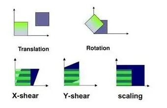
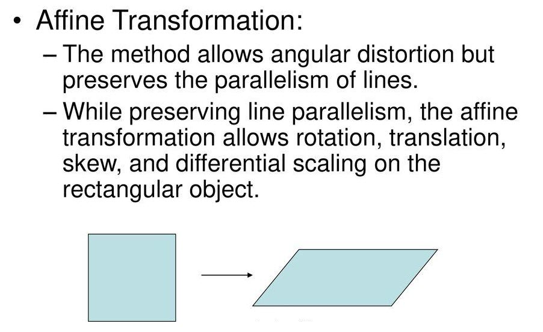
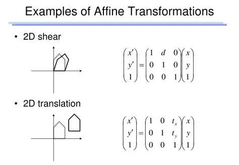
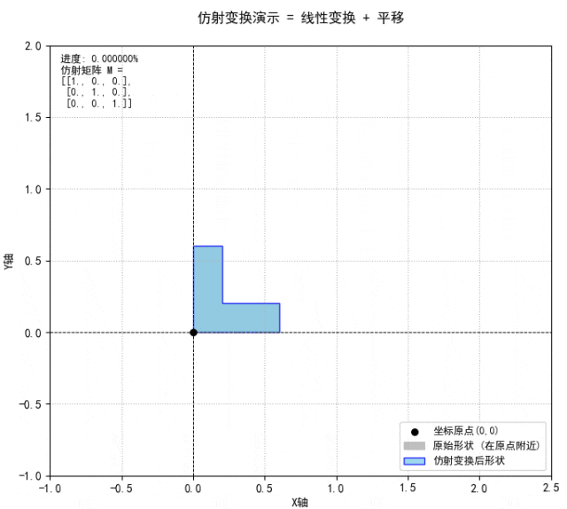
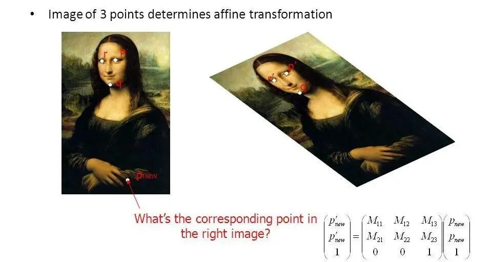

# 仿射变换：拓展线性变换的几何世界

> 原文地址: [https://mp.weixin.qq.com/s/ID30xILcDc7PParEboxHbg](https://mp.weixin.qq.com/s/ID30xILcDc7PParEboxHbg)

在数学和计算机图形学中，仿射变换（Affine Transformation）是一种重要的几何操作。它不仅包含了传统的线性变换，如旋转、缩放和剪切，还引入了平移这一非线性元素。本文将深入探讨仿射变换的基本概念、数学表示、实际应用以及如何利用齐次坐标来简化其计算。

## 线性变换与仿射变换的区别

首先，我们需要明确线性变换与仿射变换之间的关系。线性变换包括旋转、缩放和剪切等操作，但不包含平移。这是因为线性变换必须保持原点不变，即对于任意向量 ，有 。然而，在许多实际场景中，我们还需要考虑物体的位置移动，这就需要引入平移操作，从而扩展到仿射变换的范畴。

仿射变换可以看作是线性变换的一个超集，它允许我们在进行线性变换的同时执行平移。具体来说，一个作用于二维向量  的仿射变换  可以表示为：

其中， 是一个  的矩阵，代表线性变换部分； 是一个  的向量，代表平移量。

## 仿射变换的重要特点

仿射变换的一个重要特点是它保持了平行直线的平行性不变，这意味着如果两个线条在原始图形中是平行的，那么经过仿射变换后它们仍然是平行的。此外，仿射变换还保持了线段之间的长度比例不变，即如果一条线段是另一条线段的两倍长，在变换之后这一比例关系依旧成立。这些特性使得仿射变换成为计算机图形学、图像处理等领域中不可或缺的工具。

## 齐次坐标：解决平移问题的巧妙方法

由于仿射变换不是线性变换，不能仅通过一个矩阵乘法来表示。为了克服这一限制，我们可以使用齐次坐标（Homogeneous Coordinates）。通过增加一个维度，我们可以用单一的矩阵乘法来表示整个仿射变换了。例如，在二维空间中，一个点或向量  可以扩展为齐次坐标 。

接下来，我们将线性变换矩阵  和平移向量  组合成一个增广矩阵：

或者写成块矩阵形式：

其中 。

对齐次坐标  应用这个增广矩阵：

结果的前两行正是 ，即线性变换加上平移的结果。最后的 1 保持不变，使得我们可以连续应用多个仿射变换的增广矩阵。

## 仿射变换的组合

仿射变换的一个强大之处在于它可以轻松地组合多个变换。假设  和  是两个仿射变换，对应的增广矩阵分别是  和 ，那么先应用  再应用  的组合变换  对应的增广矩阵就是 。这使得用齐次坐标处理仿射变换非常方便。

## 实际应用案例

在计算机视觉和图像处理领域，仿射变换有着广泛的应用。例如，在图像配准中，我们需要将一张图像中的特征点与另一张图像中的对应点对齐，这时就需要用到仿射变换。此外，在虚拟现实和增强现实中，为了使虚拟对象与真实环境无缝融合，也需要精确地进行仿射变换。

另一个典型的应用场景是在机器人导航中，机器人需要根据传感器数据实时调整自己的位置和姿态，这同样离不开仿射变换的帮助。

## 小结

仿射变换作为一种强大的几何工具，不仅能够帮助我们理解和实现复杂的几何变换，还在多个领域中发挥了重要作用。通过引入齐次坐标，我们解决了平移操作带来的挑战，并且能够更加高效地处理多种变换的组合。希望本文能为读者提供一个全面而深入的理解框架，激发大家进一步探索仿射变换及其应用的兴趣。无论是在学术研究还是工程实践中，掌握仿射变换都将为你打开一扇通往更广阔世界的门。

  

往期推荐

[

几何视角下的线性变换：理解矩阵乘法

](https://mp.weixin.qq.com/s?__biz=Mzk0MzI0NDU2NQ==&mid=2247491515&idx=1&sn=b57276f0983d2a7cdd2185d9adc70f1d&scene=21#wechat_redirect)

[

数值线性代数：科学与工程计算的核心

](https://mp.weixin.qq.com/s?__biz=Mzk0MzI0NDU2NQ==&mid=2247490796&idx=1&sn=85b715aed259b51c4d35ef2d1a5f3b06&scene=21#wechat_redirect)

[

计算机与计算数学：从理论到实践的跨越

](https://mp.weixin.qq.com/s?__biz=Mzk0MzI0NDU2NQ==&mid=2247490147&idx=1&sn=c4f00fd36919bd6a170aa4998bb6b666&scene=21#wechat_redirect)

推荐阅读

  

  

  

‍

  

  

  

**给我一组控制方程，还你一套专业软件。**我们长期从事多场耦合有限元算法和软件的研发工作，掌握全流程的 CAE 软件开发技能。如果您需要相关的技术服务，非常欢迎私信交流和扫码咨询。

**喜欢****作者******，请点********赞********和在看********

****