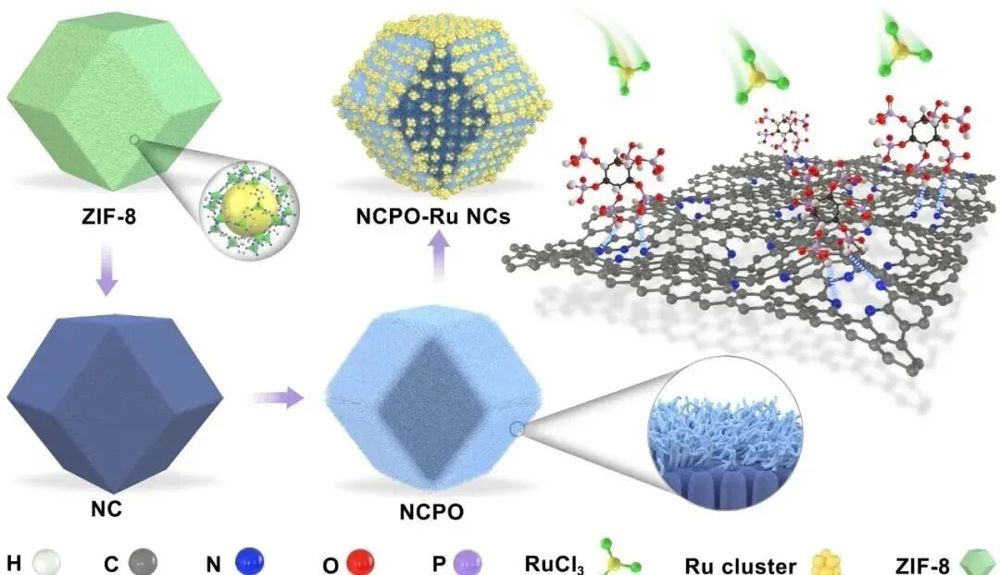

# 优秀科研工作者的十大良好习惯：谈研究生该如何高效开启科研之路

> 原文地址: [https://mp.weixin.qq.com/s/fFdZ3AHIzVOmzEYWPzoY5w](https://mp.weixin.qq.com/s/fFdZ3AHIzVOmzEYWPzoY5w)

  

点击上方蓝字关注我们

科研是一场马拉松。在探索未知的过程中，良好的习惯是科研人最可靠的“导航仪”。无论是初入实验室的研究生，还是正在攀登学术高峰的研究者，培养科学、高效的习惯，不仅能提升工作效率，更能让你在科研之路上走得更稳、更远。我们在这里聊一下优秀科研工作者应该具备的十大良好习惯，或许能为你的科研之路提供启发。

## 1\. 明确目标，科学规划

科研的第一步，是明确方向与目标。优秀的科研人会为自己的研究制定清晰的“路线图”：

-   • **设定SMART目标**：目标需具体（Specific）、可衡量（Measurable）、可实现（Attainable）、现实（Realistic）、有时限（Time-sensitive）。例如，将“完成论文”拆解为“两周内完成实验设计，一个月内撰写初稿”。
    
-   • **制定每日/每周计划**：每天结束前列出任务清单，优先处理核心任务（如论文写作、数据分析），避免被琐事占据时间。
    
-   • **定期复盘调整**：每两周回顾进展，评估目标的可行性，及时修正偏差。
    
-   
    

> **行动建议**：使用时间管理工具（如Notion、Todoist）记录任务，并标注优先级。

## 2\. 深耕文献，厚积薄发

文献是科研的基石。优秀的科研人深知“站在巨人肩膀上”的重要性：

-   • **高效阅读文献**：先读摘要、引言和结论，快速筛选价值；精读关键论文时，用费曼学习法（将文献内容复述为“教学笔记”）加深理解。
    
-   • **建立知识库**：用Zotero、EndNote等工具分类管理文献，按主题或技术点归档，方便后续撰写论文时调用。
    
-   • **积累写作素材**：在阅读中记录经典表达、研究方法和创新点，逐步形成自己的“学术语言库”。
    
-   
    

> **行动建议**：每天固定2-3小时用于文献阅读，设定“阅读-总结-输出”的闭环流程。

## 3\. 严谨实验，细节制胜

实验是科研的核心环节，严谨的态度和规范的操作是成功的保障：

-   • **实验前充分准备**：提前确认试剂、仪器和实验步骤，避免“临时抱佛脚”导致失败。
    
-   • **详细记录过程**：实验记录需包含时间、条件、异常现象及思考，建议使用电子实验室笔记本（ELN）或纸质本同步记录。
    
-   • **数据及时分析**：实验结束后立即整理数据，发现问题可快速调整方向，避免堆积导致混乱。
    
-   
    

> **行动建议**：为每个实验项目建立标准化SOP（标准操作流程），确保结果可重复。

## 4\. 批判思维，敢于质疑

科研的本质是探索未知，而批判性思维是突破瓶颈的关键：

-   • **不盲从权威**：对文献结论保持审慎态度，通过实验验证其适用性。
    
-   • **提出关键问题**：在阅读和实验中不断追问“为什么”“如何改进”，例如：“这个模型的假设是否合理？”“是否有更高效的实验方法？”
    
-   • **多角度验证假设**：设计对照实验时，确保变量控制严格，避免结论偏差。
    
-   
    

> **行动建议**：每周与导师或同行进行一次“头脑风暴”，讨论研究中的疑问与创新点。

## 5\. 高效沟通，协作共赢

科研不是孤军奋战，良好的沟通能力能加速成果产出：

-   • **主动汇报进展**：定期向导师反馈工作状态，及时获取指导，避免“闭门造车”。
    
-   • **团队协作分工**：在项目中明确职责，利用协同工具（如GitHub、Trello）共享进度，减少信息差。
    
-   • **表达清晰简洁**：无论是口头汇报还是撰写论文，逻辑需层层递进，结论明确，避免冗长堆砌。
    
-   
    

> **行动建议**：练习“电梯演讲”（Elevator Pitch），用1分钟讲清研究的核心价值。

## 6\. 视觉化呈现，让成果“说话”

科研成果的展示直接影响说服力，优秀的科研人深谙“颜值即正义”的道理：

-   • **图表清晰美观**：使用Origin、Prism或Python（Matplotlib）绘制图表，确保数据可视化直观、专业。
    
-   • **PPT逻辑严密**：每页PPT聚焦一个核心观点，用关键词和图表代替大段文字，配合简洁的动画效果。
    
-   • **论文结构化写作**：遵循“IMRAD”框架（Introduction, Methods, Results, and Discussion），让逻辑一目了然。
    
-   
    

> **行动建议**：参考顶刊论文的图表风格，建立自己的模板库。

## 7\. 时间管理，拒绝内耗

科研需要专注力，而时间管理是高效工作的核心：

-   • **区分黄金时间与碎片时间**：将论文写作、深度思考安排在精力充沛的时段（如上午），用碎片时间处理邮件、查文献。
    
-   • **番茄工作法**：专注25分钟+休息5分钟，每4个周期后延长休息时间，避免疲劳堆积。
    
-   • **拒绝拖延**：用“5分钟法则”启动任务——告诉自己“只做5分钟”，往往能克服畏难心理。
    
-   
    

> **行动建议**：尝试使用Forest、番茄钟等工具，培养专注习惯。

## 8\. 保持健康，身心并重

科研需要持久的战斗力，身体和心理状态同样重要：

-   • **规律作息**：保证7-8小时睡眠，避免“开夜车”成为常态。
    
-   • **适度运动**：每天30分钟快走、瑜伽或力量训练，缓解压力并提升精力。
    
-   • **情绪管理**：面对实验失败或论文拒稿时，学会用正念冥想、倾诉等方式调节心态。
    
-   
    

> **行动建议**：每周安排固定的“运动日”，与实验室伙伴一起打卡，互相监督。

## 9\. 定期总结，螺旋式成长

科研是不断试错与优化的过程，总结反思能加速成长：

-   • **每周复盘**：记录本周的收获与问题，分析哪些方法有效、哪些需要改进。
    
-   • **失败日志**：将实验失败的原因和解决思路记录下来，避免重复踩坑。
    
-   • **长期规划**：每季度回顾研究方向，确保与长期目标一致。
    
-   
    

> **行动建议**：建立“科研日志”，用Markdown格式记录每日进展和反思。

## 10\. 终身学习，与时俱进

科研领域日新月异，持续学习是保持竞争力的关键：

-   • **关注领域动态**：订阅顶级期刊（如Nature、Cell）、参加学术会议，追踪前沿进展。
    
-   • **跨学科拓展**：学习AI、编程等新技能，为研究注入创新动力。
    
-   • **英语能力提升**：精读英文文献，练习学术写作与口语表达，为国际交流铺路。
    
-   
    

> **行动建议**：每月选修一门在线课程（如Coursera、edX），或参与实验室的“读书会”活动。

## 结语：习惯的力量，成就科研的“复利”

科研之路没有捷径，但良好的习惯能让你走得更远。从今日起，尝试将上述习惯融入日常生活：规划时多一份细致，实验时多一份严谨，沟通时多一份主动。正如爱因斯坦所说：“所谓教育，是当一个人把学校里学到的东西都忘掉之后，剩下的东西。”而科研的习惯，正是你未来十年、二十年学术生涯中，最宝贵的“剩下的东西”。

> **行动号召**：选择1-2个习惯作为起点，坚持21天，你会看到改变的发生。科研的复利，终将为你积累出令人惊叹的成果！

**喜欢****作者******，请点********赞********和在看********

****