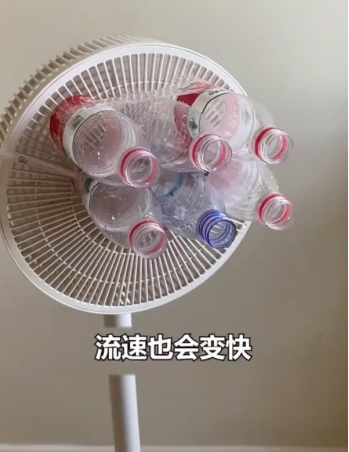
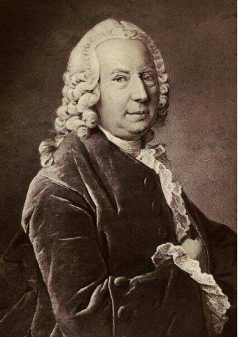
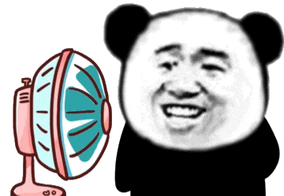

# 伯努利原理显灵，电风扇＋矿泉水瓶“秒变”空调？

> 原文地址: [https://mp.weixin.qq.com/s/MuTxDmhoQlfXYGL3RQKTcw](https://mp.weixin.qq.com/s/MuTxDmhoQlfXYGL3RQKTcw)

**采访专家：**

**刘大禾（北京师范大学物理系教授）**

  

近日，全国多地出现高温天气。网络上盛传一条影片，大学生在宿舍将数个空矿泉水瓶绑在电风扇前，称其制冷堪比空调。制造者称“矿泉水电风扇”是以依据物理学里的伯努利原理的一次改造。真的是这样么？  

  

▲网友将数个空矿泉水瓶绑在电风扇前，称其制冷堪比空调（视频截屏）

  

  

  

**什么是伯努利原理？**

  

所谓伯努利原理，这是由瑞士物理学家丹尼尔·伯努利于1726年提出的观点——在水流或气流里，速度小，则压力大；速度大，压力便小。

  

▲瑞士物理学家丹尼尔·伯努利

  

举个例子，当我们拿着两张纸，并在中间吹气，会发现纸张不仅不会向外飘去，反而会被挤压到一起。这是因为两张纸中间的空气在我们吹得时候，流动速度快，压力就小；而两张纸外面的空气没有流动，压力就大，所以外面力量大的空气就把两张纸“压”在了一起。这就是伯努利原理。

  

▲伯努利原理（来源/秒懂百科）

  

  

  

**电风扇加矿泉水瓶是符合伯努利原理？**

  

  

北京师范大学物理系教授刘大禾告诉记者，电风扇中的风自矿泉水瓶底吹入瓶中，由于瓶口较小，风在瓶口处会产生加速，因此，吹出的风流速快。根据伯努利原理，等高流动时，流速越大，压强越小。气体进入压强比较小的地方就会膨胀，膨胀之后，气体对外做功，根据能量守恒定律，导致气体温度下降。

“但这种降温效果非常微弱，且只限于瓶口附近，无法影响整个房间温度。”刘大禾强调。

  

  

**能否产生降温效果？**

  

但是，为何有的网友认为矿泉水+电风扇的堪比空调的制冷效果？刘大禾认为，人体感觉凉快其实是快速流动的空气使皮肤表面的水分蒸发加快了，蒸发的过程能吸收周围环境的热量，使皮肤感觉凉快。矿泉水+电风扇只等效于电扇调高了风速档，人体感觉上会凉爽，但温度并不会明显降低，感觉凉爽和温度降低是两种评判标准。“矿泉水+电风扇”并不能改变周围环境的温度。专家最后提醒，大家应该采用科学的避暑降温方法防暑。

  

撰文：记者 陈永杰   实习生  屈芷慧  

  

三步点亮“星标” 精彩内容不错过！

  

> 
> 
> 出品：科普中央厨房  
> 
> 监制：北京科技报 | 北科传媒