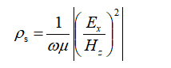
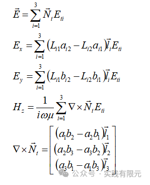
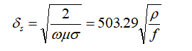
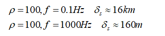
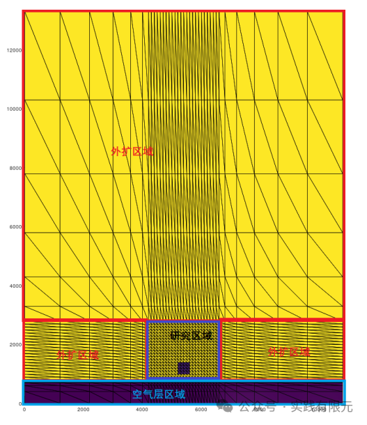
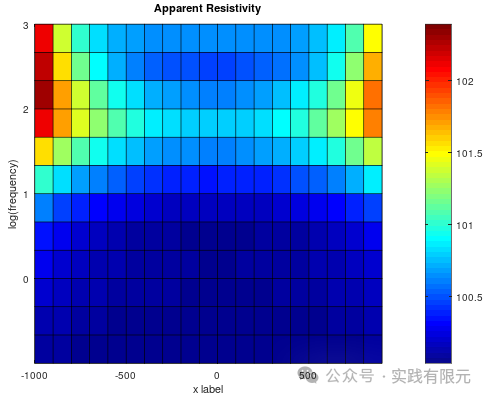
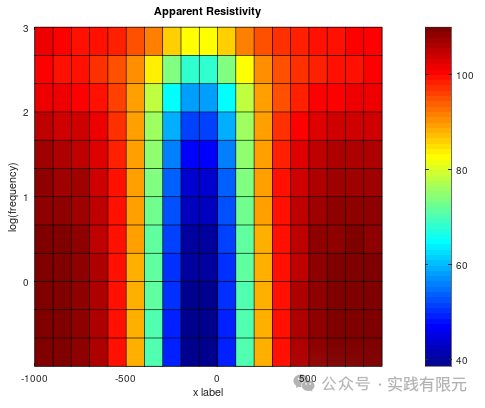
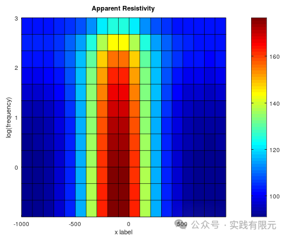
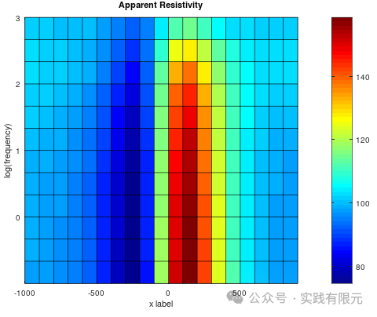

# 使用二维矢量有限元展示一个实际例子

> 原文地址: [https://mp.weixin.qq.com/s/MqE\_jt9wWqPqRY159u0iCw](https://mp.weixin.qq.com/s/MqE_jt9wWqPqRY159u0iCw)

**简述**  

二维电场从空气中入射地下空间。

电场从高空中垂直入射到地面，电场在传播过程中遇到电阻率不同的物体会反射电磁波，通过在地面监测电阻率可以获得地下空间的实际电阻率变化情况。

假设电场的振动方向是x方向，传播方向为y方向，因此在OXY平面，要模拟电场的传播规律，选择矢量有限元实现。具体实现参考：[二维矢量有限元的详细实现过程](https://mp.weixin.qq.com/s?__biz=MzkwNzUxOTM2NA==&mid=2247484232&idx=1&sn=af1a7c52d138249b44f0a7b68cb8b45c&chksm=c0d6b7a3f7a13eb57ba43f42a180beb609e1d9e5928fa89828ca94912339bcaf36ff2a0eff40&scene=21#wechat_redirect)

**1.基本信息**

频率：0.1Hz~1000Hz 选择13个频点；视电阻率公式

针对二维三角形网格矢量有限元，其插值任意一点公式为：

**2.网格**

整个仿真区域分为研究区域与外扩区域：研究区域是感兴趣的区域，实际做研究的区域；外扩区域是为了保证电场衰减下在边界面最小反射而添加的区域，外扩区域的范围大小与所研究频段的趋肤深度有关。

趋肤深度，是定义电场在良导体内衰减会衰减1/e，即36.8%时，所深入的距离。

本例子中的最大频率、最小频率的区域深度：

因此，区域深度最好在0.1Hz的趋肤深度左右，如此在底面造成的反射才有可能尽量规避；同时在地表面为了保证1000Hz的精度，研究区域的网格尺度小于1000Hz的趋肤深度。由此获得符合实际物理情景的网格：

**3.仿真案例**  

**a.地下空间的电阻率为均匀电阻率100欧姆米。**  

    可以发现，在地表获得的视电阻率结果基本上保持在100欧姆米，与理论预期一致。在高频下的结果102欧姆米也基本上保证在精度范围内。  

**b.在100欧姆米的地下空间存在一个10欧姆米的低阻物体，在实际情况中可能是矿等异常的资源****。**  

**c.在100欧姆米的地下空间存在一个1000欧姆米的高阻物体。**

**d.在100欧姆米的地下空间存在一个1000欧姆的高阻物体，一个10欧姆低阻的复杂情况。**

几个模型的结果基本上都能通过视电阻率反应地下异常体区域的电阻率情况。

**总结**

a.有限元在实际运用中的建模必须得考虑具体物理规律，保证仿真求解的结果能反应实际物理规律，这需要专业的知识与有限元算法特征的配合。

b.可以发现本案例中虽然使用的三角形网格，但是是通过结构化网格实现的，造成了很多冗余的质量差的网格，实际上可以通过三角形网格生成软件生成更加优质的网格。