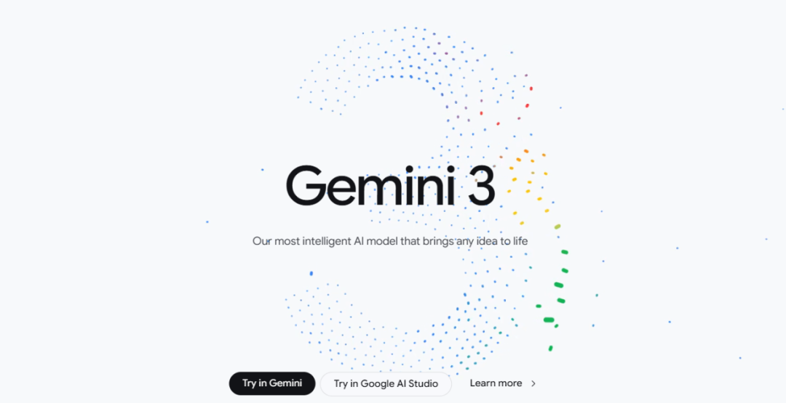
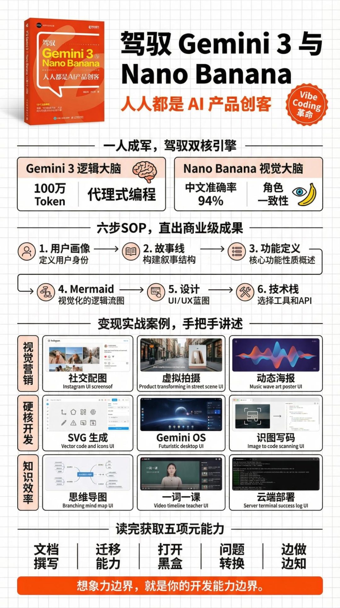
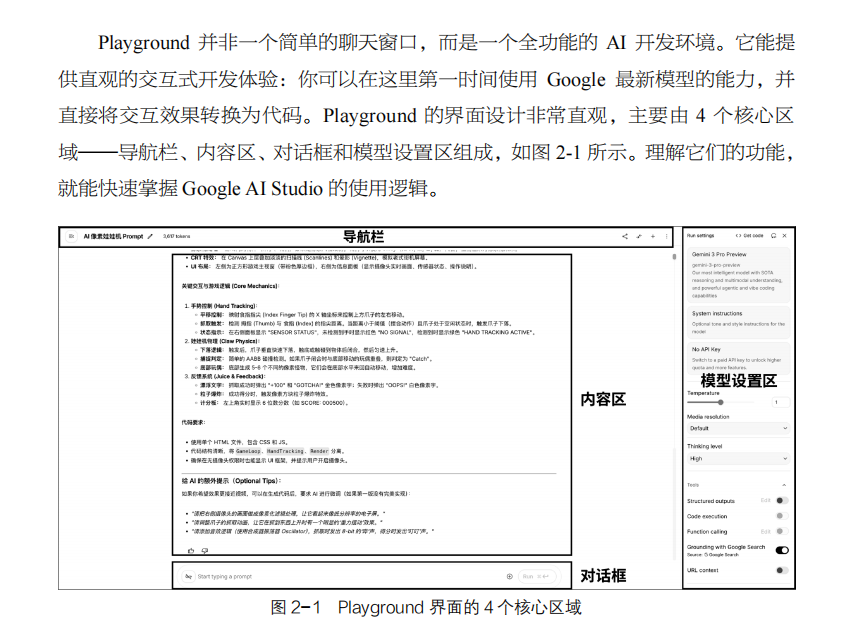
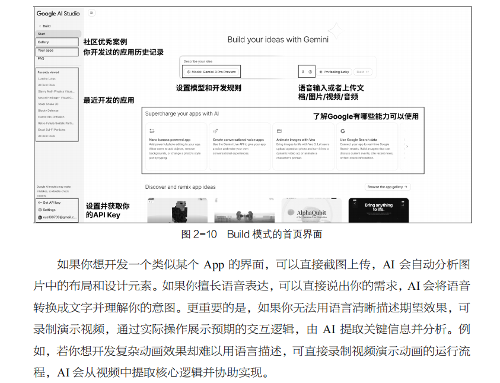
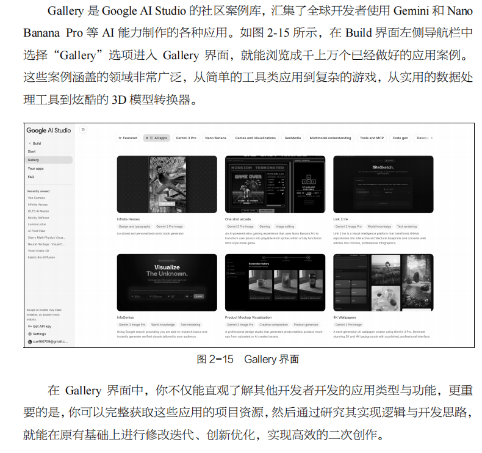
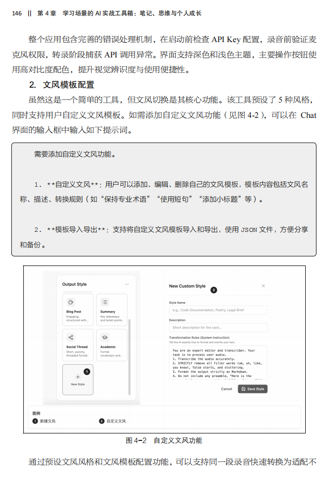
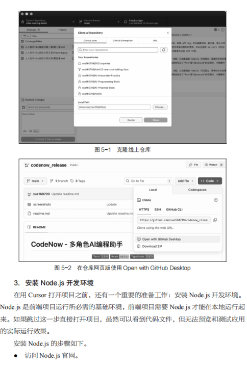
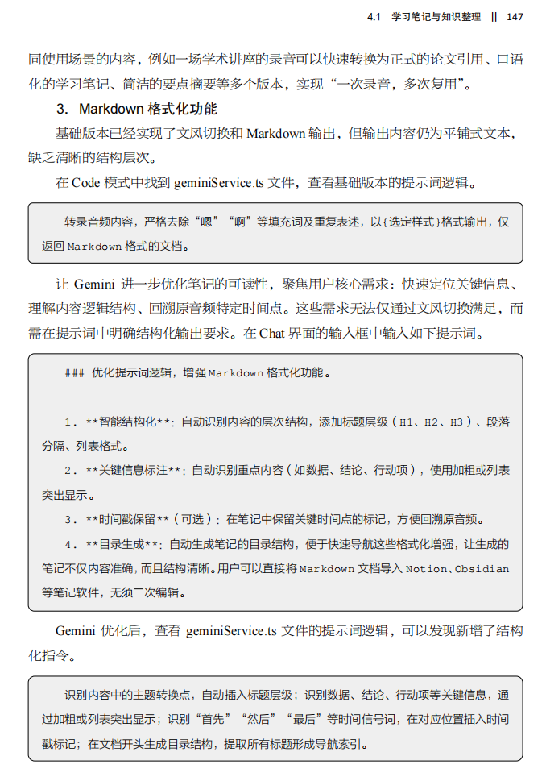
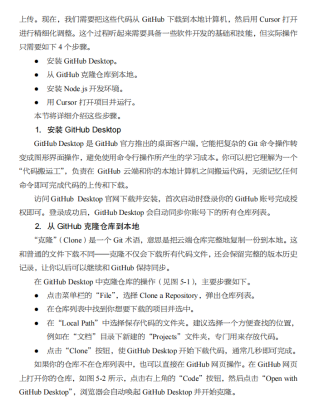
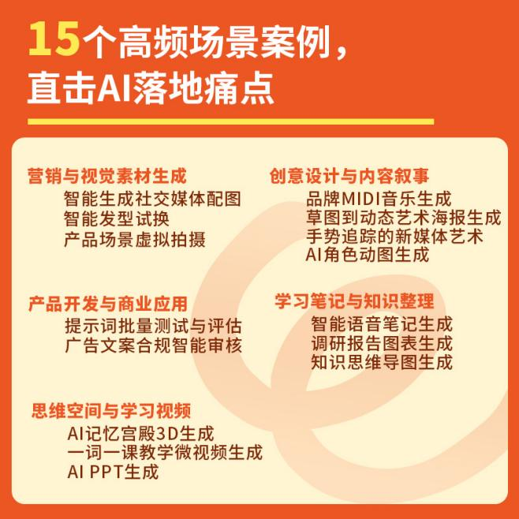

# 全网第一本Gemini3与NanoBanana实战书重磅上市！

> 原文地址: [https://mp.weixin.qq.com/s/i8uIGyjMYFqkAVt7OuNSzg](https://mp.weixin.qq.com/s/i8uIGyjMYFqkAVt7OuNSzg)

_**Part.1**_

**快看！全网第一本Gemini 3**

**和Nano Banana教程重磅来袭！**

  

2025年，AI编程领域迎来爆发式增长，成为生成式AI首个规模化落地的“杀手级场景”。

  

头部工具Cursor年化收入突破10亿美元，较2024年暴增数百倍，日活跃用户超百万，AI编程工具成资本新宠。

  

斯坦福大学2025年秋季开设的“CS146S:The Modern Software Developer”课程，鼓励学生不写一行代码完成学业，短短两个多月便有多名学生成功构建和发布全栈应用。

  

这些信号清晰地表明，**编程的核心正在从“写代码”转向“定义需求”，文档撰写、逻辑表达等元能力的重要性，已远超具体的语法知识。**

  

由此可见，不管是商业还是教育领域，生成式AI都在重塑编程行业的底层逻辑与价值格局——在AI与人类协同的新范式下，编程的价值不再依附于代码行数，而在于解决问题的效率与创造力。

  

2025年底，Google重磅发布的Gemini 3与Nano Banana Pro，更彻底降低了AI编程的门槛。

  

**Gemini 3：全能多模态开发引擎**

  

Gemini 3作为顶尖多模态大语言模型，搭载百万Token超长上下文窗口，可轻松处理海量信息，在长对话中始终保持上下文一致性。

  

Gemini 3的原生多模态理解能力支持同时处理文本、图片、音频和视频，无须依赖第三方转换工具，只需上传一张草图或一段语音描述，就能精准理解你的开发意图。

  

**Nano Banana Pro：专业级视觉创作利器**

  

Nano Banana Pro解决了传统AI图像生成的痛点，多语言文字渲染错误率远低于同期模型，可直接生成文字精准的海报、信息图、产品标签。

  

其专业级创意控制功能支持镜头与景深调整、光照与色彩优化、多分辨率输出及局部编辑，还能在多图融合时保持角色一致性，为视觉化开发提供强大支撑。

  

**《驾驭Gemini 3与Nano Banana：人人都是AI产品创客》是全网第一本为零基础学习者打造的Gemini 3与Nano Banana教程。**

▼点击下方，即可购书

  

这本书聚焦两大核心工具，从基础操作到产品上线，手把手教你打通AI编程全链路，让普通人也能轻松成为数字产品创造者。

▲用Nano Banana生成的本书内容导读

  

_**Part.2**_

**三大核心模式，全流程AI编程无忧**

  

本书以Google AI Studio为载体，**全程围绕Gemini 3与Nano Banana Pro两大工具展开**，详细拆解三大核心模式的实操流程，确保零基础读者快速上手。

  

Playground——Gemini 3与Nano Banana的核心试验场。它并非简单的聊天窗口，而是全功能AI开发环境，界面包含导航栏、内容区、对话框和模型设置区。

  

在这里，你可以直接选择Gemini或Nano Banana模型，通过系统指令定制AI行为准则，支持文本输入、文件上传、音频录制、摄像头捕捉等多种交互方式。

  

**Build**——零代码生成前端应用，无须编写代码，只需用自然语言描述想法，就能调用Gemini 3生成可运行的应用程序。

  

书中详细讲解了核心界面操作，包括AI建议功能、预览与代码模式切换、设备预览等实用功能。

  

**Gallery**——借力两大工具的实战案例库，汇集了全球开发者使用Gemini 3与Nano Banana Pro制作的实战案例，涵盖游戏、媒体生成、多模态理解等多个领域。

  

初学者可直接浏览筛选应用，既可直接使用，也可复制项目进行二次创作，从模仿中快速掌握两大工具的使用思路。

  

_**Part.3**_

**15个超实用案例，**

**文档+AI助力从想法到产品上线**

  

书中精选15个覆盖工作与学习场景的实战案例，均基于Gemini 3与Nano Banana Pro开发，循序渐进拆解全链路逻辑，让你边做边练掌握核心技能：

  

-   从GitHub导入项目并完成首次部署的完整流程，包括项目配置、环境变量设置、构建命令确认等关键步骤；针对部署过程中可能出现的错误，提供具体的排查与修复方法。
    

  

-   从Google AI Studio下载代码到本地并在Cursor中运行的完整流程，包括GitHub仓库克隆、Node.js开发环境安装、项目依赖安装与启动等关键步骤，同时分享Cursor的上下文管理、模式切换、错误修复等实用技巧。
    

  

  

_**Part.4**_

**零基础驾驭超强AI模型，**

**轻松跨越职业边界！**

  

-   对于零编程基础的读者，本书提供了从0到1的系统学习路径，搭配简单易懂的知识点与实操案例，助你快速掌握AI编程的核心方法。
    

  

-   对于具备一定编程经验的技术从业者，书中的思维模式与工具技巧能帮助你探索全新工作模式，大幅提升开发效率。
    

  

-   对于教育工作者与学生，丰富的实战案例为教学与学习提供了全新的工具与思路，培养你面向未来的核心竞争力。
    

  

在这个超级个体崛起的时代，AI编程已非可选技能，而是必备的生存能力。

  

**《驾驭Gemini 3与Nano Banana：人人都是AI产品创客》**凭借扎实的理论基础、详细的工具解析、丰富的实战案例、完整的上线流程，为你构建了一套适应AI时代的思维方式与行动框架。

  

未来已来，创造的权利正在回归每个人手中。

  

翻开这本书，迈出AI编程的第一步，你也能成为自身创意的实现者，在AI时代定义属于自己的未来！