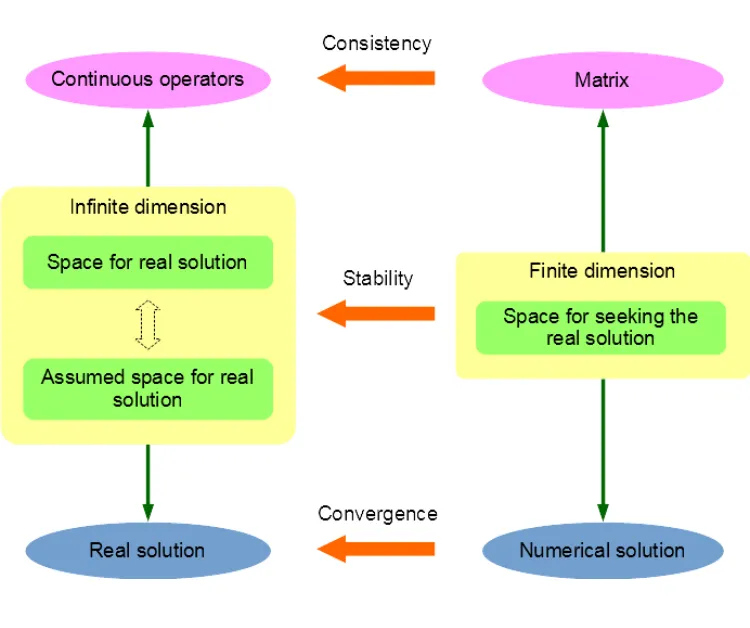
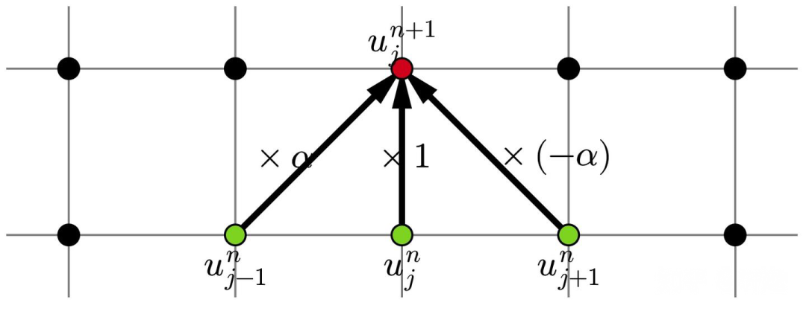

# 冯诺依曼稳定性分析：原理、方法与应用

> 原文地址: [https://mp.weixin.qq.com/s/9Pg\_j7nSOPkvnr04Q0sNLA](https://mp.weixin.qq.com/s/9Pg_j7nSOPkvnr04Q0sNLA)

在科学计算与工程仿真中，偏微分方程（Partial Differential Equations, PDEs）的数值求解是核心问题之一。无论是流体力学中的 Navier-Stokes 方程，还是热传导方程，都需要通过离散化方法将连续问题转化为计算机可处理的离散形式。然而，数值方法的选择直接影响解的精度和稳定性。一个看似合理的差分格式可能在迭代过程中因误差累积而崩溃，导致模拟结果完全失真。因此，**稳定性分析**成为数值方法设计中不可或缺的一环。

1950 年代，冯·诺依曼（John von Neumann）提出了一种基于傅里叶变换的稳定性分析方法，被称为**冯诺依曼稳定性分析**（Von Neumann Stability Analysis）。该方法通过将误差分解为不同频率的傅里叶模态，并分析这些模态在迭代中的增长情况，来判断数值格式是否稳定。本文将深入探讨这一方法的理论基础，并结合典型示例展示其应用。

## 数值格式的稳定性

在数值求解偏微分方程的过程中，稳定性是一个关键概念。所谓**稳定性**，指的是数值解在计算过程中不会因初始误差或舍入误差而无限放大，从而导致结果失真。为了确保数值格式的有效性和可靠性，必须对其进行严格的稳定性分析。

**Lax等价定理**指出，在某些条件下，一个线性偏微分方程的有限差分格式如果是一致的且稳定的，则它是收敛的；反之亦然。因此，稳定性不仅保证了数值格式的可靠性，还直接影响其收敛性，使得稳定性成为数值分析中不可忽视的核心要素。

具体来说，Lax等价定理适用于线性初值问题，假设我们有一个线性偏微分方程及其对应的差分格式。若该差分格式是一致的，即当时间步长和空间步长趋近于零时，差分格式逼近原方程，则根据Lax等价定理，只要该格式是稳定的，那么它就必然是收敛的。换句话说，稳定性与收敛性在这些情况下是等价的。这为我们提供了一个重要的指导原则：**在设计和选择数值格式时，优先考虑其稳定性。**

理解并应用Lax等价定理可以帮助我们在数值模拟中避免常见的陷阱，如不合理的参数选择导致的发散结果。接下来，我们将深入探讨冯诺依曼稳定性分析的方法论及其具体步骤。

## 冯诺依曼稳定性分析的基本原理

冯诺依曼稳定性分析的核心在于研究误差在数值格式中的传播行为。其基本思想是通过傅里叶级数展开，将误差表示为一系列正弦波的叠加形式。这种方法利用了线性系统的一个重要特性：**任意初始误差都可以分解为多个频率成分，每个成分独立地按照相同的方式演化**。因此，通过分析单个频率成分的演变情况，可以推断出整个系统的稳定性。

具体而言，冯诺依曼稳定性分析的过程通常包括以下几个步骤：

1.  **准备阶段**：首先，我们需要确定所使用的差分格式，并推导出相应的迭代公式。以线性对流方程为例：
    
    使用有限差分法（FDM）和中心差分格式，得到如下迭代公式：
    
    进一步整理可得：
    
2.  **误差引入**：假设在第  步存在误差 ，则第  步的误差可以表示为：
    
    其中  表示从  到  的线性变换。由于误差随迭代次数增加而不应放大，我们要求：
    
    这意味着，矩阵  的范数 ，即所有特征值的模小于或等于1。
    
3.  **傅里叶级数展开**：为了简化问题，我们假设误差  可以表示为傅里叶级数的形式：
    
    其中  是振幅， 是波数，， 是网格点位置。将上述表达式代入迭代公式，得到新的误差表达式：
    
    计算复数放大因子 ：
    
4.  **稳定性条件**：稳定性要求满足：
    
    对于所有实数 ，若满足该条件，则该差分格式是稳定的，由此即可推导出稳定性条件。
    

通过上述步骤，我们可以系统地分析一个差分格式的稳定性。下面将以具体的例子进一步说明这一过程。

## 典型示例分析

为了更好地理解冯诺依曼稳定性分析的应用，我们以线性对流方程为例进行详细分析。线性对流方程描述了无粘性介质中的波传播现象，其标准形式为：

其中  是未知函数， 是常数速度。我们将使用不同的差分格式对该方程进行数值求解，并通过冯诺依曼稳定性分析来评估每种格式的稳定性。

### FTCS 格式（前向时间中心空间）

首先考虑 FTCS 格式，即前向时间差分和中心空间差分的组合。该格式的迭代公式为：

整理后得到：

其中

为了进行冯诺依曼稳定性分析，设误差 ，代入迭代公式：

由此得出放大因子：

计算其模：

显然，当  时，总有 ，不可能满足稳定性要求，因此，FTCS 格式是**无条件不稳定的**，应该避免使用。

### FTFS 格式（前向时间前向空间）

接下来考虑 FTFS 格式，即前向时间差分和前向空间差分的组合。该格式的迭代公式为：

整理后得到：

其中

设误差 ，代入迭代公式：

由此得出放大因子：

计算其模：

当  时，有 。因此，FTFS 格式仅在  且网格比率  时稳定。

### FTBS 格式（前向时间后向空间）

继续考虑 FTBS 格式，即前向时间差分和后向空间差分的组合。该格式的迭代公式为：

整理后得到：

其中

同样地，设误差 ，代入迭代公式：

由此得出放大因子：

计算其模：

当  时，有 。因此，FTBS 格式仅在  且网格比率  时稳定。

### 迎风格式

稳定性依赖于方程的参数  是非常糟糕的，因为  是方程中的常数，并不是我们所能控制的。为了处理这一点，我们构造了迎风格式。

根据速度  的符号选择空间差分方向：

-   ：前向差分
    
-   ：后向差分
    

即

迭代公式统一为：

继续进行稳定性分析，得到放大因子为：

计算其模，得到稳定性条件为：

因此，迎风格式对任意符号的  均稳定，条件仅依赖于网格比率，在网格比率  时稳定。

## 小结

通过上述详细的冯诺依曼稳定性分析，我们不仅掌握了如何评估不同差分格式的稳定性，还深刻理解了误差传播机制的重要性。稳定性是数值求解偏微分方程的关键因素，它直接关系到数值结果的可靠性和准确性。冯诺依曼稳定性分析通过解析误差的传播特性，为我们提供了一套系统化的工具，用以检验和优化数值格式。

尽管冯诺依曼稳定性分析是一种强大的工具，但它也有一定的局限性。例如，它主要适用于线性问题，对于非线性问题则需要更复杂的分析方法。此外，该方法依赖于假设误差可以表示为周期函数的叠加形式，这在某些复杂边界条件下可能不再成立。因此，在实际应用中，除了冯诺依曼稳定性分析，还可以结合其他稳定性分析方法，如能量估计法和矩阵分析法等，以获得更加全面的结果。

  

往期推荐

[

相容_性_、_稳定性_和收敛_性_：有限差分法核心概念解析

](http://mp.weixin.qq.com/s?__biz=Mzk0MzI0NDU2NQ==&mid=2247490129&idx=1&sn=f46ae8cda5c26a536cc6de9cb78d032a&chksm=c3378e2bf440073dd2cbb81cc8d26d472ba385630c0f0a0eed6bb5ebee82831e5e2b1c4e4950&scene=21#wechat_redirect)

[

差分中的库朗数和计算_稳定性_

](http://mp.weixin.qq.com/s?__biz=Mzk0MzI0NDU2NQ==&mid=2247486310&idx=1&sn=29529196eb624f1796d4b0e1a206f3cb&chksm=c3379f1cf440160af19ee8a917509a79ea13d8d6460a543948658e1a53b828b77bca21d610eb&scene=21#wechat_redirect)

[

步长选择与数值_稳定性_：常微分方程初值问题计算方法解析

](http://mp.weixin.qq.com/s?__biz=Mzk0MzI0NDU2NQ==&mid=2247490905&idx=1&sn=0dd5c95ef47c508ada48e34b93db623a&chksm=c3378923f4400035d82077ceabe640252a0a8ca37a3cb3f992803b5e589a666889c8c8384180&scene=21#wechat_redirect)

  

## 推荐阅读

  

  

  

  

‍

**给我一组控制方程，还你一套专业软件。**我们长期从事多场耦合有限元算法和软件的研发工作，掌握全流程的 CAE 软件开发技能。如果您需要相关的技术服务，非常欢迎私信交流和扫码咨询。

**喜欢****作者******，请点********赞********和在看********

****