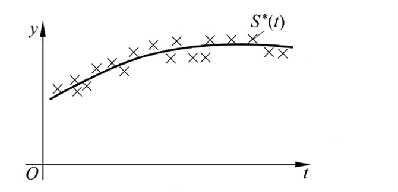
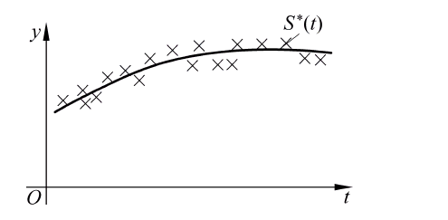

# 函数逼近-曲线拟合与最小二乘法

> 原文地址: [https://mp.weixin.qq.com/s/ogCeq8L\_JzI8mDSq4SX2bA](https://mp.weixin.qq.com/s/ogCeq8L_JzI8mDSq4SX2bA)

## 曲线拟合与最小二乘法

在科学与工程计算中，常常遇到大量带有误差的实验数据，需要将这些数据点拟合成一条函数曲线，从而总结、验证相关**物理量**之间满足的**函数关系**。此问题被称为**曲线拟合** （curve fitting），它要求构造一个不必严格满足所有离散数据的逼近函数（曲线），并使逼近误差达到最小。这在统计学上也称为**回归分析**（regression analysis）。若将离散数据点看成**表格函数**，并定义表格函数的 \-范数、 2-范数，曲线拟合问题即最佳一致逼近和最佳平方逼近问题。根据**最佳平方逼近准则**进行曲线拟合的方法称为**最小二乘法**，它使数据点到曲线的误差平方和最小，应用广泛。若逼近函数可表示为一组基函数的线性组合，只需求组合系数，这种问题称为**线性最小二乘** （linear least square）问题，否则为非线性最小二乘问题。

### 最小二乘问题的矩阵形式

假设离散数据点为  ，它对应表格函数  ：

希望在某个函数类 ：

中寻找一个函数  ，使得它与  的误差总体上达到最小。 （1）表格函数  的表达式是未知的，当  固定时，它可用**函数值向量** 表示。 （2）所有定义在离散自变量点  上的**表格函数构成一个线性空间**，不同于连续函数的线性空间，它是有限维空间  。 （3）若只考虑自变量点  上的取值，函数类  中的函数也都是表格函数，它们与被逼近函数  的区别是它们的表达式已知，为多项式等较简单的形式。

由于在自变量点  固定的情况下，表格函数与包含其函数值的向量一一对应，它的**内积、 2-范数**可定义为**对应向量**的内积、 2-范数。假设表格函数定义在离散自变量点  上，则它的**内积**为：

而**2-范数**为：

最小二乘问题是求  ，使得  达到最小，即  最小，其直观意义是离散点  到解曲线  的  方向距离平方和最小。而这个误差与统计学上的**均方误差**（也称为均方根误差，Root-Mean-Square Error）有关，均方误差为：

从向量与矩阵的角度看，上述最佳平方逼近问题有另一种形式。定义矩阵  为：

其第  列为表格函数  对应的向量，则表格函数：

在  处：

希望这个值  。对所有  ，写出方程：

对应的向量为  ，即：

所以，最小二乘问题就是求向量  ，使   达到最小值。一般地， ，数据点比要确定的拟合参数多。若  ，通常可求出唯一解，使得拟合曲线通过所有数据点，即**插值问题**。

脱离曲线拟合的问题背景，可定义一般的线性最小二乘问题。**定义a7**：设已知矩阵  ，向量  ，求向量  ，使得 达到最小值。这个问题称为线性最小二乘问题，记为

满足要求的解  称为**最小二乘解**。

对于任意向量  ：

所以：

连续函数内积（理论定义）：对于定义在区间  上的函数  和  ，标准内积为

离散数据情形：只有  个数据点  ，并不知道连续函数  的解析式。只能使用离散点上的函数值来计算一个离散化的内积

离散

这相当于对连续内积  采用矩形数值积分公式（所有节点权重  ）。将函数在  处的值写成向量：

即：

右边为向量  和  的标准欧几里得内积（点积）。即：

### 最小二乘问题法方程法

**法方程方法**具有普遍性，可用于求解线性最小二乘问题，此时法方程 （a12）：

中的**函数内积**为**函数值向量的内积**。若记表格函数  对应的向量为  ，则  是矩阵  的第  个列向量，即：

矩阵方程可写为：

法方程（a12）的系数矩阵为：

其右端向量为：

所以，需求解的法方程为：

根据一般的线性最小二乘问题的定义，即考虑求多元函数  的最小值问题，也可推出方程（a31）。

而且，**定义a7**还适用于超出曲线拟合的更一般线性回归分析，如根据一系列自变量和因变量值的组合拟合出公式：

（其中，、、 和  的值待求）。只要**拟合公式为待定参数的线性组合**，则均可看做线性最小二乘问题。

做曲线拟合时，只要离散自变量  上定义的表格函数  ，  线性无关，格拉姆矩阵  就一定非奇异，且对称正定，因此方程（a31）的解存在并且唯一。由格拉姆矩阵  非奇异，则格拉姆矩阵 ：

可逆，则：

其中：

### 最小二乘问题直接求解法

根据一般的线性最小二乘问题的定义，即考虑求多元函数  的最小值问题，也可推出方程（a31）。

已知：

-   矩阵 （通常  ，即方程个数多于未知数）
    
-   向量 
    
-   未知向量 要最小化残差向量的平方范数：
    

记  ，则：

所以：

由复合函数求导：

而

因为只有  项对  的导数为  ，其它导数为 0 。于是：

整理成内积形式：

交换求和次序：

-    是  的第  元素，因为：
    

-    是  的第  个分量。
    

因此：

对  ，令  ：

矩阵形式为：

即方程（a31)。

### 用法方程方法求解曲线拟合的最小二乘问题

-   输入： ，函数 
    
-   输出：
    
-   形成矩阵 
    

-   计算格拉姆矩阵 （ 读作“定义为”或“令其等于”。）
    

-   计算右端向量
    

-   对矩阵  进行 Cholesky 分解  ；依次执行前代过程和回代过程求解方程  ，得到 
    

用法方程方法进行最小二乘拟合的前提是**表格函数** 线性无关。考虑定义在离散自变量  上的表格函数形成的线性空间，若 ：

当且仅当  时成立，称  关于自变量点  线性无关，否则它们线性相关。判断是否线性无关的方程为：

其中，等号左边的矩阵为  ，可看出表格函数 **线性无关**等价于矩阵  的**列向量线性无关**，此时称矩阵  为**列满秩**的。在这种条件下，根据矩阵理论  是非奇异的。 假设  ，两边左乘  ：

由于  列满秩，齐次方程  只有零解  。所以  只有零解  可逆。

> 若某个区间上定义的连续函数  线性无关，则它们在自变量点  上对应的表格函数未必是线性无关的。

**线性相关的表格函数**：当  时，连续函数 、 显然是线性无关的，但考查自变量取值  ，显然这两个函数线性相关，因为它们的函数值均为  。

### 哈尔（Haar）条件

对于  个函数  ，要判断它们在某组点  上是否线性无关，即判断矩阵  的列是否线性无关。假设存在**非零系数** ，使得：

这表示非零线性组合  在这些  上全为零，即其有  个零点，即方程组：

有非零解。如果有  个不同点  ，则方程组：

为一  齐次线性方程组：

如果系数矩阵的行列式为  （否则只有零解），那么存在**非零解** ，这意味着函数组在这  个点上线性相关，尽管它们在整个区间上可能无关。

所以，如果要函数组  在任何  个不同点上都线性无关，则必须要求非零线性组合：

在任意  个不同点上不能全为零，即**最多**只能在  个点上为零。

**哈尔（Haar）条件**：线性无关函数组

的任意线性组合：

在一组至少有  个不同值的自变量取值  上至多（最多）有  个**不同的零点**，此条件称为 **Haar** 条件。

> 若这组函数对至少有  个不同值的自变量取值  满足 Haar 条件，则其关于该组自变量点就是线性无关的。

**Haar 条件等价形式**：对于**任意** 个不同点  ，矩阵

都是**非奇异**的。这意味着任何非零线性组合  不可能在  个不同点上全为  （否则取这  个点构造的方程组就有非零解，矩阵奇异）。

非奇异仅有零解非零线性组合不可能在个不同点上全为条件

如果允许  有  个不同零点，那么这  个点对应的矩阵的列向量线性相关 ⇒ 矩阵奇异 ⇒ 不满足 Haar条件。

**等价性证明**： 设  非零。假设它在  个不同点  处为零：

这是一个关于  的齐次线性方程组，系数矩阵为  。如果该矩阵非奇异（即满足 Haar 条件），则唯一解是  ，与  非零矛盾。 所以满足 Haar 条件 ⇒ 非零  不可能有  个不同零点  最多  个不同零点。

相反，如果已知任意非零组合最多  个不同零点，那么取任意  个不同点（ 仅有零解），矩阵必然非奇异（否则存在非零  使  对  个点成立，即有  个零点，矛盾）。所以两者等价。

所以 **Haar 条件**要求：非零线性组合

最多  个不同零点（在连续区间上，计重数时可能允许  个但至少有一个是重根；在离散情形下，最多  个不同的  使值为  ）。

### 多项式函数族

一般地，考查是否满足 Haar 条件非常困难，但对于多项式函数族  ，可知其对任意包含至少  个不同值的一组自变量点都满足 Haar 条件，因为其线性组合为  次多项式，最多有  个不同的零点。

个线性无关基函数次多项式至多个零点满足条件

对于多项式集合  的任意一组基函数，在类似条件下也满足 Haar条件，这说明可以放心地使用多项式函数对离散数据点进行**最小二乘拟合**。而采用其他函数时，并不总能保证它们对点集是线性无关的，矩阵  可能列不满秩，从而导致方程（a31）的解不唯一。

**例**：已知一组实验数据 ，用适当的函数对其进行拟合。

1.00

1.25

1.50

1.75

2.00

5.10

5.79

6.53

7.45

8.46

1.6292

1.7561

1.8764

2.0082

2.1353

将数据点在坐标纸上标出，根据其分布，大体上可确定以指数函数形式描述比较合适： ，待定参数为 、 。但是，这个函数形式并非关于参数 、 的线性组合，所以不是线性最小二乘问题。需对上述函数形式加以处理，转换为可由基函数的线性组合表述的形式。两边取对数得  。同时令  ，则需拟合的函数形式为  。在原数据表的基础上添加一行，表示  的值。 线性最小二乘的标准形式：

其中  是已知的基函数， 是待求系数。

此问题中  ，用式（a28）：

构造矩阵  及向量  为：

列法方程  为：

。

解得  ，所以得到  ，数据的拟合曲线为：

注： （1）对于拟合函数表达式不是已知函数的线性组合的情况，可将函数表达式进行变换得到**基函数线性组合**的形式，才能使用线性最小二乘法。 （2）上述实际上是对  进行了**最佳平方逼近**，因此首先要对原始数据改造得到  的值。同时，拟合的结果是某种最佳逼近，但已不再使离散点到解曲线的  方向距离平方和最小。

对于离散数据点中包含重复自变量值（甚至重复数据点）的情况，仍然可以构造如式（a30）的问题形式，在某些情况下（如采用多项式逼近函数），可以根据 Haar 条件得到的结论判断矩阵  是否列满秩。

### 用正交化方法求解最小二乘问题

对于连续函数的最佳平方逼近问题，当  较大时，法方程方法的系数矩阵非常病态，而且求解的计算量很大，因此采用**正交函数族**进行逼近。在曲线拟合问题中，法方程往往也具有类似的病态性，而且计算  会放大数值误差，当  较大时，其结果准确度受很大影响。

对于定义在自变量点  上的表格函数，构造**正交函数族**的 **Gram－Schmidt 过程**依然适用。在做曲线拟合时，由于内积运算依赖于具体的自变量点集，无法利用勒让德多项式等事先已知的正交函数族，这是与连续函数逼近不同的地方。假设根据初始的表格函数  ，经过正交化过程得到一组单位化的正交函数：

则曲线拟合的最小二乘解为：

其中涉及的内积、范数是基于自变量点  的表格函数内积、范数。

对线性最小二乘问题：

通过 Gram－Schmidt 过程构造正交基函数求解。

1.00

1.25

1.50

1.75

2.00

1.6292

1.7561

1.8764

2.0082

2.1353

原始的基函数  。正交化过程为：

再计算

所以，根据式（a32）写出拟合公式为：

#### QR 分解

设  的秩为  ，则 矩阵 可以唯一地分解为：

其中，  是标准正交向量组矩阵，  是正线上三角阵。 其实是源于 orthogonal matrices 或 orthonormal basis，为了避兔  不好区分的问题；  是指代 right triangular matrices。

#### 矩阵的 QR 分解实现基函数的正交化

更一般的、实用的方法是根据定义，利用矩阵的 QR 分解实现基函数的正交化，也就是表格函数对应的向量的正交化。 假设任意采用一组基函数  ，根据式：

得到函数值矩阵  ，而被逼近函数对应的向量为  ，要求拟合系数  ，它使得  达到最小值。借助矩阵  的 QR 分解式：

其中，  为**正交矩阵**（维数为  ），  为上三角矩阵（维数为  ），则有：

由于  为正交矩阵：

因此问题转换为求  ，使得  达到最小值。

将  写成  分块矩阵的形式（一般  ），  ，其中  ，  ，而将  写成：

其中，  为  的零矩阵，则：

根据向量  2-范数的定义（向量 2-范数的平方等于各分量平方和），有：

当矩阵  列满秩时，由于  的列秩也是  ，它是**非奇异方阵**，存在唯一的解  满足方程：

此时， 达到最小值。

由上述推导，只需求解方程（a34）即求出所要的最小二乘解：

而根据式（a33）可算出最小二乘拟合的误差。在实际计算中，  是  的前  个分量形成的向量，它在将  正交化为上三角矩阵的同时可以得到，而求解上三角矩阵为系数的线性方程组 （a34）采用回代法即可。

#### 利用矩阵的 QR 分解求解曲线拟合的最小二乘法

-   输入： ，函数  ；
    
-   输出： 。
    
-   形成矩阵 
    

-   将  正交三角化得到矩阵  ，同时将正交变换作用于向量  ，得到  ；
    

取矩阵的前行取的前个分量

-   执行回代算法，求解方程  ，得到 
    

根据表格函数与其函数值向量的对应关系可证明，QR分解与通过 Gram－Schmidt 正交化过程求最佳逼近函数的方法在数学上是等价的。不同之处在于：前者不涉及正交函数族，直接得到原基函数对应的拟合系数；前者主要计算矩阵的 QR 分解，它可通过 Householder 变换或 Givens 旋转变换等不同方法实现。

由于上述求解算法直接利用矩阵的QR 分解的特点，它更易于实现和应用，而且稳定性好。

若初始的表格函数  线性相关，矩阵  不是列满秩的，QR 分解也能进行，但得到的上三角矩阵  奇异。可以证明，这种情况下有无穷多个最小二乘解。

### 参考文献

-   喻文健.数值分析与算法（第3版）\[M\].清华大学出版社,2020.