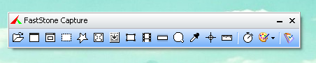
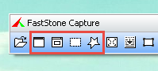
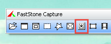
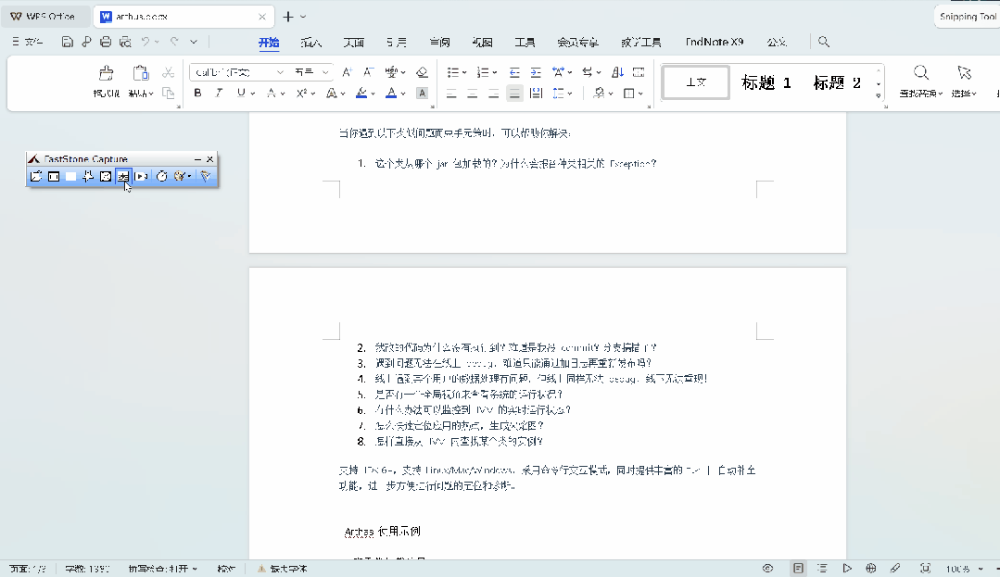
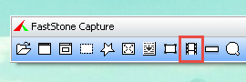
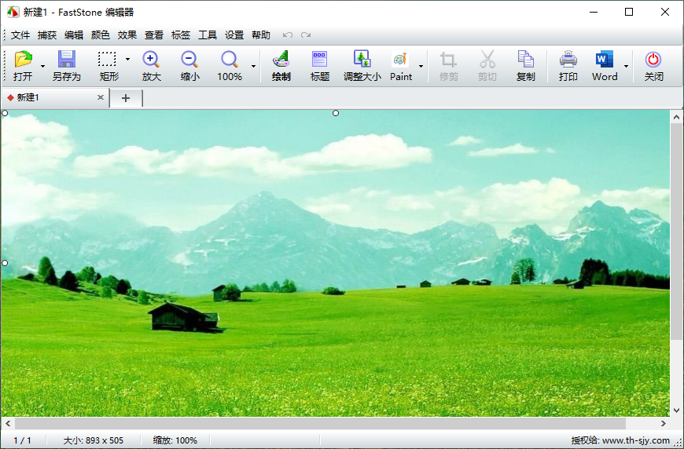
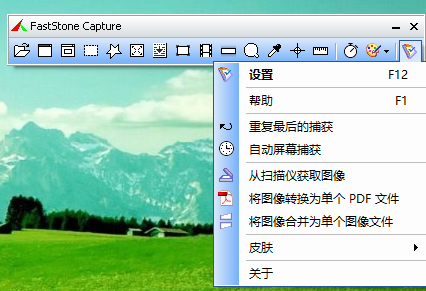

# 分享一个极简主义的截图录屏程序：FastStone Capture

> 原文地址: [https://mp.weixin.qq.com/s/5i0gepPpdZUvmm4ma-UCZA](https://mp.weixin.qq.com/s/5i0gepPpdZUvmm4ma-UCZA)

# FastStone Capture 

FastStone Capture 是一款备受推崇的屏幕捕获软件，以轻量级、易操作和多功能特性在用户群中赢得了高度评价。它超越了简单的截图功能，集成了滚动截图、高清视频录制、图片编辑与格式转换等众多进阶特性，成为提升工作效率的得力助手。

## 软件介绍

支持屏幕录制、滚动截图、高清长图、图片编辑、图片转PDF格式、屏幕取色。

-   高清截屏 无论是窗口、自选矩形区域、自由手绘形状，还是全屏模式，FastStone Capture 都能确保每一次截图都清晰无比。
    

-   滚动截图 独特设计让你能够轻松捕获长网页或文档的完整视图。只需标记好区域，软件即会自动向下滚动并逐一捕捉画面。
    

1.  在软件界面的顶部，点击截取滚动的窗口的按钮。
    
2.  按下Ctrl键，使用鼠标左键在屏幕上拖动以选择您想要截取的矩形区域（自定义滚动模式截图）。
    
3.  释放Ctrl键，然后点击界面下方的向下滚动箭头，开始截取滚动内容。
    
4.  页面将自动向下滚动，软件会逐屏捕捉内容。如果您想要在某个点停止截取，可以按下键盘左上角的Esc键。
    
5.  截取完成后，您可以选择将截图发送到编辑器、文件、剪贴板等，或者直接保存。
    

-   屏幕录制 无论是录制课程讲解、软件演示还是游戏过程，FastStone Capture 都能出色完成任务，记录下每一帧细节，同时支持声音录入（包括麦克风、系统音频及鼠标操作音效），并以高压缩比输出视频文件，节省存储空间。
    

-   图片编辑 内置的图片编辑器支持多种格式，利用先进的平滑与去毛刺技术优化图像质量，提供缩放、旋转、裁剪及色彩调整等功能，满足专业级编辑需求。
    

-   设置与小工具 软件设置及小工具：为了进一步提升用户体验，FastStone Capture 还配备了放大镜、颜色拾取器、屏幕十字线和标尺等工具，为设计和教学工作带来更多便利。
    

  

## 总结

综上所述，FastStone Capture 是一款不可多得的屏幕捕获与编辑工具，特别适合那些频繁需要进行屏幕内容记录与加工的用户。它以其实用性、高效性和灵活性，成为众多用户在数字化工作与学习中的首选伴侣。

下载方式

  

点击下面卡片，从**消息**对话框发送关键词：**工具**