# 初探高斯积分在一维有限元中运用：泊松方程

> 原文地址: [https://mp.weixin.qq.com/s/Uz\_GSRHfdZTdMhSJbAehZg](https://mp.weixin.qq.com/s/Uz_GSRHfdZTdMhSJbAehZg)

**简述**

在之前的所有有限元文章中，单元系数矩阵的推导均是直接求解得到系数，其实还有一种方法，可以避免人工求解最终的系数矩阵，其原理就是使用高斯积分，对系数矩阵的被积分项使用高斯积分，从而避开人工推导系数矩阵。

本文通过最简单的一维泊松方程，初步探索高斯积分求解系数矩阵的过程。

**1.边值问题**

泊松方程的一维边值问题如下：

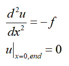

其对应的有限元问题如下，具体不再推导（参考：[最简单的一维有限元问题：求解cos函数分布](http://mp.weixin.qq.com/s?__biz=MzkwNzUxOTM2NA==&amp;mid=2247483689&amp;idx=1&amp;sn=238051a214893aec197bde3511363463&amp;chksm=c0d6b5c2f7a13cd49795a90d7a3509ff6e6a5fbd744fe1f1721af17a4cb8e93827383ddc9d60&scene=21#wechat_redirect)），直接给出结论：

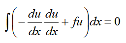

**2.一维线单元基函数**

在之前的一维有限元基函数推导中，已知基函数可以表示为如下：

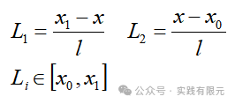

现在，我们将上述的基函数投影到区域\[-1,1\]中进行求解，投影关系有：

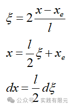    

其中xe表示单元中心点坐标。将上述式子带入基函数中，得到：

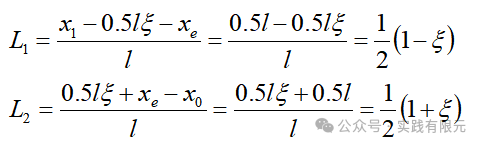

上述基函数的梯度表示为：

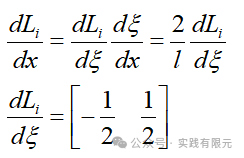

因此，针对1阶基函数而言：

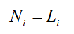

针对插值型2阶基函数而言：

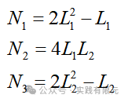

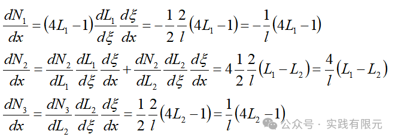

**3.系数矩阵推导**

根据高斯积分公式，在实际插值中，高斯积分的阶数大于等于基函数插值阶数。

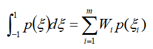

对于1阶泊松方程，积分第一项：    

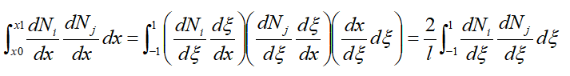

将被积分式子堪称高斯积分中的被积项，带入：

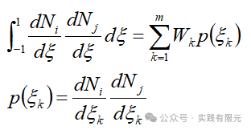

推导这里即可结束！对于积分第二项：

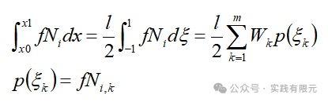

如此推导完成！

对于高斯积分的采样点与权重，直接给出：    

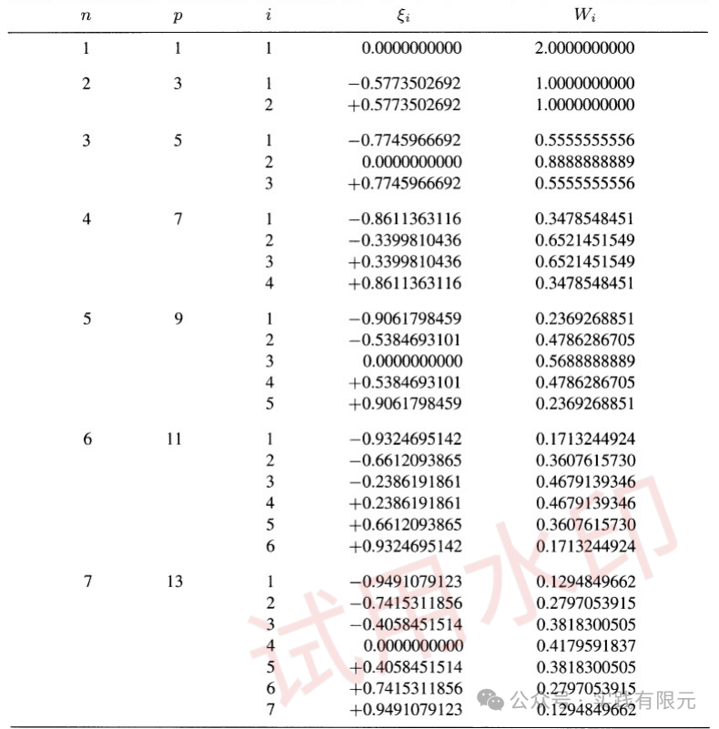

由此，就可以根据上述公式，直接得到积分结果,这对于编程实现是很便捷的。这里具体说明K11实现过程,以便于理解：

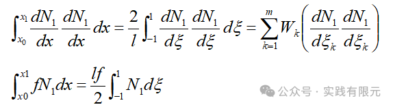

针对1阶基函数而言，已知基函数的导数：

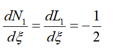

带入得到：    

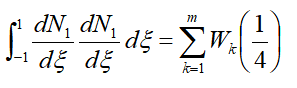

取1阶高斯积分，则已知：

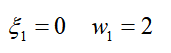

带入上述式子：

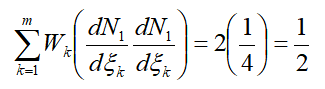

所以，该项对x的梯度的积分结果为：

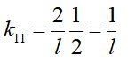

同理，针对右端项rhs11积分：

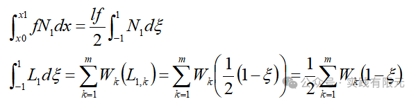

同样带入1阶高斯积分采样点和权重值，得到：

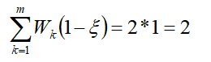

所以，该项的积分结果为：

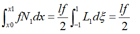

针对2阶基函数而言的k11    

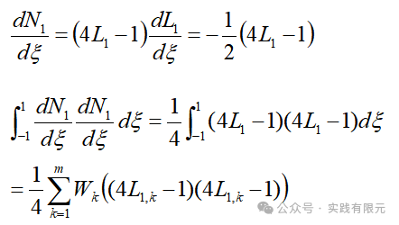

带入二阶高斯积分点和权重：

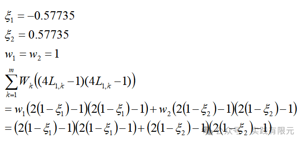

最终带入，得到该K11的 求解结果：

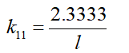

演示到这里停止，上述求解计算完全可以交给计算机，这里仅为了说明过程推导例子。

需要注意的是，该流程针对Kij,rhsi是完全一致的，因此不需要求解得到每个具体矩阵系数，这在编程通式求解是非常重要的。

**4.组装矩阵与边界条件加载**  

这部分与之前的有限元组装流程一致，这里不再介绍，参考：[最简单的一维有限元问题：求解cos函数分布](http://mp.weixin.qq.com/s?__biz=MzkwNzUxOTM2NA==&amp;mid=2247483689&amp;idx=1&amp;sn=238051a214893aec197bde3511363463&amp;chksm=c0d6b5c2f7a13cd49795a90d7a3509ff6e6a5fbd744fe1f1721af17a4cb8e93827383ddc9d60&scene=21#wechat_redirect)

**5.结果展示**

计算区间为\[0,10\]，均匀剖分为20个线网格单元。

**a.1阶基函数，使用1阶高斯积分 共计21个未知数**    

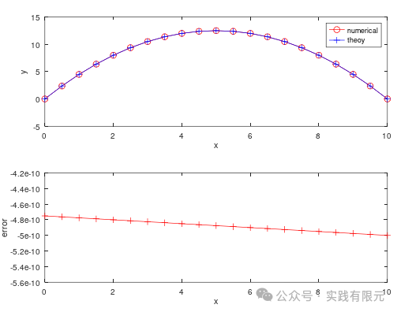

**b.2阶基函数，使用2阶高斯积分 共计41个未知数**

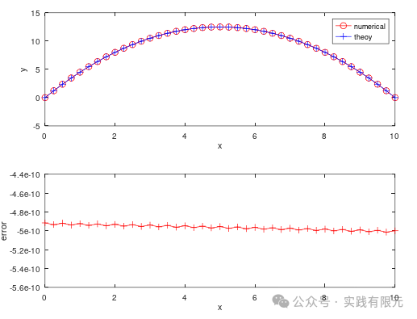

可见，数值结果结果与理论完全对应一致！

**6.结论**

在有限元的实现中，如果能求解通式，一定要比求解特定数值更加的适用，因此高斯积分的介绍也是为了这个目的。