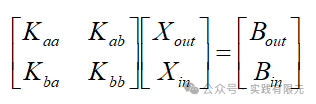
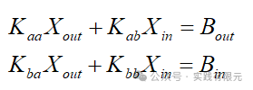
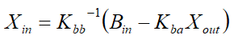
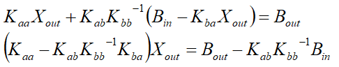
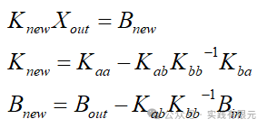
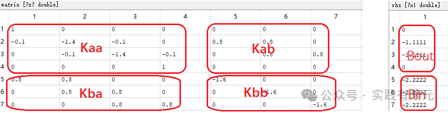
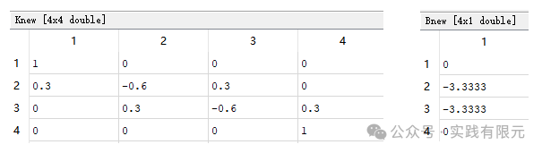
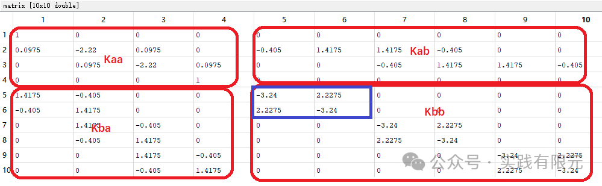
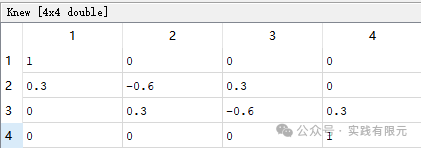

# 单元刚度矩阵的缩聚

> 原文地址: [https://mp.weixin.qq.com/s/p-ULI87lIeYTlZBoTFrTKA](https://mp.weixin.qq.com/s/p-ULI87lIeYTlZBoTFrTKA)

**刚度矩阵的缩聚**

抛砖引玉，最近看到力学有限元中处理刚度矩阵的一种方法：缩聚，有意思，简单介绍下。

对于高阶有限元而言，高阶部分可能存在与网格之间的连接位置无关的部分。这部分在刚度矩阵中的体现，仅在内部相关点的位置存在值，其他绝大部分均为零。因此可以对刚度矩阵进行缩聚，从而减小求解未知数，进而优化计算时间。

将刚度矩阵写成如下形式，分成两部分，仅与单元内自身节点相关的内部点的信息为Xin，右端项为Bin，其他部分放在Xout,Bout,具体如下：

将上述矩阵乘开，得到：

根据第二式，将Xin表示出来，

将第一式中，Xin替换掉，化简：

因此得到，

如此，将求解矩阵缩减为一阶情况下的维度。当求解得到Xout的时候，带入上述Xin的等式，即可得到Xin的结果。    

需要注意，虽然对Kbb进行了求逆的实施，但是因为Kbb对应的未知数全部与非本单元无关，因此其逆矩阵比较好求解，并且具有一定规律。

例如：考虑一维有限元，研究区域\[0 10\]，采用三个网格；

_Eg1 2阶基函数的泊松方程系数矩阵_

将该系数矩阵与右端项进行缩聚处理后，得到的新的右端项与系数矩阵：

测试求解的结果是一致的。

_Eg2.采用3阶基函数的泊松方程，其缩聚部分不再仅仅是对角线矩阵_

缩聚后其系数矩阵依旧为一个4\*4矩阵：    

求解该4\*4矩阵后，反推同样可获得所有未知数结果。

根据这两个案例可以发现，其缩聚的部分，如蓝色框中的数据即表示一个单元内部点的单元系数。

当对于结构相同，材料相同的情况下，在刚度矩阵中每个单元内部点相关的系数矩阵是一致，这里局部系数矩阵会出现重复，就可以进行优化了。

**思考**

1.矩阵缩聚这种方法，关键对需要缩聚部分的逆矩阵的求解，对于2阶而言，其内部仅有一个点，因此缩聚部分仅有对角线矩阵，对于高阶而言，其内部存在多个点，对应缩聚部分不再仅仅是对角线，因此求解逆矩阵比较麻烦。

2.我所理解的这里应该是每个网格尺度一致的情况下，仅仅需要求解单元内相关的一个小的逆矩阵，其他单元逆矩阵一致，如此实现快速求解。

3.缩聚不仅仅在高阶中适用，根据其定义，只要介质材料一致，网格一致，既可以划分区域，将区域内部点缩聚，缩聚到连接点，依次逐级缩聚，达到快速求解的目的。该方法在力学领域应该适用广泛，电磁领域所见较少。具体原因尚不清楚。

4.此外，这种方式是否可以直接抛开物理问题，直接使用到求解线性方程组的算法中，例如superlu其中使用的分块分解求解是否有异曲同工之妙。