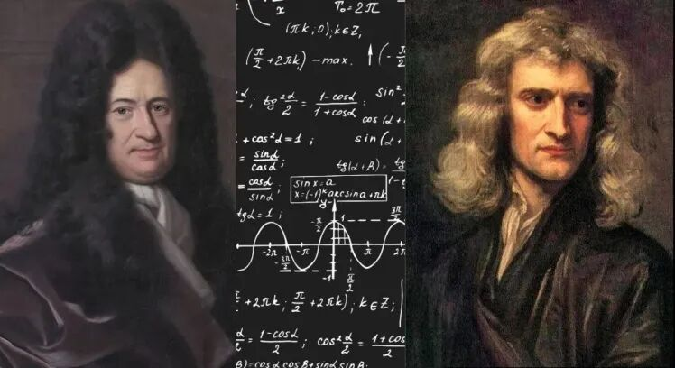
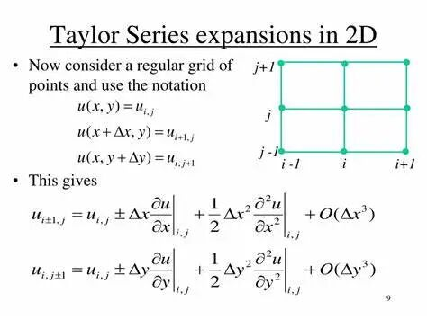
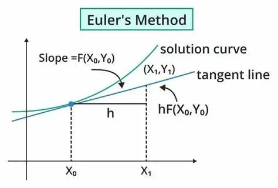
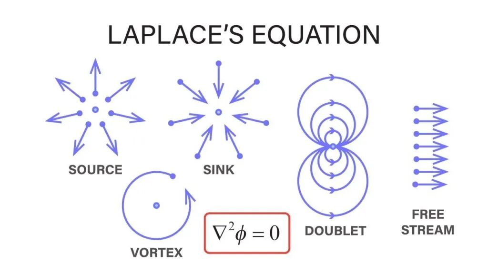
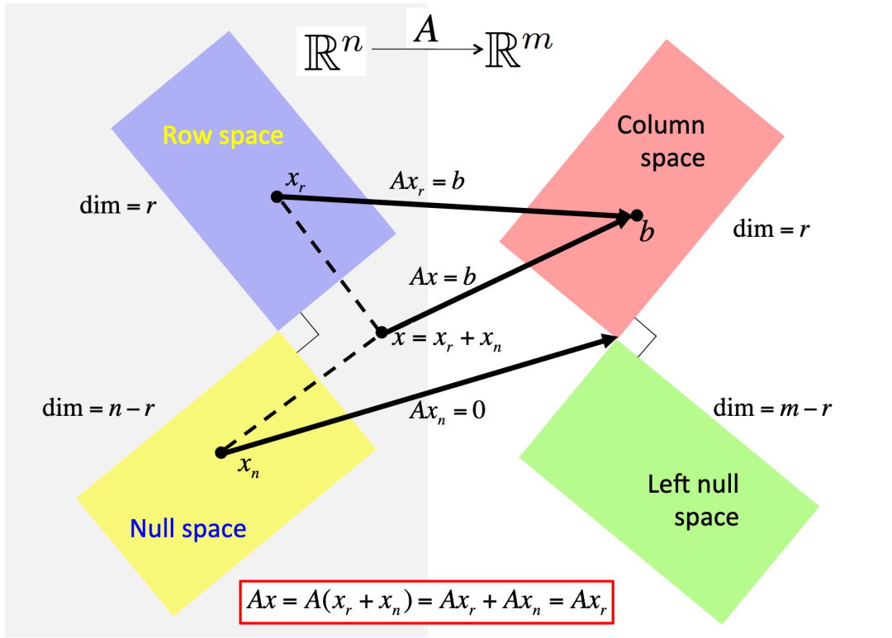
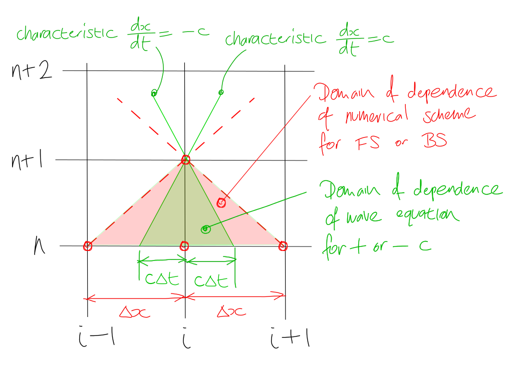
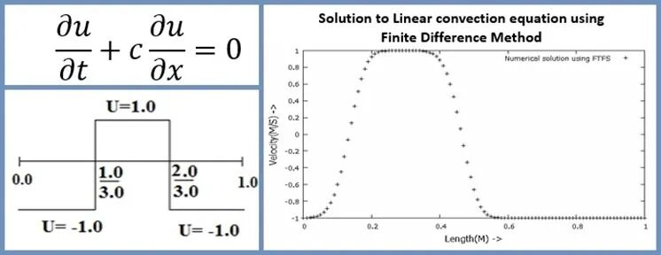
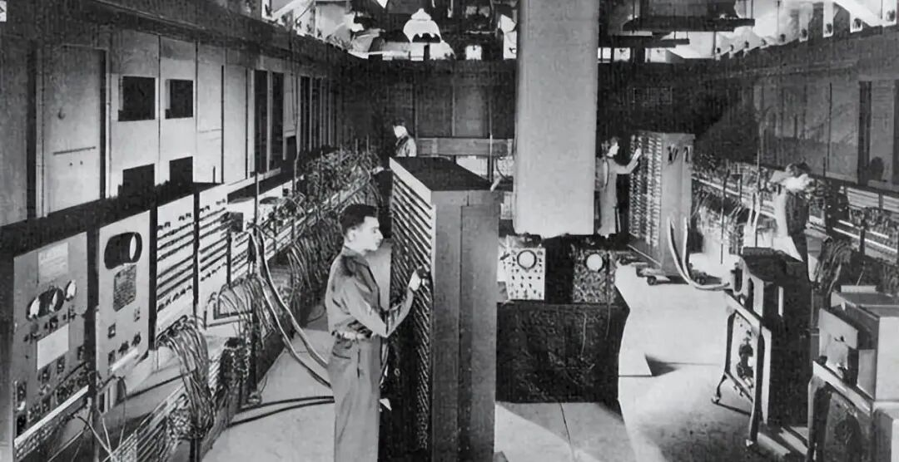
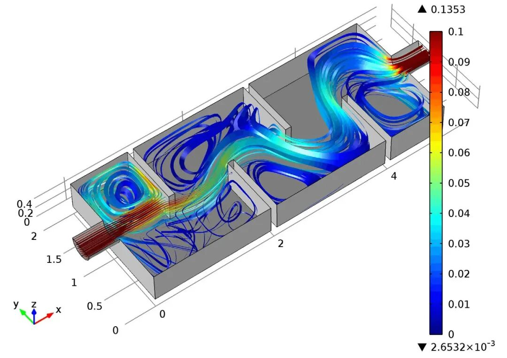
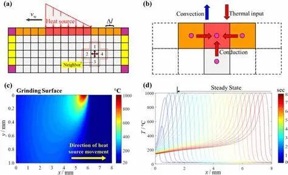

# 历史回眸：有限差分法的诞生与发展

> 原文地址: [https://mp.weixin.qq.com/s/8sAlMp0v7UNO\_TZluTFaRg](https://mp.weixin.qq.com/s/8sAlMp0v7UNO_TZluTFaRg)

在科学与工程领域，微分方程是描述自然界动态变化和物理现象的重要工具。然而，随着问题复杂度的增加，传统的解析方法往往难以提供有效的解决方案。在这种情况下，数值方法成为了科学家们探索未知世界的利器之一。其中，有限差分法（Finite Difference Method, FDM）作为一种经典的数值求解微分方程的方法，自其萌芽到发展成熟，经历了漫长的历史进程，并逐渐成为解决各种科学和工程问题的重要工具。

## 早期萌芽阶段(17世纪)

**微积分学**的诞生为有限差分法奠定了理论基础。17世纪晚期，**`牛顿`**（Isaac Newton）和**`莱布尼茨`**（Gottfried Wilhelm Leibniz）分别提出了微积分的概念，这不仅为数学提供了新的语言，也为描述连续变化和动态系统提供了强大的工具。在这一时期，人们开始意识到，对于一些复杂的微分方程，直接用解析方法求解变得不切实际。于是，他们转向了**离散化的方法**，即通过将连续的函数或方程转换成离散的形式来近似求解，这种方法正是有限差分法的基础。

**泰勒级数展开**的提出进一步推动了有限差分法的发展。**`泰勒`**（Brook Taylor）在17世纪中叶提出的泰勒级数展开，是一种将函数在其邻域内表示为多项式的方法。泰勒级数使得函数的变化可以用差分来表示，这对于构建有限差分格式至关重要。通过对微分项进行差分近似，可以将微分方程转化为代数方程，在离散化的网格上逼近原方程的解。

## 差分方法与插值法的发展(18世纪)

进入18世纪，**`欧拉`**（Leonhard Euler）和**`拉格朗日`**（Joseph-Louis Lagrange）等数学家的工作对有限差分法的发展起到了关键作用。

欧拉提出了著名的**欧拉法**（Euler's Method），这是一种用于求解常微分方程的简单而有效的数值方法，它通过逐步迭代逼近函数值，实现了对微分方程的离散化处理。

与此同时，拉格朗日提出的**拉格朗日插值法**（Lagrange Interpolation Method）则允许利用离散点值来估计函数的变化趋势，这对后来的有限差分法有着深远的影响。

## 微分方程的离散化探索(19世纪)

19世纪是物理学和工程学科迅速发展的时代，热力学、流体力学等领域的问题促使数学家们寻找更加精确的数值解法。**`拉普拉斯`**（Pierre-Simon Laplace）提出了描述稳态问题的**拉普拉斯方程**，这种偏微分方程广泛应用于电场、重力场等问题的研究。为了求解这类方程，数学家们开始尝试通过空间变量的离散化来近似微分方程，从而开启了有限差分法在偏微分方程求解中的应用。

此外，**线性代数**的进步也促进了有限差分法的发展。偏微分方程的离散化过程通常会生成大量的线性方程组，尤其在多维空间中。线性代数的理论为这些方程组的求解提供了必要的工具，使有限差分法的应用范围得以扩大。

## 系统性研究与应用扩展(20世纪初)

到了20世纪，有限差分法迎来了系统性的研究和发展。**`考特`**（Richard Courant）等数学家深入探讨了如何有效地将偏微分方程离散化，并分析了有限差分法中的**稳定性**和**收敛性**问题。他们提出的**Courant-Friedrichs-Lewy（CFL）条件**是判断数值稳定性的重要标准，确保了数值解的可靠性。

同时，有限差分法也开始被广泛应用于物理和工程问题中。例如，在流体力学领域，有限差分法可以用来求解Navier-Stokes方程，帮助科学家分析气体和液体的流动特性；在地震勘探和石油工业中，有限差分法模拟地层中的波动传播，有助于更好地理解地下结构。

## 电子计算机的出现与普及(20世纪中叶)

20世纪中叶，**电子计算机**的发明给有限差分法带来了革命性的变化。计算机的高速度和高精度使得科学家们能够处理以前难以完成的复杂计算任务，如大规模偏微分方程的求解。计算机技术的发展极大地推动了有限差分法的普及，尤其是在模拟和工程设计方面。

## 现代进展

随着计算需求的增长和技术的进步，有限差分法也在不断发展。科学家们探索出了**更高阶的差分公式**，以减少截断误差，提高计算精度。高阶有限差分法特别适用于需要高精度求解的应用场景，如波动方程、声场模拟等。

**并行计算技术**的引入更是为有限差分法注入了新的活力。由于有限差分法具有点对点独立计算的特点，非常适合在并行计算环境中实现。这项技术提高了计算效率，使得有限差分法能够应对更大规模的问题，如三维波场传播模拟等。

现代有限差分法的应用已经超越了传统领域，扩展到了**图像处理、金融建模、人工智能**等多个新兴领域。有限差分法中的离散化和近似思想为解决一类复杂非线性问题提供了数值基础，尤其在神经网络训练和最优控制等方面展现了重要的实际意义。

## 结语

回顾有限差分法的发展历程，我们可以看到它从一个简单的数学概念逐渐演变为解决现实世界复杂问题的强大工具。从最初的理论探索到现代计算技术的支持，有限差分法不仅在传统领域取得了巨大成功，而且正在向更多新兴领域扩展。随着科技的进步，我们期待有限差分法在未来能够继续发挥其独特的优势，为科学研究和技术应用带来更多的创新和发展。无论是面对气候变化的挑战，还是探索宇宙深处的秘密，有限差分法都将继续作为人类智慧的结晶，照亮前行的道路。

# 推荐阅读

我们目前正和专业SCI论文英文润色机构**艾德思**开展全方位合作。如果您需要**论文和基金标书辅导服务**，欢迎扫码下方二维码，获取您的专属学术顾问，**锁定直减活动优惠**👇

********▲****长按扫码添加学术顾问咨询********▲****

 

  

  

**喜欢****作者******，请点********赞********和在看********

****