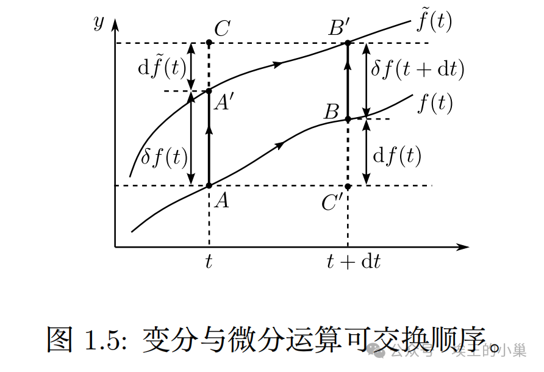

# 变分法基础

> 原文地址: [https://mp.weixin.qq.com/s/\_N\_7z7vTNrmKaUBbC5KMpQ](https://mp.weixin.qq.com/s/_N_7z7vTNrmKaUBbC5KMpQ)

# 变分法基础

## 前言

新开一个系列讲最小作用量原理，前面两章铺垫数学背景，即变分法基础。

注意：所有内容均以个人理解讲述，可能存在不严谨等问题，具体学习还请参阅专业教材\[1\]。

## 函数

我们知道，函数是输入一个数，经过映射后，输出一个数，即给一个数得到一个数，这是基本的函数。

## 泛函

泛函与函数不同，他像一个机器，接收我们输入的函数，它返回一个数。这里要与“函数”区分开：

-   函数是接收“数”输出“数”。
    
-   泛函是接收“函数”输出“数”。
    

这里给出几个具体的例子帮助理解：

最速降线问题：给定小球运动的轨道，我们可以得到他的运动时间。这里是的泛函。我们输入函数（即轨道），得到一个数。

理想气体准静态过程对外做功：给定气体过程方程，我们可以得到他在过程中对外做的功。在这里，是的泛函。

对于泛函，有别于函数,通常我们使用来表述，即：

## 微分

对于函数，我们为了研究其变化率，引入微分的概念：

## 导数

有了微分我们可以进一步定义变化率：

## 变分

类似的，在泛函中，自变量是一个函数，我们自然会想到自变量发生微小变化时所带来的泛函发生的变化，于是引出函数的变分：

-   函数变成了另外一个函数,且两者相差无穷小：
    

注意区分它与微分的差别：微分是对“数”进行的操作，而变分是对“函数”进行的操作。

变分有许多与微分相同的运算规则，例如：

变分有一个重要的性质：变分与微分可以交换顺序。即:

我们可以做一个简单的直观证明，如下图所示：我们研究点到点的变化。有两条路径可走：

-   路径1：。即先微分再变分。
    
-   路径2：。即先变分再微分。
    

对于路径1，我们可以得到点与点差值为：(精确到一阶小量)

其中：

对于路径2，同理有：

其中：

由于两个路径起点终点相同，因此我们联立式，并代入并化简即可得到：

进一步可以得到“导数的变分=变分的导数”，即：

这在变分法中经常用到。

## 结束

我们简单介绍了泛函和变分的概念，接下来我们会进一步引出泛函导数与泛函极值等问题。

## 写在最后

句子表述或相关证明也许存在问题，欢迎指出和讨论。

参考资料

\[1\]

参考资料: _《经典力学》/高显，科学出版社，2023.9_