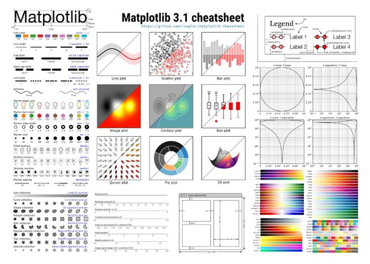
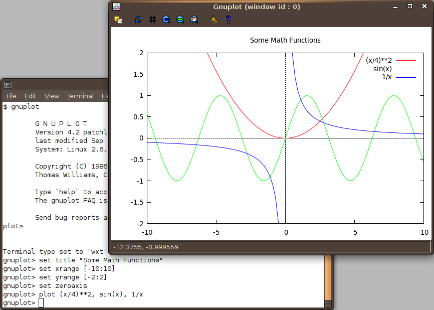
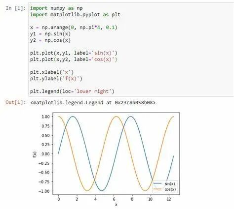

# 同样作为画图工具, gnuplot和matplotlib有什么异同点？

> 原文地址: [https://mp.weixin.qq.com/s/2fAapjoD-VnHY-F8oH8kig](https://mp.weixin.qq.com/s/2fAapjoD-VnHY-F8oH8kig)

## 

# 提问

经常使用 gnuplo 作图，感觉还算顺手。今天刚刚发现还可以使用 python 的 matplotlib 作图，觉得很新鲜，想学却不得要领。找了些入门资料来看，也是很不适应。不知道有没有熟悉这两种工具的朋友能给做一下对比？

# 一己之见，欢迎拍砖

两种工具自己都用过，目前 gnuplot 用得比较多一点，勉强算个已经入门的选手，在这里谈谈自己的理解。

gnuplot 和 matplotlib 都是强大的数据可视化工具，广泛应用于科学计算、数据分析和学术研究等领域。

## **相同点**

-   **目的相似：** 两者都旨在帮助用户生成高质量的图表，包括线图、散点图、直方图、3D图等。
    
-   **脚本驱动：** 它们都可以通过**编写脚本语言**来控制绘图过程，便于重复使用和自动化生成图表。
    
-   **跨平台：** gnuplot 和 matplotlib 都能在多种操作系统上运行，包括 Windows、Linux 和 macOS。
    

## **不同点**

**语言绑定**

-   **gnuplot：** 是一个独立的程序，有自己的专用脚本语言，适合从命令行或脚本文件直接调用。
    

-   **matplotlib：** 是一个 Python 库，与 Python 紧密集成，意味着使用 matplotlib 需要具备 Python 编程知识。
    

**易用性和学习曲线**

-   **matplotlib：** 通常被认为更加用户友好，特别是对于已经有 Python 基础的用户，其语法和 Matlab 相似，易于上手，且有丰富的文档和社区支持。
    
-   **gnuplot：** 学习曲线可能稍微陡峭一些，尤其是对于初学者，因为它有自己的命令语法，但一旦熟悉后，处理复杂绘图任务也很高效。
    

**性能**

-   **gnuplot：** 在处理大规模数据集时，gnuplot 因其底层优化，往往展现出更好的性能。
    
-   **matplotlib：** 对于中等规模的数据集，matplotlib 足够高效，但在数据量极大时，性能可能不如 gnuplot。
    

**可定制性**

-   **matplotlib：** 提供了极高的定制程度，几乎图表的每一个元素都可以被调整，适合制作出版质量的图形。
    
-   **gnuplot：** 也具有高度的可配置性，但相对于 matplotlib，定制图形样式和布局可能需要更多的命令行操作或脚本编写。
    

**集成性**

-   **matplotlib：** 作为 Python 生态的一部分，与其他 Python 库（如 NumPy、Pandas 等）集成得非常好，适合数据分析流程中的可视化步骤。
    
-   **gnuplot：** 虽然也能与各种数据源配合使用，但在与其他编程语言或工具的集成方面可能不如 matplotlib 灵活。
    

**图形输出**

-   两者都支持多种输出格式，包括但不限于 PNG、PDF、SVG、GIF 等，但具体的支持情况和默认设置可能会有所差异。
    

  推荐阅读