# 同轴线求电容，初探泊松方程的二维非结构化有限元

> 原文地址: [https://mp.weixin.qq.com/s/vPnhNayjwhYYQZZQAUmX0w](https://mp.weixin.qq.com/s/vPnhNayjwhYYQZZQAUmX0w)

**简述**

对于物理背景，考虑同轴芯线的横截面模型:

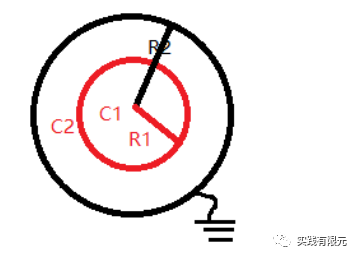

其中C1表示良导体芯线，C2表示介质层，求解这个模型的电容在电学中是一个非常经典的模型。

具体实现方法就是通过求解C2区域的电势分布，得出在芯线与介质层的分界面的电荷总量与电压分布，进而通过电容的定义式求取电容。

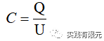

因此，需要求解电容，就得求解泊松方程在研究区域2的分布。

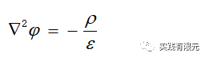

求解上述问题的数值方法有很多，这里主打介绍有限元的数值方法。

使用有限元求解上述微分方程的时候，我们发现用之前介绍的二维结构化有限元的四边形规则网格难以剖分出合适的网格，因此非规则网格的使用就势在必行。

本文介绍二维非结构化有限元中最常用的网格单元：三角形网格。

三角形网格因为其结构特征可以模拟任意形状模型，同样因为非结构化原因，网格获取不再如四边形一样很好生成，通常都需要使用开源或者软件生成三角形网格，后期会介绍几款作者常用的三角形网格的生成方法。

本文主要介绍有限元的非结构化网格的实现整个流程，并最终实现电容的求解，用以判断计算正确性。

**1.边值问题**

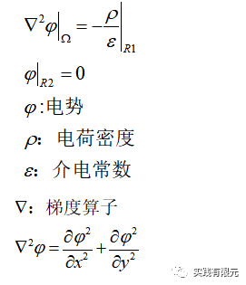

不难发现，这和文章：[最简单的二维结构化有限元问题：求解拉普拉斯方程](http://mp.weixin.qq.com/s?__biz=MzkwNzUxOTM2NA==&amp;mid=2247483928&amp;idx=1&amp;sn=05e3ce02b78d231fd8da3f06e2ddc0e1&amp;chksm=c0d6b6f3f7a13fe5e27ef7e246c1fe6c9dabeaeeca1605f4dd38678a4e6473c3388057c899e7&scene=21#wechat_redirect) 的边值问题公式基本上一致，只是多了右端项，并且该问题的研究区域是圆环C2。电容的理论公式为：

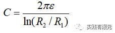

已知R1= 1e-4；R2=5e-4，相对介电常数为1，将这些参数带入上述公式，得到：

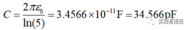

**2.有限元推导**

有限元推导过程也与文章[最简单的二维结构化有限元问题：求解拉普拉斯方程](http://mp.weixin.qq.com/s?__biz=MzkwNzUxOTM2NA==&amp;mid=2247483928&amp;idx=1&amp;sn=05e3ce02b78d231fd8da3f06e2ddc0e1&amp;chksm=c0d6b6f3f7a13fe5e27ef7e246c1fe6c9dabeaeeca1605f4dd38678a4e6473c3388057c899e7&scene=21#wechat_redirect)几乎，最终得到的有限元方程为：

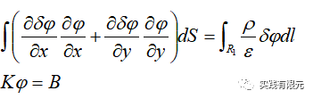

离散后得到：

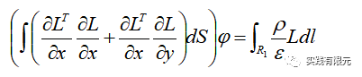

将研究区域离散成三角形网格（具体使用工具后期文章再做介绍），得到：

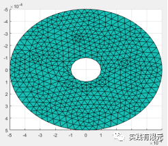

**3.三角形基函数推导**

使用面积坐标推导三角形的插值函数，如下图，假设三角形内任意一点P：

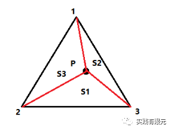

满足三角形总面积S=S1+S2+S3，因此，通过面积坐标，得到形函数L可以表示为：

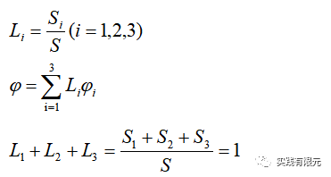

不难发现，当p点落在1点的时候，S1=S，S2=S3=0得到L1=1,L2,L3=0，插值得到p点的解就等于1号点的解；其他两个点具有同样的性质。

进一步推导，已知三个点坐标，三角形面积公式可以表示为：

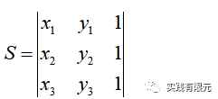

因此，形函数可以表示为：

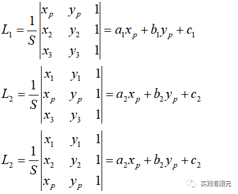

通过上述公式，就可以计算出每个形函数的系数a、b、c。从而确定形函数的具体表达式，对于单元内任意点P（xp,yp），则可以带入其中计算出具体的插值系数，带入的插值公式中就可以得到P的解。

这也是有限元的最直观理解，用简单的关系表示每个三角形内的关系，即基函数，然后通过节点之间的联系把所有三角形联系在一起，求解整个区域上的最优解，从而实现有限元求解。

所以有限元组装成的矩阵一般都是稀疏矩阵，因为每个节点仅与之相连的节点有关，不相连的节点无关，体现在稀疏矩阵中就是相邻节点上存在数值，不相邻节点为零。

进一步推导，可以发现同样需要对基函数求导，根据公式不难得出导数结果：

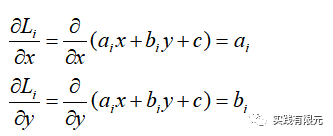

**4.单元系数矩阵**

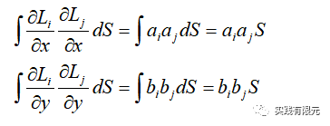

写成矩阵形式为：

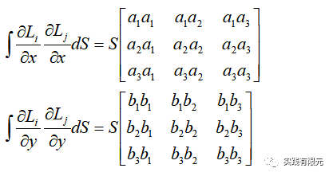

详细介绍右端项推导，假设在内边界上放置总电荷量为1的电荷，那么边上的电荷密度就等于：

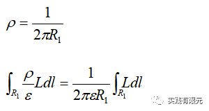

不难看出，在内边界R1上是属于线积分，所以基函数L也会降维到一维，因此使用一维的积分方法（查阅一维积分表，具体参考[最简单的一维有限元问题：求解cos函数分布](http://mp.weixin.qq.com/s?__biz=MzkwNzUxOTM2NA==&amp;mid=2247483689&amp;idx=1&amp;sn=238051a214893aec197bde3511363463&amp;chksm=c0d6b5c2f7a13cd49795a90d7a3509ff6e6a5fbd744fe1f1721af17a4cb8e93827383ddc9d60&token=907995554&lang=zh_CN&scene=21#wechat_redirect)），获得积分结果：

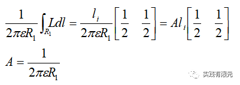

**5.系数矩阵组装**

组装过程与文章[最简单的二维结构化有限元问题：求解拉普拉斯方程](http://mp.weixin.qq.com/s?__biz=MzkwNzUxOTM2NA==&amp;mid=2247483928&amp;idx=1&amp;sn=05e3ce02b78d231fd8da3f06e2ddc0e1&amp;chksm=c0d6b6f3f7a13fe5e27ef7e246c1fe6c9dabeaeeca1605f4dd38678a4e6473c3388057c899e7&scene=21#wechat_redirect)一致。通过全局坐标节点与单元坐标节点的映射关系，将局部系数矩阵组装到全局系数矩阵的对应位置。

这里对右端项系数向量的加载方法做介绍。假设l1,l2两条边属于内边界，首先知道两条边的局部编号映射到全局编号。

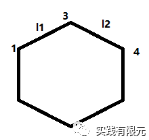

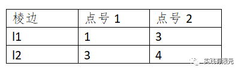

原始的右端项系数矩阵为零，因此将上述两条棱边加入内边界条件：

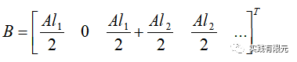

在完成内边界条件的加载后，最后再加入外边界的第一类边界条件，该边界条件的加载方法就和以前介绍的第一类边界条件的加载方式一致，乘大数法。

**6.计算结果**

二维电势的分布结果：

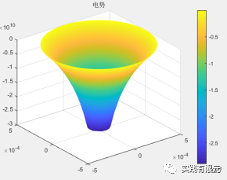

根据电容的定义式，我们知道了在内边界的电荷总量为1库伦（这是添加的边界条件），因此只需要知道该模型内外边界的电压差就能求电容。外边界的电势为0，内边界的电势可以通过上述有限元结果获取，假设为U1,则内外电压就等于：

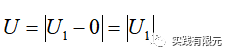

本例子中，获取到内边界的电压U1=-2.8929e10,根据电容公式得到公式：

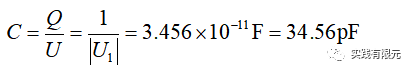

理论解与解析解基本已知，具体如下，可以说明计算整个求解过程是可靠的。

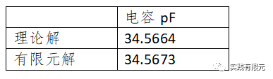

**7.总结**

a.非结构有限元实现过程中，对求解区域的非结构化网格离散是一个关键问题，笔者常用的是matlab、comsol、q2d、以及一些二维网格剖分开源代码来实现这步骤，其中对于简单测试用matlab中的pdetool工具就可以实现。

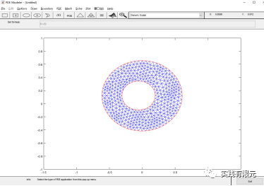

b.非结构有限元与结构化有限元的区别在于基本单元网格的不同，非结构网格的优势在于可以匹配复杂形状的模型；相对于其网格剖分难度更大。

c.对于有限元实现过程而言，单元不同，基函数也就不同，组装矩阵的结果也都不一样，但是整体上有限元的流程是和二维结构化、一维有限元一致的。

d.有限元的实现最终还是要服务于物理仿真，因此了解物理问题特性，得到合适的边值问题，从而才能合理运用有限元进行仿真实现。