# 四维泊松方程也能有限元仿真

> 原文地址: [https://mp.weixin.qq.com/s/C36gCTe58l5GzvZ6HeliOg](https://mp.weixin.qq.com/s/C36gCTe58l5GzvZ6HeliOg)

**简述**

在陆续实现1、2、3维度的高阶通式有限元的过程中，对于结构化网格而言，各个维度的基函数通式也可以获得，由此联想到是否可以用有限元仿真四维空间的泊松方程。

四维空间的泊松方程长啥样子？

好奇心驱使下，实现了这个想法，结果与预期一致，但是还是难以想象四维空间的样子。下面就介绍整个四维仿真过程的实现与结果。

**1.边值问题**

四维泊松方程的边值问题根据二维、三维可以类推得到：

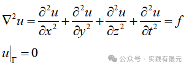

其中，第四个维度用t表示，这里表示的不是时间维度，而是空间维度。而边界等于0类比低维度，其边界条件应该是三维。

对上述进行变分推导进而得到有限元方程相对简单：

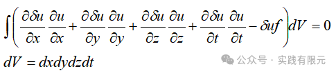

此时，对应的不再是对体积积分，而是针对四维空间的空间单元V积分。

**2.四维空间结构化一阶基函数**

在简述中提到，对于结构化网格而言，任意维度的基函数可以表示为：

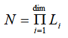

因此，可以推断四维空间的基函数有2^4=16个基函数，为：    

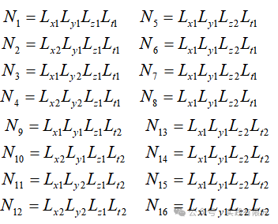

对应的映射关系：

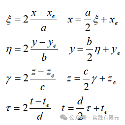

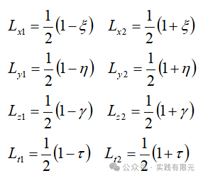

由此，其梯度也获得：

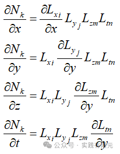

**3.单元系数矩阵的推导**    

推导单元系数矩阵其实也不难，根据三维的结论，在其基础上在添加一个维度即可，下面给出泊松方程有限元的各项梯度乘积的结果：

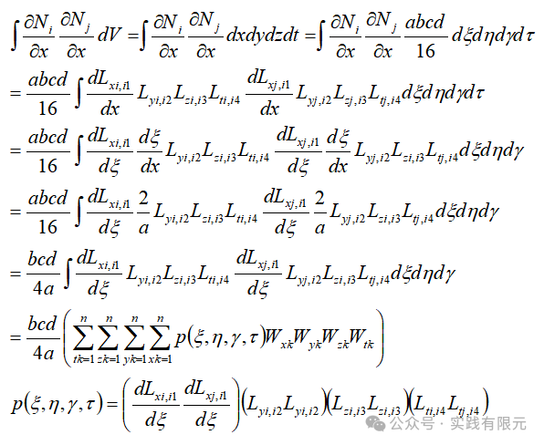

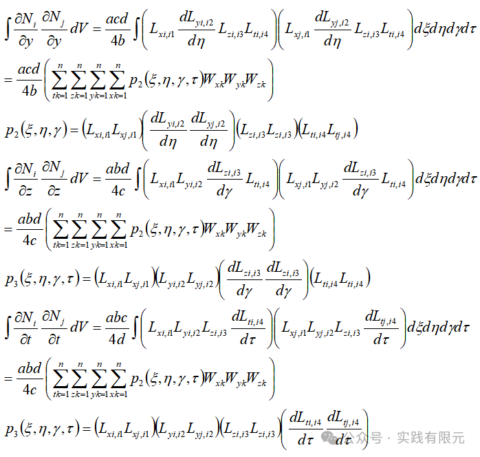    

对应的右端项：

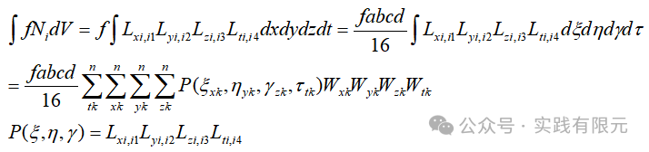

**4.系数矩阵组装与边界条件设置**

对于四维而言，其单元系数矩阵为16\*16，组装方式与低维度一致，对应位置一一组装即可。

其难点在于节点矩阵、单元映射节点关系矩阵的实现，如何构造一个四维空间的网格集合。这里不适合去发挥空间想象，可以从数学的角度出发，四维的每个节点由四个方向共同决定。四维的网格单元也是三维度+一维度组合而成，实现过程中考虑在三维上叠加一个维度即可。

对于的边界条件：可以想象，一维边界是两个零维点；二维边界是一维条边；三维的边界条件是8个二维面...

类推得出四维的边界条件是三维16个体，控制某个维度在边界上，由此可以切出一个三维体，即是边界体，如此即可找到四维的三维边界条件。

对所有边界均加载第一类边界，边界条件的加载方式不变，依旧使用乘以大数的方法。

**5.展示结果**

网格剖分为nx\*ny\*nz\*nt=10\*10\*10\*10=1万个四维网格，共计14641个节点。

首先，使用一条线，从各个方向的0点位置，穿透四维空间，得到(0,0,0,t)、(0,0,z,0)、(0,y,0,0)、(x,0,0,0)，四条一维曲线。按照边值问题的理论分析，这四条曲线应该有完全一致的变化规律，所得结果的确也是如此，如下图：    

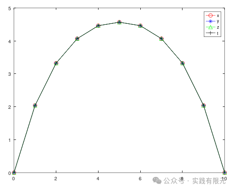

再看看四维空间彩图结果，对t方向切片，得到三维空间的彩图，联合在一起显示即使表示四维空间的结果，如下图：    

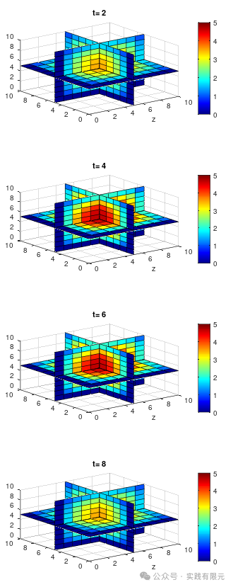

可以看出，控制色棒为同一个区间，t=2~8的变化去试试呈现变大再到变小的趋势，与(0,0,0,t)曲线的变化趋势一致。    

即使如此，想要想象一下四维空间的样子，还是很难将上述结果想象成四维空间的泊松结果。

**6.感悟**

A.从大量实现1~3维问题发现，无论几维度，最终有限元组合结果都是matX=rhs，mat始终是N\*N的系数矩阵,rhs都是N\*1的维度，因此如果能获得高维，例如四维、五维的基函数，那么是否也可以仿真高维的物理问题。而高斯积分与结构化网格让这成为了可行性的。

B.不得不承认，即使实现了所谓的四维空间的泊松方程，依旧难以想象其存在的方式，更不用说其具体的实用场景。

尝试以电荷的角度类比：一维拉普拉斯方程的点源理解为面电源的衰减；二维拉普拉斯方程的点源可以理解成电线源的衰减；三维拉普拉斯方程的点源理解成电点源的衰减；那么四维拉普拉斯方程的点源是否可以理解为电XX源的衰减。至于是否真实存在就不得而知了。

C.当然，还有一种是把第四维度理解为时间维度，如此似乎可以想象一个三维空间随着时间变化的规律。