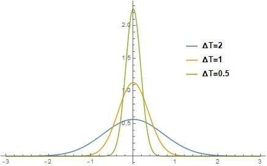
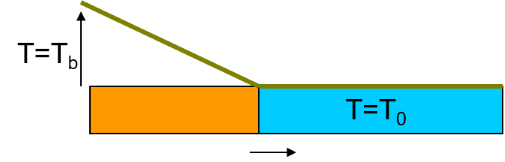
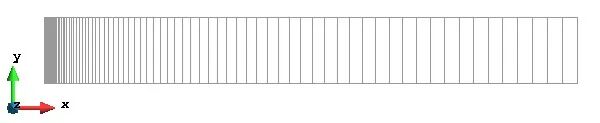
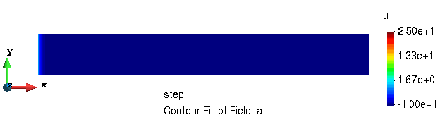
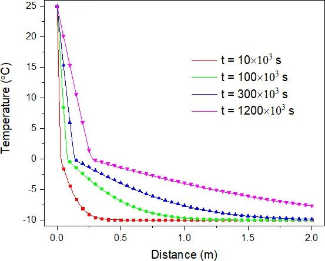
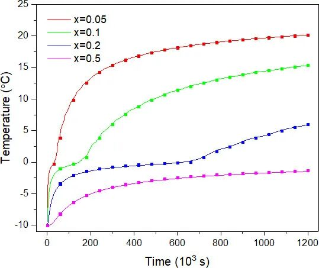

# 固液相变问题的有限元求解

> 原文地址: [https://mp.weixin.qq.com/s/FO4-Yeaz1tmoQ9Fm4P5pYw](https://mp.weixin.qq.com/s/FO4-Yeaz1tmoQ9Fm4P5pYw)

点击上方「蓝字」关注我们

在自然界和各种工业生产过程中，大量存在着伴有相变的传热过程。例如，冰的融化和凝固，铸造过程中金属铸件的凝固，焊接中焊条的熔化固结，晶体的生长等。其特点是区域内存在着一个随时间移动的两相界面，界面的位置未知，在该界面上放出或吸收潜热。这类问题是1890 年德国科学家 J. Stefan (斯蒂芬) 在研究无限大冰块的融化问题时首先提出的，因而也称为 Stefan Problem (斯蒂芬问题)。

在铸造、焊接、塑料成型等加工工艺中，相变传热是基本的物理现象，与材料性质、产品性能和质量密切相关。研究相变传热的规律及其分析方法，对于设计和改进工艺方法具有重要意义，也是相关工业产品 CAD、CAE 技术的重要基础。

本文以半无限长冰层的融化问题为例，介绍 FEtch 系统在求解伴有相变过程的瞬态热传导问题中的应用。

## 控制方程

对于二维直角坐标系，固液相变问题服从如下偏微分方程：

**固相**

**液相**

**融化界面**

其中， 表示材料密度， 为材料的比热， 表示温度， 是热传导系数，下标 、 分别表示固相和液相。 为凝固/融化温度， 为相变界面的法向矢量， 为相变潜热， 为相变界面位置。 和 为二维直角坐标系下的坐标变量， 为时间。

## 等效热容法

为了适用于多维问题计算以及处理带有相变区间的情况，这里采用等效热容法。等效热容法不需跟踪两相界面，从而使液相区和固相区统一处理成为可能。此时 (1) 式可统一写成

其中

    

  

式子中的 为狄拉克 Delta 函数。这样我们就将固液相变问题转换成了**非线性瞬态热传导问题**，可以相应的求解方法来操作了。

上式的主要难点是 的数值表示。该函数在除了 点以外的点取值都等于零，而其在整个定义域上的积分等于 1。 并不是一个严格意义上的函数，它在泛函分析中被称为广义函数。我们可以用下式来近似表示 Delta 函数

这是一个偶函数，在整个定义域上的积分也等于 1。其中 控制着函数非零区域的宽度，可以理解为假定的以 为中心的相变温度区间的一半。 取不同值时对应的曲线形状如下图。

  

## 算例

考虑一半无限长的板状冰层，上下边界绝热，初始温度为 。将左端温度提升并保持在  ，求冰层温度场的演化过程。

有关的热物性参数为：水的比热容 ，冰的比热容 ，水的导热系数 ，冰的导热系数 ，相变潜热 。水和冰的密度均取 。

**建模和网格剖分**

简单起见，这里仅模拟 4 m 长的冰层区域。网格剖分采用 4 节点等参单元，并对左端进行了局部加密。共使用了 80 个单元，162 个节点。

我们令 的参数 ，取 为单位时间，对 1200 个时间单位的温度场的演化过程进行模拟。

### 计算结果

计算程序根据收敛性速度自动改变时间步长，时间步变化范围从 1 到 12，总共使用了 314 个时间步。对计算结果稍加整理，效果如下。

**温度场的演化过程**

**不同时刻的温度场分布**

不同时刻的温度场分布情况如下图所示。图中的直线为数值解，散点为解析解。

从图中可以看出，随着时间的推移，冰层从左向右逐渐融化，温度不断升高。通过对比可以发现，不同时刻温度场的模拟结果与解析解吻合较好。

**温度随时间的变化曲线**

选取 0.05、0.1、0.2 和 0.5 m 的四个位置作为观察点，温度随时间变化的过程如下图所示。图中的直线为数值解，散点为解析解。

可以看到，伴随着传热过程，观察点由近及远，温度逐渐升高。整个变化过程是平滑和稳定的。数值解和解析解符合较好，充分证明了算法和程序的有效性。

  

**往期推荐**

[

**一图读懂 FEtch 的工作流程**

](http://mp.weixin.qq.com/s?__biz=Mzk0MzI0NDU2NQ==&mid=2247484242&idx=1&sn=2a466b3d5070c1b304e651802fea1935&chksm=c3379728f4401e3ea99bd94415da1bb7b51a747a79b49b83529abc75100adddadf2eef86c95a&scene=21#wechat_redirect)

[

**谈谈有限元程序开发，兼谈 FEtch 入门**

](http://mp.weixin.qq.com/s?__biz=Mzk0MzI0NDU2NQ==&mid=2247484241&idx=1&sn=75293632dd989a5060fb4c803ca54b3a&chksm=c337972bf4401e3d2334e5a5e4a403bd4b9bffbb599e5626680ab56e9a67f3a2dd2e8a4129ae&scene=21#wechat_redirect)

[

**通用前后处理软件 GiD 简介**

](http://mp.weixin.qq.com/s?__biz=Mzk0MzI0NDU2NQ==&mid=2247484077&idx=1&sn=f91b124c472bc374439266d2fe28c394&chksm=c33796d7f4401fc1839829cd4211644369b8ff835bd043188dd758f3b0bf84e6df802814bfda&scene=21#wechat_redirect)

  

  

## 推荐阅读

  

**FEtch 系统**是笔者团队开发的新一代有限元软件开发平台。只需按照有限元语言格式填写脚本文件，即可在线自动生成基于**现代 Fortran** 的有限元计算程序，从而大幅提高 CAE 软件的开发效率。

我们长期开展 FEtch 系统的试用活动，欢迎私信交流和扫码咨询，免费获取**许可证文件**。

**喜欢****作者******，请点********赞********和在看********

****