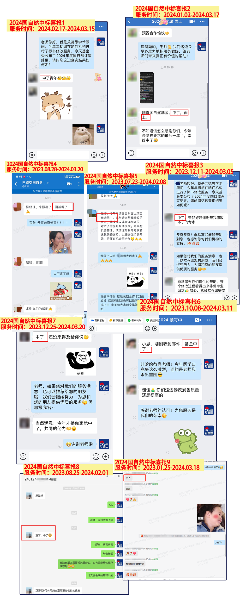
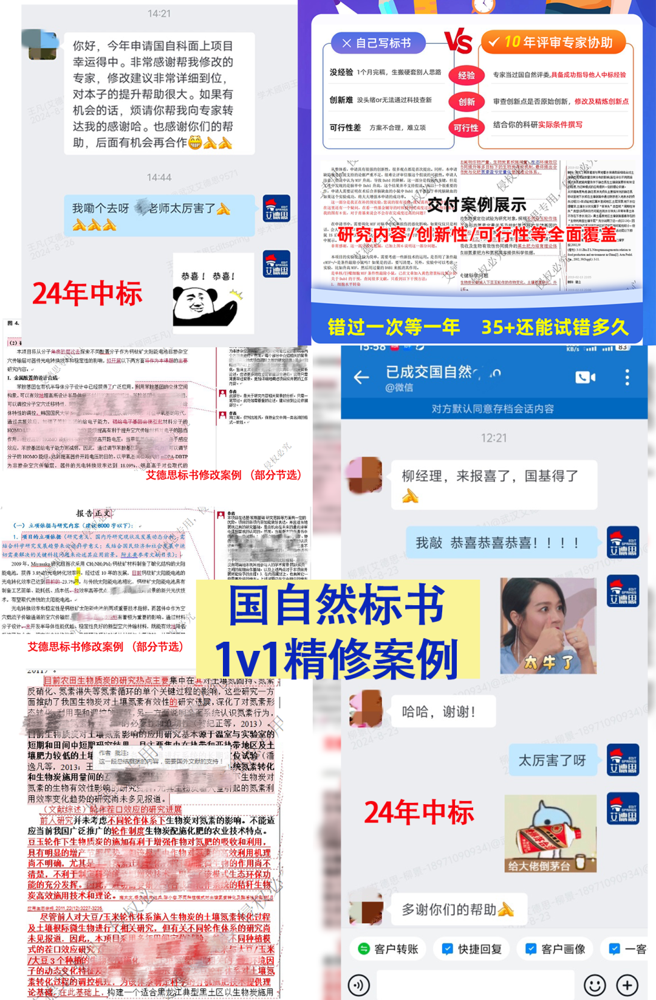
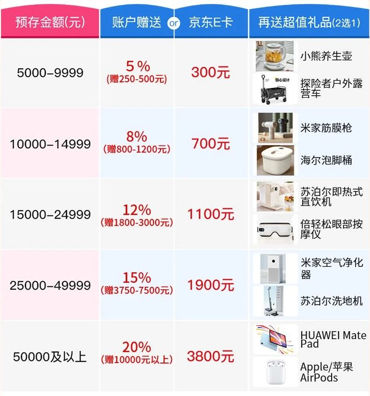
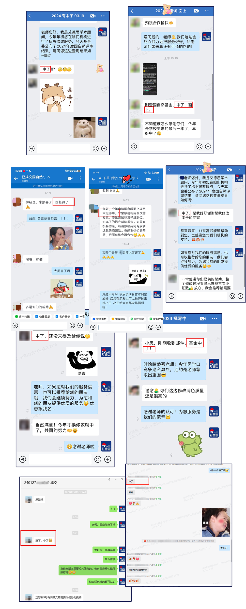
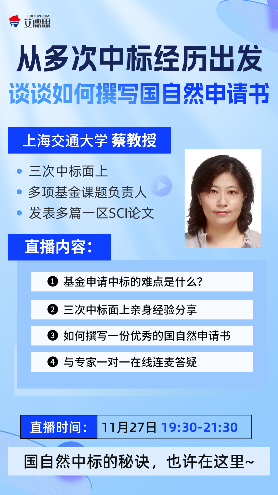
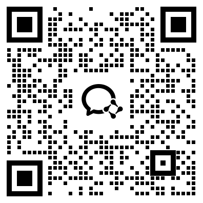
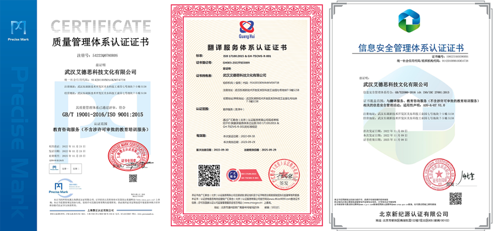
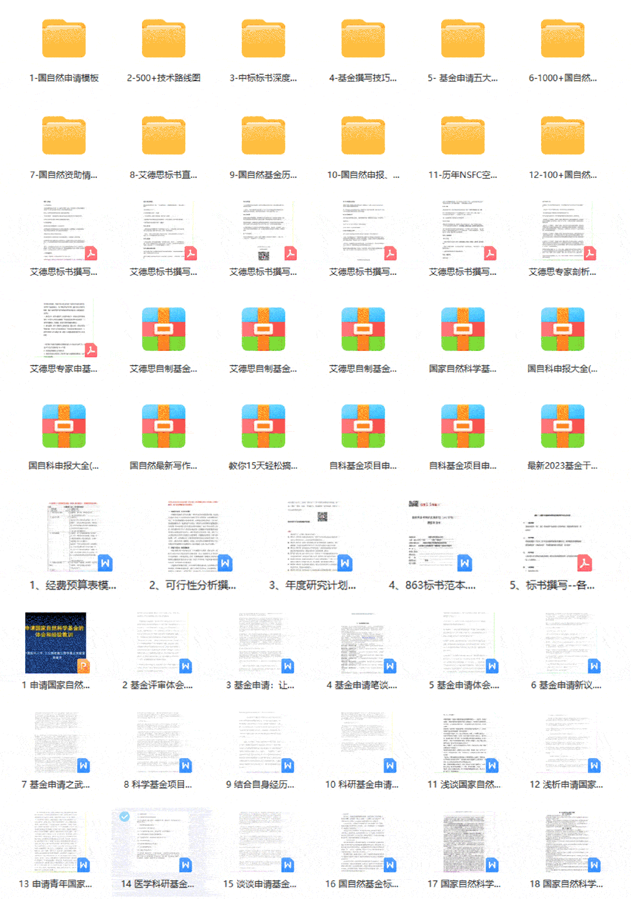

# 国自然十年评审专家1v1本子精修，中标率提升58.6%！大牛评审在线直播，一键0元预约！

> 原文地址: [https://mp.weixin.qq.com/s/i3QN0LLpWb\_76lnFFGWyyA](https://mp.weixin.qq.com/s/i3QN0LLpWb_76lnFFGWyyA)

提示：如需预约《从多次中标经历出发-谈谈如何撰写国自然申请书》国自然评审专场直播，请拉至文末预约！

**老标书人都知道，国自然申请要一鼓作气，最好一举中标！毕竟等一年老一岁，优势变劣势。**  

8月国自然才放榜的时候，就有不少作者来提交本子让专家开始修改了。

估计大家也知道，国自然立项竞争越发激烈，大家也越发勤奋。

**越早准备，就有越多修改打磨的机会，避开高峰期，专家就可以将全部心力倾注在你一个人的本子上，这也是事实。**对于作者来说，相同的支出可以获得更高质量、全面的服务，更高的中标率！

**特别适合准备把历年的本子修改了，再次提交的老师**，毕竟如果你要打赢比赛，超越对手就可以了。

**没有哪个科研人不想中基金。**

落榜，也不需要太灰心，因为这注定是一场长跑，比的就是耐力。

连续好几年没评上，已经越来越常见。甚至每次意见都不错，都只差一点儿…

这时候就不要闭门造车了，**基金这个类目涉及立项，必须请行业内的高级专家多提提意见，你才能对你的本子有好的把控。**  

就我的个人经验来说，我推荐大家选艾德思Editsprings，积淀13年的基金标书科研服务老牌机构。

**他家最厉害的是能匹配同领域经验丰富、自身水平高的“国自然真实评审”亲自上手1v1修改！大佬亲手给改本子的感觉，真的很香~**

历年数据显示，和未经由专家处理的本子相比，服务后本子的中标率可以提升**58.6%！**

有了审查本子无数、基金评审经验10年以上的同领域专家精细打磨抛光，**原本50分的本子甚至能接近100分！**

2024年真实中标好评案例

就像**学生永远猜不着老师会出什么样的考题**，申请基金的老师们也猜不到专家们可能拒绝的理由。

有些老师的科研能力十分过硬，但欠缺这些**技巧**和**经验**，当真正提交申请书之后，往往会因为这些**小细节**而与成功失之交臂。

所以，艾德思作为业内的老牌科研服务机构，凭借**十年基金申请协助经验**，依靠**“强大”、“阅本子无数”**的专家实力。

针对国自然这一项目推出了**一系列服务**，帮广大科研人解决难点、痛点、卡点。

**具体有哪些服务，我现在就一一给大家介绍一下**

**01 国自然1v1精修/指导服务⭐️**

**“ 1v1精修”**，顾名思义，主要模式是学员和**“同领域”国自然高级专家**一对一交流，**对已写好的标书进行针对性协助与修改。**

涉及到的标书整体思路的创新性和可行性问题将提出指导意见，标书内容将**逐字逐句进****行协助修改，不用担心“写不出”、“写不好”。**

**国自然1v1精修：**

专家将从选题、研究假说、研究内容、创新性、系统性和可行性等各方面**直接参与修改您的标书**，为标书**全流程**把脉，找准病因，对症下药，让您的标书更出众。

**创新性：**对标书的创新性进行评估并给出意见 

**科学性：**对标书的科学性性进行评估并给出意见 

**可行性：**对标书的可行性进行评估并给出意见 

**标题：**对项目名称、关键词、摘要进行精炼、规范化、条理化、鲜明化修改 

**前言：**优化立项依据、国内外研究现状，使其条理清晰、层次分明、表述精简 

**研究主体：**突出研究内容重点、明确研究目标、概括凝练拟解决的关键科学问题。有相关性、层次性，环环相扣的递进阐述 

**研究思路：**优化研究方案，使其思路清晰，简洁明了，调整技术路线，使其逻辑严密且合理 

**研究理论：**优化可行性分析，使其多维（理论、技术、实验条件、知识技能）分析均可行，突出项目特色和创新之处 研究计划及基础：调整年度研究计划，补充优化研究基础及工作条件

****▼**长按****扫****码，抢占****国自然1v1精修******名额********▼****

**国自然1v1指导**/****辅导**：**

专家将对标书各部分内容逐条提出评估意见及改进建议，并出具指导报告；

**创新性：**对标书的创新性进行评估并给出意见 

**科学性：**对标书的科学性性进行评估并给出意见 

**可行性：**对标书的可行性进行评估并给出意见 

**标题：**对项目名称、关键词、摘要是否合理提出意见 

**正文：**对本子正文内容是否充足，是否准确合理，是否逻辑清晰等提出意见

****▼**长按****扫****码****，抢占****国自然1v1指导****名额******▼****

**02 国自然标书评估**

专家将根据您的本子出具专业且详细的评估报告，给出是否建议申报的评估意见，为您评估研究内容、研究方案及所采用的技术方案是否合理，为您评估其创新性、科学性、可行性**（评估报告中将附带申报建议）**

****▼**** **标书评估5折优惠活动进行中******▼****

****仅需********500元**** ****收获评估报告+申报建议****

****▲**长按扫码，领取标书评估5折优惠券****▲**

**03 国自然标书润色**

专家将为您润色您的标书语言、逻辑，突出重点，避免头重脚轻，使之更符合基金评审专家的阅读习惯，**避免因语言格式问题错过中标机会。**

提升强化标书语法、语句逻辑，简洁精炼语言，删除重复累赘内容  规范标书标点符号，段落格式，**使得本子行文规范，保证不会因为语言问题被拒。**

****▼**长按****扫****码，****咨询标书润色服务****▼******

**04 国自然课题设计**

当然，也有很多老师觉得，光一个科学问题就这么弯弯绕绕，更别提摘要、预算、研究目标、技术路线等关键部分的难度了，根本无从下手！

想申报标书，又不知道从哪里开始的老师，不如找10年评审经验专家协助更有把握！

**艾德思标书一条龙服务：**  

**搭建完整的项目研究框架：拟解决的科学问题；项目的研究目标；项目的基本研究内容；项目的研究技术路线；项目预期存在的问题；**

**第一阶段：**确认方向和级别，评估不过不接单➜ 你：仅需填写需求表；  

**第二阶段：**查阅文献，设计选题，查新包过 ➜ 你：不满意重拟；

**第三阶段：**交付完整标书（题目、摘要、立项依据等）➜ 你：不改动直接申报；

****▼**长按****扫****码，********咨询********国自然课题设计******▼****

****为您提供优质一条龙服务****

**05 年末特别活动-预存款大额返现**

临近年底，**老师们要是有****没用完的项目经费，无需退回****，最好用来预存！**活动力度很大！

无论是个人还是全部课题组都能使用，永久适用于所有服务，**报销发票手续非常齐全，特别方便**！

**预存可获相当比例的金额赠送，****最高返20%****，也就是可**额外收获******10000元****余额****或****3800元京东卡****（京东卡可直接进行消费）**

除了能收到京东卡，还能****叠加获得****以下礼品****，自己挑自己喜欢的就行（悄咪咪透露一个小技巧：分成两笔就可以收到两份礼物****）

****▼年度大礼-**预存款返现大放送******

****

覆盖各个项目的超全发票类型

**立即咨询****年度****经费预存返现活动**

**抢占****大额赠送****名额**

********▲****长按扫码添加学术顾问********▲****

听了介绍，可能有老师想知道**帮忙改本子的专家资质**，以及**服务效果如何******

**答案是：算得上基金项目中的顶峰水平！好评率98%！**

艾德思国自然专家队伍是由**10年以上通讯评审**和**会评专家**组成，都拥有**3次以上中标基金项目主持经验**，并且**每位专家均超5次成功指导他人标书中标**！都属艾德思多年沉淀所得！

无论是**写本子****思路、眼界，**还是**中标技巧**，或**对改革变化的敏感度**，每位专家的学术能力都是上上乘的，可以全方位帮助你的本子得到最大的提升！

据往年购买了以上服务的客户反馈，进行服务了的老师确实**比其他老师拥有“大很多”的中标**优势******，光从本子“卖相”上来说就赢了！**

**在艾德思专家的支持下，每年都有很多老师申请并成功中标**：

**①中标率高。**艾德思自开展国自然基金服务始，报名参与的老师都有着较高的中标率。历年国自然中标率达**56%**，近几年整体呈上升趋势，老师们均有不错的反响。

艾德思2024年回访真实中标案例 

**②覆盖领域广。**艾德思积累数十年，基金标书业务已覆盖**18大学科**以及各细分领域，只要是大学里有的专业，几乎都能匹配到，并提供高资质高水平专家支持。

与此同时，**保持超强的专业性**。本次“1v1精修”服务是由国自然高级专家坐镇，亲自评审和修改指导，专业过硬、经验丰富，在语音1v1沟通中，可以准确、到位地指出学员本子中存在的问题，学员可以有方向地去修改，高效省时。

**③紧追热点。**在“1v1精修”中，我们会**提供珍贵的往年申请成功标书**作为参考。国自然申报每年都在变，有这些最新的申报成功的标书作为参考去修改，比较贴近最近几年评审的口味，更能提高中标率。

**④保密性强。**艾德思采用的是国际标准**128位SSL加密技术**，每笔订单都会自动生成相对应的保密协议，该协议具有**法律效力**，丝毫不同担心泄露。  

申请条件限制一览

****▼**长按****扫****码****，咨询服务**▼****

**附赠国自然超全大礼包一份**

另外，在座的各位老师应该都知道，**每年国自然申报都有诸多新变化**，包括竞争压力的加大，很多老师正为此忧心忡忡。

为了尽可能帮助基金人摆脱困境，艾德思EditSprings作为老牌的基金科研服务品牌，邀请到了从事**国家基金标书审查管理10余年、累计审查基金标书10000余份**的**985高校**辜教授，于8月28日举办了一年一度的**国自然重磅结果解析与未来展望****直播**。

  

**辜老师从国自然基金委的角度**，为大家深度剖析了2024年国家自然科学基金放榜结果！

  

**在直播中，很多老师提出希望能有真实中标的老师来分享个人经验，来补充自身的不足。**

为此，艾德思特意邀请了国自然函评专家——**中标三项国自然面上项目**的上海交大蔡教授，为大家精心策划了一场国自然直播**，于11月27（周三）举行！**

  

如果你**对24年国自然的评审结果有疑问**，**不知道什么样的本子才能上会并中标****？**或者**对25年的申报没有信心**，都可以获得与**蔡教授**在线一对一沟通的机会️

  

**三项国自然面上中标**

**实时直播亲授国自然中标技巧**

  

这场直播讲座的目的很明确，**为广大标书人做申报方向上的精确指引**，**避免反复碰壁浪费时间，进而综合提升本子的中标率**，**早日中标！**

  

  

机会珍贵，**扫描下方二维码，添加学术顾问即可预约直播**！还提供有国自然学术交流群，让大家学习讨论，群内潜伏有各领域大牛哦~

  

**长按识别下方二维码添加学术顾问** 

 **立即预约直播** 

  

  **重磅附加福利，**扫码加微领取****

**附加福利一**：

“免费领取价值5699国自然超全大礼包（课程+资料）”

**附加福利二：**

“免费加入国自然基金学术交流群”

  

**直播主题**

**国自然面上三次中标作者&评审专家：**

**“从多次中标经历出发-谈谈如何撰写国自然申请书”**

**直播内容**

**1、基金申请中标的难点是什么？**

**2、三次中标面上亲身经验分享**

**3、如何撰写一份优秀的国自然申请书**

**4、与专家一对一在线免费连麦答疑，任何问题均可咨询！**  

**全方位攻克基金难题，助您提高中标率！**

  

**受邀专家简介**

**上海交大****\-蔡教授**

**◁** **国自然基金函评专家  
**◁** 三次中标国自然面上项目  
****◁**** 多项基金课题负责人  
****◁**** 发表多篇一区SCI论文**

**0元预约直播！**

**长按识别下方二维码添加学术顾问**

 **立即预约直播** 

  

  **重磅附加福利，**扫码加微领取****

**附加福利一**：

“免费领取价值5699国自然超全大礼包（课程+资料）”

**附加福利二：**

“免费加入国自然基金学术交流群”

  

**艾德思**的**所有工作人员都受到严格的保密协议约束，一切上传至系统的文件都受最新的 ISO** **(ISO 27001:2013)****信息安全管理体系保护。**

行业官方颁发-三大质量认证证书

**现在预约直播，将获得以下重磅福利**

**福利一：国自然系列课程视频  
**

1、基金申请入门与标书解读系列课程

2、基金申请与课题设计从入门到精通

3、科学基金标书写作与申报课程

4、工具包模块化写作教程

5、25个课程学会所有基金申请规范和技巧

6、艾德思标书直播视频

7、国自然系列评审专家讲座视频

****福利二：**国自热重磅资料包**

01、1000+国自然中标项目合集（含多篇完整中标基金标书）

02、国自然申请模板

03、中标标书深度剖析

04、国自然基金申报流程

05、500+套历年基金标书模板以及规范

06、国自然基金历年清单list

07、历年NSFC空白模板

08、国自然申报、结题、答辩PPT模板

09、100+国自然插图源文件（可编辑） +500+技术路线图

10、艾德思独家标书撰写技巧

**国自然**重磅**超全大礼包**

****

****福利三：******科研绘图矢量图包**

**原创常见元素矢量图包**，平时写论文用得上~

科研绘图高清矢量图资料包

以上资料，全部免费送给你！立刻添加学术顾问，预约直播️

**长按识别下方二维码添加学术顾问** 

 **立即预约直播** 

  **重磅附加福利，**扫码加微领取****

**附加福利一**：

“免费领取价值5699国自然超全大礼包（课程+资料）”

**附加福利二：**

“免费加入国自然基金学术交流群”

**艾德思作为10余年****国自然基金标书专业科研服务品牌****，助力您的科研之路！**  

**期待大家早日迎来中标的好消息！******

 **点击在看、转发** 

 **将直播分享给身边人**