# 实例：带状线二维界面提取电容参数

> 原文地址: [https://mp.weixin.qq.com/s/LftQtwlS9RnmpW9b7MZwjw](https://mp.weixin.qq.com/s/LftQtwlS9RnmpW9b7MZwjw)

_**简述**_

在印刷电路板（PCB）中有一种传输线结构叫做带状线。对于PCB设计者而言，设计合理的带状线需要通过电容、电感等参数去评价，这时了解如何计算传输线在二维截面下的电容分布显得尤为重要。本文则使用有限元数值模拟方法实现带状线的电容求解过程，对标软件Ansys中的Q2D软件。

研究路线将首先导出Q2D的网格数据，然后将网格编号调整成自主代码中格式，然后使用有限元仿真，最后经过后处理得到带状线的电容。

带状线求解电容的原理：在传输线上施加电压，模拟带状线二维截面中的电场分布，进而获得电容的储能能力。因此，边值问题本质上是求解二维泊松方程。

_**1.微带线的有限元求解理论**_

带状线模型如下，中心位置为传输线，上下各接地。

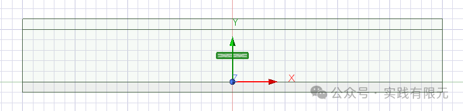

边值问题：

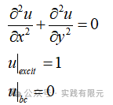

简单的微分方程，两个边界条件均为第一类边界条件：一个是在传输线上放置1V的电压进行激励，一个是外边界上的进行接地处理。

该边值问题的有限元推导非常简单，这里直接给出结果：    

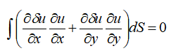

使用三角形网格离散后得到有限元离散方程：

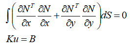

使用三角形的高阶插值基函数作为基函数，其目的也是为了验证不同阶基函数下其求解的精度效果。具体基函数推导这里不再演示，参考之前的文章。

在求解得到电势分布后，进而求解得到电场，通过对电场，进而使用能量公式求解得到电容。

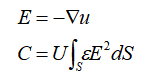

电场能量的积分使用两种方案，一种是直接使用三角形中心点电场乘以面积进行积分，一种是使用高斯积分点进行积分，目的是为了对比不同阶数基函数下两种方式的积分精度效果。

_**2.测试对比**_

在自适应网格完全收敛下，q2D的电容为：44.15pF。（注：Q2D使用二阶有限元）

**网格1：**提取的Q2D带状线网格，共计369个网格

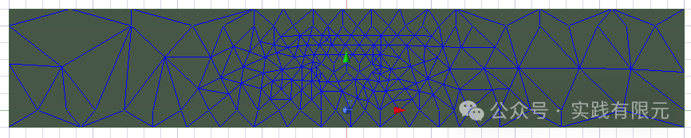

Q2D的电势分布规律：    

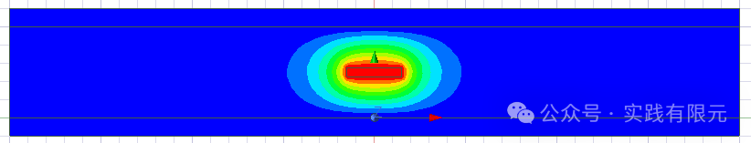

该网格下，Q2D的电容为：44.437pF。

_**A.当自主代码使用1阶基函数：**_

提取网格如下：  

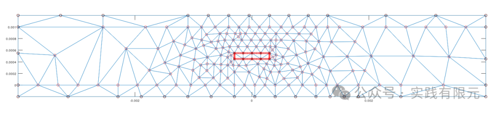

电势精度对比如下：  

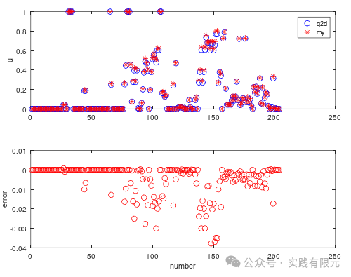

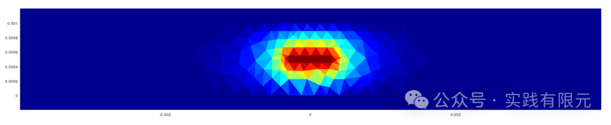

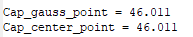    

可见1阶下，求解的电势u与Q2D结果较大，电容结果也有2pF的差异。

**B.当自主代码使用2阶基函数：**

       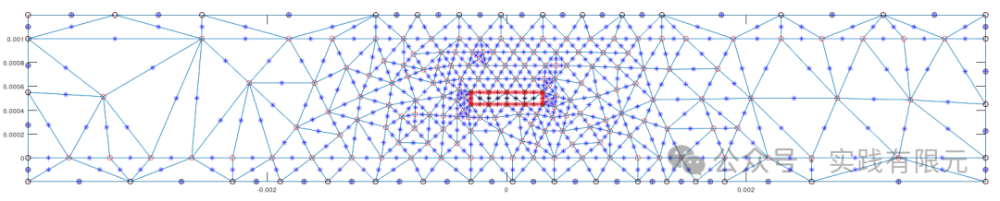       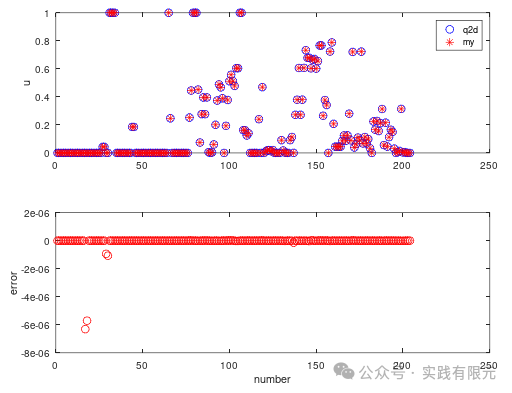

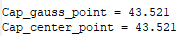

可以发现，电势u与Q2D结果几乎一致，精度控制在1e-5次方以下，但是电容依旧存在0.6pF左右的差异。误差可以确定是由于后处理导致的。

**C.当自主代码使用3阶基函数：**    

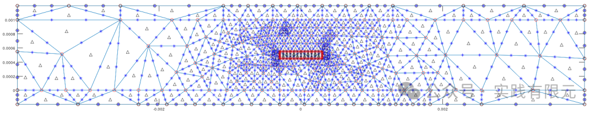

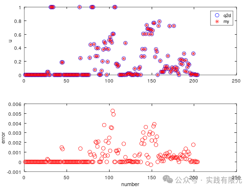

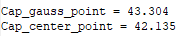

使用3阶基函数，电势u与Q2D的差异变大，对应的电容误差也在变大。3阶基函数获得的电容变得更小了。并且3阶情况下电容，使用高斯点位置积分和使用中心点位置积分电容的结果存在1pF多的差异，因为对于使用正确的后处理可能也较大影响精度。

**网格2：**密集的网格。网格共计2052个网格。

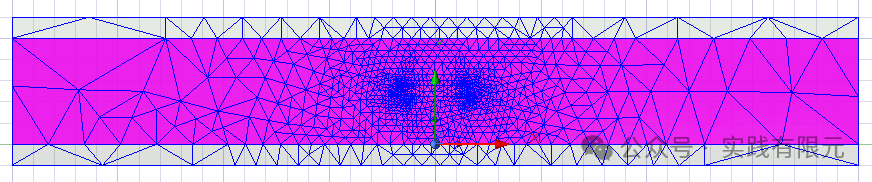

该网格下，Q2D的电容为：44.17pF

**_自主1阶基函数结果：_**

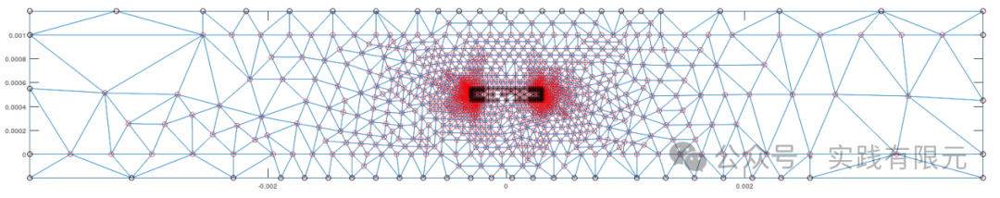

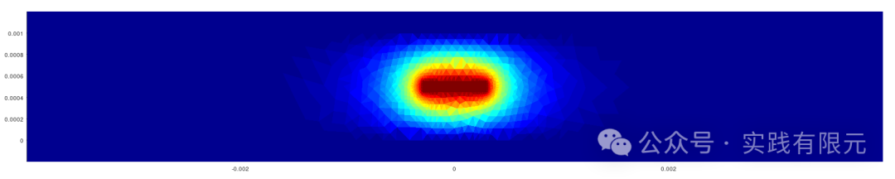

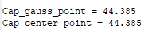

**_自主2阶基函数结果：_**

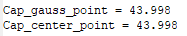

**_自主3阶基函数结果：_**

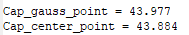

通过案例发现，即使求解的有限元结果一致，在后处理后得到的电容也存在差异。似乎Q2D的后处理结果更加接近真解。

_总结_

1.整个流程的求解过程基本上是正确性，得到的有限元解电势与Q2D一致，误差可在1e-6左右。

2.在后处理过程中，电容始终存在一定差异，具体原因还有待研究。