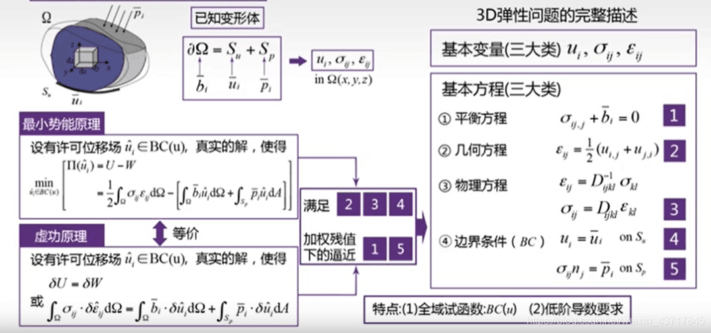
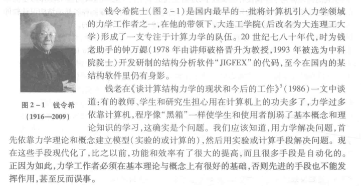
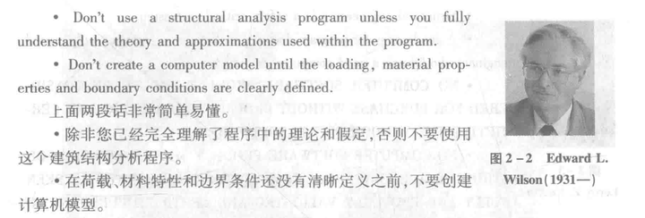
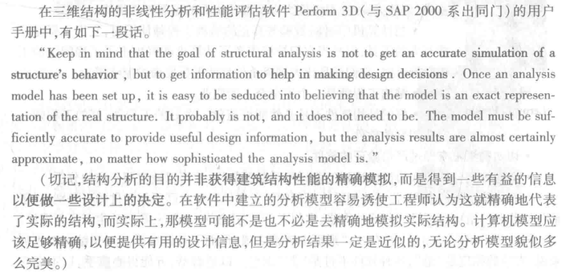

# 当下有限元软件已成为主流工具，那么学习弹性力学等理论课程还有意义吗？

> 原文地址: [https://mp.weixin.qq.com/s/lr8iNv\_U0zmsv3cnQ7IkOg](https://mp.weixin.qq.com/s/lr8iNv_U0zmsv3cnQ7IkOg)

## 

  

# 提问

如题。有限元技术已成为了部分工程计算的主流工具，那么，随着计算科学的不断进步，学习理论的力学课程的意义是什么？

# 一己之见，欢迎拍砖  

**永****远不要轻视理论课程的重要性！！！**

  

尽管有限元技术已成为工程计算中的主流工具，学习弹性力学等基础理论课程仍然具有重要意义，原因包括但不限于以下几点：

1.  **理论基础构建**：弹性力学等理论课程为理解固体材料在受力情况下的行为提供了坚实的理论基础。它们介绍了基本假设、基础变量、基本方程类型等，这些都是构建准确计算模型的前提。
    
2.  **模型简化与判断能力**：在实际工程问题中，由于计算资源和时间的限制，仿真模型往往需要简化。具备弹性力学理论知识有助于工程师合理地进行模型简化，识别关键因素，确保模型既简单又不失真。
    
3.  **问题定性分析**：在应用有限元分析之前，需要定性地理解问题的性质。理论学习有助于快速判断问题类型，比如是线性还是非线性问题，是否涉及复杂边界条件或材料特性，从而指导后续的建模和求解策略。
    
4.  **提高仿真可靠性**：理解理论基础可以帮助工程师评估有限元分析结果的可靠性。理论知识使工程师能够更好地校验模型的合理性，避免因软件使用不当或模型设置错误导致的误判。
    
5.  **创新能力与问题解决**：深厚的理论基础鼓励创新思维，使工程师能够在面对复杂或新颖问题时，设计出更有效的解决方案。理论不仅仅是软件操作的指南，更是推动技术进步和方法创新的源泉。
    
6.  **优化和验证**：理论知识有助于优化计算参数，提高仿真效率，并通过理论解或实验数据验证有限元分析的结果，确保其准确性和实用性。
    
7.  **跨学科应用**：随着多物理场耦合问题的增多，弹性力学等基础知识为理解和解决涉及多种物理现象的复杂问题提供了桥梁，促进不同领域间的有效沟通与合作。
    

综上所述，即便在有限元技术广泛应用的今天，扎实的理论基础仍然是工程师不可或缺的能力，它不仅能够提升解决问题的效率，还能确保工程决策的科学性和安全性。

**更深刻的阐述，推荐阅读**：

  

  

  

  

**FEtch 系统**是笔者团队开发的新一代有限元软件开发平台。只需按照有限元语言格式填写脚本文件，即可在线自动生成基于**现代 Fortran** 的有限元计算程序，从而大幅提高 CAE 软件的开发效率。欢迎私信交流。

有任何疑问或建议，欢迎加Q群 "**FEtch有限元开发系统(519166061)**" 留言讨论。我们长期开展 FEtch 系统的试用活动，感兴趣的朋友入群后可直接联系管理员，免费获取**许可证文件**。