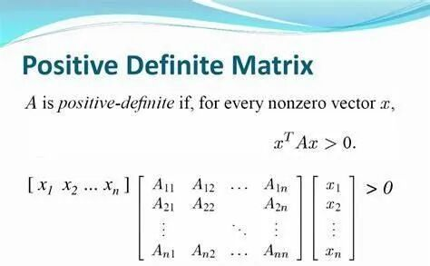
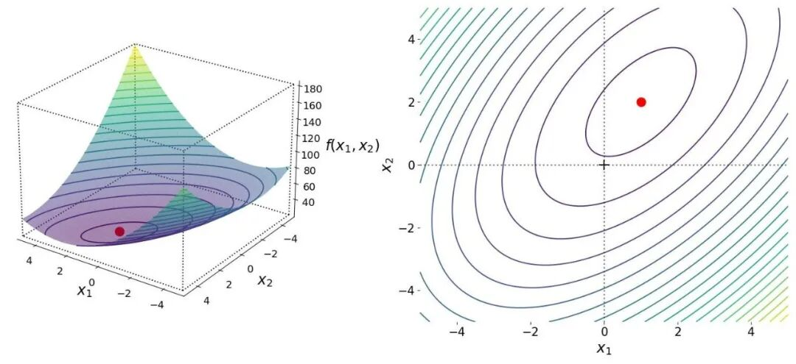
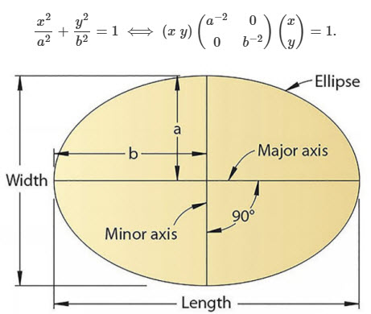
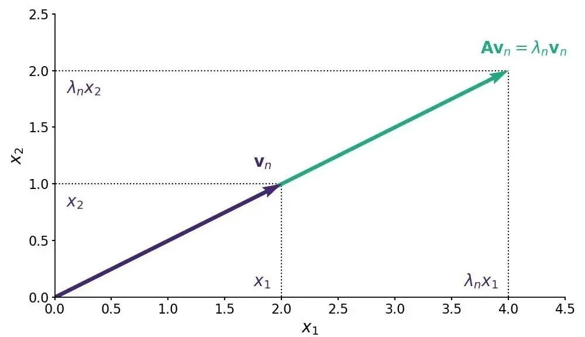
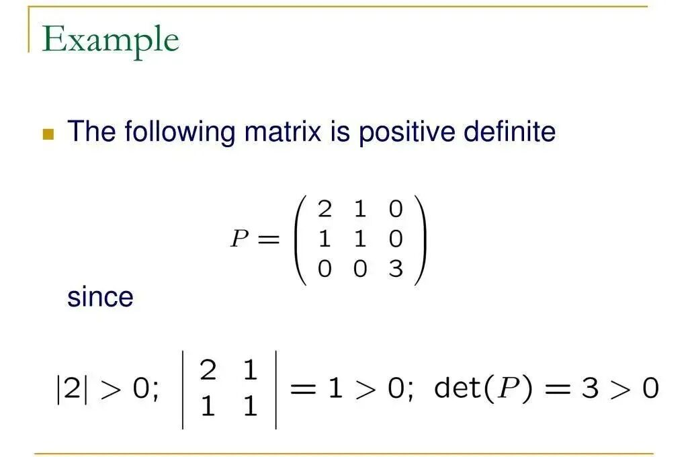
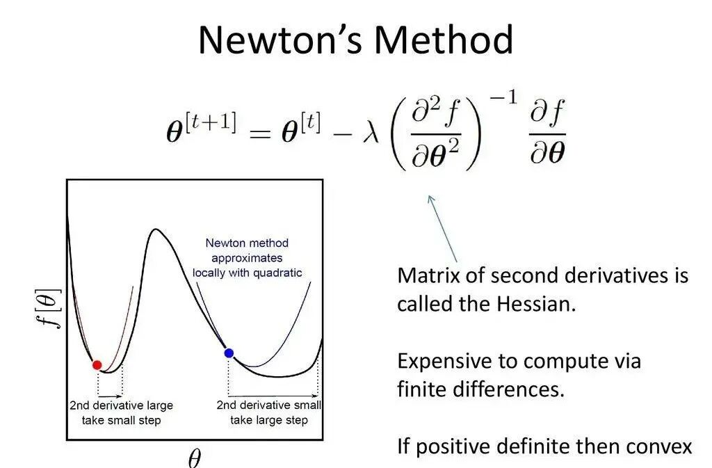
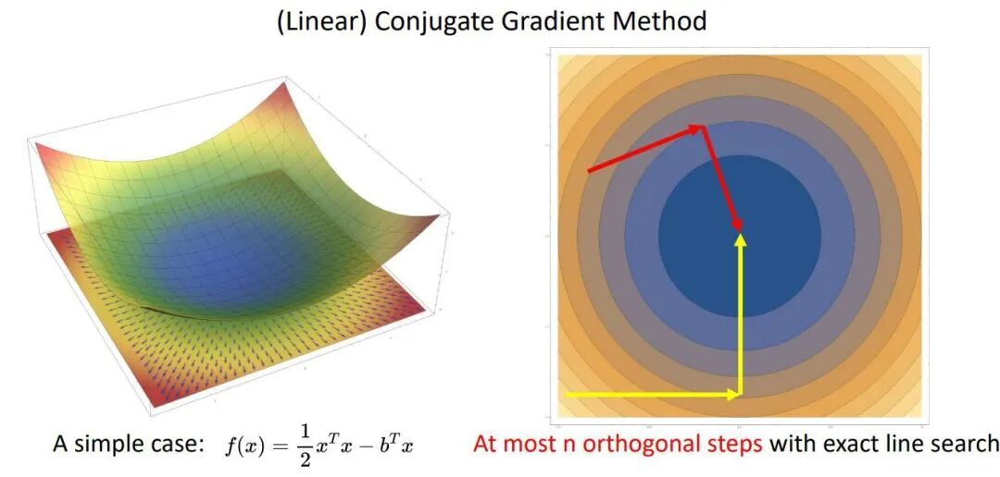
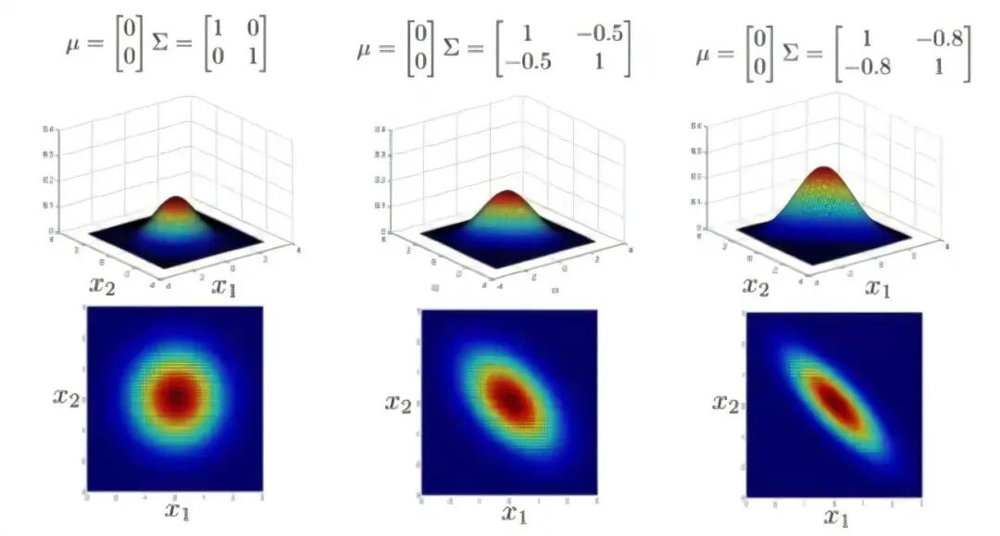
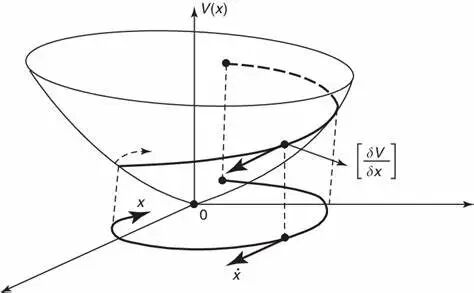
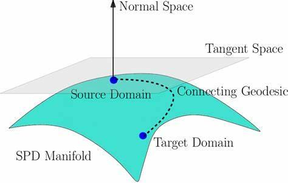

# 必知必会：正定矩阵的定义、性质和应用

> 原文地址: [https://mp.weixin.qq.com/s/nZemOY3d0zI4r8FvkHTYCw](https://mp.weixin.qq.com/s/nZemOY3d0zI4r8FvkHTYCw)

在数学和物理学的诸多领域中，正定矩阵扮演着至关重要的角色。无论是在优化问题、机器学习算法还是数值分析方法中，正定矩阵都因其独特的性质而成为解决复杂问题的关键工具。本文将深入探讨正定矩阵的定义、重要性质、判定方法以及其广泛应用，旨在为科学计算领域的专业人士提供详尽的参考。

## 正定矩阵的定义 

### 基本定义

一个  的实数矩阵  被称为正定矩阵（Positive Definite Matrix），如果它满足以下两个条件：

-   对称性：，即  ，表示矩阵元素关于主对角线对称。
    
-   正定性：对于所有非零向量 ，都有  成立。
    

### 正定矩阵与二次型

如果给定一个对称矩阵  和向量  ，则表达式  称为**二次型**。如果对于所有非零向量 ， ，则称矩阵  对应的二次型是**正定的**，矩阵  被称为**正定矩阵**。

### 直观解释

-   **二次型曲面**：正定矩阵对应的二次型 （）在所有维度上表现为**椭球面**。该曲面封闭且无开口，特征值决定了各轴的缩放比例，特征向量确定轴的方向。例如，二维下为椭圆，三维下为椭球，高维则为超椭球。
    
    
    

-   **线性变换**： 正定矩阵可分解为 ，其中  是正交矩阵（旋转）， 为对角矩阵（缩放）。其几何意义是：对空间进行旋转后，沿主轴方向按正特征值缩放，再旋转回原坐标系。所有方向保持正向拉伸，无反射或压缩到负数维度。
    

## 正定矩阵的性质 

正定矩阵具有许多非常有用的性质，这些性质使得正定矩阵在优化、数值分析等领域中扮演着重要角色。以下是正定矩阵的一些主要性质：

### 对称性

所有正定矩阵都是对称矩阵，即对于正定矩阵  ，总有  。

### 特征值恒正

-   正定矩阵的特征值都是正数。也就是说，如果  是正定的，那么它的所有特征值  都满足  。
    
-   因为特征值为正，正定矩阵总是可以通过特征值分解得到正定的形式，且可以通过正交矩阵进行对角化。
    

### 行列式大于0

正定矩阵的行列式总是大于零，即  。这是因为所有的特征值都大于零，而行列式是矩阵特征值的乘积  。

### 逆矩阵正定

如果  是正定矩阵，那么它是可逆的，并且它的逆矩阵  也是正定的。

### 主子矩阵正定

正定矩阵的所有主子矩阵（即矩阵的任意上左部分的子矩阵）也都是正定矩阵。

## 判定正定矩阵的方法 

判断一个矩阵是否为正定矩阵通常有以下几种方法：

### 特征值法

对于一个对称矩阵  ，如果它的所有特征值  都是正的，则  是正定矩阵。

### 主子行列式法

对于一个对称矩阵  ，可以通过判断其所有的主子行列式是否大于零来判断矩阵是否正定。具体地，设矩阵  是  的对称矩阵，那么对于  ，如果以下每个子行列式都大于零：

其中  是矩阵  的  的主子矩阵，那么  是正定的。

### 二次型法

对于一个对称矩阵  ，如果对于所有非零向量  ，都有  ，则  是正定矩阵。

## 例题与演练 

### 例 1：使用特征值法判断正定性

给定矩阵：

判断它是否为正定矩阵。

**解**：

由

得到

所以，特征值  ， 。因为这两个特征值都大于零，所以矩阵  是正定的。

### 例 2：使用主子行列式法判断正定性

给定矩阵：

判断它是否为正定矩阵。

**解**：

计算主子行列式：

因为所有的主子行列式都大于零，所以矩阵  是正定的。

## 正定矩阵的应用 

正定矩阵在数学、物理、工程、优化等领域具有广泛的应用，其性质（如对称性、特征值非负等）为许多理论和实际问题提供了重要的工具。以下是正定矩阵在一些领域的应用的简单介绍。

### 优化问题

-   **二次型优化**：形如  的二次函数，若  正定，则存在唯一全局最小值。例如最小二乘问题  的解  要求  正定。
    
-   **凸优化**：正定矩阵与凸函数密切相关。若函数  的 Hessian 矩阵（二阶导数矩阵）正定，则  是严格凸函数，其局部最小值即为全局最小值。这在梯度下降、牛顿法等优化算法中至关重要。
    

### 线性代数与数值计算

-   **矩阵分解**：Cholesky分解 （ 正定）用于高效解线性方程组，计算复杂度 ，速度比LU分解快一倍，数值稳定性更优。
    
-   **特征值问题**：正定矩阵的特征值为正，在矩阵分析和稳定性理论中起关键作用，如矩阵的谱半径分析。
    
-   **共轭梯度法**：用于求解正定系数矩阵的线性方程组，收敛速度显著优于传统迭代法。
    
-   **有限元法（FEM）**：椭圆型偏微分方程（如泊松方程）离散化后的刚度矩阵通常对称正定，有限元法中需正定性保证解的唯一性和数值稳定性。
    

### 统计学与机器学习

-   **协方差矩阵**：多元高斯分布的协方差矩阵必须正定，确保概率密度函数有效（）。
    
-   **核方法**：正定核（如高斯核 ）满足Mercer定理，支持向量机（SVM）等算法依赖此性质。
    
-   **马氏距离**： 要求  正定。
    

### 控制理论与动力系统

-   **Lyapunov稳定性**：对于系统 ，若存在正定矩阵  满足  负定，则系统全局渐近稳定。
    
-   **最优控制**：Riccati 方程的解需正定，如LQR控制中代价函数的权重矩阵。
    

### 几何与黎曼流形

-   **度量张量**：正定矩阵定义黎曼流形上的内积，如广义距离和角度计算。
    
-   **曲率分析**：Hessian矩阵正定性用于判断临界点是否为局部极小值（如曲面上的谷底）。
    

## 小结 

理解正定矩阵的核心在于掌握其定义及其相关特性，包括但不限于特征值、行列式及主子行列式的性质。熟练运用多种判定方法不仅有助于加深对概念的理解，也能提升解决实际问题的能力。希望本文能为读者提供有价值的指导，促进在科学研究和技术开发中更加有效地利用正定矩阵。

  

往期推荐

[

一目了然！动态演示5大_稀疏矩阵_存储格式，解锁科学计算必备技能

](http://mp.weixin.qq.com/s?__biz=Mzk0MzI0NDU2NQ==&mid=2247485041&idx=1&sn=5991bdd6148da24bf2dcb1c3be6f3c50&chksm=c337920bf4401b1d798fdf67422bd36c558cf6536685109ac70be00e5c57c80d35f25806ae5c&scene=21#wechat_redirect)

[

数值_线性代数_：科学与工程计算的核心

](http://mp.weixin.qq.com/s?__biz=Mzk0MzI0NDU2NQ==&mid=2247490796&idx=1&sn=85b715aed259b51c4d35ef2d1a5f3b06&chksm=c3378896f440018050c510c0128b281dfc2e4f208a3d6a1d511c99ff7dfaabe975915da2e3fe&scene=21#wechat_redirect)

[

LAPACK简介：基于Fortran的高性能_线性代数_工具箱

](http://mp.weixin.qq.com/s?__biz=Mzk0MzI0NDU2NQ==&mid=2247486327&idx=1&sn=b9db16b49c5f8520ef1caf46d5eb7423&chksm=c3379f0df440161b19f26e7af8d610092bc69a4c7545334af56228e26c7c47947954fbb0526f&scene=21#wechat_redirect)

  

## 推荐阅读

  

  

  

  

  

‍

  

  

  

**给我一组控制方程，还你一套专业软件。**我们长期从事多场耦合有限元算法和软件的研发工作，掌握全流程的 CAE 软件开发技能。如果您需要相关的技术服务，非常欢迎私信交流和扫码咨询。

**喜欢****作者******，请点********赞********和在看********

****