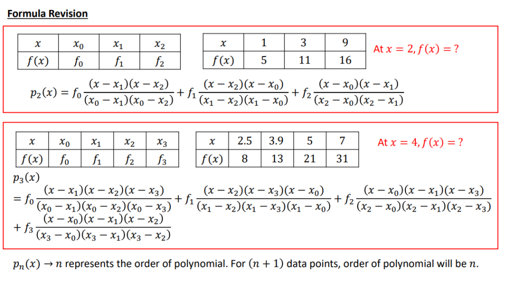
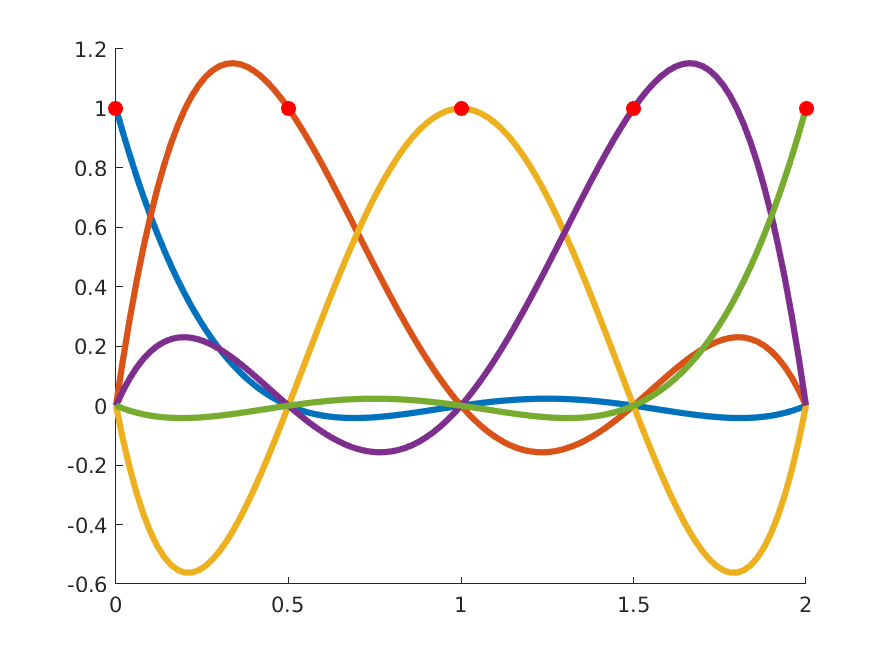

# 拉格朗日插值：理论与应用

> 原文地址: [https://mp.weixin.qq.com/s/E2BqKjGTnG1FBraswTyphQ](https://mp.weixin.qq.com/s/E2BqKjGTnG1FBraswTyphQ)

## 引言

我们先来看这样一个例子，中学阶段我们都会计算三角函数值，如

这些我们都能够求出具体的数值，但是如果我们想知道 的值怎么办呢？也许你很擅长数学运算，可以通过各种倍角公式、和差化积、对称性质来求出它的精确表达式，但那样不仅费时费力，而且如果稍微变换下角度，就又得推翻重来，这个时候插值就站出来帮忙了。

## 插值的基本概念

插值的基本思路就是，已知一些点，以及目标函数在该点的函数值，通过找到某个**简单**的函数，使得它**在这些点上的函数值恰好与目标函数在这些点的函数值相同**。进而，求目标函数在给定点之外的函数值就可以将其**代入简单函数**得到一个近似值。而怎样的函数才算得上简单呢？对了，**多项式函数**！

下面给出问题的一般提法：

给出 个点上的一张函数表，要构造一个多项式 满足下面**两个条件**：

> (1)  的次数不超过  次
> 
> (2) 在给定的点  上与  取值相同

我们称这样的多项式 为**插值函数**，点 为**插值节点**，并且假定它们是**互异**的。

## 存在性与唯一性定理

我们的目的是求目标函数在给定点之外的函数值，现在我们面临着一个很大的问题：

> 我们求出的插值多项式可以是近乎“笔直”地通过平面上的这些点，也可以是“振荡”地通过。如果我们分别求出了两个插值多项式，我们应该用哪个作为目标函数值的近似？同时，如果对于特定的点，这样的多项式我们根本就求不出来，又改怎么办？

下面这个定理告诉我们：**求出两个是不可能的，并且这样的多项式一定存在**！

### 定理

对于给定 个点的函数表，**存在唯一的多项式**满足上面两个条件。

#### 证明：

利用待定系数法，假设所求插值多项式为

该多项式要经过 个点，因此有

这个方程组有 个方程和 个未知量，存在唯一解等价于系数行列式不为 0，而系数行列式为

这是**范德蒙（Vandermonde）行列式**，由于插值节点 互异，所以其不为 0，进而得到定理的结论。

## 拉格朗日插值法

上面的定理给我们打了一针强心剂，让我们对于任意给定的函数表都可以不加思索地上手求插值多项式，可是具体该如何求呢？在线性代数课上，我们学过可以利用**克莱姆法则**来求解线性方程组，即

其中

但我们知道，计算一个行列式的时间复杂度是阶乘级别的，而且范德蒙行列式通常是**病态的**，舍入误差会造成很大影响，因此，很少会使用这样的公式！

下面，我们给出拉格朗日插值法的思路。

构造 次多项式**基函数** 使得

为了使 通过 个点，基函数应该满足下面的条件

如何求基函数呢？首先，我们利用它的非常多的零点，待定系数如下

然后，利用它所满足的，就可以解出待定系数并得到

这个形式可以这样记忆：分子为 减去插值节点的连乘，分母为 减去插值节点的连乘，并且分子分母都不减 ，这是因为如果分子有减 ，那么就有 就为 0 了，如果分母有减 ，那么分母就为 0 了。

但这个基函数的形式上还是比较长的，为了简便，我们记 项连乘为

这个式子求导之后有很多项，但是在插值节点上的导数值很漂亮

这样一来，基函数就可以表示成

进而

## 插值误差分析

我们已经通过构造出插值多项式来得到了函数值的近似，那么这个近似的效果如何？要研究近似的效果，就免不了扯上误差，下面给出多项式插值的余项以及误差估计：

### 定理

设 为 在区间 上的 次插值多项式，那么对每个 ，存在 使得

#### 证明：

首先给出一个巧妙的构造，对 ，令

可以验证 都是 的零点，反复利用**罗尔定理**，得到 阶导数至少有一个零点

进而得到定理结论。

另外，利用这个误差估计式也**能够证明插值多项式的唯一性**。具体来说，如果存在两个插值多项式，那么可以将其中一个看成是另外一个的插值多项式(因为插值条件是相同的)，进而误差估计式中的导数项恒为 0，即二者相等。

## 实例解析

求函数 在节点 的三次插值多项式。

#### 解：

我们可以直接按定义来计算，先求节点值再代入公式即可，难度不大，大家可以自行尝试。

这里结合多项式插值的**线性性质**和误差估计式，给出一种更简捷的方法。

> **插值满足线性**
> 
> 若 ,  的插值多项式为 ,  则  的插值多项式为 。

函数 在节点处函数值均为 0，因此其插值多项式为 0 多项式。

记 的三次插值多项式为 ，利用误差估计式有

注意到 ，进而可得

最后求得

## 小结

拉格朗日插值法作为一种经典的数值分析工具，具有清晰的结构和易于理解的特点。本文介绍了拉格朗日插值的基本概念、理论基础及其应用实例，并探讨了插值误差的相关问题。希望这篇文章能为你提供关于拉格朗日插值的全面认识，并激发你探索更多相关领域的兴趣。

  

往期推荐

[

_数值_计算中的误差及减小误差的原则

](http://mp.weixin.qq.com/s?__biz=Mzk0MzI0NDU2NQ==&mid=2247488424&idx=1&sn=b6654a3d4f75bb83a0c3abba0661079f&chksm=c33787d2f4400ec47a76f6bda3d5feb1a3d72cc34d6369b47354132b641207db0dc3f74f0f73&scene=21#wechat_redirect)

[

_数值_方法中的误差与步长：为什么更细的网格并不总是意味着更高的准确性？

](http://mp.weixin.qq.com/s?__biz=Mzk0MzI0NDU2NQ==&mid=2247487499&idx=1&sn=6f4f778b786e4de26d8563021c81ab5e&chksm=c3378471f4400d67316264aeaf70fad630912cf588bbe642d820095e834ee5863bbbb3242c2a&scene=21#wechat_redirect)

[

常微分方程与偏微分方程：_数值_计算方法的深度对比

](http://mp.weixin.qq.com/s?__biz=Mzk0MzI0NDU2NQ==&mid=2247488464&idx=1&sn=d76b0384cfdf26a00999990bda312eda&chksm=c33787aaf4400ebcb99c7bdb5783b758eb5280927b784c34faaf8aa705a9c106d9e30d0f0dfe&scene=21#wechat_redirect)

  

# 推荐阅读

**FEtch 系统**是笔者团队开发的新一代有限元软件开发平台。只需按照有限元语言格式填写脚本文件，即可在线自动生成基于**现代 Fortran** 的有限元计算程序，从而大幅提高 CAE 软件的开发效率。

我们长期开展 FEtch 系统的试用活动，欢迎私信交流和扫码咨询，免费获取**许可证文件**。

**喜欢****作者******，请点********赞********和在看********

****