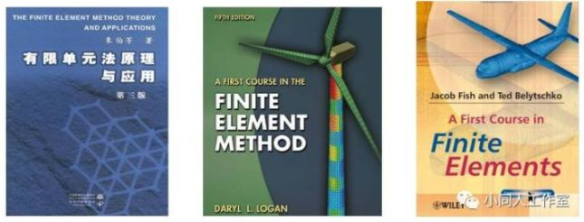
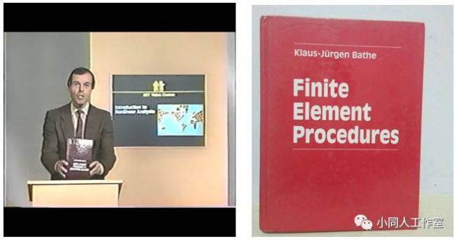
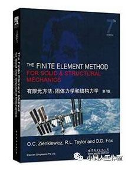
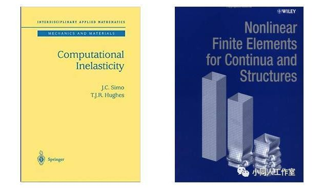

# 推荐几本力学和有限元分析的书籍！

> 原文地址: [https://mp.weixin.qq.com/s/qQl7MWcYRBZe7z8jo\_b7WA](https://mp.weixin.qq.com/s/qQl7MWcYRBZe7z8jo_b7WA)

# __

最近总有师妹问我关于数值模拟、有限元、软件等方面的事情（别问我为什么只有师妹，那不是重点！），叫我帮着推荐一些相关的入门书单，今天借着酒兴一起说一下吧。

目前的数值计算方法主要包括：FEM（有限单元法）、DEM（离散元）、FVM（有限体积法）、X-FEM（扩展有限元）、FDM（有限差分法）、LBM（玻尔兹曼格子法）、SPH（光滑粒子流体动力学）等等，不一而足，各自有各自最适用的范围，他们好比少林七十二绝技，哪怕仅仅掌握好了一门也可以立足武林，不对，是立足工业界，掌握好了几门则可以威震江湖。

当然，鲁迅先生也曾说过“一部《红楼梦》，经学家看见《易》，道学家看见淫，才子看见缠绵，革命家看见排满，流言家看见宫闱秘事”（翻译成人话就是，仁者见仁，智者见智，一千个哈姆雷特），不同的人对此问题肯定有不同的看法，以下仅为一家之言，无意冒犯，欢迎交流。

固体力学里面，用的最多的还是有限单元法，笔者就厚着脸皮来扒一扒看过了还有印象的有限元入门书。哦，有一点忘说了，如果读者想看下面的这些书，看之前，还是希望读者可以懂一点材料力学，了解一点弹性力学，复习一下线性代数，重温一下张量表示，下面我们开扒。

首先是朱伯芳老先生的《有限单元法原理与应用》，敲黑板！！！划重点！！重点在这里！

这本书给了笔者很大的心灵启迪，此书成书于十年浩劫期间，可参考的资料很少，很多东西都是从最基本道理，最原始的公式推出来的，故读起来深入浅出，回味无穷，将高深的道理阐述的生动细致、环环入扣，引领笔者初窥了有限元的门径。

如果你初次接触有限元，那么Logan大大的那本《A first course in finite element method》也是不二之选，浅显易懂，看起来很有成就感。注意，有一本名字很相似的书《A first course in finite elements》（黄色封皮），同Logan的书名仅一字之差，是Jacob Fish和Ted Belytschko写的，也是很好的入门教材。

如果你要问我它为什么好，嘿嘿，你看看作者的名字啊—Jacob—，就是为了计算力学而生的好吧，如果你不知道Jacob矩阵，就当我啥也没说，但我也不会原谅你的浅薄的。

MIT大牛Bathe教授的传世之作《Finite Element Procedures》则是值得传颂的经典教材，辅以Bathe教授的公开课视频，再拿江小白泡点麦片，听着大牛吹着牛，看着教材学着知识，拿着白酒装着B，还能有比这更爽的事情吗？书中有很多的例题，读起来也不至于很枯燥。

如果一定要让我用一句话来形容一下Bathe教授的生平的话，我想那就是“生活要远比小说来的精彩”，在金矿和筑路队工作，在南非读书，到美国攻读博士，到MIT当教授，写了SAP软件，并将其开源（今天有个软件叫SAP2000吧，别问我为什么和Bathe写的软件名字那么像，这里面有一串指责抄袭与撕逼的罗生门故事，有机会再扒），创建了TADINAR&D公司，开发了ADINA软件，并以其变态的收敛性而闻名。

笔者曾用Workbench平台做流固耦合，流体模型和固体模型间数据传输的那个效率啊，气得我吐出三升老血，因为Workbench平台在流、固模型的数据传输过程中，只支持单核。后我用了ADINA，才发现世间竟有此神器，助我降妖除魔。好了扯远了。。。。。。总之就是这个老头很牛B，很牛逼。

提到了有限元，Zienkiewicz教授的《The Finite Element Method for Solid and Structural Mechanics》是不得不说的，该书可以说是FEM中的圣经，原因有二，一是因为其作者在该领域的鼻祖地位（Zienkiewicz是有限单元法的三位创始人之一），二是因为其涵盖范围非常之广无所不包。

但至于说到可读性嘛……我就甩个呵呵的表情吧，毕竟是圣经，原谅我只是个凡人。辛克维奇，这个名字听起来像苏联人，实际上他是波兰人，二战时德国攻陷的第一国家是哪里还记得吗，Zienkiewicz教授一家在二战开始的时候就辗转流落到了英国，后来也一直生活、工作在英国。

值得一提的是，Zienkiewicz教授的关门弟子就是我济的地下系系主任黄茂松教授。Zienkiewicz教授曾获得过铁摩辛柯奖（学过材料力学的，没有不知道铁摩辛柯的吧？！），我济的庄晓莹教授则曾获得过Zienkiewicz奖，宣父犹能畏后生，不知他日是否会有以庄晓莹老师命名的奖项，又不知哪位后生有幸可以荣获殊荣。

在非线性有限元方面，笔者推崇的书有两本：

Simo和Hughes的"Computational Inelasticity"，经典的材料本构在本书中都有包含，如果想要编程实现其中一些的话，本书是不二之选，只要照着此书的步骤很容易实现。

Ted Belytschko 的《Nonlinear Finite Elements for Continua and Structures》，此书封面就是一个非线性有限元中的经典问题（壳体碰撞后的大变形）。此书有中文译本，是清华的庄茁老师翻译的，首先承认一点，如果是我来翻译的话，那么一定翻译的没有庄老师的这版好，但是我也不想恭维他这版译本翻译的有多好。学好外语很重要，直接看原版（虽然贵了点）！！

贝公在非线性有限元，无网格法、扩展有限元等领域造诣颇深、著作等身，而且是第一个提出了“无网格法”这一名字的人（注意，只是最早命名了无网格法，而不是最早提出了无网格法，笔者有的时候还是很严肃的，哈哈！！）。Belytschko有一位学生叫J.S. Chen，在当今计算力学界也是赫赫有名，J.S. Chen有位学生就是我济的任晓丹老师，而笔者我…………则去听过任老师的一堂课，所以各位看官也别指望我说的有多好，毕竟我连再传弟子都算不上，但我善于吹啊！

一口气写了这么多，都是固体力学的东西，还没来得及谈及我目前正在做的流体力学的东西，就要草草收场，改日再扒流体的那些事吧！至于改到那日，就再说吧，毕竟笔者很懒很懒。

最近我一直在思考一个问题：资本推手对实业的意义何在，是共赢般扶持企业成长抑或是吸血剥皮？AT&T上市后为迎合华尔街而垮了，顺丰没抵住资本市场的诱惑上市了，老干妈坚决不上市也不知还能坚持多久。但我敢肯定的是，坚定不移走实业兴国，技术为本这一路线绝对没有错。

【免责声明】本文来自小同人工作室，作者旭，版权归原作者所有，仅用于学习等，对文中观点判断均保持中立，若您认为文中来源标注与事实不符，若有涉及版权等请告知，将及时修订删除，谢谢大家的关注！

  

