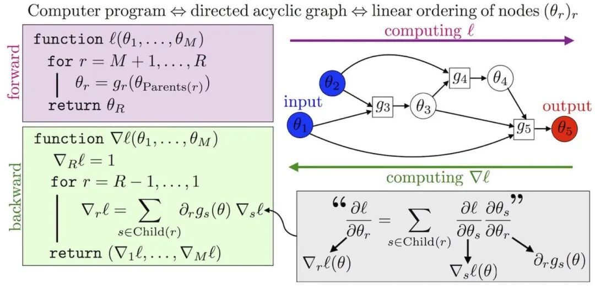
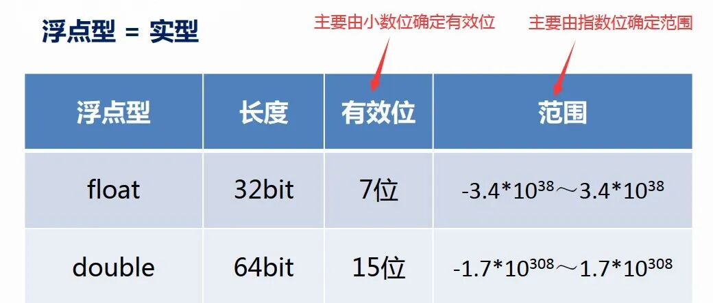
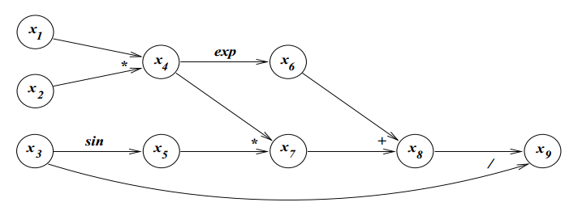

# 数值求导与自动求导：理论基础与实践应用

> 原文地址: [https://mp.weixin.qq.com/s/p-mA5yU3yZfAGOHyLxg3\_A](https://mp.weixin.qq.com/s/p-mA5yU3yZfAGOHyLxg3_A)

在我们的学习历程中，从高中开始接触到导数的概念，并了解了一些基本函数的求导规则。到了大学阶段，我们进一步深入理解了极限定义下的导数概念，例如函数  在点  处的导数可以表示为

尽管这个定义式为我们提供了理论上的指导，但在实际操作中却鲜少使用，因为计算它需要让  趋近于零，这超出了手工计算的能力范围。与此同时，各种现成的求导公式和法则使得我们可以直接得出导函数的解析解，因此我们很少需要根据定义来具体计算某个点的导数值。

然而，当我们工作之后，面对现实世界时，情况变得复杂起来。很多时候，我们无法获得导函数的解析表达式，或者即使能够得到解析解，其代价也过于高昂。在这种情况下，数值求导和自动求导应运而生，它们是数学与计算机科学结合的产物，展示了这两大学科如何相互补充，在工程领域发挥着重要作用。

## 数值求导与有限差分方法

假设我们面对的是一个“黑盒”函数  ，即我们知道给定任意输入  ，都能得到唯一的输出  ，但并不知道其内部结构或解析形式。这种情况非常常见，尤其是在软件库中封装的函数，外部调用者无法访问其实现细节。此时，如果要计算该函数的导数，只能依赖数值求导的方法。

最常用的数值求导方法之一是**有限差分法**（Finite-Difference），它基于上述导数的定义式。应用此方法时，我们需要去掉  运算符，并代入一个足够小的实际值  。尽管这样做会引入误差，但如果  足够小，误差也会相应减小。为了更精确地描述这种关系，我们可以利用泰勒定理对  进行展开：

其中

若假设二阶导数有界，即存在常数  使得  成立，则可将上式进行放缩处理：

由此推导出导数估计式：

其中

这意味着有限差分的结果与真实导数值之间的误差处于  的量级。

然而，选择合适的  并非易事。由于计算机精度限制，任何运算都无法达到完全精确，而是伴随着舍入误差。

对于双精度浮点数而言，其相对精度约为  。考虑舍入误差的影响后，我们发现最优的  值并非越小越好，而是应该取  左右，其中  表示机器精度。

此外，除了前向差分法外，还有更为精确的**中心差分法**：

这种方法的近似误差位于  的数量级，相比前向差分法具有更高的精度。但是，当自变量  是多维向量时，中心差分法所需的计算量显著增加，因此在实际应用中需权衡精度与效率。

## 高维向量函数与雅克比矩阵

在涉及高维向量函数的情况下，导数通常以雅克比矩阵的形式出现。对于标量函数，雅克比矩阵是一个行向量：

而对于向量函数，它则是一个  的矩阵，分别对应目标函数的维度  和输入变量的维度  :

随着输入变量和目标函数维度的增加，雅克比矩阵的计算量迅速膨胀，使得数值求导变得不切实际。

幸运的是，在某些应用场景下，雅克比矩阵呈现出稀疏性特征，例如条带状结构。针对这种稀疏性，可以通过优化策略，识别并合并独立的影响因子，以减少不必要的计算量，在一定程度上加速雅克比矩阵的计算过程。

## 自动求导与链式法则

虽然数值求导提供了一种便捷的方式来估算未知函数的导数，但对于那些已知解析表达式的复杂函数，手动求导既耗时又容易出错。特别是像神经网络这样的模型，频繁修改网络架构、激活函数、损失函数等因素会导致目标函数不断变化，使得手动求导几乎不可能实现。在此背景下，**自动求导**作为一种强大的工具应运而生。

自动求导不同于符号求导，后者直接给出导数的解析解，而前者则是通过分解复杂函数为一系列简单的子单元，并逐个对其求导，最终合成完整的导数。这一过程通常借助于**计算图**（computational graph）来实现，它是一个标记了数据流向的有向无环图。

以函数  为例，将其拆分为多个子单元：

接下来，按照计算顺序构建计算图

最终的目的是求导数

在前向传播的过程中，如果我们不仅计算中间节点的函数值，同时也计算它相对于三个输入数据的偏导数，比如对中间节点  来说，计算

按照计算图的数据流向，依次把每个中间节点相对于三个输入数据的偏导数都算出来。对于后面的中间节点，需要运用链式求导法则。比如，当计算到  时，需要利用  和  的中间结果，计算公式如下

如此计算下去，直到计算出  的三个偏导数，即为  。

这种方法叫做**前向模式**（forward mode）。如果你把前向模式的所有计算过程都写下来，会发现每个节点都需要对所有输入数据求导，这其实包含了许多冗余计算。比如从图中我们很容易看出  这一分支并不依赖于  ，但在前向模式中，由于只做一次**前向扫描**（forward sweep），数据流在到达  节点时并不知晓这一信息。

为了解决这一问题，就有了前向模式对应的**逆向模式**（reverse mode）。在逆向模式中，前向扫描并不计算导数，而是额外增加一次**逆向扫描**（reverse sweep），在逆向扫描的过程中，从后往前计算导数。仍然考虑上面的例子，先计算函数对  的偏导数

注意，在前向扫描的过程中我们已经得到了所有中间结果的值，因此  是可以直接出结果的。接下来，向前找到依赖于  的节点  和  ，分别计算它们的导数。

此时，我们是把结果累加到  和  的导数值上，而不是直接替代。这是因为  并不一定是  和  的唯一后继，也许还有其它节点也会影响  和  的导数值，它们应该是累加的效果。  即属于此类。

按照依赖关系从右到左，直到计算出  、  和  这三个输入节点的导数即可。

在深度学习以及大部分优化问题中，目标函数都是标量函数  ，自变量很多，但函数值只有一个。这种情况下，使用前向模式，就会导致前面所述的大量冗余计算。如果使用逆向模式，每次计算只需考虑该节点真实的后继节点，不存在冗余。因此，实践中往往采用逆向模式，即先进行一次前向扫描记录所有中间结果，再执行一次逆向扫描累积各个节点的导数值，从而避免重复计算。

与数值求导中的稀疏雅可比类似，自动求导时也可以考虑稀疏性。仍然是找到计算图中相互独立的输入节点，在前向传播时同时考虑这些输入即可。

## 小结

总之，无论是数值求导还是自动求导，都是现代数值优化算法不可或缺的技术手段。理解它们的工作原理有助于我们更好地评估和改进各类优化算法的性能表现。希望本文能够帮助读者建立起对这些基础概念的基本认识，并激发进一步探索的兴趣。

  

往期推荐

[数值方法中的误差与](http://mp.weixin.qq.com/s?__biz=Mzk0MzI0NDU2NQ==&mid=2247487499&idx=1&sn=6f4f778b786e4de26d8563021c81ab5e&chksm=c3378471f4400d67316264aeaf70fad630912cf588bbe642d820095e834ee5863bbbb3242c2a&scene=21#wechat_redirect)_[步长](http://mp.weixin.qq.com/s?__biz=Mzk0MzI0NDU2NQ==&mid=2247487499&idx=1&sn=6f4f778b786e4de26d8563021c81ab5e&chksm=c3378471f4400d67316264aeaf70fad630912cf588bbe642d820095e834ee5863bbbb3242c2a&scene=21#wechat_redirect)_[：为什么更细的网格并不总是意味着更高的准确性？](http://mp.weixin.qq.com/s?__biz=Mzk0MzI0NDU2NQ==&mid=2247487499&idx=1&sn=6f4f778b786e4de26d8563021c81ab5e&chksm=c3378471f4400d67316264aeaf70fad630912cf588bbe642d820095e834ee5863bbbb3242c2a&scene=21#wechat_redirect)

_[浮点](http://mp.weixin.qq.com/s?__biz=Mzk0MzI0NDU2NQ==&mid=2247484787&idx=1&sn=701926eccad2e27695420c5e9d553097&chksm=c3379109f440181f264abc1b7f58fcdec98324b89703b6d65f76f096c55352ea42ebb3f7bf31&scene=21#wechat_redirect)_[之巅：Fortran科学计算中的](http://mp.weixin.qq.com/s?__biz=Mzk0MzI0NDU2NQ==&mid=2247484787&idx=1&sn=701926eccad2e27695420c5e9d553097&chksm=c3379109f440181f264abc1b7f58fcdec98324b89703b6d65f76f096c55352ea42ebb3f7bf31&scene=21#wechat_redirect)_[精度](http://mp.weixin.qq.com/s?__biz=Mzk0MzI0NDU2NQ==&mid=2247484787&idx=1&sn=701926eccad2e27695420c5e9d553097&chksm=c3379109f440181f264abc1b7f58fcdec98324b89703b6d65f76f096c55352ea42ebb3f7bf31&scene=21#wechat_redirect)_[艺术](http://mp.weixin.qq.com/s?__biz=Mzk0MzI0NDU2NQ==&mid=2247484787&idx=1&sn=701926eccad2e27695420c5e9d553097&chksm=c3379109f440181f264abc1b7f58fcdec98324b89703b6d65f76f096c55352ea42ebb3f7bf31&scene=21#wechat_redirect)

[编程漫谈 |](http://mp.weixin.qq.com/s?__biz=Mzk0MzI0NDU2NQ==&mid=2247484981&idx=3&sn=c44bf0d670ae2f5b11dbb350abed9003&chksm=c337924ff4401b5924e6237fe45fda134ae692c670127c58532798a3785302c28c27a76f0e75&scene=21#wechat_redirect) _[IEEE](http://mp.weixin.qq.com/s?__biz=Mzk0MzI0NDU2NQ==&mid=2247484981&idx=3&sn=c44bf0d670ae2f5b11dbb350abed9003&chksm=c337924ff4401b5924e6237fe45fda134ae692c670127c58532798a3785302c28c27a76f0e75&scene=21#wechat_redirect)_[浮点数标准](http://mp.weixin.qq.com/s?__biz=Mzk0MzI0NDU2NQ==&mid=2247484981&idx=3&sn=c44bf0d670ae2f5b11dbb350abed9003&chksm=c337924ff4401b5924e6237fe45fda134ae692c670127c58532798a3785302c28c27a76f0e75&scene=21#wechat_redirect)

  

## 推荐阅读

  

  

  

  

  

‍

  

  

  

**给我一组控制方程，还你一套专业软件。**我们长期从事多场耦合有限元算法和软件的研发工作，掌握全流程的 CAE 软件开发技能。如果您需要相关的技术服务，非常欢迎私信交流和扫码咨询。

**喜欢****作者******，请点********赞********和在看********

****