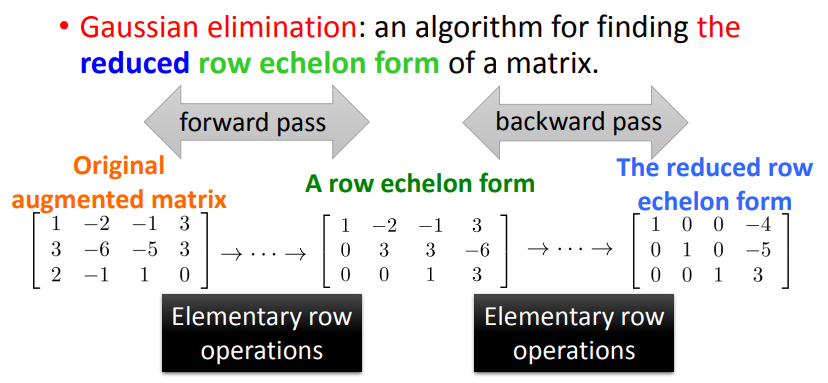
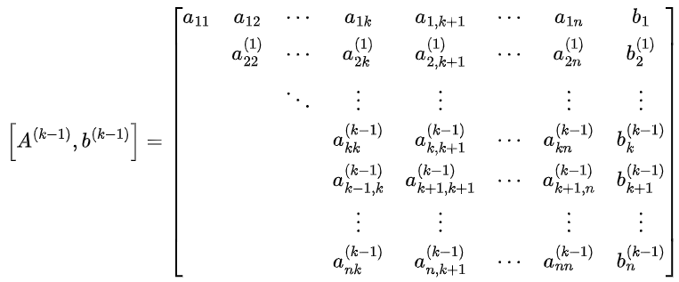

# 数值计算边学边练：高斯列主元消去法

> 原文地址: [https://mp.weixin.qq.com/s/I1fWK4rqtTIiQNFda\_0DEA](https://mp.weixin.qq.com/s/I1fWK4rqtTIiQNFda_0DEA)

线性方程组的求解是数值分析中的一个核心问题，广泛应用于科学计算、工程模拟以及金融建模等领域。在众多求解方法中，高斯消去法以其直观性和高效性成为解决线性方程组的重要工具之一。然而，在实际操作过程中，由于舍入误差的影响，传统的高斯消去法可能无法得到理想的精度结果。为了克服这一缺陷，人们发展了高斯列主元消去法（Gauss Elimination with Partial Pivoting），该方法通过选择每一步消元过程中的“最佳”主元来减小舍入误差的影响，从而提高计算结果的准确性。本文将详细介绍该方法的原理、步骤及其应用实例。

## 高斯消去法回顾

[高斯消去法](https://mp.weixin.qq.com/s?__biz=Mzk0MzI0NDU2NQ==&mid=2247490964&idx=1&sn=e7e86f2c93c15142277059ae8bc07b88&scene=21#wechat_redirect)的基本思路是通过初等行变换，将一个给定的线性方程组转换成一个易于求解的形式——上三角形系统。

对于一个  阶线性方程组

其中， 是系数矩阵， 是未知数向量， 是常数项向量。

我们可以通过对增广矩阵  进行一系列操作，使其变为  形式，其中  是上三角矩阵。然后，通过回代过程可以得到方程组的解。

高斯消去法特点在于循环执行过程中，需要计算多次乘法及减法，其主要问题在于数值计算的稳定性。

在消元过程中，假设进行了  步，会得到一个阶梯矩阵：

在接下来的第  步，若主对角元素  ，会选取  作主元。然而，若  或它与同列元素  相比较，  的绝对值较小，则舍入误差影响很大，会使计算结果精确度不高，甚至在计算机上出现溢出，以致消元过程无法进行到底。

### 例题

我们用高斯消去法解方程组

在一个假想的计算机上用断位的五位十进制算术运算进行计算。

首先，计算得到乘子

于是有

增广矩阵变成

由回代过程得计算解：

原方程组的准确解是 ，。对比发现， 的相对误差为 ，而  的相对误差较大，为 。

为了减小计算过程的舍入误差影响，我们试着将原方程组的两行变换一下，以避免绝对值小的主元作除数。

将增广矩阵的第一行与第二行交换得

计算得到乘子

于是有

由回代过程得计算解：

这比前面不作行交换的情形得到的结果更精确。

## 高斯列主元消去法

从上面的例子看到，为使高斯消去法的消元过程不至于中断和减小舍入误差的影响， 在第  步我们不一定选取  作主元，而从  中选取绝对值最大的元素，即使得

的元素  作主元，又称它（第  步）为**列主元**，增广矩阵中主元所在的行称为**主行**，并且，在进行第  步消元之前，交换矩阵的第  行与第  行。可能有若干个不同的  值使  为最大值，则取  为这些  值中的最小者。经这样修改过的高斯消去法称为**高斯列主元消去法**。

为了更好地理解该方法的计算步骤，我们再看一个例题。

### 例题

应用高斯列主元消去法，用准确算术运算解方程组

**解:**

消元过程的第一步，选取增广矩阵

的第一列元素  中首先遇到的绝对值最大的  作主元，即选取第二行为主行，交换  的第一行与第二行：

计算得到乘子

进行第一步消元：

第二步，选取第一步消元后得到的矩阵的第二列中元素  和  的绝对值最大元素  为主元，交换该矩阵的第二行与第三行：

计算得到乘子

进行第二步消元

由回代过程得方程组的解为

## 代码实现

下面是一个简单的 Fortran 程序，展示了如何实现高斯列主元消去法。该程序主要包括三个阶段：读取输入数据、执行消元过程以及回代求解。

### Fortran源代码

`program gauss_elimination   implicit none   integer :: n, i, j, info   real(8), allocatable :: A(:, :), b(:), x(:)   character(100) :: filename = 'input.txt'   ! 输入文件名为input.txt      ! 读取输入文件中的数据   call read_input_from_file(filename, n, A, b)      ! 执行高斯消去法   call gaussian_elimination(A, b, n)      ! 回代求解   allocate(x(n))   call back_substitution(A, b, n, x)      ! 输出结果   write(*,*) "解向量x："   do i = 1, n       write(*,'(f12.8)') x(i)   enddo      contains   subroutine read_input_from_file(filename, n, A, b)       character(len=*), intent(in) :: filename       integer, intent(out) :: n       real(8), allocatable, intent(out) :: A(:, :), b(:)       open(unit=10, file=filename)       read(10, *) n  ! 读取矩阵大小n       allocate(A(n, n), b(n))       do i = 1, n         read(10, *) (A(i, j), j = 1, n)  ! 读取系数矩阵A       enddo       do i = 1, n         read(10, *) b(i)  ! 读取常数向量b       enddo       close(10)   end subroutine read_input_from_file      subroutine gaussian_elimination(A, b, n)       real(8), intent(inout) :: A(:, :), b(:)       integer, intent(in) :: n       real(8) :: factor, temp, maxVal       integer :: i, j, k, maxRow          do k = 1, n - 1         ! 寻找主元素并进行行交换         maxVal = abs(A(k,k))         maxRow = k         do i = k+1, n           if (abs(A(i,k)) > maxVal) then             maxVal = abs(A(i,k))             maxRow = i           endif         enddo               if (maxRow /= k) then           ! 交换行           do j = k, n             temp = A(k,j)             A(k,j) = A(maxRow,j)             A(maxRow,j) = temp           enddo           temp = b(k)           b(k) = b(maxRow)           b(maxRow) = temp         endif         !交换完成以后即按照消元法进行         do i = k + 1, n           factor = A(i, k) / A(k, k)           do j = k + 1, n             A(i, j) = A(i, j) - factor * A(k, j)           enddo           b(i) = b(i) - factor * b(k)         enddo       enddo   end subroutine gaussian_elimination      subroutine back_substitution(A, b, n, x)       real(8), intent(in) :: A(:, :), b(:)       integer, intent(in) :: n       real(8), intent(out) :: x(n)       integer :: i, j          x(n) = b(n) / A(n, n)       do i = n - 1, 1, -1         x(i) = b(i)         do j = i + 1, n           x(i) = x(i) - A(i, j) * x(j)         enddo         x(i) = x(i) / A(i, i)       enddo   end subroutine back_substitution      end program gauss_elimination   `

### 示例

程序使用了输入文件`input.txt`。文件的第一行表示矩阵的大小`n`，接下来的`n`行是系数矩阵`A`，之后的`n`行是常数向量`b`。

对于上文中的实例

输入文件`input.txt`内容如下：

`3   1.0 -1.0 1.0   -3.0 1.0 -2.0   3.0 1.0 -1.0   2.0   6.0   12.0   `

编译上面的 Fortran 代码并运行，得到

 `解向量x：     3.50000000   -13.50000000   -15.00000000`

这个结果跟上文中手算得到的结果是一样的，证明了算法和程序的有效性。

## 小结

高斯列主元消去法通过对主元的选择进行了优化，有效地减少了舍入误差的影响，提高了求解线性方程组的准确性和稳定性。这种方法不仅适用于理论研究，也在工程计算、科学模拟等领域得到了广泛应用。通过合理选择主元，可以确保数值计算的可靠性，从而为解决复杂的线性系统提供强有力的工具。

  

往期推荐

[

数值计算边学边练：高斯消去法

](http://mp.weixin.qq.com/s?__biz=Mzk0MzI0NDU2NQ==&mid=2247490964&idx=1&sn=e7e86f2c93c15142277059ae8bc07b88&chksm=c33789eef44000f882066dc938565e85acfb4042f4a4677309486ef698db7eeb6ba1df0f177b&scene=21#wechat_redirect)

[

利用Eigen进行高效矩阵计算

](http://mp.weixin.qq.com/s?__biz=Mzk0MzI0NDU2NQ==&mid=2247490796&idx=2&sn=b0bd918f8c6f1eff7bba4ddf39ea2645&chksm=c3378896f440018056b8e0087cf06fc01c329b4373b02205adc904f06d21be6147e8c71660f8&scene=21#wechat_redirect)

[

数值线性代数：科学与工程计算的核心

](http://mp.weixin.qq.com/s?__biz=Mzk0MzI0NDU2NQ==&mid=2247490796&idx=1&sn=85b715aed259b51c4d35ef2d1a5f3b06&chksm=c3378896f440018050c510c0128b281dfc2e4f208a3d6a1d511c99ff7dfaabe975915da2e3fe&scene=21#wechat_redirect)

  

## 推荐阅读

  

  

  

‍

  

  

  

**给我一组控制方程，还你一套专业软件。**我们长期从事多场耦合有限元算法和软件的研发工作，掌握全流程的 CAE 软件开发技能。如果您需要相关的技术服务，非常欢迎私信交流和扫码咨询。

**喜欢****作者******，请点********赞********和在看********

****