# 数学也有实验？

> 原文地址: [https://mp.weixin.qq.com/s/RUf0mPTTgLQi1vXmSnmujQ](https://mp.weixin.qq.com/s/RUf0mPTTgLQi1vXmSnmujQ)

  

  

**数学是否有实验？**

在物理学习中，我们会通过观察小车的运动研究惯性及摩擦力的存在，会利用弹簧创设研究拉力形成的条件，会利用各种仪表检测电流中各种量的大小及其相互制约关系。

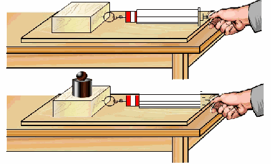

在化学学习中，会通过燃烧确认氧气的存在，通过石灰和盐酸的相互作用等探讨酸碱盐的化学反应。

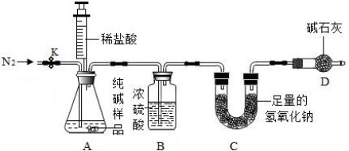

  

在生物学习中，会在显微镜下观察草履虫的结构和活动，会解剖青蛙了解它的身体结构。我们可以回想出好些在这些学科学习中做过的事。

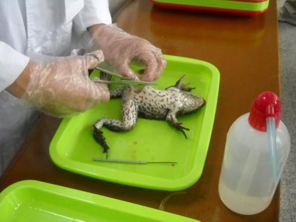

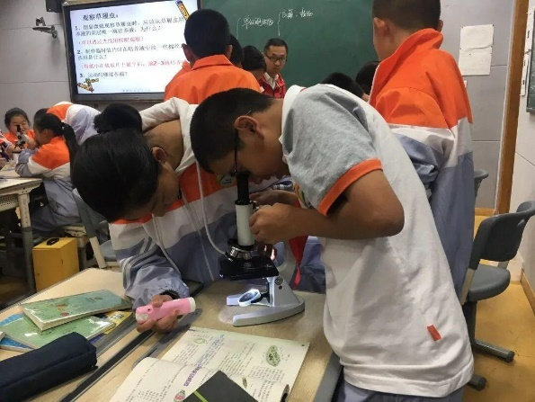

于是，物理有实验，化学有实验，生物也有实验，成为我们的共识。但是，**什么是实验？**

  

一般认为，实验是研究者根据确定的认识目的，应用特定的物质手段，对认识对象进行控制，使对象按照自身的意愿发生变化，从而对认识对象进行观察和分析的认识方法。

  

那么，**数学是否有实验？**众多的数学家对数学的实验性给出肯定的回答。

  

18-19世纪有突出贡献的数学家**欧拉**（Euler，1707-1783）和**高斯**（Guass，1777-1855）都曾发表过一些经验之谈。欧拉说过：“数学这门科学，需要观察，还需要实验”。高斯也提到过，他的许多定理都是靠实验、归纳法发现的。

  

**D.希尔伯特**，这位公理化理论的斗士，在1900年巴黎国际数学家代表大会上作了著名的《数学问题》演讲，提出了具有深远影响意义的23个Hilbert问题。他在演讲中对数学问题作了如下论述：“数学这门科学究竟以什么作为其问题的源泉呢？在每个数学分支中，那些最初、最老的问题肯定是起源于经验，是由外部的现象世界所提出的。”

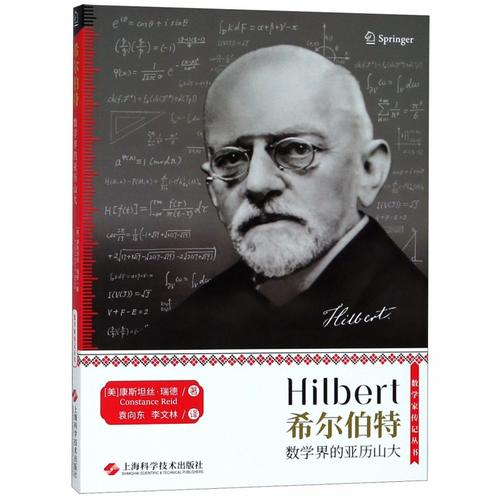

  

**冯·诺依曼**在论文《数学家》中有以下的论述：“数学有十分特殊的二重性，必须认识它、接受它，并把它吸收到这门学科的思想中”。“几何学在古代起源于经验，它之所以成为一门学科，与今天的理论物理学的情况并无二致。”“微积分学比其他任何事物更明显地表明现代数学的开端，而且，作为其逻辑发展的数学分析体系，仍然是精密思维中最伟大的技术进展。微积分明显来源于经验。”

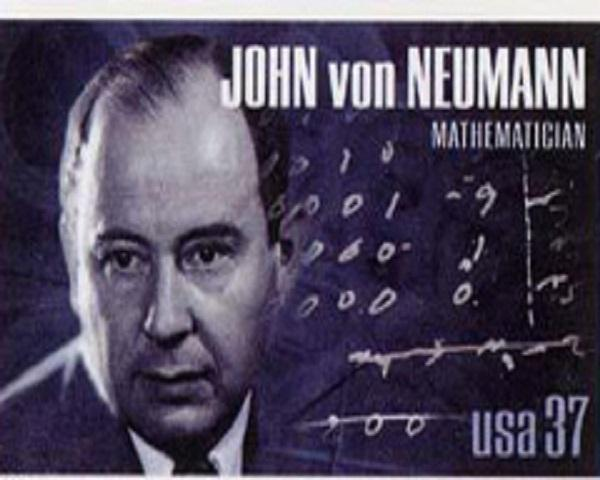

**徐利治先生**在《数学方法论选讲》中表述了如下观点：“为什么数学真理如同物理学科的领域的定律和原理那样，有时可以通过实验与归纳的方法去发现呢？原因很简单，因为数学对象本身（如数量形式和空间结构）也具有客观实在性。” 

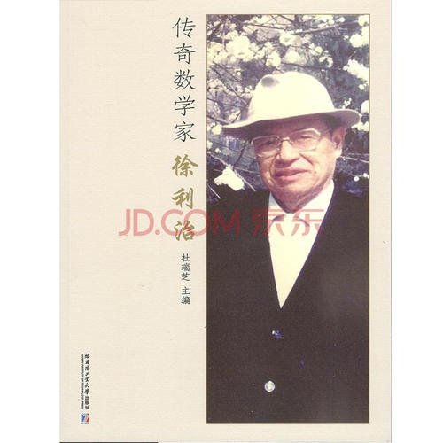

  

  

  

  

**什么是数学实验？**

追寻数学家们的足迹，我们发现很容易找到许多与以下片段类似的感悟：

  

“如果必须把数仅仅看作纯理性的概念，我们就很难理解观察和假想实验怎么能用于研究数的性质。”事实上，“今天人们所知道的数的性质，几乎都是由**观察**所发现的，并且早在用严格论证确认其真实性之前就被发现了。”——欧拉

  

“我珍视**类比**胜于任何别的东西，它是我最可信赖的老师，它能揭示自然界的秘密，在几何学中它应该是最不容忽视的。”——开普勒

  

“甚至在数学里，发现真理的主要工具也是**归纳和类比**。”——拉普拉斯

  

生物学家、数学家R.A.Fisher获取**观察资料**的方法是很特别的。他将66年的施肥、田间试验和气候资料加以**整理**，**提取信息**，为他的理论研究打下基础。——Fisher

  

20世纪40年代美国在第二次世界大战中研制原子弹的“曼哈顿计划”计划的成员S.M.乌拉姆和J.冯·诺伊曼提出了蒙特卡罗方法——随机**模拟法**。这种方法的原理，是在计算机上尽可能**真实地创造一种实验环境**，在这种环境中重现所要描述的客观现象，从而对这种现象的某些规律作出描述、判断、预测。——S.M.乌拉姆和J.冯·诺伊曼

  

数学具有“**经验与演绎二重性**”，这点波利亚在《数学与猜想”一书中表述得最为清晰。从数学产生、发展的角度看，人们是通过**观察、归纳、类比、猜想**等方法获得对事物数与形特性的认识，完成数学抽象，并通过研究抽象的数与形关系（包括概念、算法、公式、图形等等）拓展认识，也由此逐步积累了深刻地认识自然的方法。——波利亚

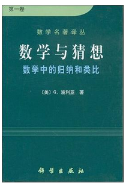

纵观前人的经验，我们认为：所谓**数学实验**，是指在一定的数学思想、数学理论指导下，经过某种预先的组织设计，借助于一定的仪器和技术手段，进行数学化操作，进而获得对客观对象的认知经验、探求对客观对象的控制手段或技术的方法。

  

**数学化操作**包括对客观事物的数量化特性进行观察、测试、度量、计算、归纳、类比、猜想、判断、推广、抽样、检验、逼近、模拟等。观察、测试、度量是数学的实际操作，而计算、归纳、类比、猜想、判断、推广是在实际操作基础上进行的数学化推演。抽样、检验是在不能预先知道随机现象分布时使用的描述随机现象的方法。逼近是在无法求出模型明确的解析解时采用的探究方法。而模拟，正如前面所述，是一种基于对客观现象的数值仿真描述进行深入探究的方法。

  

数学实验是认识活动，有明确的认识对象，讲究实验手段及操作，因此，数学实验具备一般实验的基本要素。

  

  

  

  

**什么是中学数学实验活动？**

**中学数学实验活动**隶属于数学实验，但它同时兼容了“教育”的鲜明特性。中学数学实验活动过程是“再发现”的过程，是教师根据教学需要人为地、有目的地、模拟地为学生创设积极的思维背景，使学生通过实际操作获得数学体验的活动，其目的是让学生在“做数学”中“学数学”、“用数学”。  

  

由于中学数学内容属于数学各分支中最基础的内容，所以，可以通过设计实验活动在一定程度上还原和描述中学数学涉及的数学现象、概念、原理、知识体系的形成和发展。也因此，中学数学实验活动首先是作为一种认知方法在教学过程中发挥效用。

  

数学实验是一种建立感性认识，并以此为基础追求理性的过程。因此，中学数学实验活动并不是止步于对客观对象表面的感性认识，而是以更深入内化的认知基础，进入到对客观对象属性的深层次探究，这是一种对科研方法的初步接触。

  

中学数学实验活动是根据数学教学的需要，在一定的数学原理的指导下，让学生借助一定的工具、仪器和技术手段，对具有一定数学意义的实物、模型、事物，以及数字、图形、式子、题目等，进行观察、测试、度量、计算、归纳、类比、猜想、判断、推广、抽样、检验、逼近、模拟等数学化操作，经历“再发现”的过程，以获取感性认识和数学信息的活动。

  

  

  

（本文摘自《高中数学实验活动选编》，略有修改）

  

  

  

**相关图书  
**

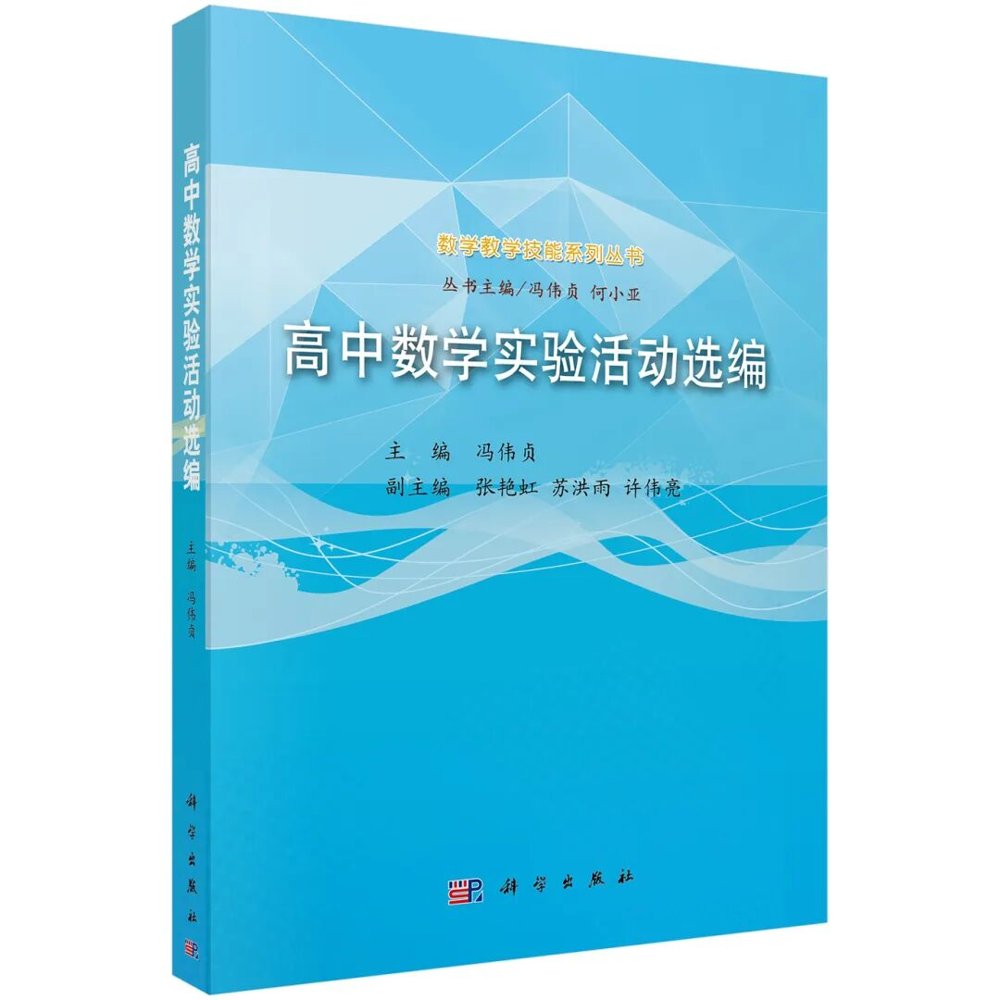

书名：高中数学实验活动选编

作者：冯伟贞

ISBN：978-7-03-047103-1

  

  

  

**内容简介**

本书采用了 45 个高中数学实验活动设计，对中学数学实验活动的概念、教学原则及教学组织方法进行了深入解读。本书的实验设计内容基本与高中数学教学内容同步，其中基于计算机的实验都是使用几何画板、Excel、Flash 等提供了较完善的视窗化操作系统的大众化操作平台。附带光盘录入了支持 45 个实验活动的71个课件及华南师范大学数学科学学院师范生的实验报告样例。数字资源还可以通过登录相关网站获取。

  

本书可供普通高等院校数学专业师范生作为教材使用，也可供高中数学教师、高中学生作为科普读物选读。

  

  

  

  

**目录**

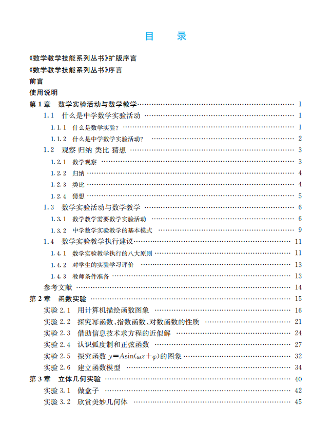

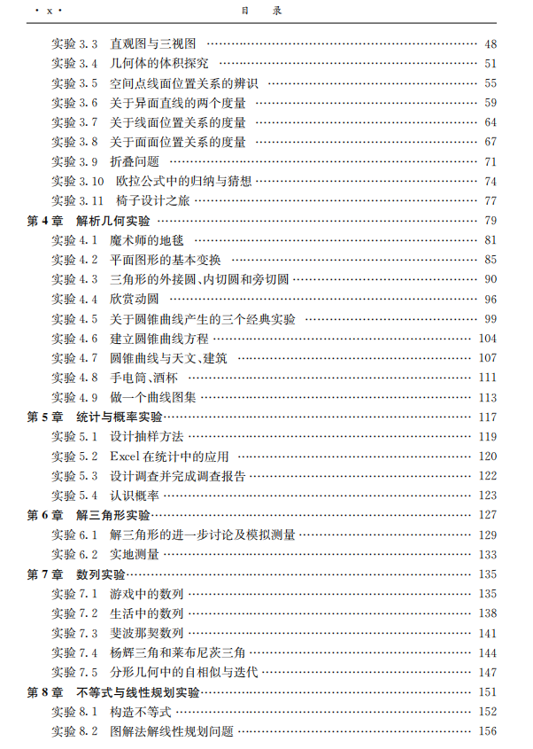

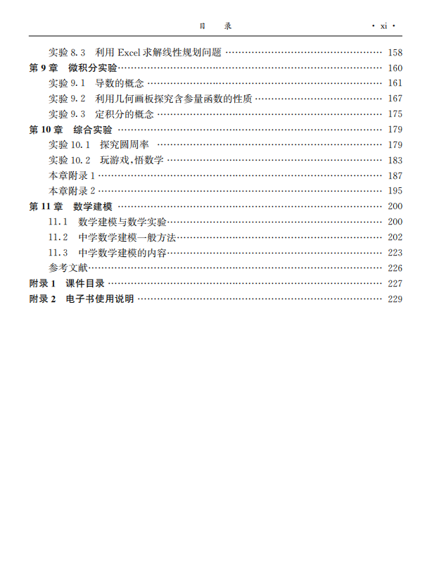

左右滑动查看更多

  

  

  

  

**本书特色**

1

本书的实验设计内容基本与高中数学教学内容同步。

2

基于计算机的实验都是使用几何画板、Excel和Flash等提供较为完善的视窗化操作系统的大众化操作平台，没有特殊的平台要求。

3

丰富的电子资源，包括45个实验活动和71个电子课件及实验报告样例。

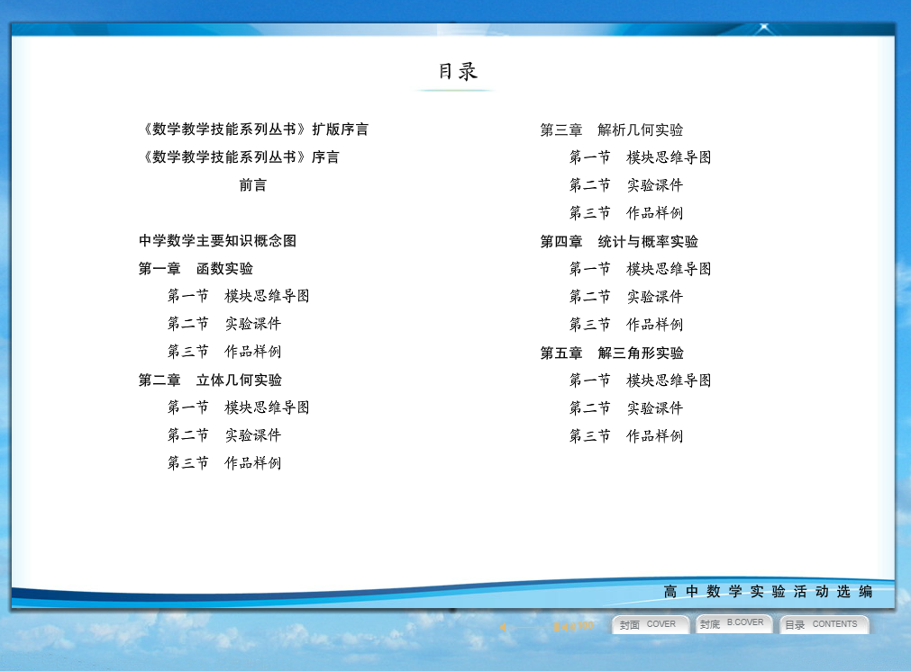

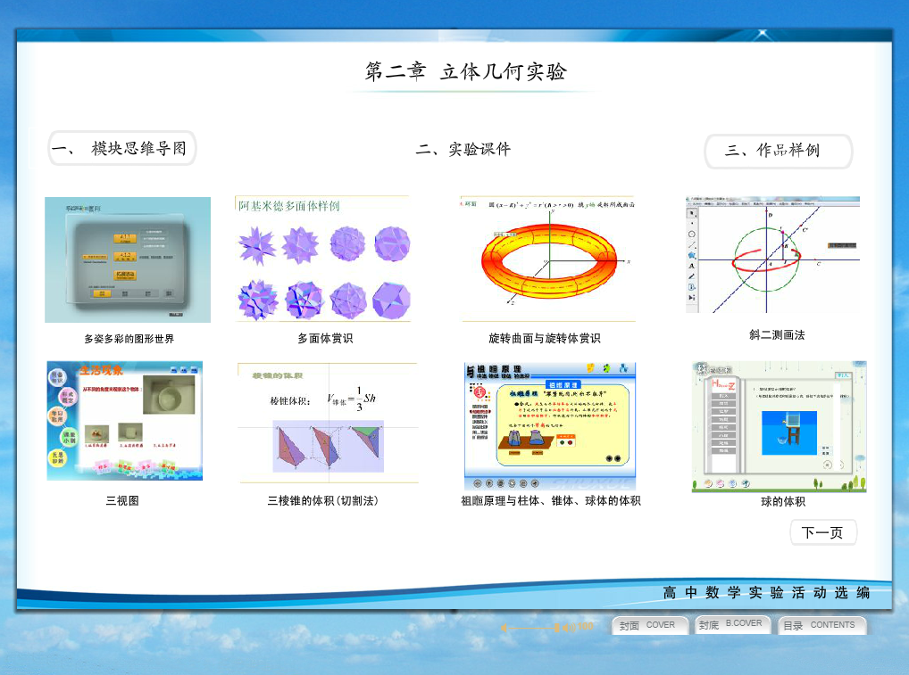

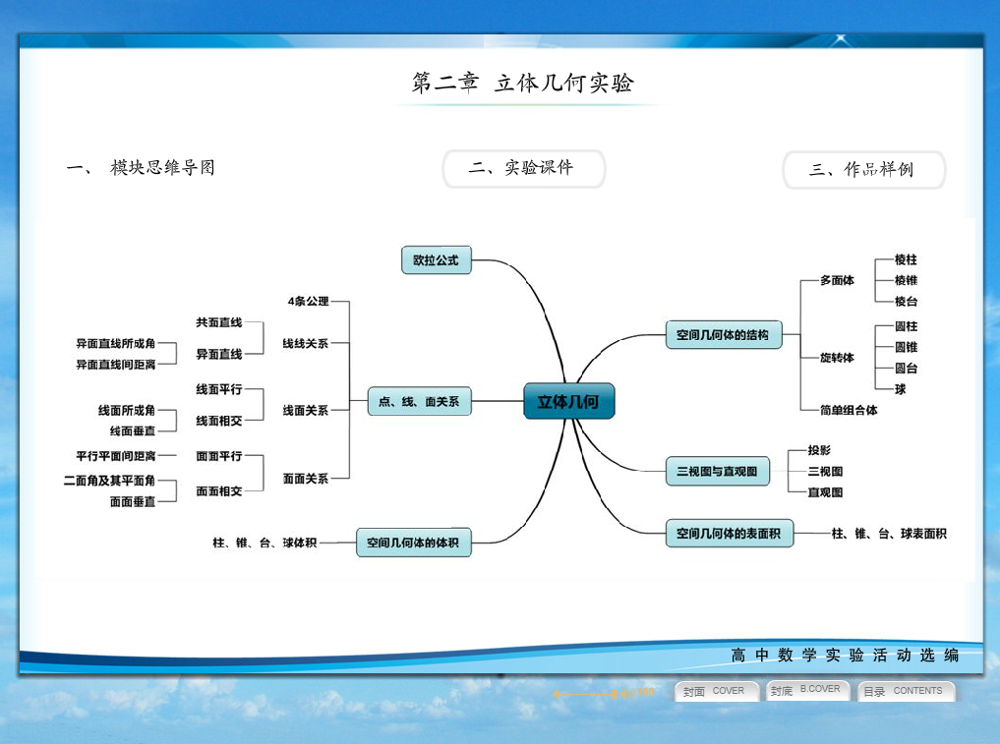

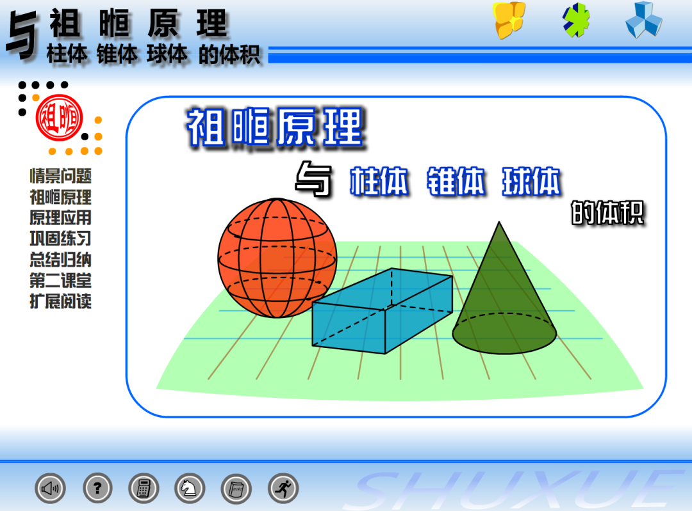

  

  

  

  

**购买链接  
**

‍

‍‍