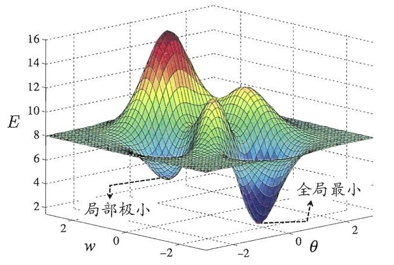
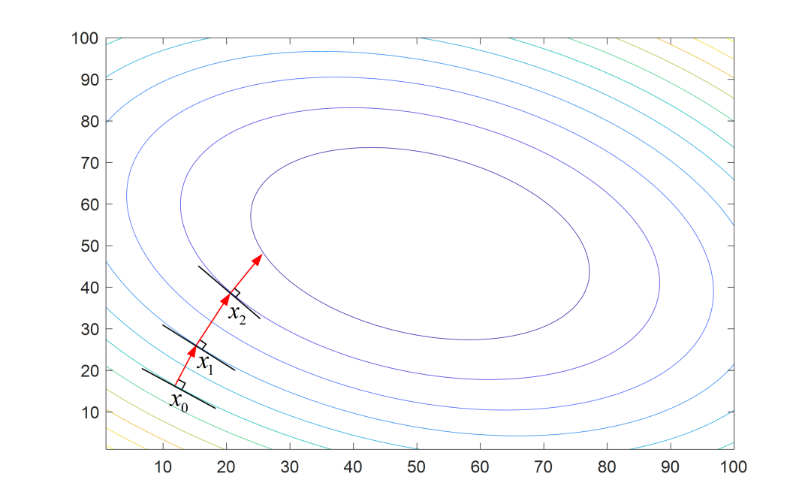
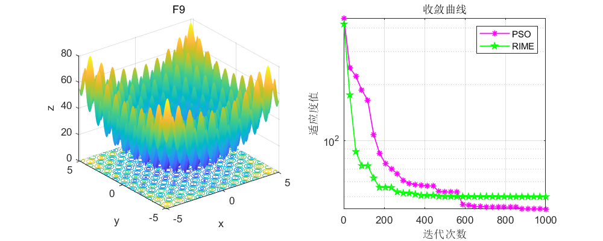

# 最优化理论：让决策更科学，让模型更高效

原创 Fairy Girl 有限元语言与编程 2025-03-27 09:00 山东

> 原文地址: [https://mp.weixin.qq.com/s/LgCj9la3je6JcJM\_GvDxYA](https://mp.weixin.qq.com/s/LgCj9la3je6JcJM_GvDxYA)

在快节奏的现代生活中，我们每天都在面临各种选择和决策。

小到选择午餐吃什么，大到企业的战略规划，每一个决策都可能影响我们的未来。

  

今天，我们就来聊聊一个听起来高深莫测，但实际上与我们生活息息相关的新领域—最优化理论。

  

**01**

**什么是最优化理论？**

最优化理论是数学的一个分支，它研究**如何在一定约束条件下找到使目标函数达到最大值或最小值的最优解。**

简而言之，它就是帮助我们做出最佳选择的科学。  

**关键概念**

最优化理论的关键概念是理解和应用这一领域的核心。以下是一些最优化理论中的关键概念：

**🎰目标函数：**这是需要被优化（最大化或最小化）的函数。

在实际问题中，它通常代表了我们想要优化的性能指标，如成本、利润、效率等。

**🎰约束条件：**这些是限制决策变量取值的条件，可以是等式或不等式。

它们定义了问题可行解的边界，比如预算、时间或者法规。

🎰**可行解**：满足所有约束条件的解。在最优化问题中，只有可行解才被考虑。就像是在规则内玩游戏。

🎰**最优解**：在所有可行解中，使目标函数达到最大值或最小值的解，也就是我们的最佳选择。

  

**应用场景**

最优化理论的应用非常广泛，从经济学中的资源分配，到工程中的结构设计，再到日常生活中的购物决策，它都能提供科学的指导。

**📍线性规划**：当我们面对的问题目标函数和约束都是线性的时候，线性规划就能大显身手。

**📍非线性规划**：面对更复杂的非线性问题，非线性规划提供了解决方案。

**📍拉格朗日乘数法**：在有等式约束的情况下，这种方法能帮助我们找到最优解。

**📍动态规划**：面对多阶段决策问题，动态规划通过分解问题来逐步求解。

**📍凸优化**：在目标函数和约束集都是凸的情况下，凸优化提供了高效的解决方案。

  

  

**02**

**最优化理论在机器学习中的应用**

最优化方法是机器学习的灵魂，用于更新模型参数，使策略（损失函数）最小化。

对于无约束的优化问题，常用的方法包括**梯度下降法**、**牛顿法**和**共轭梯度法**等。  

  

**梯度下降法**

**梯度下降法（Gradient Descent）**：这是一种一阶最优化算法，通常也称为最陡下降法。要使用梯度下降法找到一个函数的局部极小值，必须**向函数上当前点对梯度的反方向的规定步长距离点进行迭代搜索**。

梯度下降法并不是下降最快的方向，它只是目标函数在当前的点的切平面上下降最快的方向，可以认为是局部下降最快的方向。  

**牛顿法**

**牛顿法（Newton's Method）**：与梯度下降法相比，牛顿法使用二阶的海森矩阵（Hessian Matrix）的逆矩阵或伪逆矩阵求解，收敛速度更快，但每次迭代的时间更长。  

在机器学习中，不同的模型和学习策略会采用不同的优化方法。  

例如，支持向量机（SVM）通过解凸二次规划的对偶问题来进行优化；决策树学习则采用正则化的极大似然估计，损失函数是对数似然损失加上正则化项；而逻辑斯蒂回归模型则可以利用梯度下降法或拟牛顿法等无约束最优化问题的解法。

  

**03**

**最优化理论的实践与挑战**

在实际应用中，最优化理论面临着诸多挑战。一方面，**数据的质量和数量**直接影响到优化效果；另一方面，许多实际问题存在**复杂的约束条件和非凸性**，使得优化问题变得难以解决。

为了应对这些挑战，研究者们开发了一系列智能优化算法，如遗传算法、模拟退火法、粒子群算法等。这些算法在解决复杂的、实际的优化问题时表现出色，能够在有限的时间和计算资源下给出较优解。  

此外，随着机器学习技术的不断发展，**启发式算法与机器学习的结合**也成为了一个热门的研究方向。通过引入机器学习技术，可以改进启发式算法的性能，提高优化效率。

  

结

语

  

最优化理论是一个既古老又充满活力的研究领域。它不仅是数学和工程学科的重要基础，也是现代科学技术进步的重要推手。

随着人工智能和大数据技术的不断发展，最优化理论将在更多领域发挥重要作用。

希望今天的文章能够让大家对最优化理论有一个更深入的了解。

在未来的日子里，我们将继续为大家带来更多关于最优化理论及其应用的精彩内容。敬请期待！

**点这里👇关注我，记得标星⭐哦~**

  

**往期回顾**

· [微积分遇上机器学习：理解偏导数的力量](http://mp.weixin.qq.com/s?__biz=MzkyODYxNjA2Mw==&mid=2247491407&idx=1&sn=3f8148b683db8318b3fb845627256ccf&chksm=c217445ff560cd49508657c6d8eb454ba00acbf6f66f5f7c3545178e499228d7ddfa7726b140&scene=21#wechat_redirect)

· [微积分小故事｜“芝诺乌龟”的胜利？古老的阿喀琉斯与乌龟悖论之谜](http://mp.weixin.qq.com/s?__biz=MzkyODYxNjA2Mw==&mid=2247491348&idx=1&sn=a8a539a4efd1405e1a160c9aa6cf658f&chksm=c2174404f560cd12072262018cd7cd5e5166b6d3bca8d4176c405533dda6a7978f04ba1c56aa&scene=21#wechat_redirect)

· [统计学小知识｜统计学中的“黑天鹅事件”](http://mp.weixin.qq.com/s?__biz=MzkyODYxNjA2Mw==&mid=2247491287&idx=1&sn=f6f60243b2963bdb8d2ec14a09bc9282&chksm=c21745c7f560ccd166eb940e1336895f6a9f5cb4c43b728dce1aee0042d386f5b6e15f479631&scene=21#wechat_redirect)

· [“导数”遇上机器学习：从理论定义到实践应用](http://mp.weixin.qq.com/s?__biz=MzkyODYxNjA2Mw==&mid=2247491218&idx=1&sn=951fd0e70ca852cd08f7e5de7bc43175&chksm=c2174582f560cc9414a331083d8d6270a0f5265cb6ed1066a2746ce03c0567a5f61d3ba6ce91&scene=21#wechat_redirect)

  

**你们点点“在看”，给我充点儿电吧~**