# 最简单的一维有限元问题：求解cos函数分布

> 原文地址: [https://mp.weixin.qq.com/s/4312-GsikBlTAHd9c\_NAcQ](https://mp.weixin.qq.com/s/4312-GsikBlTAHd9c_NAcQ)

**1.给出边值问题**

满足cos函数的边值问题：  

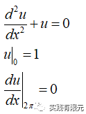

求解区域离散x=(0,2pi)

该边值问题的解析解为：

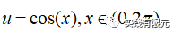

**2.有限元离散方程推导**

首先对求解区域离散，例如x=(0,2pi)区域离散得到的网格：

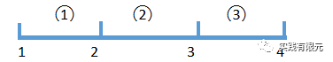

这里展示离散成3个单元段，四个节点，对应编号关系如下：  

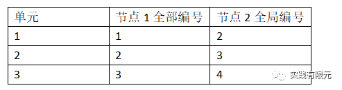

针对离散网格，使用伽辽金推导方法对连续的边值问题进行离散，首先对微分方程乘以试探函数，并且再求解区域积分，得到：

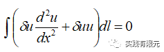

对上述式子第一项进行分部积分处理后：

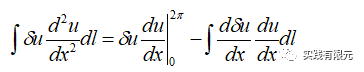

根据边界条件对上述的等号右端第一项分析：

在x=0处是第一类边界条件，后续强加边界后会覆盖掉这里x=0项的值；

在x=2pi处是第二类边界条件，对应给出的第二类边界条件等于0，也就是在x=2pi处加入第二类边界条件的系数矩阵为零；

具体详细的公式，在后续给出，这里继续推导区域内的有限元方程：

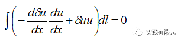

对求解区域进行网格划分，引入每个单元的线性插值型函数，表示为：

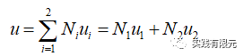

对上述方程进行离散，得到有限元离散方程：

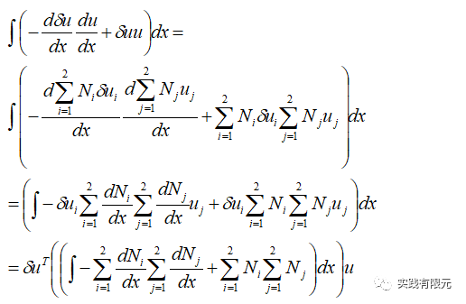

其中，试探函数不等于零，因此约去，简化用矩阵表示，得到：

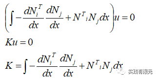

当加入边界条件后，变成：

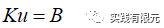

上述就是有限元离散方程，K表示对应边值问题的有限元系数矩阵。

**3.确定形函数**

在每个小单元内，通过端点解与形函数的组合可以获得单元内任意一点的求解结果：

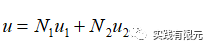

理解为在单元（一维线段）内u任意一点值有两个端点u1,u2通过插值函数N获得。因此不难理解，型函数N必须满足在端点1处插值的点为u1，在端点2处插值结果为u2。使用拉格朗日插值公式，可以直接获得满足上述要求的基本插值函数:

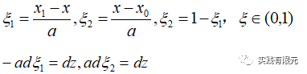

其中，a等于线段的长度，当型函数为线性一阶基函数的时候，形函数就等于插值函数：

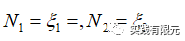

可以简单验证，上述形函数满足：

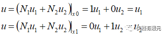

**4.单元系数矩阵推导**

在确定形函数后，根据有限元离散方程，发现还需要形函数的梯度，因此根据形函数与插值函数的关系，推导如下：

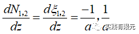

根据有限元离散方程的系数矩阵K,其中主要有两部分组成，梯度\*梯度与N\*N,因此，分开考虑两部分，带入形函数的梯度推导结果，得到：  

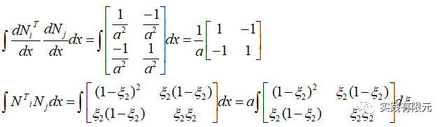

其中第一项是常数积分，很容易获得；第二个公式可以查表获得，这里手动积分看看原理。对第二项的积分变量转化到§下，因为§的积分范围是一定的(0,1),因此：

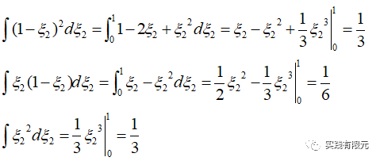

所以，得到第二项的积分结果：  

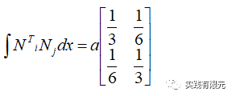

一般的，通过带入公式计算得到系数或者查表得到：

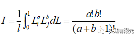

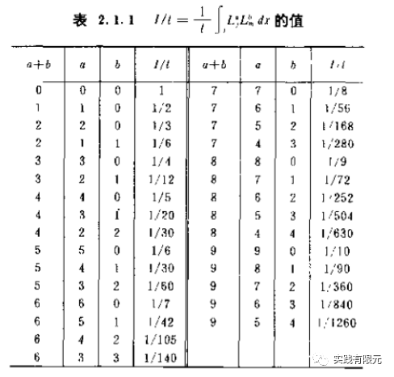

**5.组装全局系数矩阵**

根据上述离散网格，离散成三个单元，因此，单元长度a等于2pi/3,因此第一个单元的系数矩阵：  

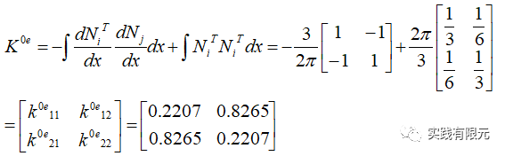

其他两个单元一次可以得到相同的系数矩阵，然后把三个系数矩阵根据单元节点列表将局部单元系数矩阵一一映射到全局节点中：  

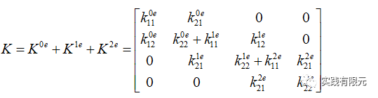

然后，对系数矩阵添加边界条件：在x=0处的第一类边界条件，使用乘以大数的方法，得到：

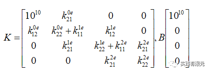

在x=2pi位置处添加第二类边界条件，在终端边界点添加矩阵Kf:

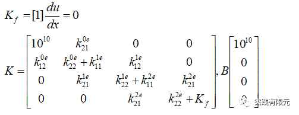

最终得到的系数矩阵数据，线性方程组：

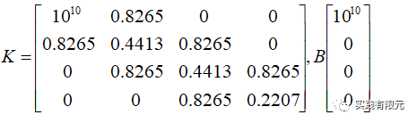

**6.有限元计算结果**

求解线性方程组有很多方法，大体分成迭代法和直接求解方法，这里采用matlab中自带的直接求解方法求解，求解结果为：

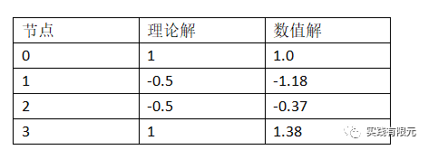

用图像显示，数值结果与解析解的误差：  

3个网格单元：  

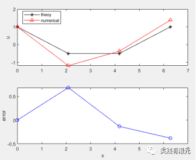

10个网格单元：

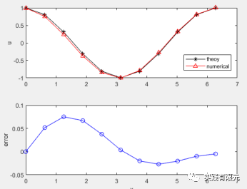

50个网格单元：

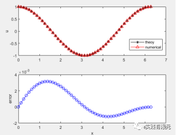

可以直观感受，3个网格的最大计算误差在0.5左右，10个网格误差在0.1以下，而50个网格精度就达到了4e-3，基本上与理论解完全重合。  

7.总结  

有限元求解流程：

       1.确定边值问题与求解区域；

       2.推导有限元离散方程；

       3.确定形函数；

       4.单元系数矩阵推导；

       5.组装全局系数矩阵；

       6.求解线性方程组得到数值结果。