# 最简单的二维热传导有限元数值模拟实现

> 原文地址: [https://mp.weixin.qq.com/s/FXz91hbABR6aKBfkFX8IaA](https://mp.weixin.qq.com/s/FXz91hbABR6aKBfkFX8IaA)

简述

本文介绍热传导方程的有限元数值模拟方法，模拟二维稳态传导方程。意在学习了解有限元数值模拟在热传导问题中的运用。

1.边值问题

热传导的基本定理，描述热流密度与温度梯度的关系：

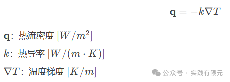

能量守恒定律，单位体积内热量变化等于流入热量与热源之和：

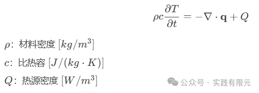

带入第一个公式，得到热传导方程：

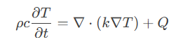

当温度不随着时间变化的时候，方程简化为泊松方程：

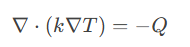

对于二维而言，展开写得到：

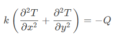

该方程对应的变分问题为：

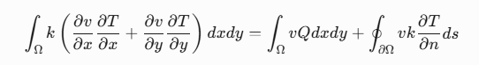

考虑绝热边界，此时简化方程得到：

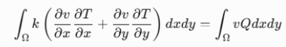

对于四个边的边界条件，在底边固定温度使用第一类边界条件，在其他三个边使用热流边界的第二类边界，具体如下：

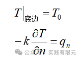

由此，热传导方程的边值问题为：

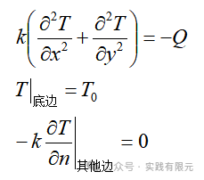

假设为热源密度和热导率为均匀情况，二维问题有解析解：

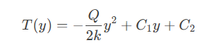

二维问题对应的有限元方程为：

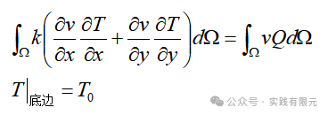

可见，二维的热传导方程经过分析后，最后得到的边值问题就是泊松方程，这对于有限元数值模拟而言是非常简单的。

对于具体的泊松方程的二维有限元推导过程这里不再介绍，各种有限元方法可以参考文献：

[有限元文章集合-2024年](http://mp.weixin.qq.com/s?__biz=MzkwNzUxOTM2NA==&mid=2247486208&idx=1&sn=887b2ddb55a4a8c2fc8d2f149ed41899&scene=21#wechat_redirect)

[同轴线求电容，初探泊松方程的二维非结构化有限元](http://mp.weixin.qq.com/s?__biz=MzkwNzUxOTM2NA==&mid=2247483980&idx=1&sn=9803c31966314d8fbd90cede9faa1b60&scene=21#wechat_redirect)

[最简单的二维结构化有限元问题：求解拉普拉斯方程（改）](http://mp.weixin.qq.com/s?__biz=MzkwNzUxOTM2NA==&mid=2247483928&idx=1&sn=05e3ce02b78d231fd8da3f06e2ddc0e1&scene=21#wechat_redirect)

2.数值结果

当热源密度和热导率为均匀情况时，数值模拟的稳态温度与数值解的对比：

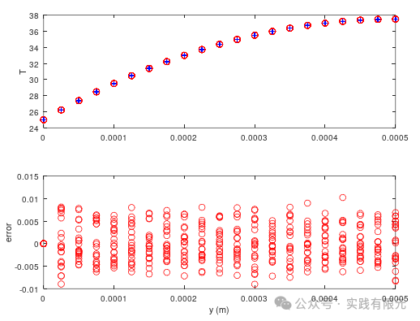

可见数值解和解析解是一致的。

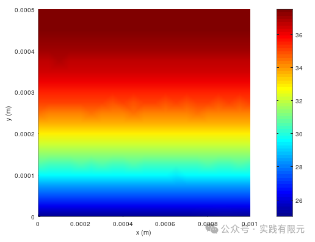

当仅中心区域存在热源情况下，数值模拟结果：

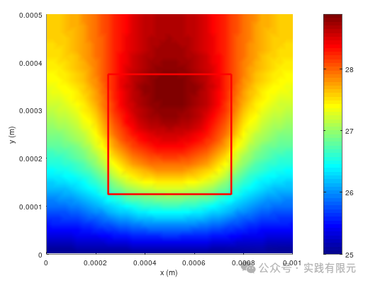

3.最后

这里简单实现了的二维热传导问题的有限元数值模拟，根据实现流程可见，稳态热传导方程本质就是泊松方程，因此弄明白泊松方程后，问题热传导方程也就迎刃而解，更多的就是考虑热传导的物理背景。

* * *

博主长期深入实践电磁学领域的有限元技术，感兴趣的朋友可以添加博主公众号，欢迎共同探讨与有限元相关的技术知识。