# 最简单的二维结构化有限元问题：求解拉普拉斯方程（改）

> 原文地址: [https://mp.weixin.qq.com/s/f0cKfRHOGk\_5drQ3doFKFA](https://mp.weixin.qq.com/s/f0cKfRHOGk_5drQ3doFKFA)

**简述：**  

    二维边值问题的有限元求解过程相对于一维而言难度开始增加，复杂性也开始增加。这里通过足够简单的边值问题，实现了二维结构化有限元的整个详细流程。

**1 边值问题**  

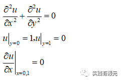

        对应均匀研究区域，解析解为：

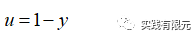

        简单介绍该问题的用途：在电学中求解两块平行板之间的电势。

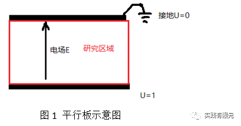

    红色区域为实际研究区域，满足静电场中不含源的拉普拉斯方程，在上下边界存在电压差,假设一端1V,一端0V,两个侧面为自由边界条件，就得到上述边值问题。

**2 边值问题的有限元推导过程**  

    对微分方程进行处理：  

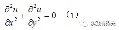

    在研究区域内积分并乘以试探函数：

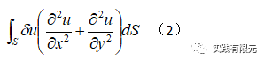

    根据公式（2），加法的积分可以拆分独立积分再累加，因此该二维问题的有限元问题推导类似于一维，继续分部积分：

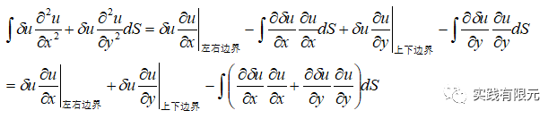

    该二维模型存在四个边界：上下边界分别为第一类边界条件，在边界条件处理的时候会乘以大数实现；左右侧边界分别为第二类自由边界条件为零，自然满足。所以得到的有限元方程为：

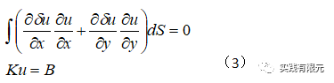

**3.二维基函数推导**

    二维基函数不同于一维仅存在一种线单元，二维存在许多基本单元，例如四边形、三角形、六边形等等；这里介绍结构化中的最简单四边形单元，如下图：  

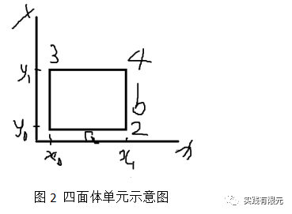

    不难看出，二维四面体是规则形状，其插值函数与一维存在一定关系，我们知道一维的拉格朗日插值函数为：  

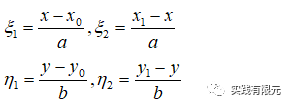

    如果要组合成二维的插值基函数，就需要满足在各个点上对应插值结果为1，因此可以猜测表达式为：

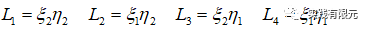

    展开得到：

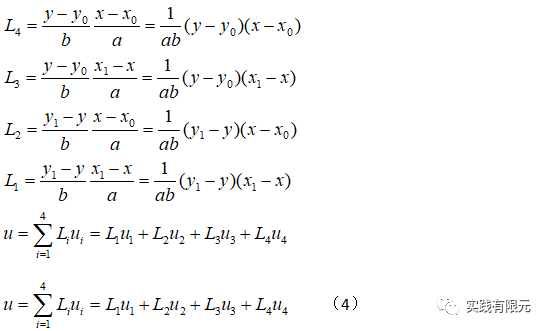

    进一步验证，分别将四个点坐标带入上述表达式中：  

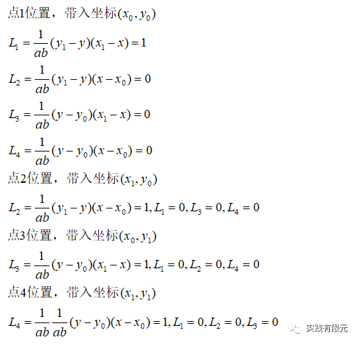

    验证结果满足基函数的要求，带入对应的节点坐标时，对应的基函数等于1，其他基函数等于零。进一步推导得到基函数的偏导数如下：

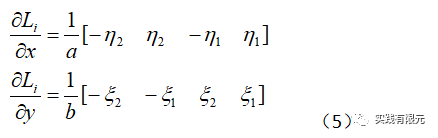

    以上就实现了对四面体线性基函数的推导过程。  

    为了更加深刻的理解基函数的意义，这里再介绍有限元中获取基函数的一个重要手段：面积坐标。

    在二维情况下，有限元的线性（插值）基函数满足一定的单元面积占比关系，或者说通过单元内任意插值点与四个点围成的面积关系从而获得对应的基函数。  

    例如下图中四边形中任意一点p,直观的感受p距离4号点位置最近，所以p的解应该最接近4号点，而不是1号点。我们可以发现这其中和p点对应围成的面积有关系。

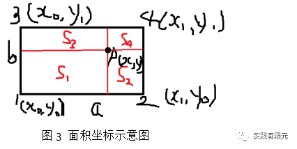

    因此，每个点对应的面积占比结果之和就是p的解，初步猜测：

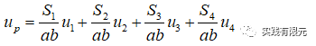

    然后我们来验证猜测是否正确，当点p逐渐趋近于4号点的时候，S1=ab，其他三个面积全部为零，我们发现，根据上述等式得到Up=U1，明显是不对的，在图4示意图中显示Up应该是等于U4的。用同样方法可以验证p点落到其他三个点的情况，最终修正上述表达式：

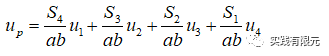

    再次验证p点落在四个节点上的情况，根据上述公式得出：

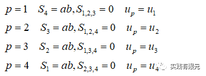

    这时候我们就成功地用面积占比的方法表示出p点的插值公式，这就是面积坐标。然后，我们把每个面积用坐标的形式表示出来如下：

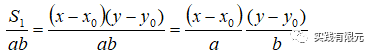

    不难发现，上述式子正好对应最开始推导的二维四边形基函数：  

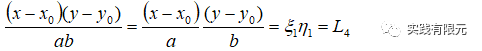

    同理其他的几个面积比例关系也可以推导得到对应的基函数。

    由此发现，从一维组合而来的二维插值公式，其实就是面积坐标公式。用面积坐标来理解更加的容易理解二维四边形的插值公式。

    备注：二维面积坐标，三维体积坐标，是有限元求解插值基函数的一个重要手段或者理解工具，它能帮助我们更好的理解基函数的意义。

**4.单元系数矩阵**  

    将四面体插值基函数带入到有限元方程中，得到：

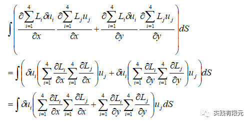

    写成矩阵形式为：

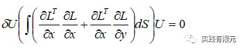

    因为试探函数不常为零，因此可以约去，最终得到：

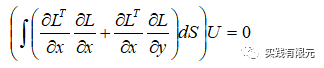

    根据公式（5），已知每个基函数对x,y的偏导，带入可得单元系数矩阵：

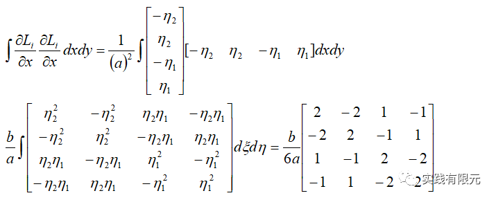

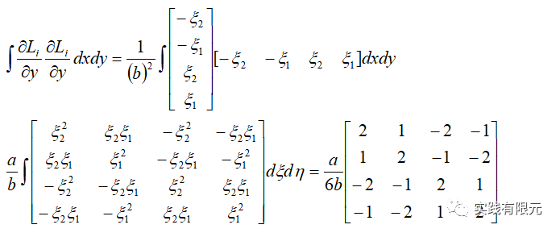

简单介绍其中两项的积分过程：

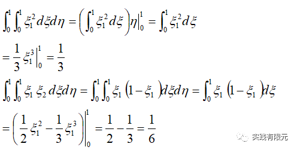

更多推导细节参考：[最简单的一维有限元问题：求解cos函数分布](http://mp.weixin.qq.com/s?__biz=MzkwNzUxOTM2NA==&amp;mid=2247483689&amp;idx=1&amp;sn=238051a214893aec197bde3511363463&amp;chksm=c0d6b5c2f7a13cd49795a90d7a3509ff6e6a5fbd744fe1f1721af17a4cb8e93827383ddc9d60&scene=21#wechat_redirect)

**5.系数矩阵组装**

    根据网格划分以及图2的局部坐标系映射到全局坐标系关系：

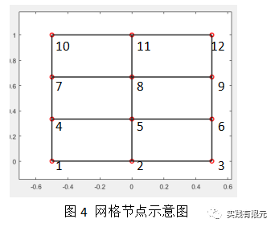

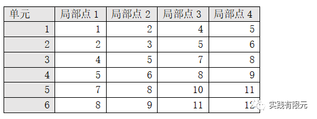

    通过上述关系就可以将单元系数矩阵组成全局12\*12的系数矩阵。

    给出具体网格数据：X范围\[-0.5,0.5\],y范围\[0,1\];x的间距0.5，y的间距0.3333，以此得出具体系数K矩阵：

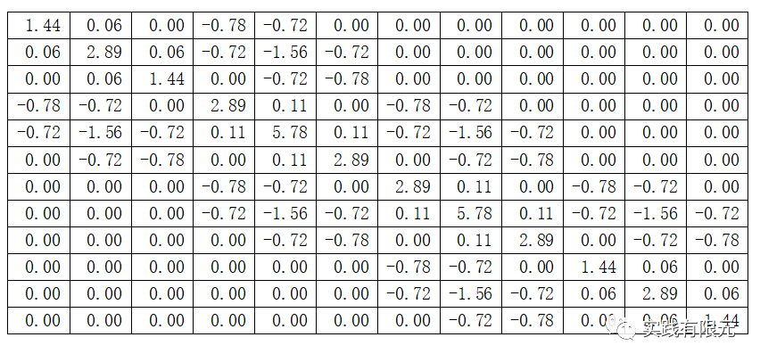

    添加上下界面的第一类边界条件，乘以大数的方法实现，乘以大数的目的在于将对应行的其他元素的影响降到足够小，以此实现该行左端项对角线直接等于右端项，从而实现第一类边界条件的加载，最终K系数矩阵为：

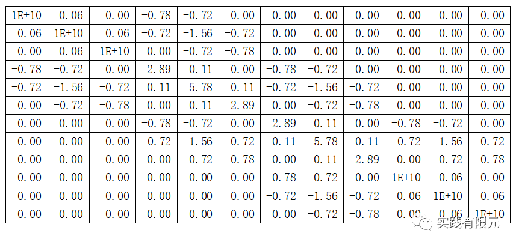

    右端项B向量：  

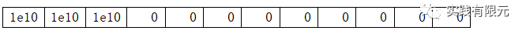

**6.结果与对比**  

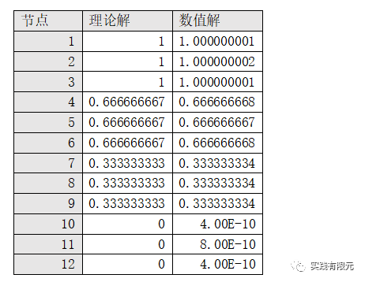

    可见，理论解与数值解几乎一致，这是由于模拟过于简单公式，所以精度非常高。显示2\*3网格的可视化结果：

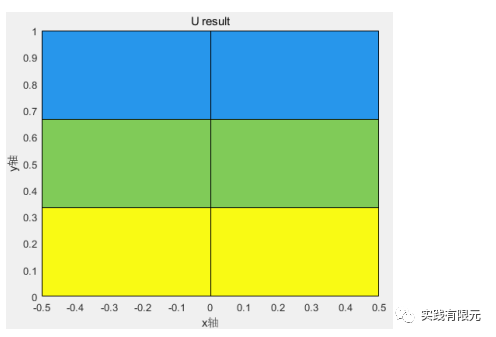

    将网格细化成20\*30，计算得到的结果可视化：

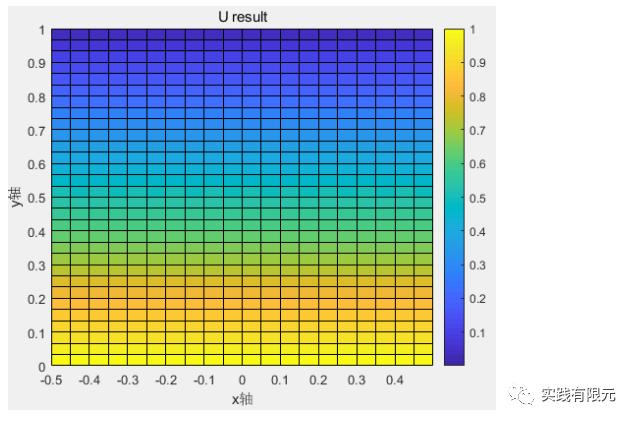

**7.总结**

    a.二维结构化四边形网格的有限元流程与一维基本上一致，区别在于一维和二维的基函数不同；

    b.四边形基函数可以通过一维基函数组合获得，同样可以通过面积坐标的方式获得；面积（体积）坐标是获得有限元线性插值基函数的一种重要思维，在二、三维体现更加的明显。