# 有文章即可！同领域大牛手把手帮你选刊、润色、投稿、返修！服务至发表，最快两个月SCI接收！

> 原文地址: [https://mp.weixin.qq.com/s/mt\_MoLlkPS7IZQlEImOvVw](https://mp.weixin.qq.com/s/mt_MoLlkPS7IZQlEImOvVw)

说到**写****论文的辛酸**，在座大部分老师或同学都深有体会，常有作者直言“**写论文是我这辈子最痛苦的事，没有之一**”

  

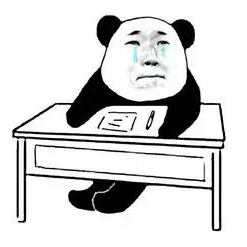

  

我查阅后台留言的时候，有一次看到**一位博士老师**半夜还在“**倒苦水**”。

  

说自己没日没夜的搞选题、做实验、一遍一遍地投稿，熬夜到头秃…但是**延毕三年了还是没能投中发表**，情绪很崩溃。

而就在**同一课题组**，却有人**三年发了十几篇SCI**！偷偷打探过，并没有学术不端，说只是因为**会选刊，会投稿，一投就中** ，影响因子还不低。

  

现如今，发表SCI已然成了**完成学业、名校留学、晋升评职称**的**硬性要求**。

  

如果你“原始积累”不够好，且不说目前状况惨淡，后续的**好单位、拿课题、评奖评基金、涨薪、经费报销**等“好前途”也都与你无关了。

  

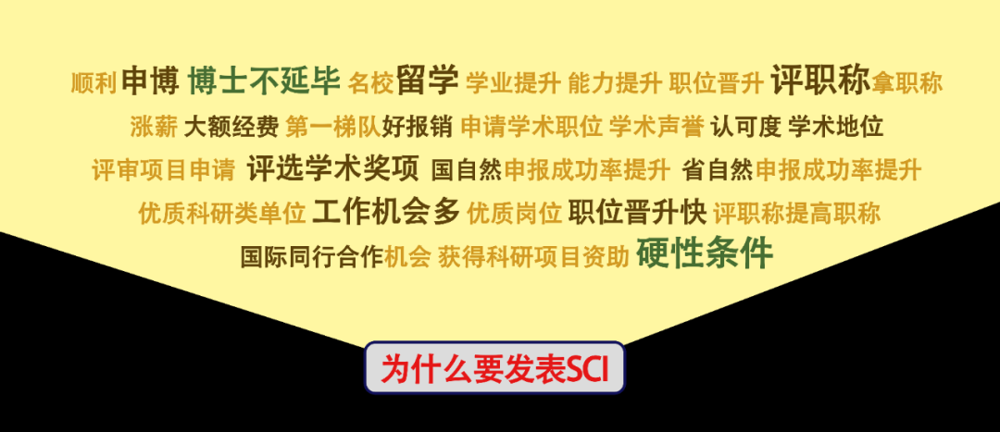

  

我单位有位同事之前申请国自然一直不中，发表一篇二区SCI后**当年就中了国自然**，奖金有**50w**。

  

所以说，文章再好，最重要的还是得被期刊接收，而且**时效****也很重要**！

  

SCI审稿周期通常在**3-10个月左右**，**投错了耽误的这些时间，创新性若被抢占，则所有努力归零**，甚至可能反过来背上**抄袭**的名头…

  

**不会选刊、不懂投稿规律、不懂期刊排版要求、图表不合格、投稿资料缺失、语言润色不过关、甚至是返修环节总通不过…** 

  

只要满足以上一项，文章再好也和成功发表无缘！

  

有调查表明，**国内科研作者发表SCI被拒，50%是败在了投稿选刊上。**

不过，其实这也不能怪，术业有专攻。

  

文章写的好，就已经是天大的本事了，现在还要求会选刊投稿，意味着你起码要具备**“期刊审稿人”的能力和眼界**。

  

而SCI期刊绝大部分都**深耕在国外**，这**“期刊审稿人”能力**在国内就鲜有人具备了。

  

但大家不必焦虑，**这里面是有捷径的****（非学术不端）**，既然大家有需要，我想也可以做个分享，感兴趣的话可以好好听下。

  

我本人的真实经历是——**第一次投稿也遇到很多问题**，第一篇SCI愣是折腾到临近毕业，我才向师兄打听到一家机构。

  

请了**手握30篇SCI的同领域学术大牛**，**联合资深母语审稿人****全程帮我选刊、润色、排版、投稿、返修，堪称全流程保姆式！**

  

甚至包括大小修的回复信审查润色、图表图片细节，都手把手协助我处理好了，才让我看到毕业的希望。

**两个月没到，文章就通知被接收了**！

  

而且更重要的是：我原本想投个**三区**发表就顶天了，机构的专家愣是给我推荐到了**二区期刊**，说**我的内容足够投二区，别浪费了！**

  

最后二区中刊，我惊喜坏了，到现在都很感谢这位专家，比我导上心多了…

  

  

如果你不止**投稿选刊**不专业，还**对自己的文章内容没信心，**但想发表，也没事。  

  

发过几篇SCI才知道，**高分中刊的作者，其实没几个是自己独自原创的**，可以说每一篇一区SCI的背后，都有数位**除作者之外**的**高级专家**在提供意见或亲自参与。

  

内容不行，刚好可以请机构里的**同领域资深教授专家**、**有****丰富SCI发表经验的大牛**对你的稿件进行**亲自点对点修改与拔高**，中英文论文都可，专家修改完毕，再请**高级投稿专家/母语期刊高级评审人**进行全程投稿发表服务即可。

  

这样下来，一篇资质平平的文章最终发表到一二区不是问题，有了高分SCI打底，后面的路也就不辛苦了！

我用的这个全程无忧套餐，在**润色-选刊-投稿-返修全流程**中，所有服务均为**多轮次不限时间的**。

  

中间遇到些繁琐的细节问题也用不着我处理，文章返修直到二区接收，专家都在帮我盯着，很负责。

  

机构名字大家可能都听过，叫艾德思，算是业内**比较资深的科研服务机构**了，**质量很过硬，高资质专家的配备**也已深入到了各个小领域，**但凡是大学里有的专业，他们那边都配备**完整** ✓**

  

考虑到**发表问题困扰各位作者已久**，我今天还特意向老东家问了下近期活动，得知**最少可以直减1000！**各位老师或同学想发表SCI，找他们会是个不错的选择。

  

**▼****全流程保姆式投稿发表套餐**  

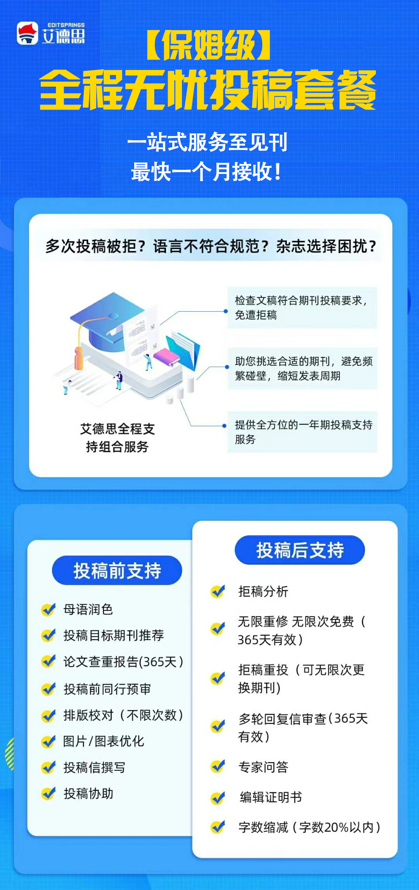 

就我去年给我们课题组的同事说完我的经历后，师兄师弟一共3人都选了这个套餐。

  

有**2篇**在**2个月内成功发表了**，还有一个因为期刊等级较高，审稿周期长，用时**6个月**最终也顺利发表了  

  

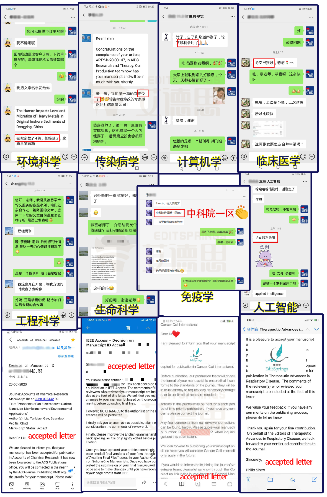

**艾德思全程无忧投稿套餐服务后发表案例**

（已经作者授权进行展示）最快4周接收！

  

我身边有不少发过SCI也合作过多家科研机构的作者，**综合对比下来**，艾德思作为一家学术支持机构，能够为科研人提供**即全面又高质量的服务**，还是很不错的：

  

**1、中刊率高：**历年平均中刊率97%；

**2、发表期刊影响因子更高：**一区二区发表论文占比37%；

**3、投稿快速包全程：**全程无忧套餐4周即可交付；

**4、专家资质高背景强：**同领域母语教授、top期刊审稿人，均发表30篇SCI及以上，高分多；

**5、客户满意度高：**24小时专属学术顾问全天应答，可咨询专家进行学术问题解答，服务平均满意度99.8%；

  

**立即咨询****论文发表全程无忧投稿套餐**

**锁定直减1200活动优惠**

********▲****长按扫码添加学术顾问********▲****

  

对了，因为艾德思的**专家资质极高**，对**学科内期刊如数家珍**，**甚至超过了大部分硕博士导师的水平，又比导师有耐心**，所以有些作者在做服务的同时把专家当导师来问问题了，收获也不少~

  

另外，如果**你是医学相关专业**，那就更占优势了，艾德思最新推出的**医学SCI无忧服务**，在上面“**全程无忧投稿套餐**”的基础上，还增加了**论文逐句修改拔高服务**，并且**可以指定时间中刊**

你仅需提供文章，剩下的交给机构里的同领域学术大牛们！**坐等接收信即可~**

  

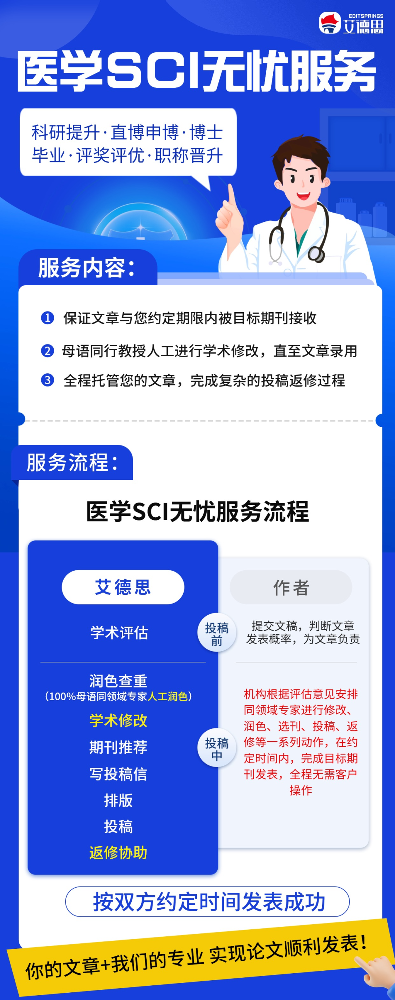

  

为什么说**省时省心，保质保量**呢？

  

因为只要是**涉及SCI发表的专业性内容****全都涵盖了**，不漏过每一个细节，**多级锻造，层层拔高文章水平**，且全程无需作者操作，机构负责到底，并在约定时间内让文章发表 👇

  

**▼作者约定时间，机构负责发表▼**  

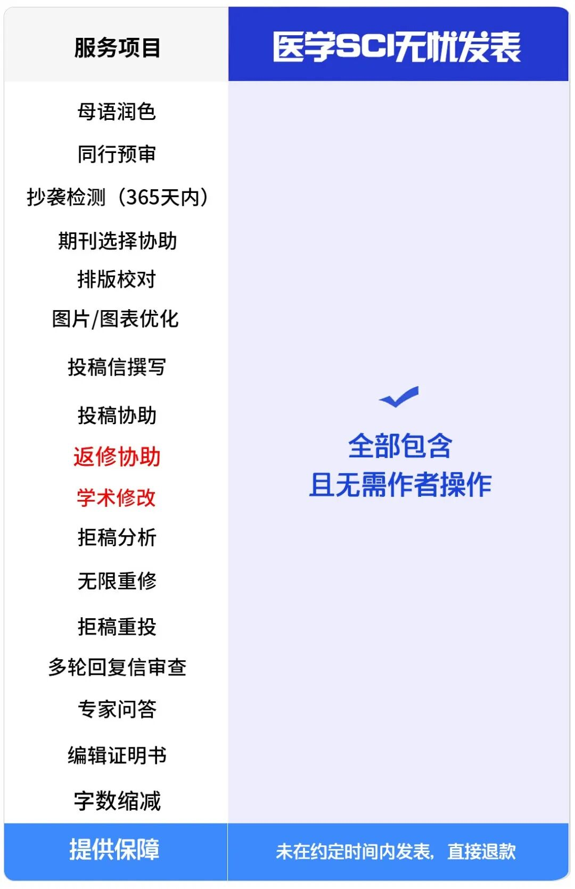

************▼********长按下方二维码添加学术顾问********▼************

**立即咨询****医学SCI无忧发表**

  

  

  

**起源于美国科研重镇波士顿**

**历经13年竭诚打造**

**拥有3000+名以英语为母语并长期编辑科技论文的**

**top期刊审稿人或****就职于欧****美TOP科研****院学术专家**

**可提供****一站式SCI论文全程发表支持服务**

****▼**艾德****思协助SCI发表的部分实名案例****▼** 

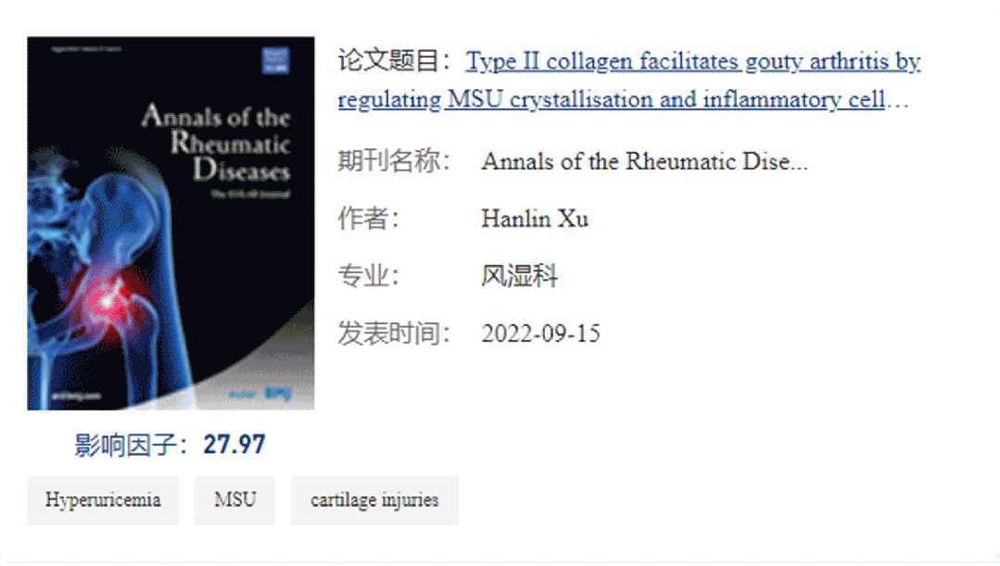

  

  

  

**艾德思（EditSprings）**于2012年由杨博士创立于**美国科研重镇**波士顿，是国际知名的**学术发表支持品牌****、****SCI/SSCI/EI期刊论文****发表**的指定服务机构，扎根深远，业务全面。

  

涵盖****全程无忧投稿发表、**论文润色/翻译、论文修改/论文辅导、各级基金标书**等一系列服务，旨在为广大科研作者**逐一破解发表难题**；

  

至今已为全球**150**多个国家**30万**名作者提供服务，累计完成稿件超**100万**份，据统计，经艾德思服务后的稿件，接收率较期刊平均**提高了67****%**。

  

  

创始人杨博士于**2008年获得博士学位**，在**哈佛大学**（Harvard University）担任讲师期间，结识了众多**欧****美本土博士、博士后和教授**，并建立了良好的合作关系。以下为几位专家代表：

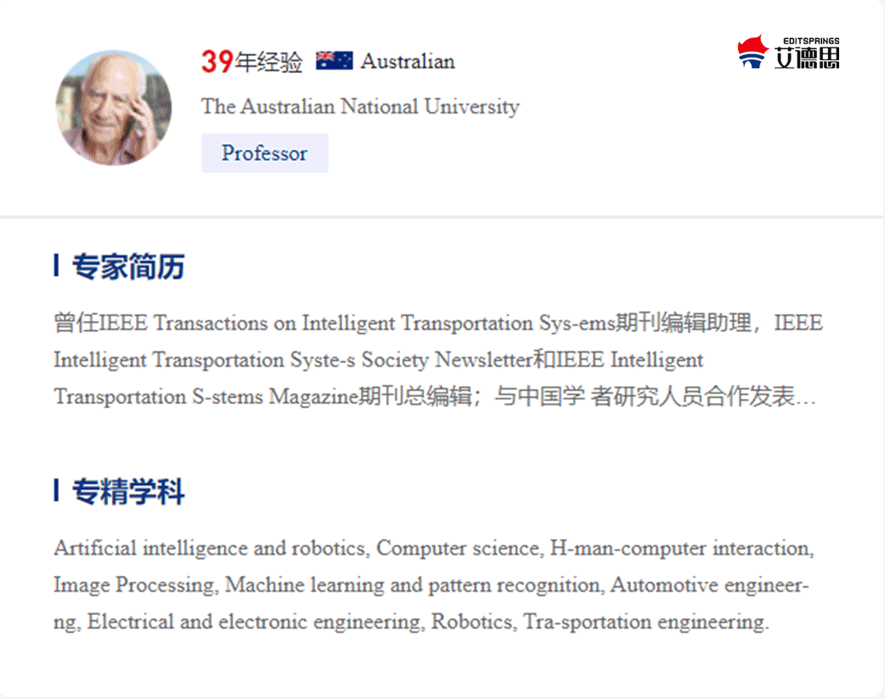

  

已有**3000+****名****100%****英语母语****、****就职于欧美高校和科研院所****，****并长期编辑科技论文的编辑、资深****TOP期刊审稿人，以及1000+名国内985/211高校教授。**  

  

研究方向覆盖医学、药学、生物学、化学、材料学、计算机、环境、农业、工程技术、人文社科等**18个大学科**，可以精细化处理 **238个二级学科、1200+细分研究领域**稿件。

  

专家平均有**20年以上**科研经验，**10年以上**SCI论文撰写及审稿经验，以及**30篇以上**SCI论文**发表经验**，**高IF期刊发表至少****10篇**。

**立即咨询****论文发表全程无忧投稿套餐**

**锁定直减1200活动优惠**

********▲****长按扫码添加学术顾问咨询********▲****

  

  

  

_**★**__**艾德思极其严格的质控**_

  

与其他机构不同都是，艾德思对稿件的质控非常严格，每一次服务，他们都会**请顾客做出详细的评价。**

  

**依据这些真实评价，对母语编辑团队实施****严格优胜劣汰机制**，如有一次因服务疏漏导致拒稿，将立即被取消与艾德思的合作资格。

  

**严格保证只有态度认真、服务质量高、中刊率高的编辑、专家，才能为艾德思的顾客服务。**

  

历年服务后的稿件，于一区、二区期刊发表占比**37%**，每天都能收到客户的中刊、中标喜报。

  

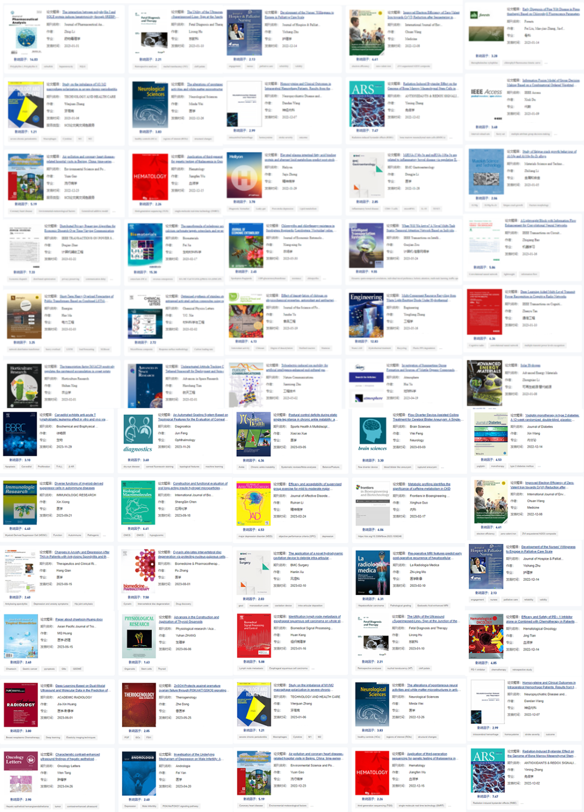

部分艾德思各领域SCI发表案例（已获取作者授权）

  

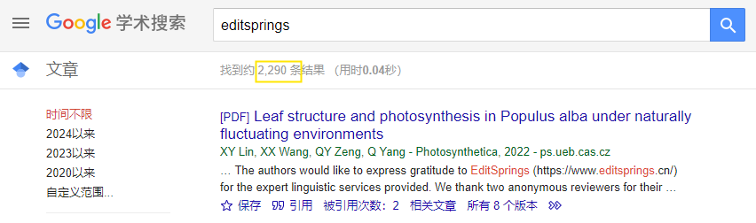

在论文中致谢艾德思的2000+篇案例

  

如果你**目前或将来准备投稿**，需要**发表论文**，赶紧扫码下方二维码，获取您在艾德思的专属学术顾问👇

  

**立即咨询****论文发表全程无忧投稿套餐**

**锁定直减1200活动优惠**

********▲****长按扫码添加学术顾问咨询********▲****

  

****▼**全程投稿服务真实用户评价**

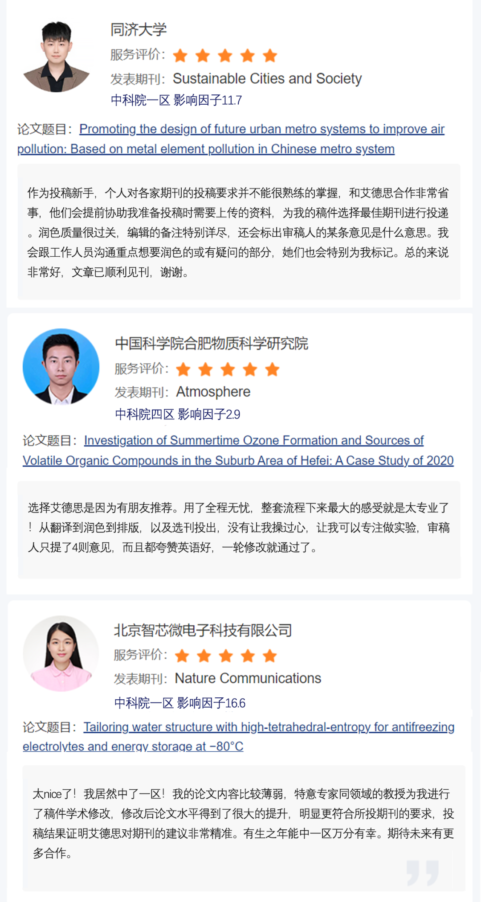

  

我**刚接触艾德思**的时候，以为他们家只是做**润色**比较好，后来发现真是**宝藏级科研机构**，能提供的帮助远远不止润色翻译。

  

包括我选择的**全程无忧投稿套餐**，还有**一对一****论文辅导**，**国家级&省级基金本子润色、修改，书籍润色**等大项，他们也完全能胜任，服务体验这块真是没得说 👇

  

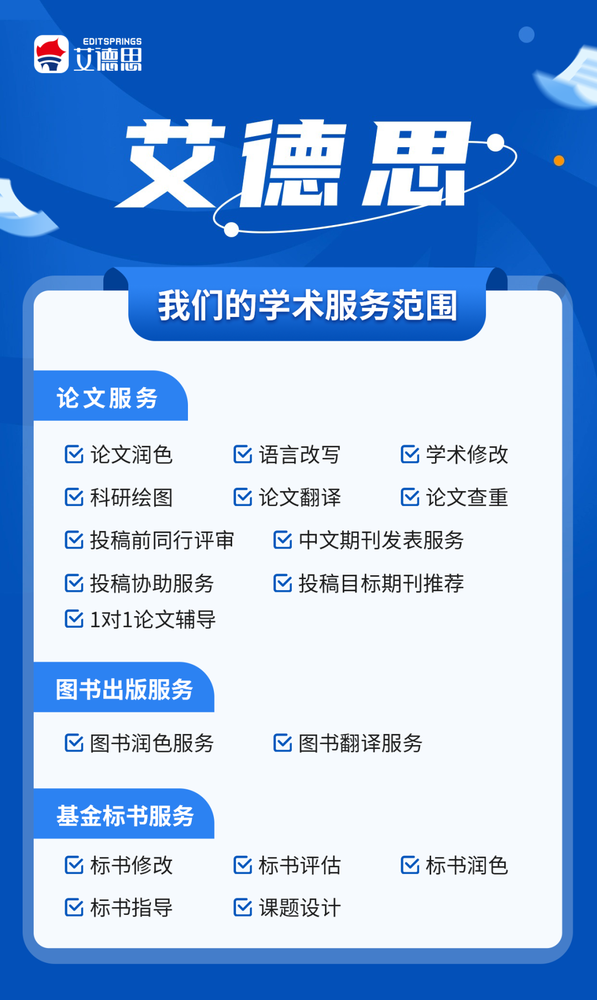

  

**艾德思**的**所有工作人员都受到严格的保密协议约束，一切上传至系统的文件都受最新的 ISO** **(ISO 27001:2013)****信息安全管理体系保护。**

行业官方颁发-三大质量认证证书

  

**立即咨询艾德思各项服务优惠政策**

**⇩**

********▲****长按扫码添加学术顾问咨询********▲****

  

**最后，祝大家，早发表，早见刊！**