# 有限体积法

> 原文地址: [https://mp.weixin.qq.com/s/KjzM8Obypy8gUEf4kStvtg](https://mp.weixin.qq.com/s/KjzM8Obypy8gUEf4kStvtg)

现在计算机数值仿真计算已经是解决实际工程问题的主流方法，通过计算机大量计算各种理论偏微分方程来预测现实的结果，如热流体工程，振动工程，结构工程，材料力学等问题。

**但是**现实中的模型十分复杂，对于许多偏微分方程，尤其是在复杂的边界条件和几何形状下，很难或者根本无法找到精确的解析解。**因此**需要将求解区域划分成许多小的、有限的标准体积（如正方块），然后在这些体积上计算和应用各种物理定律（如质量守恒、动量守恒和能量守恒）。并通过近似方法来求解这些方程。**另外**，计算机无法直接处理连续的数学实体和操作。离散化将连续的偏微分方程转换为离散形式（如线性方程组），这样计算机就可以通过数值方法求解这些方程。

为了更好的适应性和灵活性，数值计算方法（如有限差分法、有限元法、有限体积法）提供了处理不同类型物理和工程问题的灵活性。通过调整网格划分和数值方案，可以适应不同的需求和精度要求。

本篇文章，介绍有限体积方法。在流体力学基础方程式其中之一的动量守恒定律中，有限体积法是用于数值处理动量守恒定律的离散化方法之一。虽然很多热流体仿真分析软件都使用有限体积法，如OpenFOAM。但是大部分人可能没有其程序封装的经验，所以对有限体积法的底层算法没有概念。  

有限体积法是一种离散化**控制体积（以下CV）**的区域并以数值求解的方法。如果直接处理**纳维斯托克斯方程**（NS）并理解有限体积方法是有点难的。下图是处理**纳维-斯托克斯方程**（NS）的流程，感受一下，是否头皮发麻。

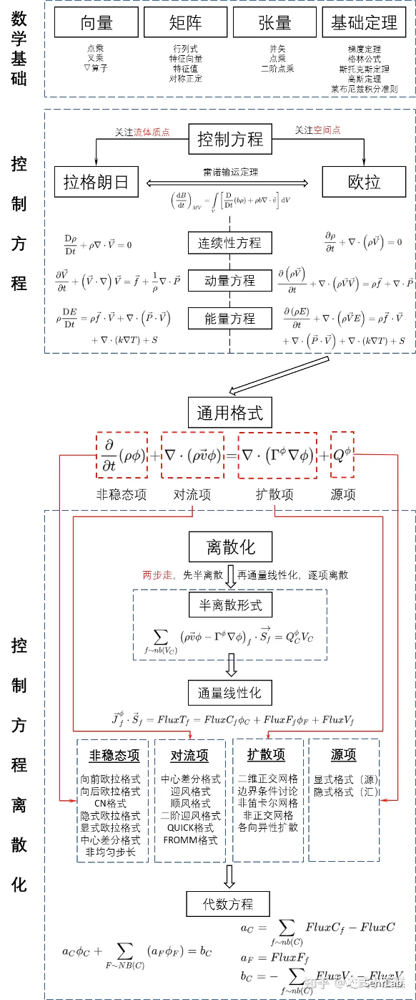

图片来源：知乎法式小蛋糕

因此，在本文中，为了更容易理解有限体积法，我将NS控制方程部分换成一维热传导方程（热扩散），并推导整个过程为例，来感受一下有限体积方法的离散化应用。这相对来说简单一点。但是数学部分还是和图中一样，需要全部掌握。

**热传导方程**是一个**从初始温度分布随时间从高温扩散到低温**的模型方程，如式（1）所示。

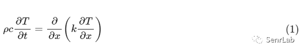

最后的目的是在想写一篇复杂专业内容简单化的科普性文章，希望本文作为有限体积方法的第一步会对大家有所帮助。

**有限体积法**常被拿来与**有限元分析**做比较，后者**使用节点值来近似导数**，或者使用有限元方法来使用**局部数值来逼近解的局部近似值**，并通过将它们加在一起来形成全域近似值。另外，有限体积法会计算某个体积中的网格解之平均，然后使用此平均值来决定单元内解的近似值。在[《**教你用Excel煮一颗温泉蛋---破解神奇的传热学密码**》](http://mp.weixin.qq.com/s?__biz=MzA3NzUzMjI5Nw==&mid=2247506490&idx=1&sn=3c657a63224fc71a1a8d5bc66f014901&chksm=9f5207dca8258ecaa51311606d91f08edd142494353af7fda4d36f0e1037fe0a5d4bf8ea80e8&scene=21#wechat_redirect)这篇文章中有应用到有限元法，但是没有详细介绍。

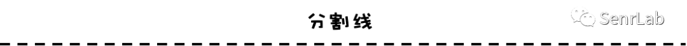

1\. 什么是有限体积法？

如下图所示，将计算区域划分为称为控制体积的区域（以下简称CV），并在每个CV处进行积分，并使用高斯散度定理将流体基本公式的平流项和扩散项改写为CV的净流出量。

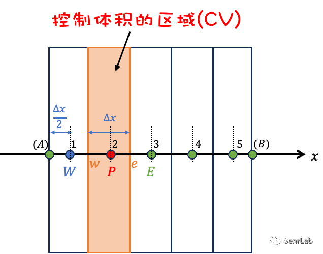

有限体积法通常用作流体流动分析的离散化方法，因为它在计算域的形状上具有**更高的自由度**，并且比**差分法更容易处理边界条件**。

**2\. 热扩散方程的有限体积法**

**K,c****作为常数、令****D=k/ρc**、

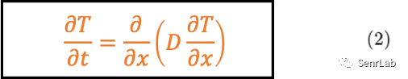

**D**可能因情况不同会有所变化。因此，将**D**放在导数中更为常见，但由于本文目的只为了解有限体积法的基础知识，因此在稍后使用特定值进行计算时，**将D视为常量值**。

在CV中进行离散化之前，**D**可以直接留在微分中。如果**D**是一个常数，可以把它放在导数之外计算，这样就不必太担心**D**是否在导数中。

**3\. 控制体积内求导**

首先，我们先研究一维控制体积（CV）来理解有限体积方法的基础逻辑。

计算面积为5个离散点1~5

先聚焦CV中的晶格点P，让相邻的晶格点为W和E，CV界面处的点为w和e。目的是求出晶格点P处物理量（温度T）的时间变化。

首先，对式（2）中 CV 部分求积分。

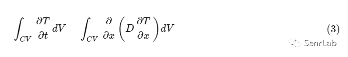

对左侧使用**高斯定理**。

高斯定理指出，微小体积的变化量等于从微小体积流出的净量。根据高斯定理用 Nabla 算子进行扩展。

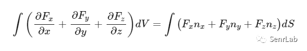

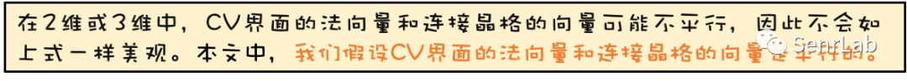

左侧是 CV 边界 w 和 e 流出的净量。

令**D(∂T/∂x)=F**，

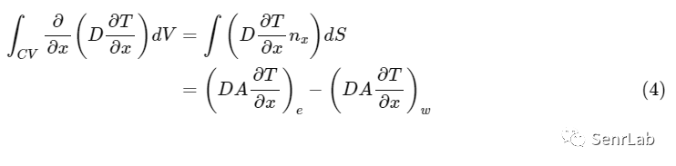

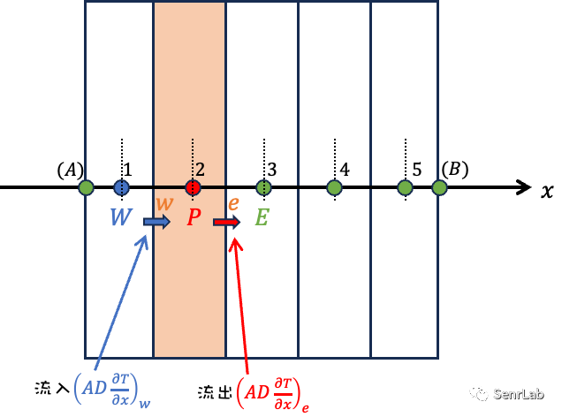

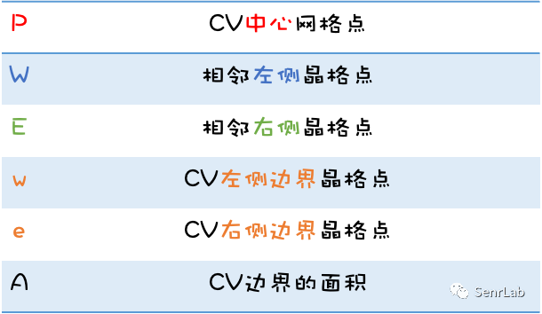

如何离散一阶导数∂T/∂x是关键。用高斯定理，CV中的公式如下

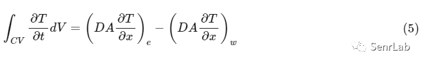

**4\. 在有限的时间内积分**

需要在时变瞬态问题中以有限时间Δt进行积分。

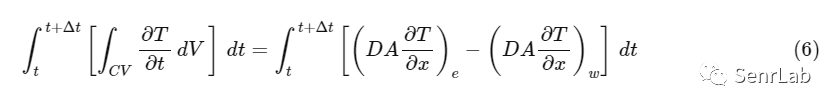

依次看左侧和右侧。

**①左边部分**

在左侧，CV处不再积分，因为高斯定理已将其替换为从CV边界流出的净量。

由于左侧只能是有限值，因此可以替换时间和空间积分

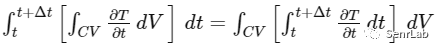

时间也需要离散化

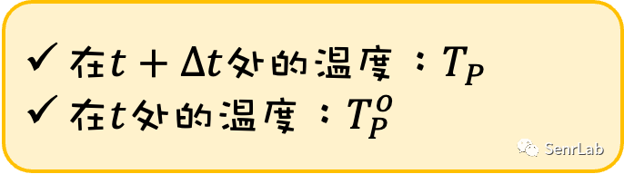

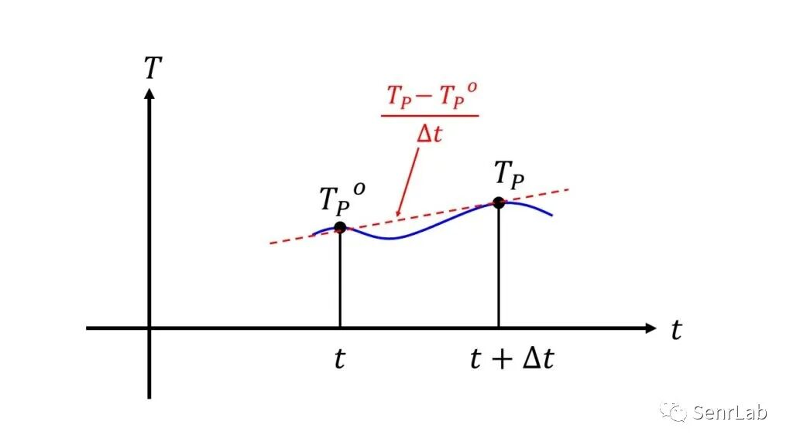

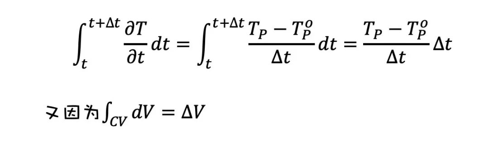

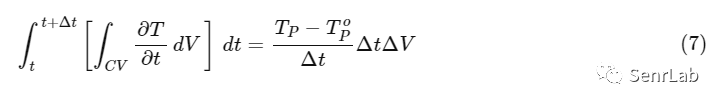

**②右边部分**

为了在数值上处理偏导数，需要使用晶格点对它们进行离散化。需要直面以下两个问题。

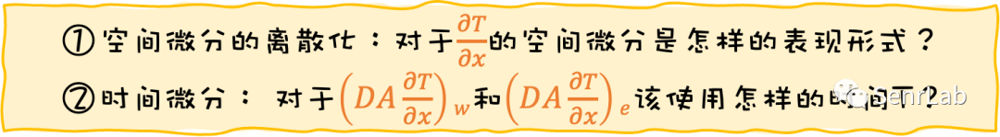

先看第一个问题，空间微分的离散化。

首先考虑∂T/∂x的空间微分

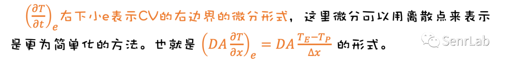

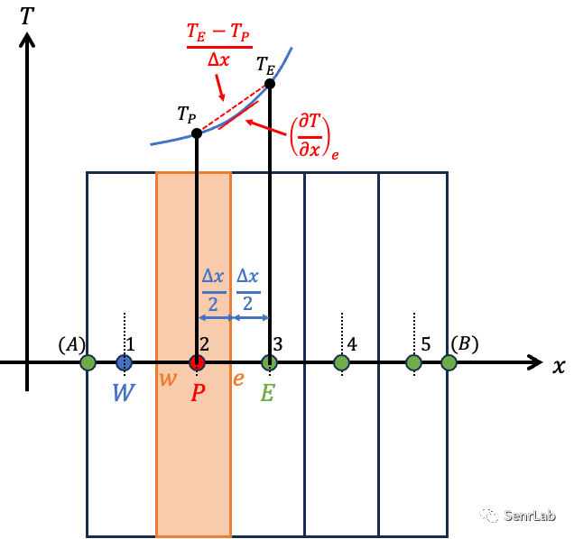

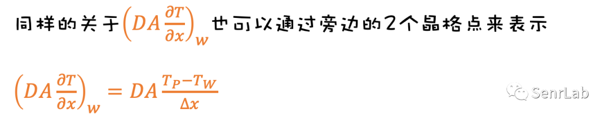

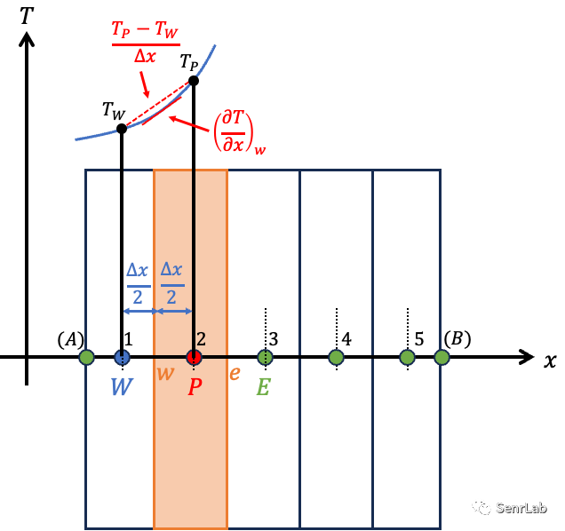

这种离散化方法称为**中心差分**，因为它使用两个相邻的晶格点来表达它们之间的微分形式。

总结一下（5）的右侧为

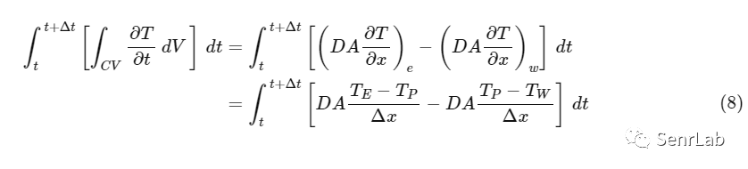

在本文中，虽然**空间微分由中心差分表示**，但有前向差分和后向差分等多种离散化方法等，都不是完美的，因为它们**包含空间微分和泰勒展开的误差**，并且解的精度和情况根据离散化的方式而变化。

由于有必要仔细考虑中心差分解决方案的准确性和情况，我将在之后文章中详细解释。

接下来，看一下关于时间积分的项

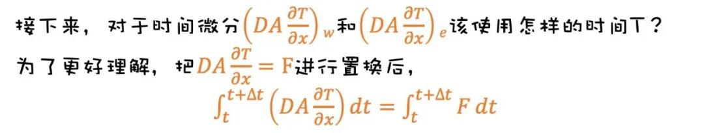

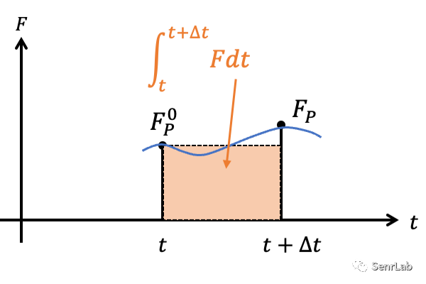

有多种方法可以解，下面列出一些作为参考。

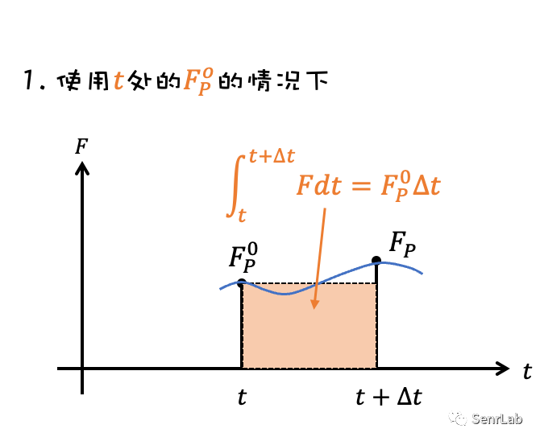

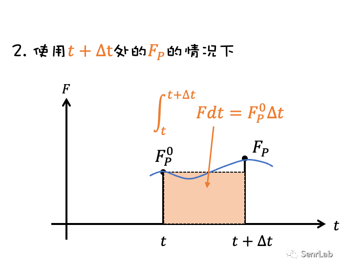

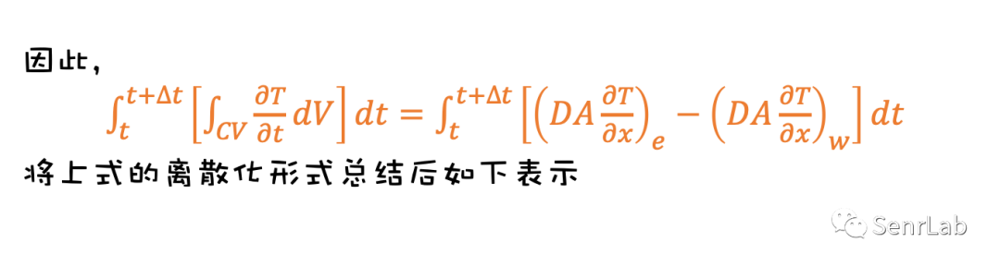

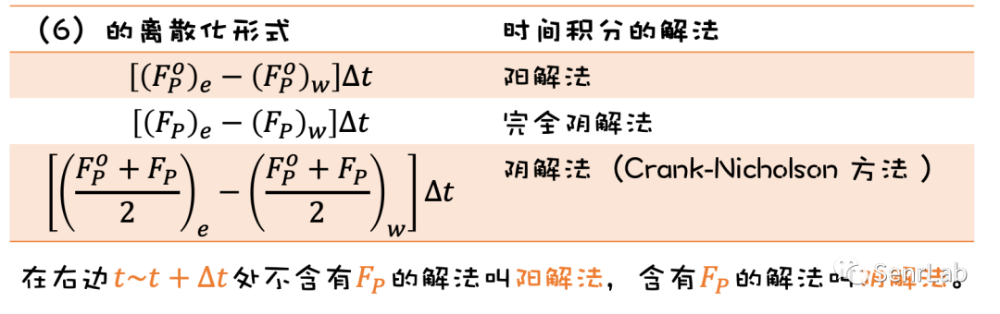

**5\. 时间积分的常见形式**

在这里，介绍一下近似时间积分的方法，例如阳解法、阴解法和 Crank-Nicholson 方法。

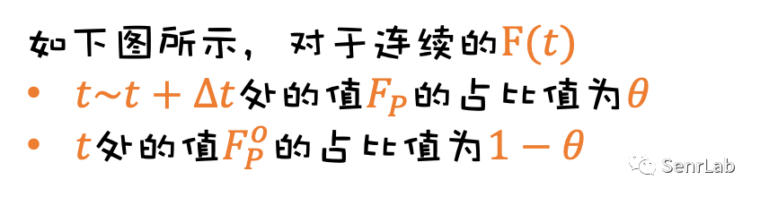

可以通过使用占比值来表达它的广义形式。

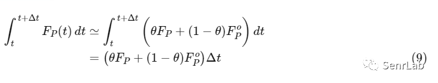

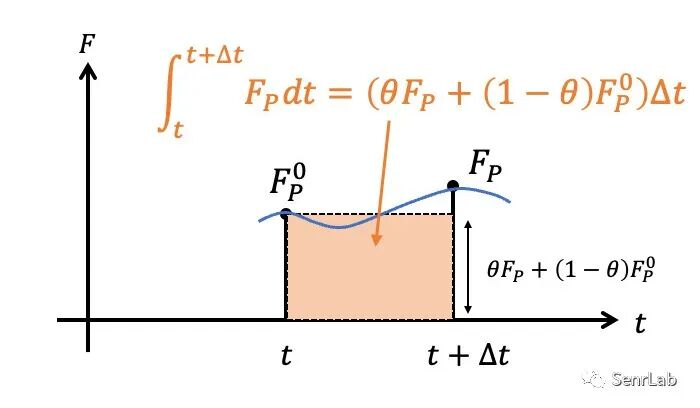

式（6）的离散化用θ总结后如下表所示

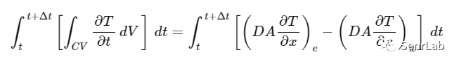

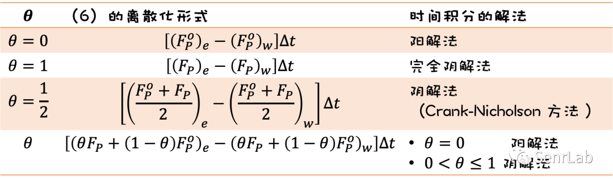

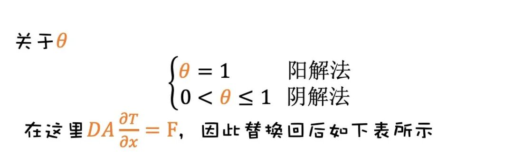

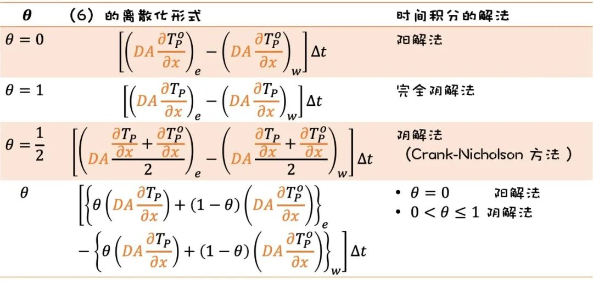

到此所得到的结果整理后如下所示

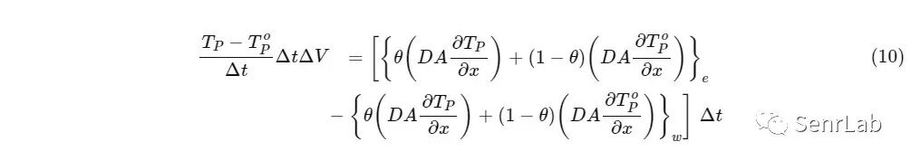

**6\. 空间导数的离散化和时间积分**

必须决定如何处理空间导数的离散化和时间项的积分的问题。

因此，在本文中，我将按以下方式来处理。

**①空间微分的离散化：_∂T/∂x_中心差分**

**②时间积分：θ=0的阳解法**

※需要注意的是，数值解的行为将根据上述选择的方式而变化。

首先令式（10）的𝜃=0时，右边的

就可以被简化。

关于空间微分，对于晶格点P来说，使用相邻的两个格子点表示来中心差分后，用下面两式的结果表示式（10）后

可得式（11）

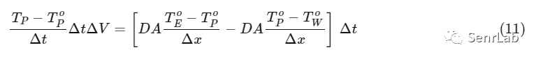

右边只使用t处的温度T0

对于非定常的微分方程式（温度T随时间变化），从t到t+Δt的T，也就是说，需要求得TP的值。只有（11）的左边有TP，可以整理关于TP的式子。

但是，式（11）是边界旁边格子以外的离散化结果，所以边界格子点需要建立式（11）的其他表现形式的公式。

**7\. 边界离散化的表达式**

**例如，考虑以下五个网格点（五个 CV）：**

**如果晶格点 P 包含左边界，式11就需要更正**

**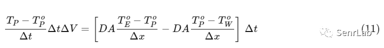**

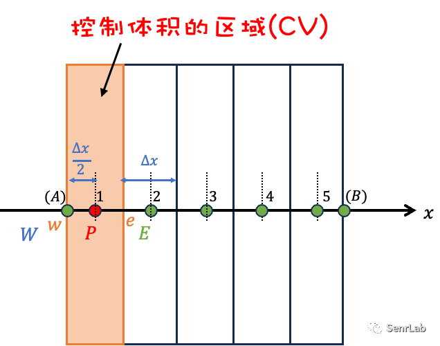

**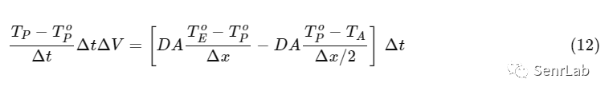**

**同样的，****如果晶格点P包含右边的界面，式 (11)也需要校正****。**

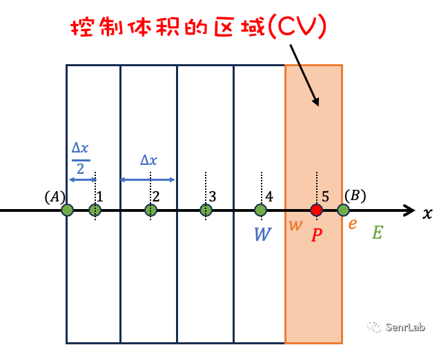

**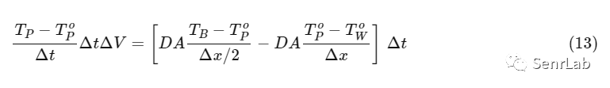**

包括边界的CV和其他等内容总结如下，

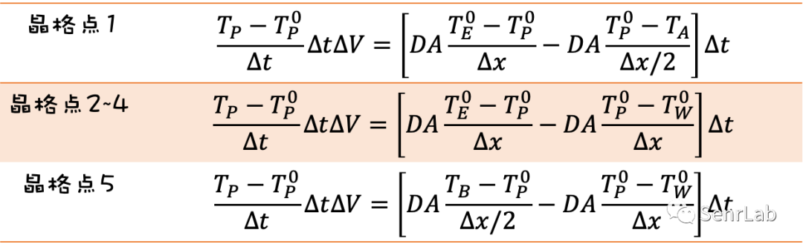

**8\. 总结为矩阵形式**

求得的是在t+Δt时Tp的值，把上面的表整理下。

这里CV的边界面积A和扩散系数D都令其为定数。

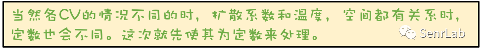

因此，因为ΔV=AΔx，关于晶格2～4可以用以下来表示。

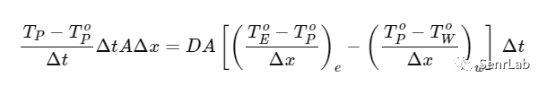

以下是求Tp的公式。  
**晶格点2~4**

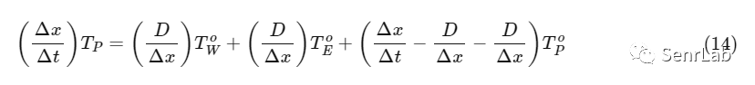

同样，求晶格点1，5的Tp由下式表示。

**晶格点1**

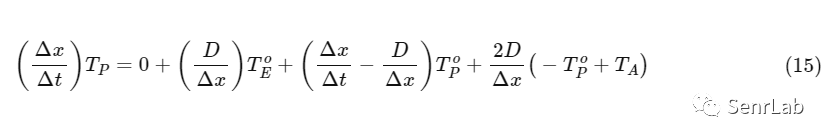

**晶格点5**

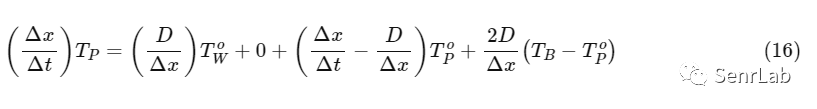

将这些内容总结为以下形式：

以上内容总结可得下表

每个系数都是一个常数，因为它由CV的形状和物理属性值决定。

根据上表，我们可以计算矩阵并找到TP的时间变化。

**9\. 总结**

在本文中，我们解释了用有限体积法求解一维热扩散方程的过程，以便理解有限体积法的基本逻辑。

**一维热扩散方程**

通过式2的有限体积求得离散化方程用包含界面CV等总结如下。

但是，应该注意的是，它是基于以下情况下得到离散化公式的

**①空间微分的离散化：_∂T/∂x_中心差分**

**②时间积分：θ=0的阳解法**

-   如果空间导数是通过与中心差分不同的方法执行的，或者如果时间积分是通过阴解法进行的，则上述离散化方程的形式也会改变，解的情况也会改变。
    
-   如何离散化和近似连续场的偏微分方程也很重要。
    
-   在下一篇文章中，我将对本文中推导的一维热扩散方程有限体积方法的离散化计算得到的特定边界条件进行详细说明。
    

**10\. 参考文献**

数値流体力学，H.K.Versteeg (著), W.Malalasekera (著), 松下 洋介 (翻訳), 齋藤 泰洋 (翻訳), 青木 秀之 (翻訳), 三浦 隆利 (翻訳), 森北出版, 第2版 (2011/5/31).

