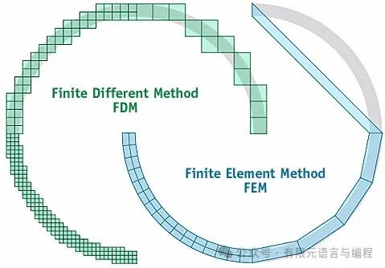
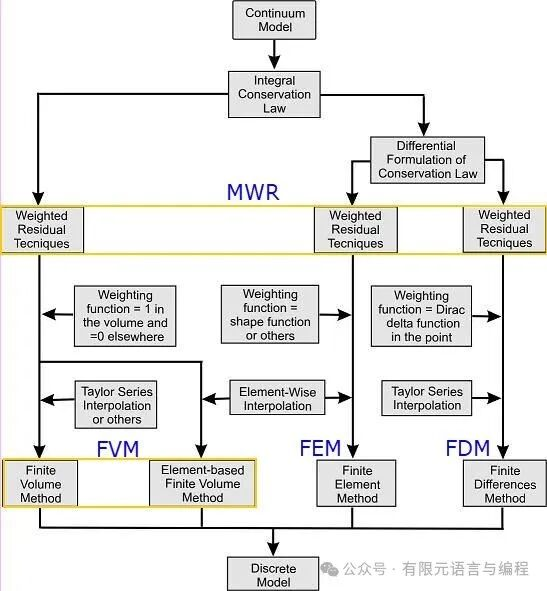
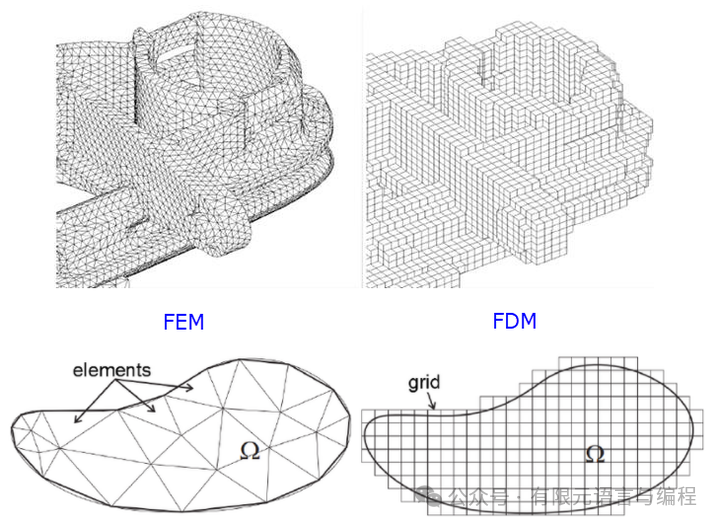

# 有限元、有限差分 or 有限体积？

> 原文地址: [https://mp.weixin.qq.com/s/Wre\_-my7jqLwPHL0k6VCQw](https://mp.weixin.qq.com/s/Wre_-my7jqLwPHL0k6VCQw)

有限元法（FEM）与有限差分（FDM）和有限体积方法（FVM）一样，它们都是区域性的离散方法。其共性都是将连续区域上定义的微分方程求解问题，变成在有限个离散子区域或离散点上定义，把求解微分方程的问题变成求解离散节点上的代数方程问题。也就是说，它们都具有离散化、代数化的数值方法本质。且可通过选择不同的差分离散格式，或在积分控制体积内选择不同的插值函数型线，以得到不同形式和离散精度的代数方程。这意味着三种离散方法在构成离散方程时都有自己的灵活性。

在加权余量法（MWR）的框架下，三种方法的联系与区别可以用下图来概括。

  

具体来讲，FEM、FDM 和 FVM 三种方法的主要区别在于:

（1）有限差分法和有限体积法是点近似，用网格节点上的值来近似表达连续函数，近似解一般不能保证解的光滑性。有限元法是分段近似（分片或分块），在单元内，近似解是连续解析的，而单元之间解是连续的。因此，有限元法得到的解是充分光滑的近似解，在单元内导数存在，单元间的边界上其解满足相容性条件。

（2）有限差分法收敛性意义为，当步长趋近于零时，解域内任意节点的差分近似解趋近微分方程在该点的准确解。而有限元方法的收敛性是积分意义下的收敛，即单元积分区域趋于零时，单元的加权积分值趋近于零。有限体积法收敛性与有限元法一致，但有限体积法的权函数始终是 1。

（3）有限差分法和有限体积法对于复杂的计算区域适应性差，处理边界条件常会遭遇一定的困难。虽然近年来发展的网格生成技术可以克服这一弱点，但是却带来编程的复杂性和计算工作量的极大增加。有限元法对于区域的剖分没有特别的限制，这对处理具有复杂边界的实际问题既方便，又灵活，还可依照实际问题的物理特点，合理安排单元网格的疏密。有限元法处理未知的自由边界和不同介质的交界面也比较容易。

  

（4）有限体积法和有限元法虽然都是用积分方法进行离散，并都要选择积分区域内的函数分布型线，但是有限体积法所选择的型线函数一旦积分完成后就不再具有任何意义。它的每个积分子区域只对应一个离散节点，该点定义的函数值代表积分控制体内函数的平均值。所积分的函数是物理问题对应的守恒型控制方程，各项物理意义明确，要求积分出来的离散方程在每个控制体内满足物理上的守恒原理。但有限元法中，型线一旦选定，就始终被认定为与求解量相关，它在建立离散方程和处理求解结果时都要应用。有限元法控制方程积分之前需乘上一个权函数，要求积分区域上控制方程余量加权积分后的平均值为零，其控制方程形式不一定是守恒型的。有限元法的一个单元通常总会设置多个节点。

（5）有限元法求解步骤几乎是统一的，因此易于编制通用程序。有限体积法次之，有限差分法则相对欠缺。但有限差分法在构造离散格式上更为灵活，易于构造新的格式。从计算工作量看，同一物理问题有限元法的工作量要大于有限差分法和有限体积法。从理论发展的成熟程度看，有限差分法已有一整套定性分析理论，其次是有限体积法，而有限元法相对要滞后一些，如计算中的数值误差分析和改进方法，离散方程的稳定性和守恒性分析方法，有限元法尚待建立有效的理论。

总之，FEM、FDM 和 FVM 三种数值方法，特点不一，各有其优点和缺点。切记，没有最好的方法，只有最合适的方法。对于不同的实际问题，应扬长避短，灵活应用，以期有最好的使用效果。

参考文献

\[1\]吴清松.计算热物理引论\[M\].中国科学技术大学出版社,2009.

FEtch 系统是笔者团队开发的新一代有限元软件开发平台。只需按照有限元语言格式填写脚本文件，即可在线自动生成有限元计算程序，从而大幅提高 CAE 软件的开发效率。欢迎私信交流。

有任何疑问或建议，欢迎加Q群 "FEtch有限元开发系统(519166061)" 留言讨论。我们长期开展 FEtch 系统的免费试用活动，感兴趣的朋友入群后可直接联系管理员，免费获取许可证文件。