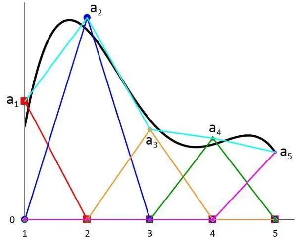
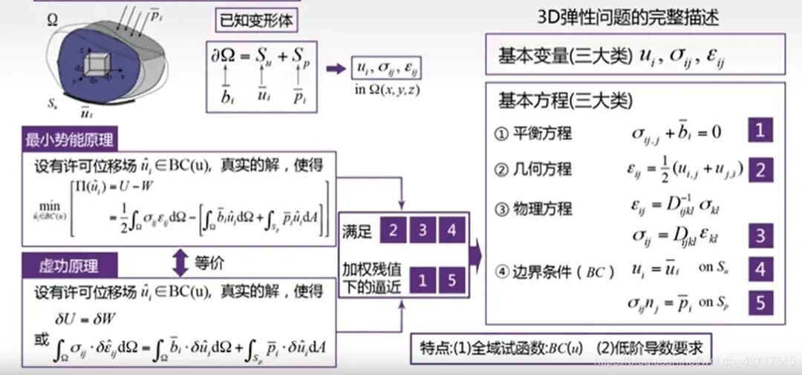
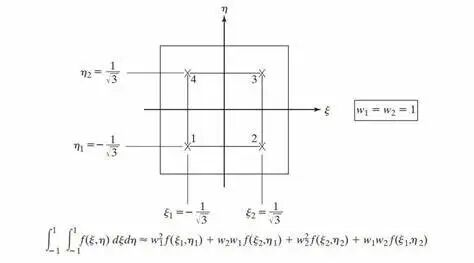

# 有限元中使用弱形式的目的是什么？

> 原文地址: [https://mp.weixin.qq.com/s/01\_V2YP2QEhP-Dhr9kwC6g](https://mp.weixin.qq.com/s/01_V2YP2QEhP-Dhr9kwC6g)

## 

# 提问

有限元中使用弱形式的目的是什么？有一种说法是：“对于像下图中那样的近似函数是分段线性函数的情况，无法求二阶导，因此要使用弱形式（分部积分），这样就只需要一阶导了”，是这样吗？

# 一己之见，欢迎拍砖

在有限元分析（Finite Element Analysis, FEA）中，采用弱形式（或称为变分形式）的主要目的有以下几个方面，这样做不仅确保了数学上的合理性，也提高了数值计算的效率和准确性。

### 放宽对解的光滑性要求

强形式（即直接从物理定律出发得到的偏微分方程）通常要求解具有较高的连续性和可微性。然而，在实际工程问题中，很多情况下边界条件或者材料属性的突变会导致解在这些位置不具备高阶连续性。弱形式通过积分和分部积分的方法，将高阶导数转化为低阶导数，从而降低了对解的光滑性要求。这意味着即使在解的某些部分不平滑或存在跳跃的情况下，仍然可以找到合理的近似解。

### 提高数值稳定性

在求解偏微分方程时，直接使用强形式可能会遇到数值不稳定的问题，尤其是在存在尖锐梯度或奇异点的情况下。弱形式有助于改善数值计算的稳定性。这是因为弱形式中的积分操作可以有效地抑制高频振荡，减少由于网格不规则或局部性质变化剧烈导致的数值噪声。此外，弱形式还允许使用不同类型的插值函数来逼近解，这对于复杂几何形状和非均匀材料特性的模型尤为重要。

### 自然地处理边界条件

在强形式下，施加边界条件尤其是Neumann边界条件（自然边界条件）比较困难。而在弱形式中，这些边界条件可以通过边界积分自然地包含在方程中。这不仅简化了问题的处理过程，而且提高了求解的灵活性和准确性。例如，在处理应力-应变问题时，Neumann边界条件直接对应于作用在边界上的力，这些条件可以在弱形式的推导过程中自然地考虑进去。这种处理方式不仅简化了编程实现，而且有助于保持数值解的整体一致性。

### 提供一个统一的框架

弱形式为不同类型的物理问题（如热传导、流体流动、结构力学等）提供了一个统一的数学描述框架。无论是线性还是非线性问题，无论是椭圆型、抛物型还是双曲型方程，都可以通过构造相应的弱形式来进行数值求解。这意味着，一旦开发出了一套有效的有限元程序，就可以相对容易地应用于多种不同的物理现象，极大地提高了软件的通用性和复用性。

### 便于应用数值积分技术

在有限元方法中，通常需要对域内的积分进行数值近似。弱形式中的积分形式非常适合使用高斯积分等数值积分技术，这些技术能够高效而准确地计算出积分值，进一步提高了有限元分析的精度和速度。

综上所述，有限元方法中使用弱形式不仅是出于数学上的便利，更是为了更准确、更稳定、更灵活地解决实际工程中的复杂问题。弱形式的引入，极大地扩展了有限元方法的应用范围，使其成为现代工程分析不可或缺的重要工具。

  

  推荐阅读

  

  

我们目前正和专业SCI论文英文润色机构**艾德思**开展全方位合作。如果您需要**论文和基金标书辅导服务**，欢迎扫码下方二维码，获取您的专属学术顾问，**锁定直减活动优惠**👇

********▲****长按扫码添加学术顾问咨询********▲****

