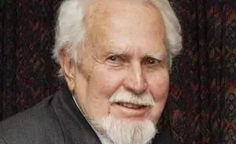
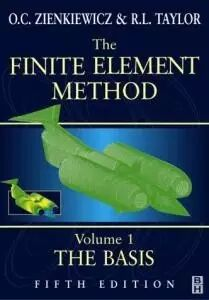
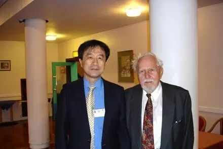

# 有限元之父：Zienkiewicz教授与有限元法

> 原文地址: [https://mp.weixin.qq.com/s/0JoHQMhkCKda63awLBrhzw](https://mp.weixin.qq.com/s/0JoHQMhkCKda63awLBrhzw)

  

  

  

Zienkiewicz教授，图片来源于swansea.ac.uk

Olgierd Cecil Zienkiewicz，工程力学和计算力学家，英国籍。

  

1943年毕业于英国帝国理工学院，获荣誉学士学位。

  

1945年获该校哲学博士学位。

  

1965年获伦敦大学科学博士学位。

  

1957年任美国西北大学教授。

  

1961年开始历任英国威尔士大学教授、工程数值方法研究所所长和荣誉教授，联合国教科文组织工程数值方法机构主席。

  

1979年，当选为英国皇家学会会员、英国皇家工程科学院院士，此后先后当选为美国国家工程院外籍院士(1981)、波兰科学院外籍院士(1985)、中国科学院院士(1998)和意大利国家科学院院士(1999)。

  

2009年1月2日逝世，享年89岁。

  

曾获英国女王授予的勋爵、英国皇家学会皇家勋章(1990)、法国科学骑士奖(1996)等多种奖励，被授予24各荣誉学位。

  

  

Zienkiewicz被公认为世界三大有限元法的先驱之一（另两位是Argyris和Clough），长期处于世界前沿，对现代数值计算中的有限元法作出了系统性和创造性的开拓和发展，在有限元法许多具方向性的重大进展上都作出了重要贡献，在国际工程界和力学界产生了深远的影响。

以始于17世纪牛顿时代的经典物理和数学体系为基础的世界科学技术体系在19世纪后半叶直至整个20世纪得到爆发式发展，极大促进了社会生产力发展。力学作为古典的基础性学科，在20世纪也得到了极大的发展和普及，有限元法的诞生和发展是力学学科发展的重要助推器。

力学需要有良好的数学功底为基础，知名的力学家往往同时是很好的数学家，在有限元法诞生以前，力学基本上是少数力学专家关在书斋里推导公式，其工程应用因为不得不将对象作过于理想化的假定而受到很大限制，也不够精准。

有限元法首先将给定边界条件(和初始条件)的偏微分方程求解问题转换为等价的变分方程的极值问题，再将连续的不规则求解区域用一系列规则区域覆盖，这些规则区域称为单元，通过单元形状函数保持各单元内部的连续性，而在单元边界上，连续性条件可适当降低，当区域划分足够精细时，离散的有限元解即趋近于偏微分方程的精确解。这就是Argyris、Clough和Zienkiewicz等先辈于二十世纪六十年代发明的有限元方法的基本原理。

值得一提的是，中国数学家冯康于上世纪六十年代也独立提出了有限元法的基本思想，可惜在中国当时特定的政治环境下，中国科学家缺少与外界交流的机会，在有限元法在全世界普及、推广的过程中，中国科学家很难做出世界范围内的贡献。冯康的有限元思想集中体现在他的专著《弹性结构的数学理论》中。国际学术界也承认冯康对有限元法的重要贡献，是有限元法的先辈之一。

Zienkiewicz是提出有限元法的数位先驱之一，但是他更重要的贡献是对有限元法的推广和普及。Zienkiewicz1967年出版了著名的“The Finite Element Method”一书，是有限元领域最早、最著名的专著。此后该书不断更新、多次修订再版和翻译，从结构、固体扩展到流体，从一卷本扩展到三卷本，凝聚了作者几十年的研究成果，荟萃了近千篇文献的精华，培养了全世界几代计算固体力学的师生和工程师，深受力学界和工程界科技人员的欢迎，成为有限元领域的经典之作，其影响力是独一无二的。如今，世界上有限元法的专著、教科书、论文等数不胜数，可以说都不过是对Zienkiewicz那本专著中某些部分的重复、深化或补充。

有限元法诞生以后，很快成为工程设计的强有力工具，在建筑结构、航空、航天、船舶、核能、石油勘探等领域内解决了大量重大课题，力学也由此走出了殿堂，走向了工程，成为工程设计的有力工具。借助于有限元法，人们对复杂问题可以精细把握，由此可以消除以往过度的保守性，例如，有限元法出现以后，ASME规范的安全系数从以往的4逐步减少为现在的1.5，由此大大节省了工程材料和造价。

借助于有限元法，可以用分析方法实现复杂的过程的实时仿真，如汽车撞击、金属材料成型过程等，由此节省大量的试验经费。如今，工程师们借助于界面友好、接口灵活、使用方便的CAE分析软件平台，开展分析法设计，轻松自如地实现设计-分析一体化，而CAE分析软件的核心部分就是有限元分析模块。

有限元法对工程技术的发展起到显著的促进作用，有限元法的大量应用也大大拓展了力学学科的发展以及力学与其他学科的交融，“科学技术是生产力”这一论断在有限元法的发展进程中得到了充分的诠释。有限元法是伴随着计算机科学的发展而发展的，计算机软硬件技术的飞速发展，使得用有限元法解决超大规模的复杂问题变得可能，在有限元算法上也出现了与大型计算机相适应的各种方法，如并行算法、区域分裂法、格子法等等。

有限元法本身还在不断发展中，主要有两个方向，一是非线性分析技术，用于解决大量物理非线性和几何非线性问题；二是自适应有限元分析技术，即在给定的精度控制要求下，自动调整有限元网格的疏密度，使计算资源得到合理配置，这一技术特别适用与模拟金属材料成型等大变形问题。Zienkiewicz教授晚年还一直致力于上述有限元领域的研究。他的去世是学科的重大损失。

  

Zienkiewicz教授与李锡夔教授合影，本图片来源于大工新闻网

本文的相关内容最早见于新浪VincentNuke的博客，小编对文章的结构和内容进行了一定的调整。