# 有限元区域分解：Schwarz迭代法-二维泊松方程


> 原文地址: [https://mp.weixin.qq.com/s/4Nfaj5rTAcYWBCTop9Eq-Q](https://mp.weixin.qq.com/s/4Nfaj5rTAcYWBCTop9Eq-Q)

简述

对于区域分解技术有很多实现方法，在上篇文章中介绍的方式[有限元区域分解技术入门级实现-泊松方程](http://mp.weixin.qq.com/s?__biz=MzkwNzUxOTM2NA==&mid=2247486390&idx=1&sn=46e9f0ba17e25bb205b4795ec259d466&scene=21#wechat_redirect)是通过对耦合边界强加连续性边界条件的方式实现区域之间的耦合。

本文中提及区域分解方法是更为常见的Schwarz迭代方法，它是通过交替求解子区域问题并更新边界信息实现全局求解。下面主要介绍Schwarz的关键点。

1.边值问题

求解最简单的二维泊松方程：

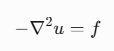

右端项为：

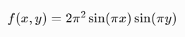

解析解：

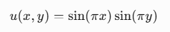

泊松方程对应的有限元弱形式：

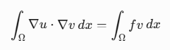

采用三角形网格剖分，将整个研究域剖分为具有重叠区域的两个区域，如下图：

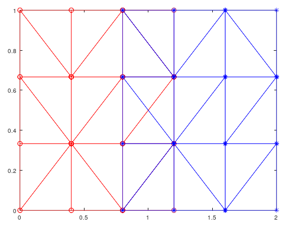

红色区域1和蓝色区域2在中间部分重叠。

分别独立组装区域1，区域2的系数矩阵和右端项，此时流程与传统有限元组装一模一样。需要注意，加载边界条件的时候，使用实际的全局边界条件。具体有限元组装方式这里不再讨论，可参考：[有限元文章集合-2024年](http://mp.weixin.qq.com/s?__biz=MzkwNzUxOTM2NA==&mid=2247486208&idx=1&sn=887b2ddb55a4a8c2fc8d2f149ed41899&scene=21#wechat_redirect)

2.Schwarz交替迭代

交替迭代的原理：

在区域1上求解：此时u2在区域1边界上的解作为已知信息，迭代得到新的u1；

在区域2上求解：此时u1在区域2边界上的解作为已知信息，迭代得到新的u2;

二者交替迭代，直到最终前一次解u1、u2和当前解u1、u2完全收敛为止。

详细的公式推导，区域1上的求解公式：

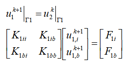

迭代中，已知u1,b的值，因此，上述式子进一步推导：

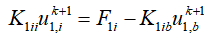

子域中本质上是求解上述方程，右端项是随着迭代过程，不断的被区域2的解进行修正。

区域2上求解过程与区域1完全一致：

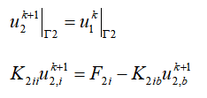

最终判断各自区域的解收敛条件，满足以下条件：

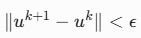

3 求解结果

针对以下网格，重叠区域有4列网格。虽然网格棱边并不完全重合，但是节点有限元不关心棱边，仅关系节点，因此无影响。

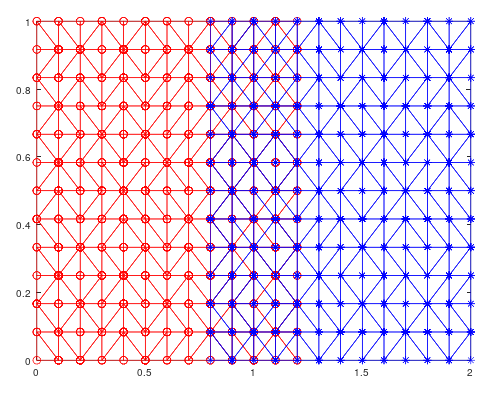

```
迭代结果：
```

结果显示：

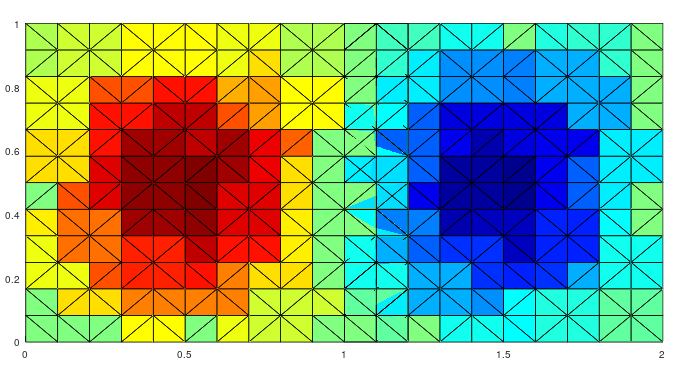

使用区域1（红色圆圈），区域2（红色三角形），全域有限元（蓝色加号）分别求解得到u然后和理论解析解对比，在x方向显示，如下：

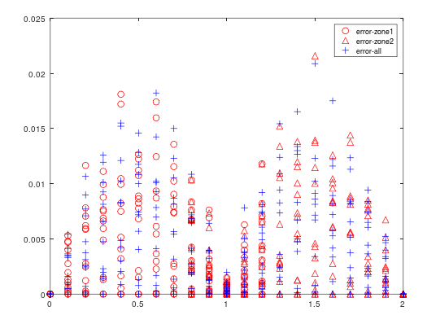

可以发现，红色和蓝色的误差分布基本上在一个量级，说明区域分解能和全域求解达到一个量级。此外细心还可以发现，红色圆圈和红色三角形在中间区域的各自边界上的解的误差是一致的，说明其本身的解也是一致的，这也是迭代的结果，前一次的区域2的解是作为第一类边界条件加入到区域1中的。

下面测试不同重叠区域对收敛次数的影响：

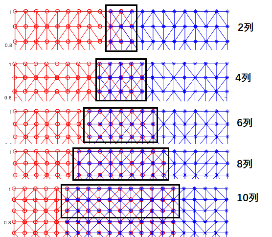

其对应的收敛到1e-8以下的迭代次数如下表格：

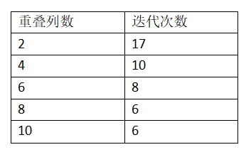

可以发现，基本上符合原理，重叠越大，迭代次数越少，但是必须得有重合，否则耦合区域没有点可供更新。

最后

重叠形**Schwarz 迭代，其本质是通过**重叠区域交换信息，重叠区域越大，收敛越快，但是对应的计算成长更高。

迭代过程中可以发现，每次迭代过程均需要子域求解一次方程，但是K系数矩阵是没有变化的，因此只需要求解一次LU分解即可，后续更新回代不同的右端项即可。

相比于上一篇文章提及的方法，本文方法或许效率还更高一些，因为上一篇文章提及的方法需要矩阵求逆，并且子域求解完，组装的所有边界相关的矩阵也需要解方程。