# 有限元区域分解技术入门级实现-泊松方程

> 原文地址: [https://mp.weixin.qq.com/s/l463ylYlr7Tj\_g2qeQGHow](https://mp.weixin.qq.com/s/l463ylYlr7Tj_g2qeQGHow)

简述

在所有有限元数值模拟领域，都会面临精度、效率、计算资源不足这三大问题。尤其对于动辄上千万网格的复杂模型，在这些问题上都具有极大的挑战。因此，有限元区域分解技术孕育而生。

本文从最简单的二维泊松方程为例，介绍有限元区域分解技术的基本实现流程。

该方法将计算区域分解成多个子区域，分别对每个区域进行独立求解，然后再对耦合区域求解，从而解决大规模问题。

1.边值问题

边值问题依然沿用最简单的二维泊松方程：

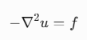

其有限元离散方程为：

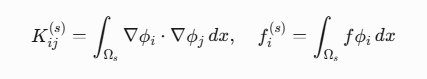

具体有限元推导这里不再介绍，参考：[有限元文章集合-2024年](http://mp.weixin.qq.com/s?__biz=MzkwNzUxOTM2NA==&mid=2247486208&idx=1&sn=887b2ddb55a4a8c2fc8d2f149ed41899&scene=21#wechat_redirect)

2.区域分解技术

假设对研究区域\[0,1\]X\[0,1\]进行网格剖分，以x=0.5为分界面，剖分成两套网格：

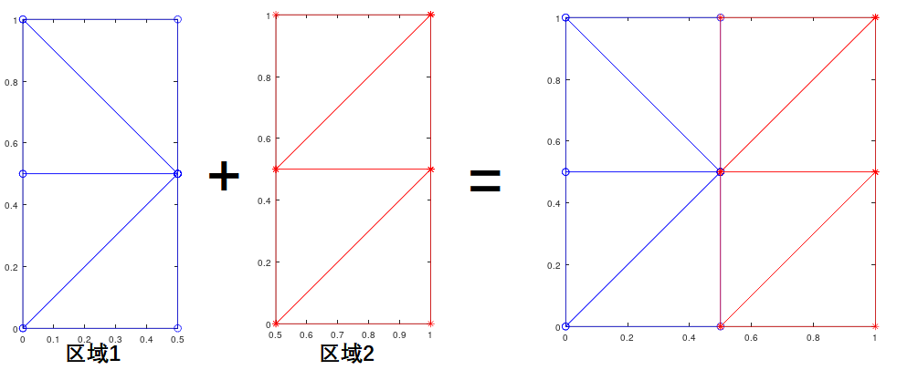

区域分解的技术的步骤：

1.独立求解区域1、2，将区域1、2中与分界面点（耦合点）无关的点（内部点）的信息独立聚合到耦合点上；

2.寻找区域之间耦合点的物理关系，在系数矩阵中强加耦合点的约束关系（拉格朗日乘子），从而得到关于耦合点的新的系数方程组，并求解该方程组，从而得到耦合点的解。

3.根据耦合点解回代得到每个区域内部点的解。

下面更加详细的介绍这个流程：

首先区域1，区域2具有独立编号，因此可以独立的对两个区域进行有限元矩阵组装：

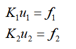

然后分别确定两个区域的内部点与耦合点的ID,因此两个区域的有限元方程组均可以表示为：

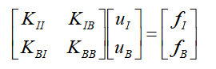

然后采用缩聚的原理，将内部点uI的信息缩聚到耦合点uB上，具体做法：

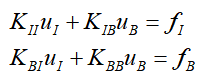

用方程1表示uI，并带入方程2中，得到：

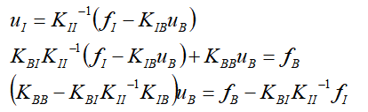

最终，转化成求解uB的方程：

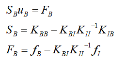

缩聚相关知识可以参考：[缩聚技术在网格结构层面上的技巧](http://mp.weixin.qq.com/s?__biz=MzkwNzUxOTM2NA==&mid=2247486203&idx=1&sn=8fd38756e30392fe57ffffdfc212ff4f&scene=21#wechat_redirect)

此时，独立处理区域1、2的任务完成，分别得到独立的两套系数方程组。写在一起可以表示为：

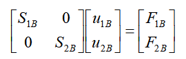

接下来，需要耦合矩阵将两套独立的系数矩阵耦合在一起即可。

对于区域1和区域2的耦合点，在泊松方程的物理规律中，区域1求解的耦合点解应该和区域2求解的耦合点解一致，即耦合点的关系具有：

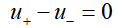

写成矩阵形式：

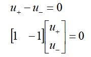

这也就是耦合点的关系，耦合矩阵。只需要依次获得每个耦合点的耦合矩阵，然后按照区域1、区域2的耦合点的位置关系将耦合矩阵组装进原系数矩阵中：

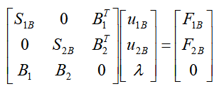

B1,B2分别是区域1、2的耦合系数矩阵，可以发现，该方程在保留了原有信息的前提下，加入了耦合项：

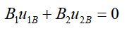

此时，求解该方程，即可得到的解u1B、u2B就是一致的。这里给出该网格下具体的系数矩阵，以供参考：

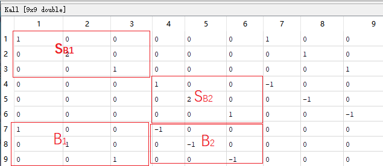

一般的对于大规模网格而言，上述系数矩阵规模是耦合未知数的三倍，依然会很大，因此可以进一步推导，降低矩阵维度，如下：

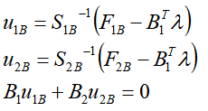

将第一、二个等式带入第三个，可以得到：

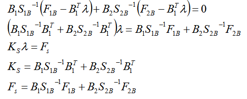

最后需要求解的问题仅仅是求解lamda，之前的矩阵求解过程均可以在各自区域中独立完成。

获得lamda解结果后，依次回代即可求解得到所有未知数。

3.结果展示

对于上述极其简单网格，其求解只有在中间一个节点非零，区域分解的结果与直接求解整个区域的结果对比如下：

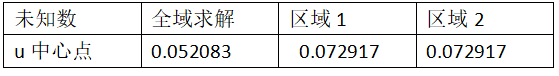

可以发现，全域求解和区域分解求解的误差挺大的，并不是完全一致。原因是由于区域分解时耦合点是通过强加耦合方程（拉格朗日算子）实现的，而全域求解是严格按照有限元理论，二者本质上存在差别。将网格量加密，误差会减小，得到的结果直观上也是正确的。

全域求解结果：

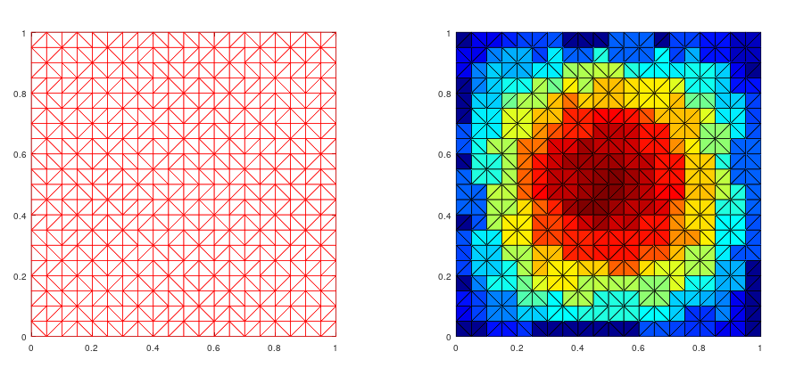

区域分解求解结果：

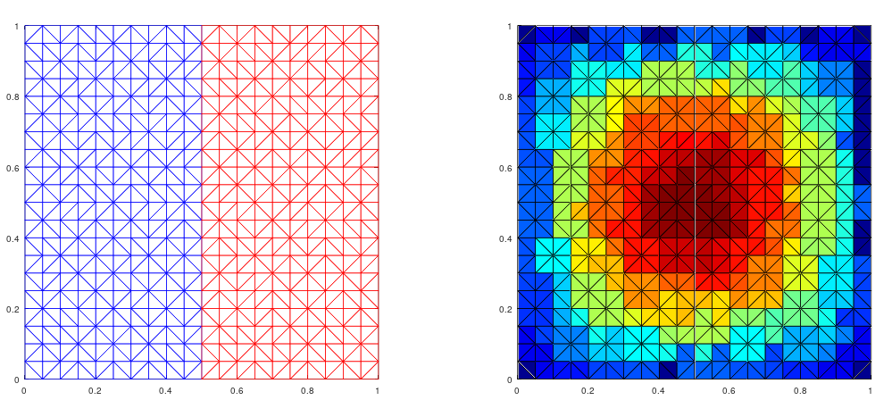

进一步观察上述区域分解的网格，可以发现区域1、2的耦合点是共点的，两个网格能够完全拼起来。

对于一些特殊案例，区域之间可能无法完全拼接，耦合位置可能会存在悬浮点的情况，这时候也可以通过耦合边界所在三角形的插值关系，获得每个悬浮点的耦合系数矩阵。例如网格如下：

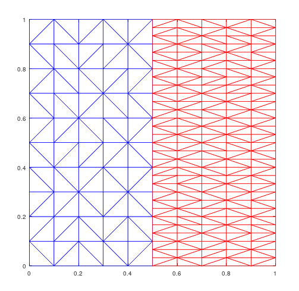

耦合位置存在很多悬浮点，此时对耦合位置的悬挂点插值处理，具体可以参考文章：[有限元中悬挂点的处理方式:泊松方程实例](http://mp.weixin.qq.com/s?__biz=MzkwNzUxOTM2NA==&mid=2247485946&idx=1&sn=33d426381e43927216c1951c696593e0&scene=21#wechat_redirect)，最终可以得到区域分解结果：

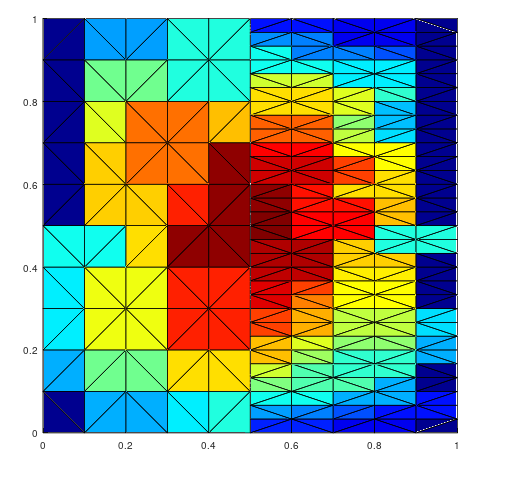

直观上possion方程的结果是正确的。

4.最后

本文用最简单的案例介绍了有限元区域分解技术的实现原理。

根据有限元区域分解技术的优势不难发现，可以将大规模模型分解成若干个子模型来处理，天然就很适合并行处理，最后的通信也仅在耦合面上，能很好的利用计算机资源，保证精度的情况下高效率完成求解，在大规模网格中是非常实用的。

区域分解技术方式还有很多，这里仅介绍其中一种，但是在具体大规模问题实现中，尤其是涉及求逆运算，还有许多关键技术需要共同使用，如此才能实现达到最优的计算效率。

* * *

博主长期深入实践电磁学领域的有限元技术，感兴趣的朋友可以添加博主公众号，欢迎共同探讨与有限元相关的技术知识。