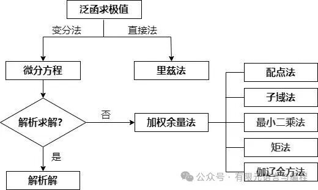
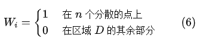

# 有限元思想追溯 —— 加权余量法

> 原文地址: [https://mp.weixin.qq.com/s/JrhRMyQjm9ZAM6ae1zpgXg](https://mp.weixin.qq.com/s/JrhRMyQjm9ZAM6ae1zpgXg)

## 加权余量法的基本概念

用变分方法求近似解时，首先要找到相应的泛函。对于某些问题，相应的泛函尚未找到，或者根本不存在相应的泛函，在这种情况下就无法应用变分学中的直接方法求解了，但可以应用加权余量法求解。这里简单介绍一下加权余量法的基本概念。不同数值方法之间的关系如下图所示。

里兹法可以参考之前的文章，这里简单介绍一下加权余量法的基本概念。

加权余量法是求微分方程近似解的一种有效方法。设在区域 中 必须满足微分方程

在边界 上必须满足边界条件

和 是微分算子。

精确解 必须在区域 中任一点都满足上述微分方程，并在边界 上任一点都满足上述边界条件。对于复杂的工程问题来说，这样的精确解往往是很难找到的，因此，人们只能设法去寻找具有一定精度的近似解。

用下式表示上述问题的近似解

式中， 为待定系数。

满足边界条件，但不满足微分方程。 应是**线性独立**的，并应取自**完备函数集合**。所谓完备函数集合指的是，任一函数都可用此集合表示。

由于 不满足微分方程，把上述近似解代入微分方程 (1)， 将得到余量

对于精确解来说，在区域 的任一点，余量 都等于零。对于近似解来说，可以选择系数 ，使得在某种平均意义上余量 等于零。这里令余量的加权积分值等于零，即

式中， 为权函数。取 个权函数，由上式得到 个方程，正好可用来求解式 (3) 中的 个待定系数 。采用不同的权函数，就得到不同的计算方法。下面分别加以说明。

## 配点法

取权函数为

实际上，这就是要求近似解在 个分散的点上满足微分方程。换句话说，在这 个点上余量应等于零

由上述 个方程，可求解 个待定系数 ，从而得到近似解如式 (3)。

【**例 1**】求解下列二阶常微分方程

边界条件

当时当时

取近似解为

显然，上式满足边界条件 (9)， 但不满足微分方程 (8)。

如在式 (10) 中只取一项，得到第一近似解

代入式 (8)，余量为

取

作为配点

  

由此得到 ，所以第一近似解为

如在式 (10) 中取两项，得到第二近似解

余量为

把区间 三等分，取 和 作为配点，得到

由此解得 ，。所以，第二近似解为

这个问题的精确解为

用配点法求得的近似解与精确解的比较见下表。可见对于本问题来说，第二近似解与精确解已相当接近，最大误差只有 3%。如果取更多的项，计算精度还可以进一步提高。

表 1 配点法计算结果

x

第一近似解

第二近似解

精确解

0.25

0.0536

0.0446

0.0440

0.50

0.0713

0.0704

0.0697

0.75

0.0536

0.0619

0.0601

## 子域法

将物体的内域 分成 个子域  ，权函数选为

在域内在域外

列出消除余量的方程为

这样便可获得 个代数方程，解出 个系数  。

【**例 2**】用最子域法求解例 1 所述问题。

一项近似解: 子域取全域，即 当 。由 (12) 式可得

求得一项近似解为

两项近似解：取 当 ， 当 。

由 (12) 式得到

解得  。

所以，两项近似解为

近似解与精确解的比较见下表。

表 2  子域法计算结果

x

第一近似解

第二近似解

精确解

0.25

0.0511

0.0432

0.0440

0.50

0.0682

0.0682

0.0697

0.75

0.0511

0.0591

0.0601

## 最小二乘法

将余量 的二次方 在区域 中积分，得到

选择系数 ，使积分 的值为极小，因此要求

由式  (13)  对 求导数，得到

由此得到 个方程，正好可用以求 个待定系数 。比较式 (5) 和式 (14 ) 两式，可见目前的权函数为

【**例 3**】用最小二乘法求解例 1 所述问题。第一近似解取为

由式  (14)

积分后，得到

由此求得 ，故

第二近似解取为

由式 (14)

经过积分，得到

解之，得到 ，，第二近似解为

近似解与精确解的比较见下表 。

表 3  最小二乘法计算结果

x

第一近似解

第二近似解

精确解

0.25

0.0506

0.0434

0.0440

0.50

0.0681

0.0683

0.0697

0.75

0.0506

0.0592

0.0601

## 矩法

对于一维问题，取权函数如下

把这些权函数代入式  (5) , 得到

由上述方程组可解出待定系数 。以上各式左端分别代表余量 的零次矩、一次矩、二次矩 ...... 所以，这个方法称为矩法。

【**例 4**】用矩法求解例 1 所述问题。

取第一近似解为 ，取权函数 ，由式  (16)，得到

即

从而求得 ，故

取第二近似解为 ，余量为

取权函数 ，，由式  (16)  得到

积分后，得

解之，，，故

近似解与精确解的比较见下表。

表 4  矩法计算结果

x

第一近似解

第二近似解

精确解

0.25

0.0512

0.0432

0.0440

0.50

0.0682

0.0682

0.0697

0.75

0.0512

0.0591

0.0601

## 伽辽金方法

取权函数为

代入式  (5) , 得到

其中 为余量。由此得到 个方程，正好用以求解 个待定系数 。

伽辽金法的计算精度较高。当存在相应的泛函时，伽辽金法与变分法往往导致同样的结果。因此，伽辽金法应用较广。

【**例 5**】用伽辽金方法求解例 1 所述问题。近似解取为

如只取一项，得第一近似解 ，取权函数 ，由式  (18)

即

由此得到 ，因此

第二近似解取为 ，取权函数 ，，代入式  (18) ，得到

即

解之, 得 ，，因此

近似解与精确解的比较见下表。

表 5 伽辽金法计算结果

x

第一近似解

第二近似解

精确解

0.25

0.0521

0.0440

0.0440

0.50

0.0695

0.0698

0.0697

0.75

0.0521

0.0600

0.0601

## 评述

在前面，我们要求试函数式 (3) 事先满足边界条件。这项要求是可以放宽的。在变分法中，边界条件分为自然条件和强制条件两种。试函数只要满足强制边界条件，不必满足自然边界条件，在泛函极小化过程中可以迫使自然边界条件得到满足。这种处理方法也可以应用于加权余量法中，在不满足边界条件的那一部分边界上引入边界余量，在计算过程中，要求边界余量以某种积分方式等于零。

和里兹法一样，加权余量法的实质是把在**无限维可取函数空间**中求解的变分问题或数学物理方程的边值问题转化为在以 为基底的 **维函数空间**中来求解 ，从而把复杂的变分问题或微分方程边值问题化为求解 元代数方程组的问题，这样就把被求解的问题大大简化了。

里兹法和加权余量法是同一物理现象的不同表现。其表现形式有所不同，但实质是一样的。在固体力学中的很多问题是有泛函的，故可应用里兹法。但还有物理现象没有泛函，不能用里兹法，这时只能用加权余量法。所以，加权余量法的应用范围更为广泛，可用于求解结构、流体、热传导等问题，从这种意义上说，加权余量法是更广义的近似计算方法。

## 参考文献

\[1\]王勖成,邵敏.有限单元法基本原理和数值方法-第2版\[M\].清华大学出版社,1997.

\[2\]朱伯芳.有限单元法原理与应用-第3版\[M\].中国水利水电出版社,2009.

FEtch 系统是笔者团队开发的新一代有限元软件开发平台。只需按照有限元语言格式填写脚本文件，即可在线自动生成有限元计算程序，从而大幅提高 CAE 软件的开发效率。欢迎私信交流。

有任何疑问或建议，欢迎加Q群 "FEtch有限元开发系统(519166061)" 留言讨论。我们长期开展 FEtch 系统的免费试用活动，感兴趣的朋友入群后可直接联系管理员，免费获取许可证文件。