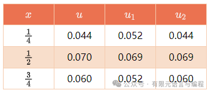

# 有限元思想追溯 —— 里兹法

> 原文地址: [https://mp.weixin.qq.com/s/WKjZv3UVy5Z4kirzbPqMjw](https://mp.weixin.qq.com/s/WKjZv3UVy5Z4kirzbPqMjw)

## 直接方法的基本概念

数学物理中的变分原理建立了各种类型的微分方程边值问题与泛函极小的等价关系。各种变分问题的古典解法是通过解欧拉方程来解变分问题的。然而，因为求解微分方程的边值问题也并非易事，所以古典解法并不能达到希望的结果。这就向我们提出了必须寻求解变分问题的新方法，即所谓直接方法。

**变分学的直接方法是指不通过解欧拉方程而直接近似地求解变分问题的方法。**这些方法最先大量用来解弹性力学问题，随着电子计算机的广泛使用，计算机方法的发展，现今变分学的直接方法已有多种，它们的应用也越来越广。变分法直接方法的发展，不仅仅直接对变分问题有益，而且对数学的其他分支特别是对微分方程，也有着重大的意义。在这里，我们将讲述一种最重要、最常用的直接方法——里兹（Ritz）法（也称瑞利-里兹（Rayleigh-Ritz）法）。

为了明确起见，我们研究关于寻求解某个泛函 极小的问题。 设这个泛函的可取函数集合为 。为了使问题有意义，我们假设泛函的极小值 存在，即

这里的 是这个问题的精确解。如果我们能选出一个函数 ， 并且它的泛函值 非常接近于 ，那么我们期望 是问题真解 的一个近似。如果我们能找到函数序列 ，，使得

则有理由期望，这样的序列在某种意义上收敛于真解。我们称这样的函数序列 为**极小化序列**。

一般地说，要证明泛函的极小化序列 在某种意义上收敛于 是个很难的问题。但当 是一个正定算子的等价泛函时，在一定的条件下，可以证明泛函的每一个极小化序列都收敛于真解 。事实上，数学物理中的很多重要边值问题所对应的算子是正定算子，它们都有相应的等价泛函。

## 里兹法

在讲述里兹法之前，我们首先分析一个简单的例题。设泛函为

其可取函数集合

试求函数 ，使

关于这个变分问题，我们只需要将函数

代人泛函（3），立即把变分问题化为普通函数的极值问题。事实上，由

得

再由

得到 。最后求得

如果泛函的可取函数集合为

那么将 代人泛函（3），同样可以把变分问题化为二元函数的极值问题。

由此可见，如果泛函 的可取函数集合是依赖于 个任意参数的函数族

将其代人泛函 ，经过必要的代数运算及微积分运算，我们就能把变分问题变为以 ，，， 为变量的 元函数的极值问题。

变分学直接方法的关键一步是**建立极小化序列**，而里兹法是流行的直接方法中的一种，它提供了构造极小化序列的有效方法。我们现在叙述它的思想方法。

设泛函

在其可取函数集合 上有极小值。为了得到极小化序列 ，我们选取坐标函数序列

它是独立的，完备的（或为正交完备系）。用这些坐标函数的前 个函数的线性组合

来实际地构造极小化序列。其中 是待定常数，也称为**里兹系数**。 将（5）代人泛函（4），进行必要的微分和积分运算后，积掉自变量，可得 元函数

里兹系数 的确定方法是：要求它们使 元函数 的值取得极小。这样，我们就将泛函的极小问题，化为普通多元函数的极小问题了。使 达到极小的必要条件是

方程组（7）是由含 个末知数 的 个代数方程组成的，叫做**里兹方程组**。若求得里兹方程组 （7）的解

代人（5）式，就可得

显然，这样求得的 是个极小化序列，而 就是问题精确解的一个近似。

我们可以用坐标函数系 来构成一系列提供精确解的近似函数

其中 为待定系数，用和求（3）中 系数一样的办法来确定这些系数。我们称 为精确解的一级近似， 为二级近似，， 为 级近似，等等。一般地说，里兹法收敛的速度很快，用一级或二级近似常能达到我们要求的适当精度。

## 例题

用里兹法求泛函

的近似解，其可取函数集合为

**解**

取坐标函数系

它是独立的、完备的，且满足边界条件 。显然有 。令其 级近似解的形式为

即

其中 为待定系数。将 （12）代人泛函（10），经过代数运算、微分运算与积分运算后，得到依赖 个参数 的函数

上式达到极小的必要条件是

由此获得里兹方程组。

下面，我们来具体计算这个问题的一级近似解和二级近似解，并把它和精确解进行比较。

(1) 当 时，令其一级近似解为

其中 为待定常数。将 的表示式代人泛函（10），并计算出积分，有

里兹方程为

从而得 ，最后求得一级近似解为

(2) 当 时，令其二级近似解为

其中 待定， 对 求导，有

将 、 代人泛函（10）计算得

使 取得极小来决定 、。由极值的必要条件，得

解这个里兹方程组，得

代人（15） 得二级近似解

下面我们来求这个问题的精确解。对于这个问题，它的欧拉方程及边界条件分别为

解这个方程，求得精确解为

在 三点，比较 与精确解 的值，我们有

由此可见，一级近似解的误差数量级为 0.01 ，二级近似解的误差数量级为 0.001 。

## 评述

里兹法的实质是把在**无限维可取函数空间**中求解的变分问题或数学物理方程的边值问题转化为在以 为基底的 **维函数空间**中来求解 ，从而把复杂的变分问题或微分方程边值问题化为求解 元代数方程组的问题，这样就把被求解的问题大大简化了。

直接方法虽然成功地解决了数学、物理、力学中的很多问题，但是，对于复杂区域、复杂边界条件的变分问题来说，**由于选取坐标函数的困难性，很大程度上限制了它对这些问题的应用**。为了克服这一困难，人们开始寻找和创造更为灵活的求解方法，这就为后来有限元方法的诞生埋下了种子。

## 参考文献

\[1\]欧斐君.变分法及其应用:物理、力学、工程中的经典建模\[M\].高等教育出版社,2013.

FEtch 系统是笔者团队开发的新一代有限元软件开发平台。只需按照有限元语言格式填写脚本文件，即可在线自动生成有限元计算程序，从而大幅提高 CAE 软件的开发效率。欢迎私信交流。

有任何疑问或建议，欢迎加Q群 "FEtch有限元开发系统(519166061)" 留言讨论。 我们长期开展 FEtch 系统的免费试用活动，感兴趣的朋友入群后可直接联系管理员，免费获取许可证文件。