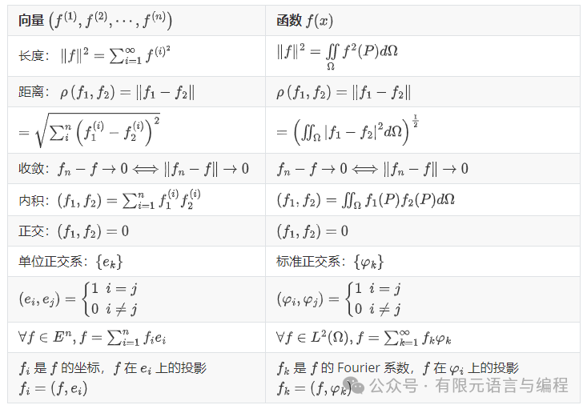
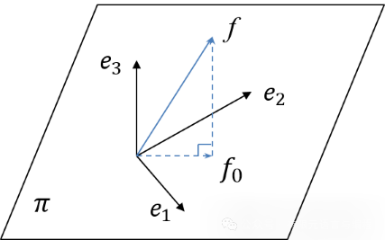

# 有限元数学基础 —— Hilbert 空间引论

> 原文地址: [https://mp.weixin.qq.com/s/fZJXnUpffu-UEAL7PwQJkw](https://mp.weixin.qq.com/s/fZJXnUpffu-UEAL7PwQJkw)

## 几何学历史回溯unsetunset

几何学有着光荣的历史。从尼罗河流域的土地测量和古埃及的纸草卷开始，在世界的几百种文明中，许多民族都有自己粗陋的几何，然而只有希腊人把它提高到了理论的高度。

在 Ptolemy 王朝时期，亚历山大城的 Euclid 以几条公理为基础，使得全部几何学都能按指定的推理规则从这几条公理演绎出来。这座壮丽的科学大厦外表那么富丽堂皇，内容那么深刻丰富，推理那么严谨，结构却十分简单。几何学开阔了科学家和哲学家的眼界。

Euclid 几何不仅成为训练每个科学工作者逻辑思维能力的工具，而且成为建立新科学的样板。许多哲学家和科学家认为世界万物尽管形形色色、错综复杂，然而它们的结构应该是简单的，宇宙应该是简单的、和谐的，仅受少数基本规律的支配。这些基本规律可以用数学形式表示，而其它规律可以由这些基本规律演绎出来。这一点鼓舞着科学家们去探索物质世界的奥秘，寻求其数学规律。几何学则成为他们的样板和工具。几千年来，从 Plato 到 Kepler，从 Newton 到 Einstein，许多学者都受过这种思想的影响。

Fermat 和 Descartes 创立了解析几何学，把代数和几何联系起来，为几何学提供了新的强有力的工具，不仅大大地扩展了几何研究的范围，而且解决了许多初等几何本身不能解决的问题。Newton，Leibniz 完成了微积分，Gauss 用分析工具研究了曲面上的几何。Riemann 把它推广到高维流形，Galois 创立 Galois 理论，彻底地解决了代数方程的根式求解问题及初等几何尺规作图问题。他们都用新的工具研究几何，解决了初等几何不能解决的问题。Euler 和 Bernoulli 兄弟的工作，Lagrange 的“分析力学”，Laplace 的“天体力学”都用分析方法取得了辉煌的成就。

尽管 Monge 及其学生企图复兴几何，然而在 19 世纪，几何学的光辉地位被分析所取代，分析方法取得了伟大的胜利。通常人们把中学里学的几何和代数看作初等数学，把微积分、微分方程等看成高等数学。高等数学高于初等数学。但是，正如 Monge 所指出的，分析学家对结果作几何解释，可以直观地指导自己的工作。

## unsetunset从有限维到无限维unsetunset

在研究函数序列 的完备性时，Hilbert 指出，正如同 维 Euclid 空间中的一个点由它的 个坐标给定一样，一个函数由它 Fourier 系数 给出，这些系数满足 。他还引进了实数序列 使得 。Schmidt 和 Frechet 把序列 在成一个点，函数被表示成无穷维空间的点。Riesz 和 Fisher 证明，在 Lebesgue 平方可积函数与它们的 Fourier 系数所成的平方可和序列之间，存在一个一一对应关系。平方可和序列可以表成无穷维空间中的坐标。

无穷维空间是 Euclid 空间的推广，许多分析的结果都可以在无穷维空间中得到解释。下面我们用几何类比的方法将分析结果赋予几何意义：

通过这种类比给函数定义长度、距离和内积，并把这样得到的带有长度和内积的在 上平方可积的函数的集合叫做 空间，记以 。

**有了距离就可以定义极限，有了内积可以定义角度。**

由 Euclid 几何可知，若 是向量 和 之间的夹角，则 ，即两个向量的内积等于两个向量长度的乘积再乘以它们之间夹角的余弦，从而 ，因此有了长度和内积可以定义角度，特别是可以定义函数间的角度。

若两个向量正交，则 ，从而 。反过来若 和 不是零向量，由 可以推出 ， 与 正交。因此可以用 来定义 与 正交。对函数来说， 和 正交就是 。

若 是 上的单位正交系，则必须有 ，，。对 维 Euclid 空间 ，若 是 的单位正交系，则 中的任意向量 可以写成

其中， 是 的各个分量。将上式两端与 作内积。由于 ，，因此 ，即 的第 个分量等于 与 的内积。注意

是 和 的夹角，，因此 相当于 在 上的投影。

对函数而言，可以把标准正交系当坐标系，而任意函数可以用坐标系表示出来。例如，取 ，，容易验证，

因此 是 上的单位正交系。根据 Fourier 级数的展开定理，任意满足 的连续可微函数都可以对 展开成

其中  叫做 的第 个 Fourier 系数。

如果把 看成坐标向量，则 可以看作 的坐标或者 在 上的投影。注意到在 Euclid 空间中坐标向量的个数等于空间的维数，而现在 有无穷多个，因此是**无穷维空间**。

Fourier 级数仅仅是标准正交系 的特殊例子。 还可以取成 Bessel 函数，Legendre 函数以及其他函数，对它们都有 ，因此右端叫做 的广义 Fourier 级数。按 Fourier 级数展开，按 Bessel 函数展开，按 Legendre 函数展开在分析上是不同的。现在我们可以给出统一的几何解释。

> 从 观点来看，不同的函数展开只不过是函数按不同坐标系的一种表示而已。

## unsetunset定理推广unsetunset

用几何类比可以为解决高等数学问题提供直观背景和新的途径，还可以猜出一些定理。

例如，在 维 Euclid 空间中对任意向量 都有 ，其中 是向量 的长度， 是 的第 个分量。以上实际上就是勾股定理。

将其推广到无限维空间 中就有 。这里 ，， 是 中的单位正交系，这就是 Fourier 级数理论中的 Parseval 恒等式。

从 Euclid 几何我们知道，平面外一点到平面的最短途径是过这点到平面的垂线。假设此平面用 表示， 是 外一点，、 是 上彼此正交的单位向量，则平面上的任意向量可以写成

设平面 上与 距离最近的点为 ，则 。设 ， 是三维 Euclid 空间的标准正交系，

，

则有 ， 或者 。

类似地，如果 是 中的标准正交系，那么   的线性组合构成 中的一个有限维子空间，记这个空间为 。假设 不是 中的函数，在 中求距 最近的点就相当于选择常数 使得  最小。，，亦即 恰是 的 Fourier 系数。

用高等数学的术语来说就是：一个函数的 Fourier 级数的前 项之和是对这个函数在最小二乘意义下的最佳逼近。

上述问题可以看成是求 ，使

取极小值。类似地，Ritz 法求解 Poisson 方程可以看成是求 使泛函

取极小值。

如果能将 解释成 到 的距离，那么最小势能原理可以解释成，在子空间 内求一点与 外的点 距离最短。

一旦变分原理有了几何解释，许多数学物理问题就可以按几何思想进行处理。几何方法是我们熟悉的，这就为我们提供了一个新的锐利工具，也就是解决问题的 **Hilbert 空间方法**。

## unsetunset参考文献unsetunset

\[1\]张鸿庆,王鸣.有限元的数学理论\[M\].科学出版社,1991.

FEtch 系统是笔者团队开发的新一代有限元软件开发平台。只需按照有限元语言格式填写脚本文件，即可在线自动生成有限元计算程序，从而大幅提高 CAE 软件的开发效率。欢迎私信交流。

有任何疑问或建议，欢迎加Q群 "FEtch有限元开发系统(519166061)" 留言讨论。我们长期开展 FEtch 系统的免费试用活动，感兴趣的朋友入群后可直接联系管理员，免费获取许可证文件。