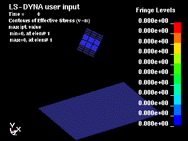
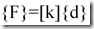
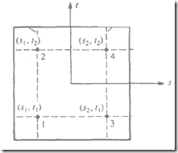
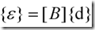
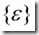
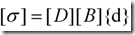
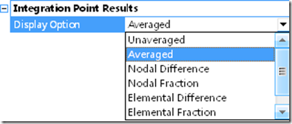

# 有限元方法中的位移解、应变解和应力解

> 原文地址: [https://mp.weixin.qq.com/s/LvcKXJ709jV\_NTVTdvCEAA](https://mp.weixin.qq.com/s/LvcKXJ709jV_NTVTdvCEAA)

  

  

  

  

  

我们知道，在结构静力学有限元方法中，经过单元方程的组装以后，形成的代数方程如下：

  

其中，{F}----节点载荷向量；\[K\]---总体刚度矩阵；{d}---节点位移向量

  

在引入边界条件以后，解上述方程组，就可以得到节点位移向量{d}。这是求解结构静力学方程组所得到的第一组解，它是最精确的。

  

得到节点的位移解后，下面是求取应变解和应力解。与位移解不同，它们并不是直接在节点上获得，而是首先在积分点上获得的。

  

所谓**积分点**是指，在对单元建立方程时，例如刚度矩阵是需要通过积分而得到的，而积分时为了能够方便计算，大多数有限元软件采用了所谓高斯积分的方式，即在单元内分布一些高斯点，如下图的 1,2,3,4 点

  

  

这样，有限元软件会首先获得这些高斯点的应力和应变，其方法如下：

在高斯积分点上，依据几何方程

计算出高斯积分点上的应变

然后基于虎克定律及几何方程推导的结果

  

来计算高斯积分点的应力。

  

可见，在应变和应力计算方面，高斯积分点的应变和应力是最最准确的。

  

那么，如何计算节点的应力和应变呢？

  

此时，利用特定单元的形函数以及高斯点的应力，应变值，将这些值外推到该单元的节点上，就得到了单元上节点的应力应变值。

  

显然，不同的单元会共用一些节点，而从不同单元内的积分点外推到这些公共节点的应变值和应力值一般不相同，那么到底取哪个单元的外推结果呢？

  

此时，可以采用平均主义的思想。即使将一个公共节点的多个应力进行平均，以代表该节点的应力值，该平均过程称为“**平滑**”。

  

总之，求解节点应力的步骤是：

（1）根据总体方程，得到节点的位移解。

（2）根据几何方程，得到单元高斯点的应变解。

（3）根据物理方程，得到单元高斯点的应力解。

（4）在某一个单元内，基于形函数，将高斯点的应力外推到该单元的所有节点。

（5）对于某一个公共节点，将该节点关联的所有单元所推出的该节点的应力解进行平均，最终得到该节点的应力解。

  

例如，在ANSYS WORKBENCH的后处理中，如果我们加入了一个应力对象，我们可以看到其细节视图中有下列选项---积分点结果选项，如下图

  

  

  

那么这里面的 7 项是什么含义呢？

  

下面阐释这 7 项的意义：

(1) unaveraged：显示没有进行平均的应力结果。

(2) averaged：显示平均后的应力结果。

(3) nodal difference：对于公共节点，计算其相连各单元计算得到的非平均应力的差的最大值。

(4) nodal fraction：计算公共节点的nodal difference与节点平均值的比值。

(5) elemental difference：对于一个单元上的所有节点，计算其非平均结果的最大差值。

(6) elemental fraction：计算element difference与单元平均值的比值。

(7) elemental mean：根据平均化的应力结果来计算单元的平均值。

  

这样，我们在浏览应力结果时，应根据需要来选择我们需要查看的对象。

  

  

