# 有限元精度与高斯点的关系：实测一维模型

> 原文地址: [https://mp.weixin.qq.com/s/TEU\_jeE53Jk0SeE3QWD9kg](https://mp.weixin.qq.com/s/TEU_jeE53Jk0SeE3QWD9kg)

**简述**  

在[自适应有限元技术:一维电场衰减数值模拟](http://mp.weixin.qq.com/s?__biz=MzkwNzUxOTM2NA==&amp;mid=2247483839&amp;idx=1&amp;sn=e2f7a7363e057ae988054c5d83e180cb&amp;chksm=c0d6b554f7a13c420b5667c418d2d0fe4e40b4192beffb78b7c46052cf66476163a0a24ded5f&scene=21#wechat_redirect)文章中，提到了有限元关于计算精度与梯度在高斯点精度的描述：

“无论选择多少阶基函数，数值解在自由度上都是精度最佳的；而数值解的梯度在对应基函数的高斯点上达到精度最高。”

本次内容针对以上描述，使用一维有限元分别对一阶、插值二阶、叠层二、三阶的计算结果验证该论点。

该结论对于计算自适应有限元中的后验误差有着非常重要的指导意义。

**1.验证方法与插值公式**

采用文章[一维高阶叠层有限元实现](http://mp.weixin.qq.com/s?__biz=MzkwNzUxOTM2NA==&amp;mid=2247483750&amp;idx=1&amp;sn=3da0cb99d39eb4586ab282794683f930&amp;chksm=c0d6b58df7a13c9b872b692a35e4b39106de14406cd9924b2e6cab71830b32d61b4104cafee6&token=962917098&lang=zh_CN&scene=21#wechat_redirect)和文章[一维高阶插值基函数有限元实现](http://mp.weixin.qq.com/s?__biz=MzkwNzUxOTM2NA==&amp;mid=2247483719&amp;idx=1&amp;sn=c2e8474e625f4d8f8e5218c4d238294d&amp;chksm=c0d6b5acf7a13cbacc3f02d721852d8870c8ba1742166a7b103a4d879718035c4bf599a7beec&token=962917098&lang=zh_CN&scene=21#wechat_redirect)的实现代码，这两个文章均是介绍cos函数求解的边值问题。将网格个数控制在一定量：一阶20个网格、二、三阶10个网格，恰好能得到相对正确的结果。

然后在研究区域采样1000个点，用各自的有限元插值公式求解数值结果或者梯度结果，如此得到的结果与理论解进行对比，查看误差分布规律。其中使用到的插值公式如下：

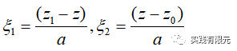

叠层基函数的数值插值公式：  

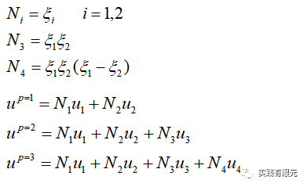

叠层基函数的数值梯度插值公式：  

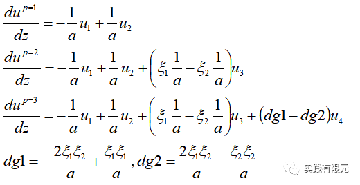

二阶插值基函数的数值、梯度插值公式如下：

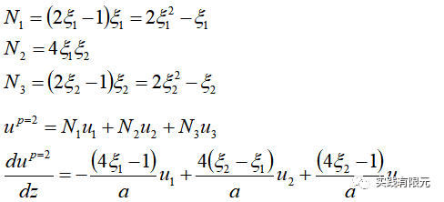

其中有限元的详细过程可以参考上述提到的文章。  

    一维高斯积分点落在区间（0,1）上的位置如下：

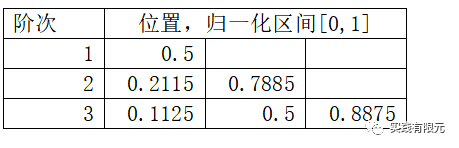

**2.一阶有限元的对比结果**  

网格数量为20个网格。

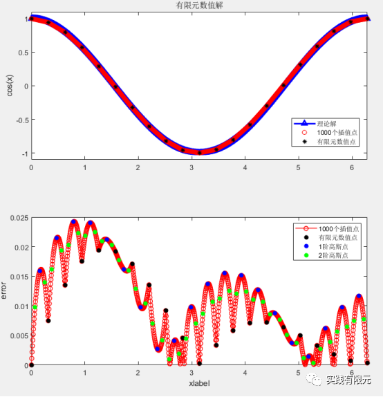

图1 一阶有限元数值解与理论对比结果与误差分析

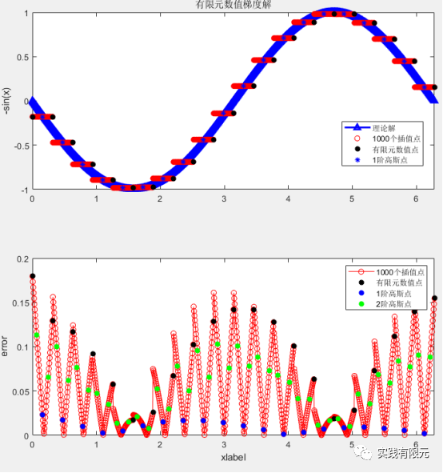

图2 一阶有限元数值梯度阶与理论阶对比与误差分析

a.图1中，数值解在网格节点（有限元数值点）的位置计算结果精度整体上相对是最高的，但并不一定是最高的。同时有趣的是，在1阶高斯点位置的数值解误差最大（在图1中误差分析图的蓝色点）。

b.图2中分析数值解的梯度精度， 首先与我们认知一样，一阶有限元的梯度在单元内是一个常数，并且在一阶高斯点（蓝色点）的位置上梯度精度整体上最高，但也有比该点精度更好的点。同时，在有限元数值节点处的梯度误差最大，这也符合我们对一阶有限元的认知。

**3.二阶叠层基函数有限元对比结果**  

网格数量为10个网格。

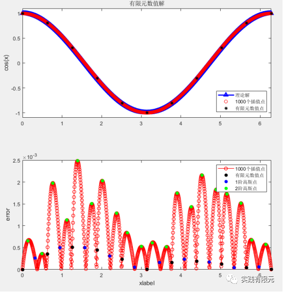

图3 二阶叠层基函数有限元数值解与理论对比、相关误差分析

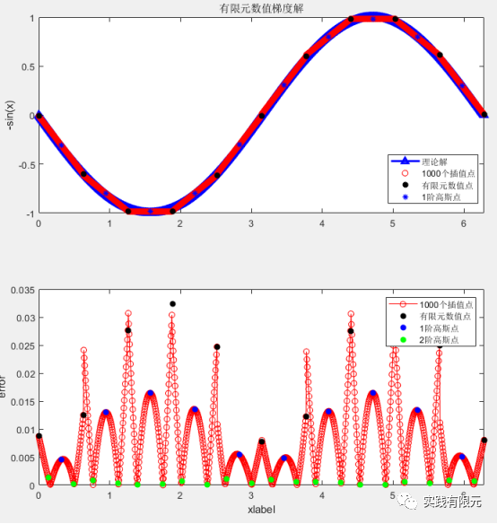

图4 二阶叠层基函数有限元数值解的梯度与理论对比、相关误差分析

a.图3中分析：二阶叠层基函数有限元的数值结果在有限元节点与一阶高斯点的结果几乎具有相同的误差精度，但是相对于整个区域而言，二者均不是计算结果精度最高的点；而二阶高斯点的位置却一定是计算结果精度最差的点。

b.图4的梯度结果图中分析：I.二阶叠层基函数的梯度在单元上是线性函数，从图中可以明显看出来节点之间是直线；II.整体上二阶高斯点位置的数值梯度误差最小，在一阶高斯点的位置与有限元数值点的位置误差达到相对最大。

**4.二阶插值基函数有限元对比结果**  

网格数量为10个网格。

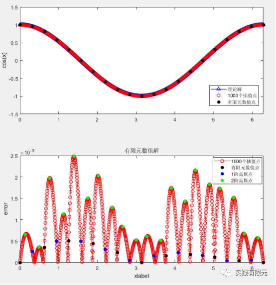

图5 二阶插值基函数有限元数值解与理论解对比、误差分析图

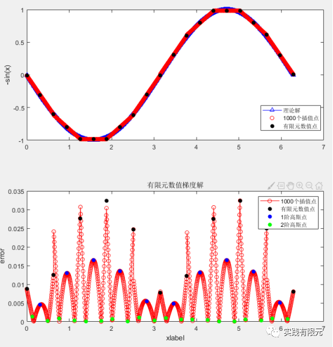

图6 二阶插值基函数有限元数值梯度解与理论对比、误差分析图

二阶插值基函数的结果几乎与二阶叠层基函数的结果一致，因此结论也基本上和二阶叠层基函数的结论一致。

在有限元数值上：有限元节点与一阶高斯点位置的精度更高；二阶高斯点位置的精度最低；

而数值梯度的结果恰好相反：有限元节点与一阶高斯点位置的精度，最低二阶高斯点位置的精度最高。

**5.三阶叠层基函数有限元分析结果**

网格数量为10个网格。

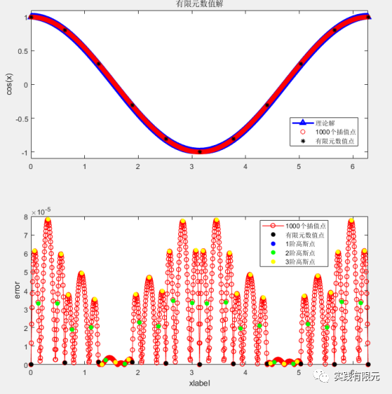

图 7 三阶叠层基函数有限元数值结果与理论对比、误差分析图

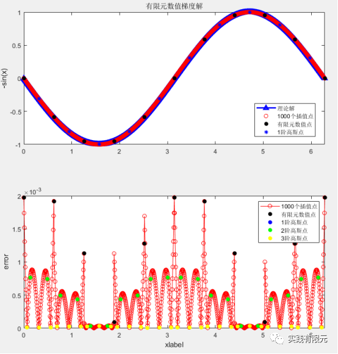

图 8 三阶叠层基函数有限元数值梯度解与理论对比、误差分析图

a.图7数值结果中分析得到：有限元节点上的数值误差最小，三阶高斯点上数值误差局部达到最大；二阶高斯点的位置并不是局部误差最小的点，至于单元内部误差最小的两个点的位置暂时不清楚具体意义。

b.图8的梯度结果中分析得到：梯度在三阶高斯点位置的精度最高；在有限元数值点的精度最低；同样二阶高斯点位置的精度相对较大，但是不是局部峰值，局部峰值的点位置具体意义不清楚。

**6.混合二、三阶叠层基函数有限元分析结果**  

网格剖分为10个网格，前5个网格为二阶，后5个网格为三阶基函数。  

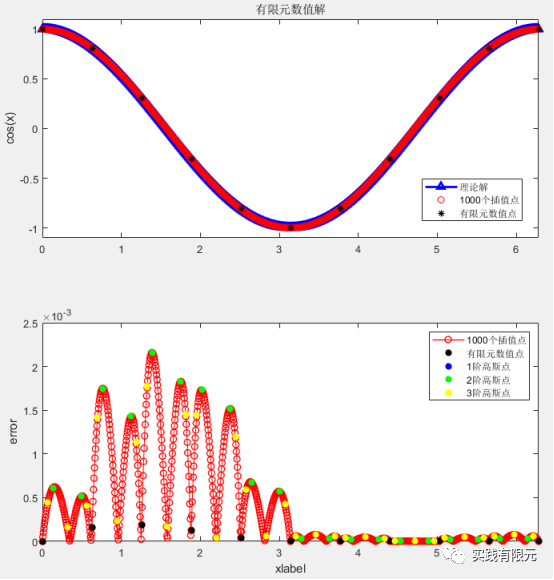

图 9 混合二\-三阶有限元的数值结果与理论对比、误差分析图

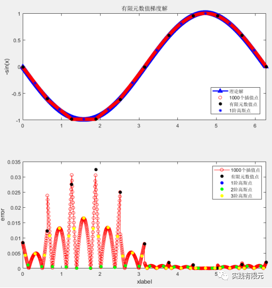

图10 混合二\-三阶有限元的数值梯度结果与理论对比、误差分析图

a.混合阶的精度在各自阶数的区域有各自的精度，总体上二阶精度低于三阶精度；

b.不管是图9数值结果还是图10梯度结果，二阶基函数部分的精度规律满足图3中二阶叠层基函数有限元的规律；三阶部分的精度规律满足图7中三阶叠层基函数有限元的规律。

**7.总结**

a.对于1、2、3阶有限元而言（包含叠层基函数、插值基函数）有以下结论：

I.有限元数值结果在数值节点处精度达到相对最高，在同阶高斯点位置的精度最低；

II.有限元数值梯度结果在数值节点精度最低，在同阶高斯点位置的精度最高；

III.叠层基函数与插值基函数的有限元数值、梯度的精度规律是一致的；

IV.对于混合阶有限元而言，各自阶数部分的规律满足各自纯阶数的精度规律；

b.上述结论验证了文章开头简述的内容。

c.在自适应有限元中后验误差的计算过程中，要根据不同的阶数，选择对应的阶数高斯点位置的数值解、梯度解来构造高精度恢复解。例如图10中混合阶梯度的误差分析，在计算高精度梯度恢复的过程中，二阶部分网格的高精度梯度点就得取二阶高斯点位置的值；三阶部分网格的高精度梯度点就得取三阶高斯点位置的值，根据这些点恢复得到整个区域的精度才是最高的。