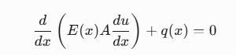
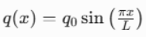
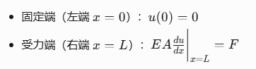
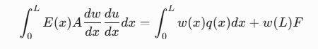
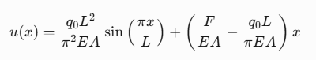
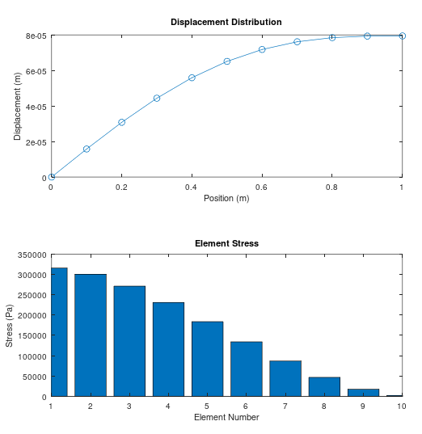
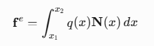
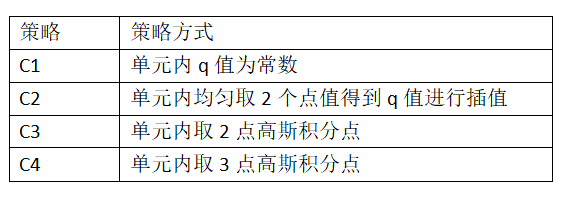
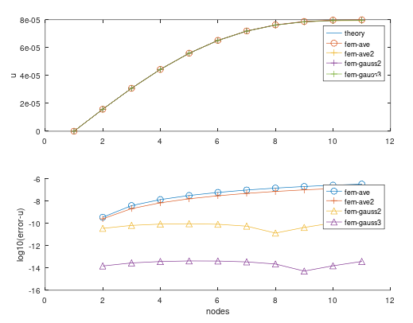

# 有限元荷载加载方式对精度的影响-一维杆力学问题


> 原文地址: [https://mp.weixin.qq.com/s/iF7wyFq2m0KIGXhrxN6UZA](https://mp.weixin.qq.com/s/iF7wyFq2m0KIGXhrxN6UZA)

简述

本文入门最简单的力学有限元仿真，以最简单的一维杆的轴向变形为例，实现力学的一维有限元仿真。

在实现过程中，发现有限元荷载加载方式不同，对计算结果的精度会有很大影响，如果实际过程中忽略考虑该因素就有可能导致精度损失。

1.力学控制方程

一维杆力学的边值问题：



E：弹性模量；A:横截面；U:位移；q:分布荷载

荷载受力方程：





其有限元方程很容易获得：



其求解上述积分，可以得到对应存在理论解析解为：



求解上述问题，就是纯粹的一维有限元，详细可参考[有限元文章集合-2024年](http://mp.weixin.qq.com/s?__biz=MzkwNzUxOTM2NA==&mid=2247486208&idx=1&sn=887b2ddb55a4a8c2fc8d2f149ed41899&scene=21#wechat_redirect)

2.结果

模型参数：

```
% 参数设置
```

求解结果：



3.荷载加载方式对精度的影响

通常，对于荷载的积分，如果q值在网格单元内本身就是个常数，此时并不存在问题。



而此案例中，q值是正弦函数，此时如果依然考虑在单元是一个常数的情况，精度就会存在损失。

这里对比了不同的插值策略，得到的不同的精度对比结果。插值策略四种：



 对比结果如下：



很明显的区别，高斯积分点处插值荷载的精度明显高于单元内均匀取值，3点高斯积分的精度更高于2点高斯积分。

这本质上是由于高斯积分对sin函数插值的精度，对于平均取值，其精度阶数为2，而二阶、三阶高斯积分的精度阶数分别在4，5。

当然如果选择足够高阶，可能会导致计算成本增加，因此具体的高斯阶数选择需要根据实际情况与所需要的精度来考虑。

4.结束

一维力学问题相对而言容易实现，清楚控制方程后即可实现简单的一维有限元仿真。对于外行而言，需要更多的去了解力学控制方程的由来。

对于荷载是非线性变化的问题，有限元荷载加载方式不同引起的精度问题值得注意，在实际情况中，需要考虑计算成本，高斯阶数针对荷载的误差损失，以及有限元自身阶数。

* * *

博主长期深入实践电磁学领域的有限元技术，感兴趣的朋友可以添加博主公众号，欢迎共同探讨与有限元相关的技术知识。