# 有限元边界元混合算法-二维拉普拉斯方程


> 原文地址: [https://mp.weixin.qq.com/s/zU\_lIP0fQtaQE\_YtlDyX-w](https://mp.weixin.qq.com/s/zU_lIP0fQtaQE_YtlDyX-w)

简述

在上篇文章中讲述了边界元多域问题的实现方法。但是对于复杂模型，传统的边界元已经不再具有简单快速的优势。而有限元由于不需要考虑模型内部边界，因此天然的适合复杂模型。结合二者优点，可以实现有限元与边界元的混合算法。

本文以二维拉普拉斯方程为例，实现有限元与边界元的混合算法。有限元与边界元的详细实现过程可参考文章：

[边界元入门实现-二维拉普拉斯方程](https://mp.weixin.qq.com/s?__biz=MzkwNzUxOTM2NA==&mid=2247486538&idx=1&sn=3da6b8c8af826db2bb851b6e27eb1d40&scene=21#wechat_redirect)[边界元处理多域问题-拉普拉斯方程](https://mp.weixin.qq.com/s?__biz=MzkwNzUxOTM2NA==&mid=2247486592&idx=1&sn=3751c11fa0c3699c8f8e36a3d7b5c25f&scene=21#wechat_redirect)[同轴线求电容，初探泊松方程的二维非结构化有限元](https://mp.weixin.qq.com/s?__biz=MzkwNzUxOTM2NA==&mid=2247483980&idx=1&sn=9803c31966314d8fbd90cede9faa1b60&scene=21#wechat_redirect)[二维有限元实现详细过程：三角形网格二阶插值基函数](http://mp.weixin.qq.com/s?__biz=MzkwNzUxOTM2NA==&mid=2247484038&idx=1&sn=b4bb6c74c18f0e8235a84580edba3c3d&scene=21#wechat_redirect)

1.边值问题

对于同轴圆模型，满足拉普拉斯方程，模型存在两个区域，区域1、2的材料不一致。

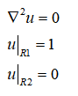

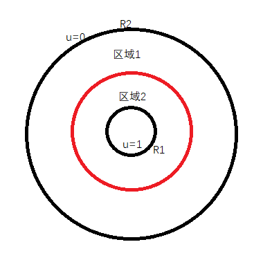

我们对区域2使用有限元求解，对区域1使用边界元。在红色边界上通过边界条件耦合有限元矩阵与边界元矩阵。耦合等式为：

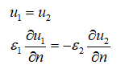

2.有限元-边界元混合算法

首先对区域2进行有限元离散，此时需要注意保留红色区域的原始边界条件，此外在R1处使用第一类边界条件，得到方程：

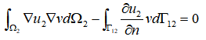

带入有限元三角形基函数N，离散后得到有限元方程：

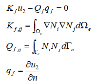

然后对区域1进行边界元离散，应用格林公式，得到边界积分方程：

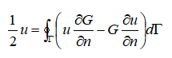

其中G表示二维拉普拉斯方程的基本解：

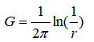

最终可以化简为：

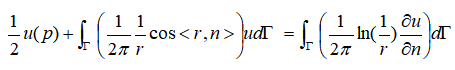

写成矩阵求解公式：

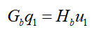

分别完成边界元与有限元的独立组装系数矩阵后，接下来将二者通过边界条件耦合在一起。对于有限元，我们将交界面边界所相关的未知数提取出来，改写系数矩阵：

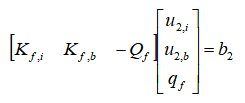

同样，将边界元的矩阵区分交界面边界与非交界面，改写矩阵：

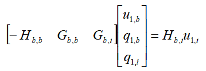

根据交接边界条件，可以得知：

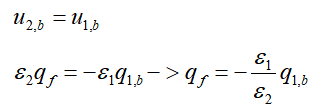

联合有限元、边界元、交界面边界条件，耦合得到系数矩阵形式为：

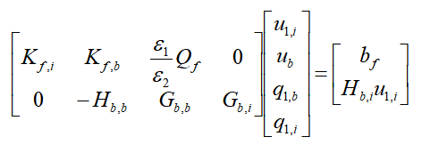

如果不希望对矩阵做过度的处理，可以采用强加边界条件处理耦合边界，得到系数矩阵形式为：

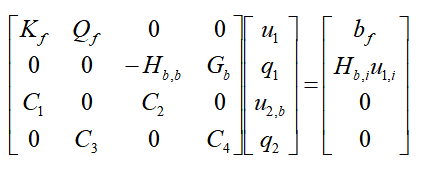

其中C1,C2,C3,C4分别耦合了交接边界上电势与梯度的信息：

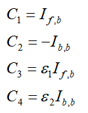

I表示为单位矩阵，If表示交界区域为单位阵，非交接区域为零。可见，这种方式相对于直接耦合方式而言，求解的未知数增加了。

完成系数矩阵的耦合后，在右端项中，有限元相关的bf表示内边界u1=1，边界元相关的u2=0。求解上述方程，即可得到对应的有限元解和边界元解。然后在各自区域分别处理求解内部区域。

进一步观察可发现，其实有限元和边界元的耦合与边界元多域问题的耦合过程基本上是一致的。本质上均是在各自的区域组装各自独立的方程，然后通过交界面耦合矩阵方程。

但是，从耦合矩阵看，有限元原本具有的矩阵对称性和稀疏性均没有了。下面是方案1耦合方式的非零元素分布情况，可见在交界位置变成了满阵。

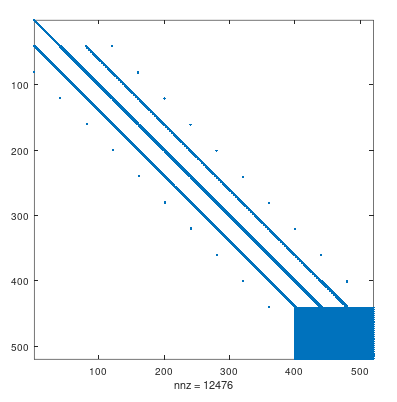

3.结果展示

```
% 参数设置
```

网格显示，有限元采取三角形网格，边界元仅剖分边界边。

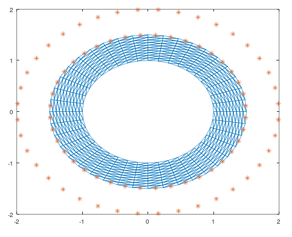

有限元部分结果可视化：

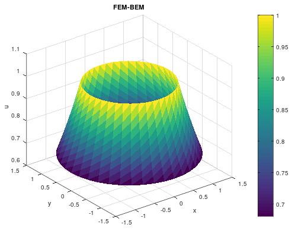

有限元与边界元结果与理论解对比：

i.当 epr 1= 1，epr2 = 1

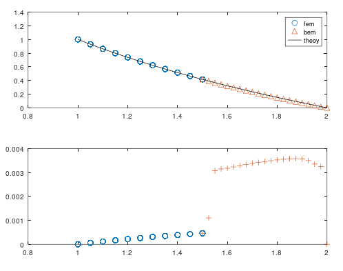

ii.当 epr 1= 3，epr2 = 1

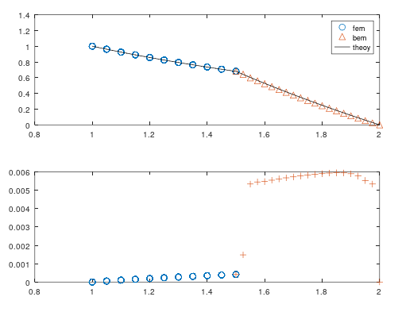

对比结果可以看出，有限元和边界元的结果均和理论解是一致的，但是有限元误差要明显小于边界元的误差。

总结

本文以二维拉普拉斯方程为例，实现有限元与边界元的混合算法。流程是首先独立构建自个区域的系数矩阵，然后通过交接边界条件耦合。耦合流程与多域边界元耦合过程是一致的。

需要注意，有限元与边界元得到新矩阵在耦合部分不再具有稀疏性与对称性。

  

* * *

博主长期深入实践电磁学领域的有限元数值仿真技术，感兴趣的朋友可以添加博主公众号，欢迎共同探讨与有限元相关的技术知识。