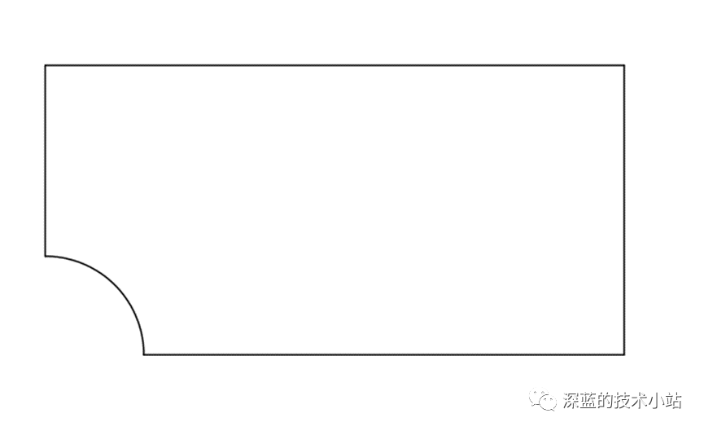
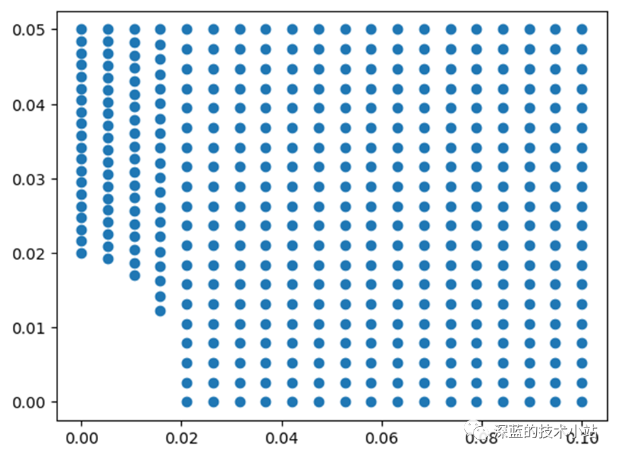
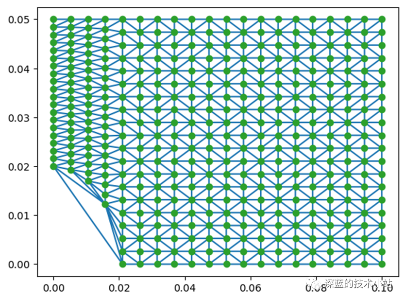
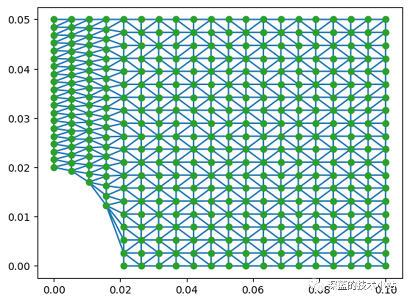
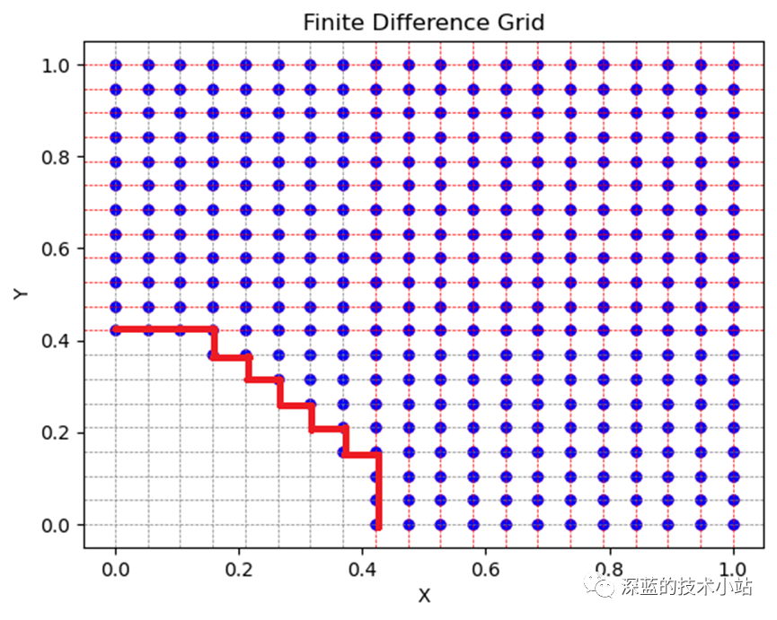
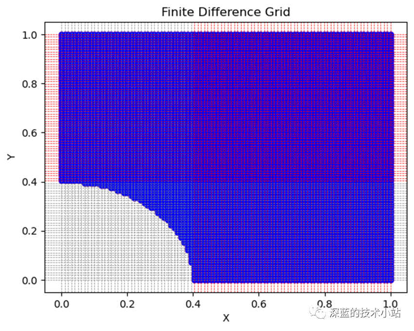

# 有限元（FEM）和有限差分（FDM）网格对比

> 原文地址: [https://mp.weixin.qq.com/s/flYPQSG8df02Zomd-tK\_Qw](https://mp.weixin.qq.com/s/flYPQSG8df02Zomd-tK_Qw)

FEM（有限元）是Finite Element Method的缩写，FDM（有限差分）是Finite Difference Method的缩写，都是常用的数值分析技术，用以求解偏微分方程和其他数学问题，二者都要把连续问题转化为离散问题，但是离散的方式又有所不同，主要体现在网格上。本文将通过简单的案例来说明二者在网格上的区别。

如图是一个带中心孔平板的四分之一模型，现在我们将运用两种方法对此模型进行网格划分，当然今天涉及到的仅仅是二维网格。

现在我们首先使用FEM方法对平板区域进行网格划分。

###导入需要使用的库

import numpy as np

import matplotlib.pyplot as plt

import math

###定义模型

L = 0.1

h = 0.05

r = 0.02

nb\_element = 20

Nodes = \[\]

###定义节点

for x in np.linspace(0,L,num = nb\_element):

if(x<r):

y0 = math.sqrt(r\*\*2 - x\*\*2)

for y in np.linspace(y0,h,num = nb\_element):

Nodes.append(\[x,y\])

else:

for y in np.linspace(0,h,num = nb\_element):

Nodes.append(\[x,y\])

###绘图

points\= np.array(Nodes)

plt.plot(points\[:,0\],points\[:,1\],'o')

plt.show()

图形如下:

###进行网格划分

from scipy.spatial import Delaunay

###此处调用了Delaunay网格划分器

tri = Delaunay(points)

plt.triplot(points\[:,0\],points\[:,1\],tri.simplices)

plt.plot(points\[:,0\],points\[:,1\],'o')

plt.show()

可以看到，在中心孔处，生成了一些多余的网格，接下来把这些网格去除掉。

p = \[\]

r2 = 0.0195

for x in np.linspace(0, r2, 10):

p.append(\[x,math.sqrt(r2\*\*2 - x\*\*2)\])

tri.find\_simplex(p)

###查找多余网格的编号

###去除多余网格

mesh = np.delete(tri.simplices,\[0,153,154,21\],0)

plt.triplot(points\[:,0\],points\[:,1\],mesh)

plt.plot(points\[:,0\],points\[:,1\],'o')

plt.show()

以上是使用FEM方法绘制的网格图，当然除了三角形网格还可以绘制四边形网格，不过过程比较复杂，此处仅仅是作为演示，因此调用了现有成熟的方法进行三角形网格划分。Delaunay三角剖分有很多有意思的内容，包括剖分思路以及如何写网格算法，之后有时间将和大家进行探讨。

接下来使用FDM方法进行网格划分。

import numpy as np

import matplotlib.pyplot as plt

\# 定义网格参数

num\_points\_x = 20

num\_points\_y = 20

x\_min, x\_max = 0.0, 1.0

y\_min, y\_max = 0.0, 1.0

\# 在二维区域内均匀生成网格点

x = np.linspace(x\_min, x\_max, num\_points\_x)

y = np.linspace(y\_min, y\_max, num\_points\_y)

X, Y = np.meshgrid(x, y)

\# 删除以坐标 (0, 0) 为圆心、半径为 0.4 内的点

radius = 0.4

distance\_to\_center = np.sqrt(X\*\*2 + Y\*\*2)

mask = distance\_to\_center > radius

X = X\[mask\]

Y = Y\[mask\]

\# 可视化网格边界

plt.plot(X, Y, 'ro', markersize=5) \# 绘制被删除的点，使用红色

plt.plot(X, Y, 'bo', markersize=5) \# 绘制保留的点，使用蓝色

plt.xlabel('X')

plt.ylabel('Y')

plt.title('Finite Difference Grid')

\# 绘制纵向网格线

for i in range(num\_points\_x):

color = 'red' if mask\[0\]\[i\] else 'gray' \# 根据标记选择线的颜色

plt.axvline(x\[i\], color=color, linestyle='--', linewidth=0.5)

\# 绘制横向网格线

for j in range(num\_points\_y):

color = 'red' if mask\[j\]\[0\] else 'gray' \# 根据标记选择线的颜色

plt.axhline(y\[j\], color=color, linestyle='--', linewidth=0.5)

plt.show()

最终结果图如下：

我们可以看到网格的边界处（红色线条）不是很平滑，因此我们更改网格参数

num\_points\_x = 100

num\_points\_y = 100

结果如下：

可以看到边界处比较顺滑，但是此时的节点数过多，如果进行计算，则计算时间会很长。通过对比可以发现，同等情况下，有限元网格对于曲面的处理效果要比有限差分网格好得多，这也会影响到最终计算结果的精度。