# 有限差分法、有限体积法和有限元法的核心区别? 网格点上的数值如何计算和获取?

> 原文地址: [https://mp.weixin.qq.com/s/HKXgPuszs9Hj7lS5i7maDA](https://mp.weixin.qq.com/s/HKXgPuszs9Hj7lS5i7maDA)

  

大家好！我是le，有限差分法（FDM）、有限体积法（FVM）和有限元法（FEM）是数值模拟中三种主要的离散化方法，它们都用于将连续的偏微分方程（PDE）转化为可以用计算机求解的离散代数方程。

  

昨天给大家分享了什么是有限元、有限体积、有限差分?有什么区别？

  

指路：[什么是有限元、有限体积、有限差分?有什么区别？](https://mp.weixin.qq.com/s?__biz=Mzk0OTY2MjU3Mg==&mid=2247488180&idx=1&sn=81e3b3c7129fba229127d6fae451264e&scene=21#wechat_redirect)

  

得到了大家的好评，但是也有小伙伴留言其实三者主要差别网格点数值如何得到！确实，有限差分法（FDM）、有限体积法（FVM） 和 有限元法（FEM） 的核心区别在于网格点上的数值如何计算和获取。

  

**1.有限差分法（FDM）**

网格点数值的获取方式：FDM直接通过差分公式近似导数，用网格点的值直接代替偏微分项。

对网格点上的变量（如𝑢(𝑥)）进行插值和导数计算。例如：对于一阶导数 

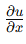

使用中心差分公式：

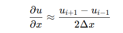

对于二阶导数 

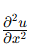

使用二阶差分公式：

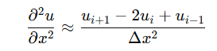

本质：通过邻近网格点的值来直接近似微分项，使用简单的代数公式计算每个网格点的数值。

关键特点：网格点数值直接通过差分公式计算，不涉及积分或变分。

对规则网格适用性强，网格点是计算的主要基准。

  

**2.有限体积法（FVM）**

网格点数值的获取方式：FVM通过对控制体积进行积分，基于守恒原理计算网格点值。

假设物理方程为守恒型方程（如质量守恒、动量守恒），其积分形式为：

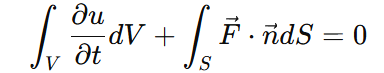

其中，𝑉是控制体积，𝑆是控制体积的表面。

控制体积上的通量通过网格边界的值计算。

本质：通过对控制体积内的物理量积分守恒，确保计算局部和全局守恒性。

关键特点：计算时，网格点的值来自于通量计算和边界条件。

涉及积分，计算结果更贴近物理守恒定律。

通常适用于流体力学等涉及守恒定律的问题。

  

**3.有限元法（FEM）**

网格点数值的获取方式：FEM通过变分法或加权余量法，对方程的弱形式进行离散化求解。

对于一个偏微分方程，例如 

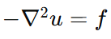

其弱形式为：

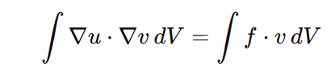

其中，𝑣是权函数（测试函数）。在离散化过程中，解 𝑢被表示为一组基函数的线性组合：

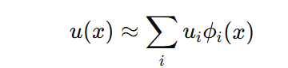

其中，𝜙𝑖(𝑥)是基函数，𝑢𝑖 是待求的网格点值。解得出的网格点数值 𝑢𝑖 是弱形式方程的求解结果。

本质：基于基函数插值和权函数计算，通过解变分形式来获取网格点的值。。

关键特点：数值解是全局基函数插值的结果，而非局部计算。

适用于复杂几何和非规则网格，灵活性高。

**4\. 网格点数值的计算方式**

### 

**方法**

**如何获取网格点数值**

**本质特点**

**FDM**

使用**邻近点的差分公式**直接近似微分项，网格点值通过代数公式计算

基于导数的直接离散，公式简单，局部计算

**FVM**

通过**控制体积积分**计算通量和守恒量，网格点值基于守恒性和边界条件

基于守恒积分，全局物理量守恒

**FEM**

使用**基函数插值**和变分法，网格点值是弱形式方程的解，依赖全局插值

基于全局变分求解，适合复杂几何体

###   

  

**5\. 简单示例对比**

### 以下用一维泊松方程

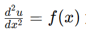

为例，比较三种方法对网格点数值的获取方式：

FDM：

（1）将二阶导数离散为差分公式：

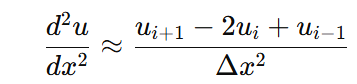

（2）在网格点 𝑖处代入公式，得到代数方程：

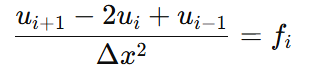

（3）通过解代数方程组，得到所有网格点的数值。

FVM：

（1）对控制体积 

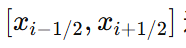

进行积分：

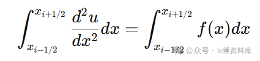

（2）使用通量计算，将导数项转化为边界值：

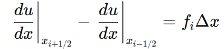

（3）通过边界条件计算通量，最终得到网格点的值。

FEM：

（1）将方程写成弱形式：

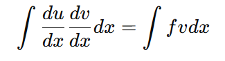

（2）使用基函数 𝜙𝑖(𝑥) 近似 𝑢(𝑥)，离散化方程：

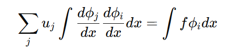

（3）解得系数 𝑢𝑗，即网格点值。

**6\. 结论**

-   **FDM**
    
    基于局部差分公式，直接通过代数公式近似导数。
    
-   **FVM**
    
    基于控制体积的积分，强调守恒性，网格点值通过通量和边界条件获取。
    
-   **FEM**
    
    基于全局基函数插值和变分法，网格点值是弱形式方程的解。
    
-     
    

###   

###   

记得点个**“赞+在看”**

  

******为****了不错过每期科研内容，记得****星标我哇！**

  

  

✅ ****往期干货****传送门：********

[一区TOP期刊《Energy》— CFD-DEM模拟分析水力压裂工程中的两相流动问题](http://mp.weixin.qq.com/s?__biz=Mzk0OTY2MjU3Mg==&mid=2247483957&idx=1&sn=b9620e3949d61b3edeae15c38fafffd4&chksm=c355a436f4222d20e467147ee4a15b94a79bd0efbf9bcf9b57ab49fd40b68a7762d53ecdb009&scene=21#wechat_redirect)

[工科领域使用COMSOL目前有什么好的创新点？我详细总结了6点！](https://mp.weixin.qq.com/s?__biz=Mzk0OTY2MjU3Mg==&mid=2247488146&idx=1&sn=b5b089cf3beff79296ebdee992ad580d&scene=21#wechat_redirect)

[CFD软件对比：OpenFOAM、Fluent和COMSOL谁更强？](https://mp.weixin.qq.com/s?__biz=Mzk0OTY2MjU3Mg==&mid=2247488141&idx=1&sn=93c780e4994b9cd4521a055ae2504582&scene=21#wechat_redirect)

[在科研中，如何设计一个科学实验？](https://mp.weixin.qq.com/s?__biz=Mzk0OTY2MjU3Mg==&mid=2247488126&idx=1&sn=23cd2e7eaccfdd4aed99320ef8dcf6f1&scene=21#wechat_redirect)

[Abaqus软件可以模拟哪些实际问题？](https://mp.weixin.qq.com/s?__biz=Mzk0OTY2MjU3Mg==&mid=2247488123&idx=1&sn=480ddc38653726daac30eecf49edf303&scene=21#wechat_redirect)

[EDEM耦合Fluent可以模拟哪些问题？](https://mp.weixin.qq.com/s?__biz=Mzk0OTY2MjU3Mg==&mid=2247488109&idx=1&sn=ecc453631454713e33d0ca0944093c04&scene=21#wechat_redirect)

[CFD模拟是什么意思？可以解决那些实际问题？我详细总结了8点！](https://mp.weixin.qq.com/s?__biz=Mzk0OTY2MjU3Mg==&mid=2247488105&idx=1&sn=6685e031ffd94a304806627f53145e1d&scene=21#wechat_redirect)

[EDEM软件可以模拟哪些问题？我总结了10点！](https://mp.weixin.qq.com/s?__biz=Mzk0OTY2MjU3Mg==&mid=2247488099&idx=1&sn=5725af472248a5f23f8556c0b73efe57&scene=21#wechat_redirect)

[详解OpenFOAM软件的优势！我总结了几点？](https://mp.weixin.qq.com/s?__biz=Mzk0OTY2MjU3Mg==&mid=2247488167&idx=1&sn=be0723052d8cd848da342d1753011b71&scene=21#wechat_redirect)