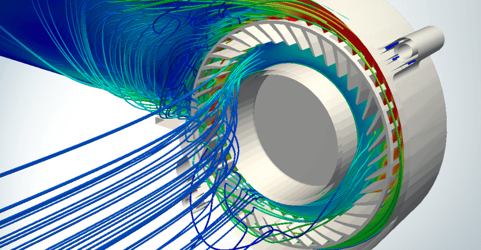

# 未来之翼：探索有限元软件的发展新纪元

> 原文地址: [https://mp.weixin.qq.com/s/CHUy0yRik0lZTrWrKTIaOA](https://mp.weixin.qq.com/s/CHUy0yRik0lZTrWrKTIaOA)

### 

## 引言

在工程设计与科学研究的广阔天地中，有限元分析（Finite Element Analysis, FEA）已成为不可或缺的工具，它以数字模型模拟现实世界的复杂物理现象，为结构、流体、热传导等多领域问题提供精准预测。随着技术的飞速进步，有限元软件正步入一个融合人工智能、云计算、大数据与高度并行计算的新纪元，不断拓展其应用边界与解决问题的能力。

## 一、云端化：无限算力，触手可及

随着云计算技术的成熟，有限元软件的云端部署成为趋势。这不仅意味着用户可以随时随地访问强大的计算资源，进行大规模仿真分析，还极大地降低了硬件投入成本，使得中小企业和研究机构也能轻松利用高端计算能力。云平台上的协同工作模式，也让团队合作更加高效，数据共享与项目管理变得前所未有的便捷。

## 二、智能化：AI赋能，洞察未来

人工智能技术的融入，是有限元软件发展的另一重要方向。通过机器学习算法，软件能够自动优化网格划分、识别模型错误、预测分析结果的可靠性，甚至根据历史数据提出优化设计方案。AI辅助的参数化设计，让工程师从繁琐的重复工作中解放出来，专注于更高层次的创新设计与决策制定。

## 三、高度集成与多物理场耦合

现代工程问题往往涉及多个物理学科的相互作用，单一物理场的分析已不能满足需求。未来的有限元软件将更加强调多物理场（如结构-流体-热-电磁等）的高效耦合，实现跨学科仿真。这种高度集成的能力，不仅能提供更为全面的系统性能评估，还能揭示隐藏的交互效应，为产品开发带来革命性的突破。

## 四、实时仿真与虚拟现实

随着图形处理技术的进步和实时仿真算法的发展，有限元软件正逐步走向实时反馈与虚拟现实的结合。工程师可以在设计阶段就“走进”虚拟产品，直观感受其性能表现，进行即时调整，大大缩短了从设计到验证的周期。这种沉浸式体验不仅提高了设计效率，也促进了非专业人员对复杂工程概念的理解与交流。

## 五、数据驱动的设计与优化

大数据与数据分析技术的应用，使得有限元软件能够从海量的历史仿真数据中提取洞见，指导设计优化。基于数据的智能推荐系统，可以为工程师提供最优设计参数建议，加速迭代过程。同时，通过持续的学习与反馈循环，软件能不断提升其预测精度，实现更高效的性能优化。

## 结语

有限元软件的未来发展，是一条通向更加智能、高效、集成与可持续的道路。在这个过程中，技术与创新的深度融合将不断拓宽人类解决问题的视野，推动科学与工程领域的深刻变革。随着这些趋势的加速演进，我们期待着一个由技术引领的、更加智慧的工程设计新时代的到来。

  

**FEtch 系统**是笔者团队开发的新一代有限元软件开发平台。只需按照有限元语言格式填写脚本文件，即可在线自动生成基于**现代 Fortran** 的有限元计算程序，从而大幅提高 CAE 软件的开发效率。欢迎私信交流。

有任何疑问或建议，欢迎加Q群 "**FEtch有限元开发系统(519166061)**" 留言讨论。我们长期开展 FEtch 系统的试用活动，感兴趣的朋友入群后可直接联系管理员，免费获取**许可证文件**。