# 板壳结构matlab有限元编程（一）：薄板单元基本理论与方程详解

> 原文地址: [https://mp.weixin.qq.com/s/CHAR2AVzKScEYmvADK0JYA](https://mp.weixin.qq.com/s/CHAR2AVzKScEYmvADK0JYA)

点击文尾**阅读原文参加活动**

**作者** **| SimPC** **仿真秀优秀讲师**

**首发 | 仿真秀APP**

**导读：**板壳结构是工程上常见的结构形式，应用也非常广泛，因此有限元仿真计算中板壳单元也是非常重要的单元。这里的板壳单元严格意义上可分为板单元和壳单元，板单元自由度包含挠度、法线转动，而壳单元自由度要比板单元多出两个面内的平动自由度。因此商业软件中并不单独设置板单元。但是从有限元理论发展的角度讲，有必要将板单元与壳单元区分开来，这样也有助于理论的理解。

本系列博文将系统介绍板壳单元的有限元理论基础及Matlab编程实现，具体包括Kirchhoff薄板理论与Mindlin/Reissner 板壳理论，这是进行有限元离散的基础，基于上述理论建立的板壳结构的三大类方程，几何方程、物理方程和平衡方程，在三大类方程基础上离散得到的有限元相关方程，此外针对的物理问题包括了板壳结构的静力求解和模态分析的内容。首先第一篇博文我们来介绍板单元的有限元编程相关内容。

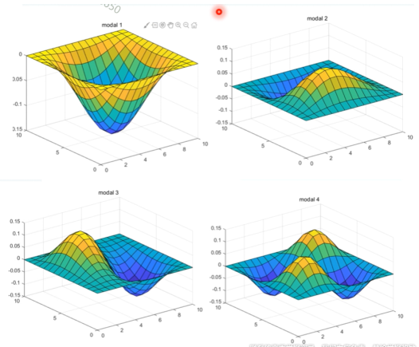

与本文所讲内容相对应的视频，是我的仿真专栏——SimPC在仿真秀精品课《**Matlab有限元编程从入门到精通35讲**》（课程持续加餐中，点击文尾阅读原文试看）和《**8节点空壳单元matlab有限元编程**》课程中同样对板壳单元进行了详尽的讲解，欢迎订阅学习。

**一、板壳理论概述**

为了从原理上理解有限元方程的建立，本小节基于板壳理论的发展历程，介绍了Kirchhoff薄板理论与Mindlin/Reissner 板壳理论，主要涉及三大类方程几何方程、物理方程和平衡方程的建立，这是进行有限元离散的基础。

板壳结构是厚度方向的尺寸小于长度和宽度方向尺寸的结构。其中，表面为平面的称为板，表面为曲面的称为壳。

但是面单元从有限元分析的角度分为壳(shell)、膜(membrane)、板(plate)三种类型。这里的板壳的概念与上述常规意义上板壳的含义有所不同

（1）膜（membrane）:膜单元只具有平面内刚度，仅能承受面内的力和法向弯矩。膜单元通常用于模拟建筑结构中的楼板，此类型单元在分析中只考虑其传递荷载的作用，而并不关心单元本身的受力变形情况。

（2）板（plate）:与膜单元相反，板单元只具有平面外刚度，只承受弯曲和横向力。通常情况下，建筑结构中很少用到这种纯板类型的面单元。

（3）壳（shell）:壳单元具有膜单元和板单元的力学属性之和。所以，壳单元是真正意义上的壳单元，可承受任何力和弯矩，适合模拟任何面对象。通过合理的网格剖分，在分析中能够考虑其刚度、质量对结构的贡献，并且能够得到面单元自身的应力、应变等情况。

另外，壳单元又分薄壳和厚壳。二者主要区别在于是否考虑单元的横向剪切变形。一般地，当平面对象的厚度小于其边长1/10时，横向剪应力对变形的影响可以忽略，一般采用薄壳单元来模拟。厚壳单元适合用于模拟横向剪切变形为主的面对象，例如：筏板、基础等。用户在不确定剪切变形是否可以忽略的情况下，推荐使用厚壳。

**1、薄壳理论**

薄壳理论的基本假定，采用Kirchhoff-Love 假定，（1）.薄壳变形前与中曲面垂直的直线，变形后仍然位于已变形中曲面的垂直线上，且其长度保持不变。（2）平行于中曲面的面素上的正应力与其它应力相比可忽略不计。与薄板理论假定类似，但是没有薄板理论的第三条假定：中面内各点都无平行于中面的位移。

①直法线假设，即原来垂直于薄板中面的一段直线在板弯曲变形时始终垂直于薄板中面且保持长度不变。这意味着不考虑横向剪切变形和挠度沿板厚的变化，即

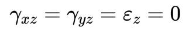

式中：z是垂直于板面的坐标方向。由z向应变为0可得到：

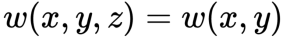

②薄板中面没有面内位移，即在中面内有

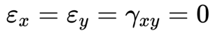

根据Kirchhoff假设，板面上任何一点的面内位移u和v为：

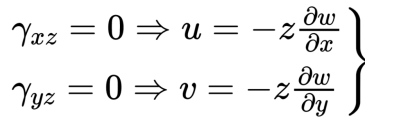

因为薄板的面外应力分量远小于面内应力分量，所以在薄板理论中采用平面应力问题的物理方程（注意平面应力问题的基本假设），于是有

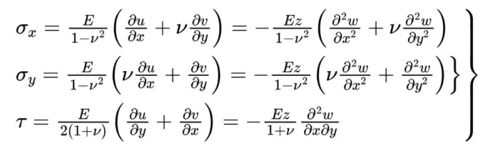

由弯矩和扭矩的定义可知，沿板厚积分（辛普森/高斯积分）即可得弯矩和扭矩与曲率和扭率的关系，得：

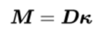

其中，

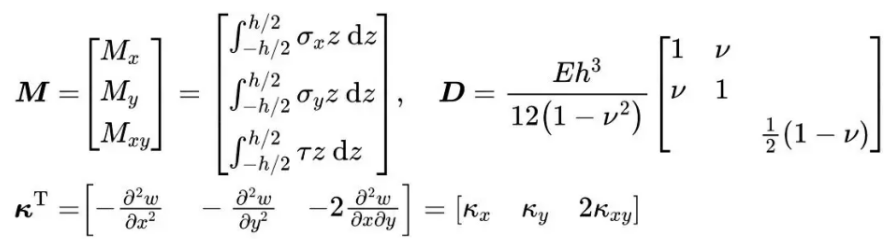

上式是薄板广义应力M与广义应变K的关系，或称薄板的本构关系。

在薄板理论中不考虑横向剪切变形，故作用在单位宽度上的剪力是根据微元的平衡条件求出的，即

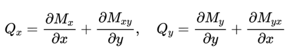

**2、厚壳理论**

薄板壳单元基于 Kirchhof-Love 理论，即不计横向前切变形的影响:中厚板壳单元则基于Mindlin-Reissner 理论，考虑横向剪切变形的影响。Mindlin/Reissner 理论的基本假定是：（1）与壳的厚度相比，位移是微小的；（2）垂直于中面的应力忽略不计；（3）变形前垂直于中面的直线，变形后仍保持为直线，但不一定再垂直于中面；（4）挠度和法线转角为各自独立的场函数。

经典的板壳理论是基于Kirchhoff假设的，忽略了横向剪切变形对板、壳变形的影响，能很好的处理薄的板壳问题，但随着厚度的增加，会产生很大的误差。可见Mindlin/Reissner 壳保持了一些Kirchhoff壳的特点，但由于不忽略剪切变形，使变形前垂直于中面的直线变形后不再垂直于中面，转角变形中应包括非均匀的平均剪切变形。

Mindlin/Reissner 理论其中比较典型的有三种：①Reissner理论；②Mindlin理论；③高阶剪切变形理论。Reissner首先采用直线假定，认为变形前垂直于中面的直法线变形后仍为直线，但不再为法线，以代替Kirchhoff假定中的直法线假设，考虑了横向剪切变形的影响，同时考虑了法向应力和应变的影响，采用Lagrangian乘子的变分法导出基本方程。之后Mindlin发展了Reissner理论，该修正理论的应用领域扩至厚板壳，我们将其称为Reissner-Mindlin板壳理论，亦为一阶剪切变形理论。

**Reissner-Mindlin板壳理论中的三个假定：**

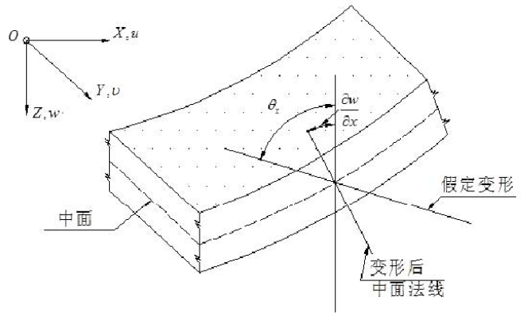

薄板理论中 Kirchhoff给出了直法线假设，Reissner 则放松了该假设中中面法线变形后仍垂直于中面的限制。只是保留了中面法线仍然为直线的假设。基于Reissner-Mindlin假设的中厚板壳理论假设的推导：

选取板的中面为xy平面，z轴与xy平面垂直，板内任一点的位移为：

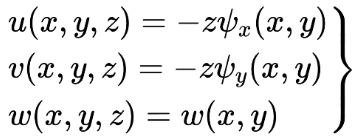

式中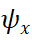和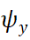,是二个未知的转角位移。在薄板理论中它们分别等于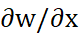和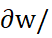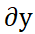，而在一阶剪切板理论中它们是独立于挠度w的，所以该理论中就有三个广义位移。那么板内非零的应变分量有

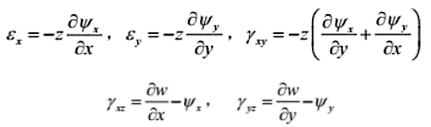

在薄板理论中为零的两个剪切应变不再为零，而是在截面上成为一个常数。这也是一阶剪切变形板理论名称的由来。

与薄板理论中一样，同样忽略掉σ，那么板理论中的应力和应变关系可以写成

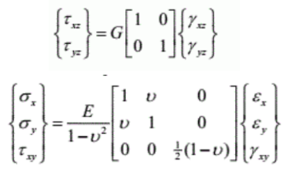

虽然现在我们能够考虑板的横向剪切变形，从而避免了薄板理论剪切应变和为零，而剪应力不为零的矛盾。但是剪应变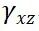和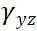,在截面上是个常数同样引入另一个无法调和的问题，因为在板截面上横向剪应力是按抛物线分布的，所以必须引入一个剪切修正系数κ，用来修正剪力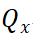和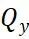的计算。

板内的内力矩沿厚度积分后，那么我们可以得到它们与2个转角位移之间的关系

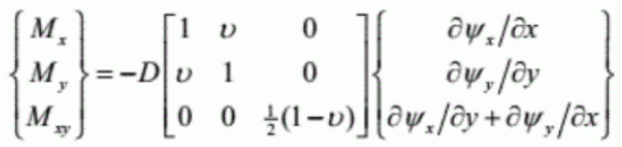

沿厚度方向积分的弯矩与曲率关系为：

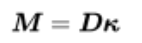

式中D是板的抗弯刚度。而板内的剪力则是剪应力的积分

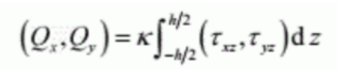

式中κ就是前面提到的剪切修正系数，所以有

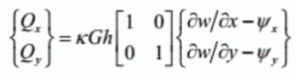

式中：k是剪切修正系数，当材料沿板厚均匀分布时，通常k=5/6（矩形截面），也有人用k=pi^2/12。

**二、板单元有限元基本理论**

从有限元法的最早发展开始，大量的工作投人了构造板、壳单元的研究。根据所要分析的结构特点、分析的要求,发展了基于不同方法或不同变分原理的各式各样的板壳单元。尽管板、壳单元的研究工作仍在吸引着很多有限元工作者的注意和精力，但是从迄今为止的发展情况来看,平板单元大体上可以分为3类。

(1) 基于经典薄板理论的板单元,即基于位能泛函的并以挠度w为场函数的板单元。

(2) 基于保持 Kirchhoff 直法线假设的其他薄板分原理的板单元,如基Hellinger-Reissner 变分原理的混合板单元,基于修正 Hellinger-Reissner 变分原理或正余能原理的应力杂交板单元等,以及在单元内或单元边界上的若干点，而不是到处保Kirchhoff 直法线假设的离散 Kirchhoff 假设单元等。

(3)基于考虑横向剪切变形的 Mindlin 平板理论的板单元。区别于经典薄板理论的是，此理论假设原来垂直于板中面的直线在变形后虽仍保持为直线,但因为横向剪切变形的结果,不一定再垂直于变形后的中面。基于此理论的板单元中,挠度 w 和法线转动0及0为各自独立的场函数。而w和0及0之间应满足的约束条件,根据约束变分原理的方法引入能量泛函，具体做法和考虑剪切的基于 Timoshenko 梁理论的梁单元相同

本文分别针对上述经典薄板理论和Mindilin板理论介绍其有限元离散方式及对应刚度矩阵的推导过程。

**1、矩形薄板单元有限元方程**

考虑如下图所示矩形单元，每个角结点有 3个自由度参数:挠度转动.和绕x和y轴的转动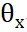即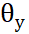。

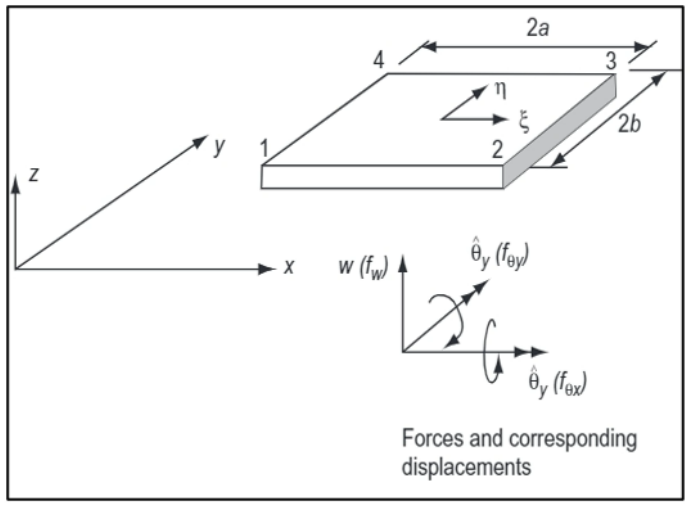

可以用含有 12 个待定系数(广义坐标)的多项式来定义位移函数，这时 4 次式必须略去某些项,为保持对于 x,y 的对称性,可以方便地采用下式

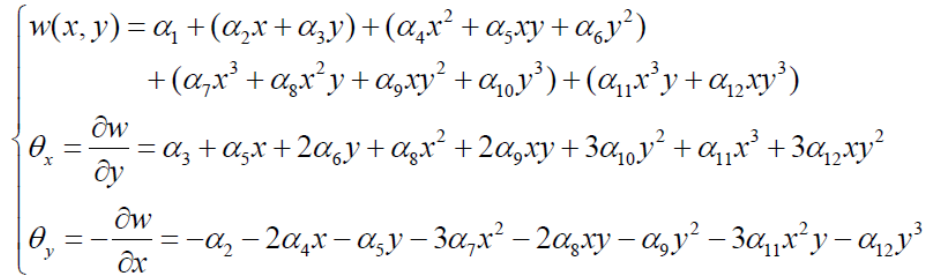

根据单元4个结点坐标和结点位移代入上式，可求得，将它们代回上式，整理得：

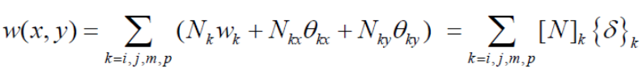

其中薄板的形函数矩阵为

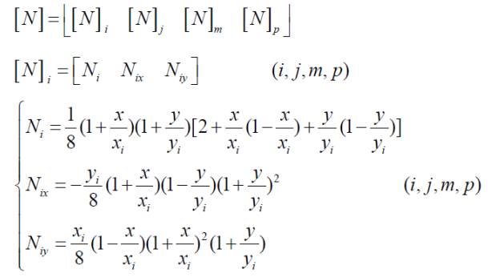

对应的参数化表达式为

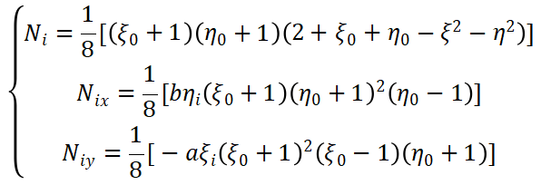

其中，矩形板沿x轴的长度为2a，沿y轴的长度为2b

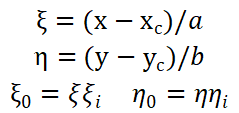

将上述离散后的位移场带入到几何方程中，可以得到应变矩阵的表达式为

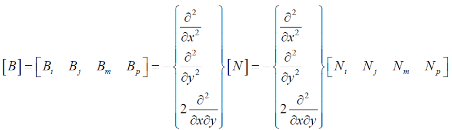

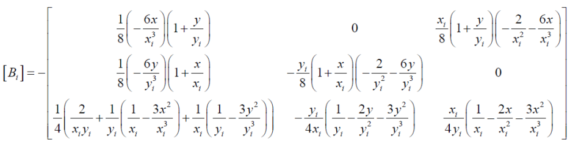

将上述应变矩阵代入薄板的刚度矩阵

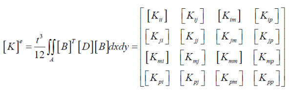

**式中**

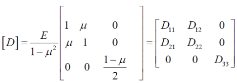

**令**

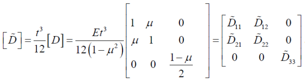

经积分计算得到薄板单元刚度矩阵各元素如下

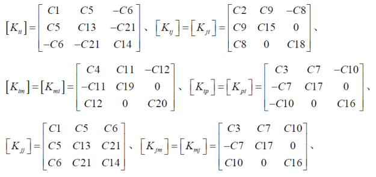

式中C1~C13元素的表达式为：

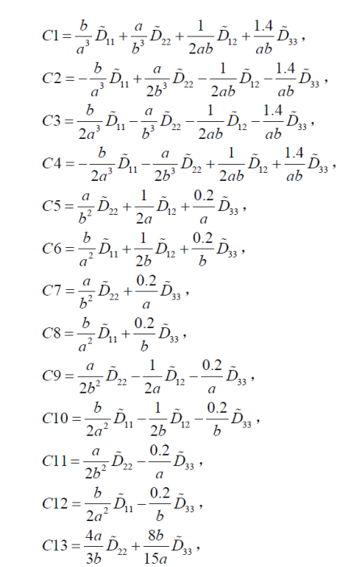

根据上述表达式，可通过程序完成板单元的刚度矩阵的建立，进而进行静力分析，篇幅限制，本篇博文就到这里。

**三、****我的Matlab有限元编程精品课**

后续系列博文将继续介绍Mindlin板单元的有限元基本理论，以及板单元和壳单元的Matlab编程实现，包括静力分析和模态分析。推荐大家关注我的原创视频课程里面《[Matlab有元编程从入门到精通](http://mp.weixin.qq.com/s?__biz=MzI4Mjk2NzQzMQ==&mid=2247550237&idx=1&sn=c0d259918b2f780b2c8d9869444d2801&chksm=eb93a9f5dce420e3c84059579329caf3191c2931c7dc9b564dfc19d49b16f5a0bcdcd1a4fc0f&scene=21#wechat_redirect)》目前加餐到第35期。我还会持续更新，强烈推荐学习者订阅。

  

**上新优惠价****（限1****0名）**

**限时特价：****449元****（****原价：****499 元 ）**

**可开电子发票，赠送答疑专栏**

提供**vip群交流，课程可反复回看**

识别下方二维码，**立即试看**

**本课程为matlab有限元编程专题课**，课程主要以**案例的形式进行讲解，**中间会穿插案例中所涉及到的**有限元基本理论**，案例不局限于力学问题的有限元求解，还会涉及**传热学、电学**等问题的有限元求解。

因为固体力学领域我最熟悉，所以我们从固体力学开始，所涉及的单元有**杆单元，梁单元，平面三角形单元，薄板单元，厚板单元，四面体实体单元**等等，力学问题有**静力学问题**，也有**动力学问题**，后期还会涉及材料非线性、几何非线性、接触非线性等非线性问题，内容丰富，不断更新完善。

**喜欢****作者******，请点********赞********和在看********

****