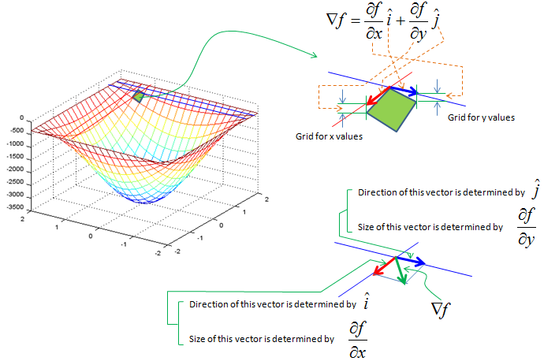
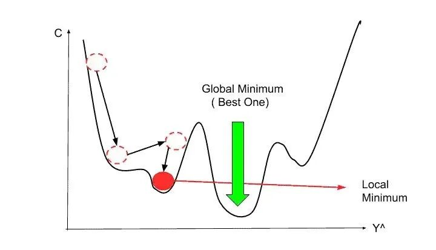
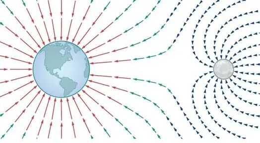
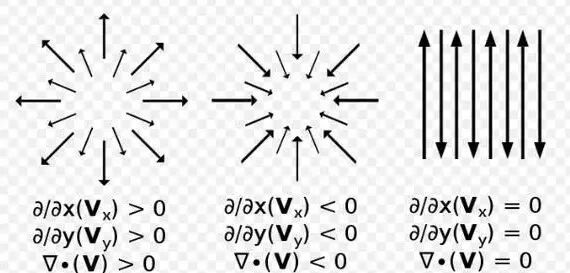
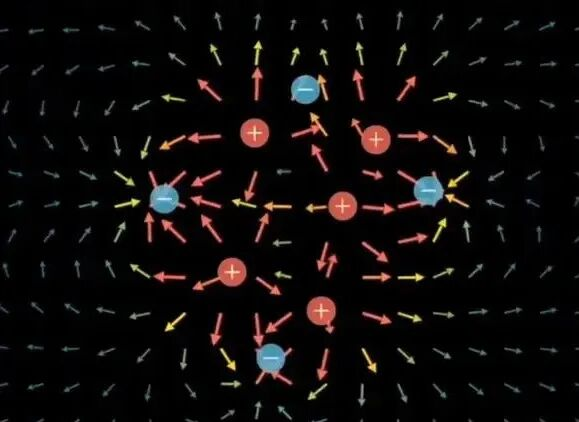
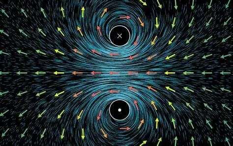
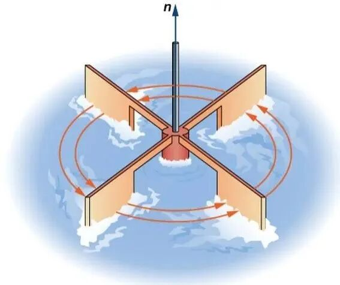
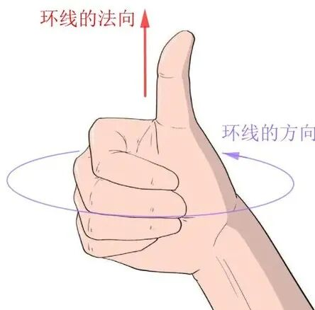

# 梯度、散度与旋度：数学与物理的交响曲

> 原文地址: [https://mp.weixin.qq.com/s/OXAQdg6BvI1eVkQv9pi36g](https://mp.weixin.qq.com/s/OXAQdg6BvI1eVkQv9pi36g)

点击上方蓝字关注我们

  

在数学与物理学的广阔领域中，梯度、散度和旋度是三个重要的概念，它们不仅在理论研究中占据着核心地位，而且在实际应用中也发挥着不可替代的作用。本文将从定义、物理意义、计算方法以及应用场景等方面，全面介绍这三个概念。

## 梯度（Gradient）

-   **定义**
    

梯度是一个向量，它描述了一个标量场在某一点处的变化方向和变化率。假设有一个标量函数 ，那么在点 处的梯度可以表示为：

这里， 是哈密顿算子，也称为梯度算子。梯度的每个分量分别表示函数在 、 和 方向上的偏导数。

-   **物理意义**
    

梯度的方向代表了标量场在该点处变化最快的方向，而梯度的大小则表示变化的快慢。具体来说，如果梯度的模较大，说明函数在该点处的变化较为剧烈；反之，如果梯度的模较小，说明函数的变化较为平缓。

-   **计算方法**
    

以二维平面为例，假设有一个标量函数 ，其梯度可以表示为：

例如，对于函数 ，其梯度为：

-   **应用场景**
    

梯度在优化算法中有着广泛的应用。例如，在机器学习中，梯度下降法是一种常用的优化方法，通过沿着负梯度方向更新参数，可以逐步逼近目标函数的最小值。此外，梯度还用于图像处理中的边缘检测，通过计算图像灰度值的梯度，可以识别出图像中的边缘区域。

## 散度（Divergence）

-   **定义**
    

散度是一个标量，它描述了一个向量场在某一点处的“发散”程度。假设有一个向量场 ，那么在点 处的散度可以表示为：

-   **物理意义**
    

散度的物理意义在于描述向量场在某一点处的源或汇的强度。如果散度大于零，说明该点是一个源，即向量场在该点处向外扩散；如果散度小于零，说明该点是一个汇，即向量场在该点处向内汇聚；如果散度等于零，说明向量场在该点处没有净流入或流出。

-   **计算方法**
    

以二维平面为例，假设有一个向量场 ，其散度可以表示为：

例如，对于向量场 ，其散度为：

-   **应用场景**
    

散度在流体力学中有着重要的应用。例如，在流体流动中，散度可以用来描述流体的压缩性和膨胀性。如果散度为零，说明流体是不可压缩的；如果散度不为零，说明流体存在压缩或膨胀现象。此外，散度还用于电磁学中的高斯定律，描述电场和磁场的源分布。

## 旋度（Curl）

-   **定义**
    

旋度是一个向量，它描述了一个向量场在某一点处的旋转程度。假设有一个向量场 ，那么在点 处的旋度可以表示为：

-   **物理意义**
    

旋度的物理意义在于描述向量场在某一点处的旋转强度和方向。如果旋度不为零，说明向量场在该点处存在旋转；如果旋度为零，说明向量场在该点处没有旋转。旋度的方向由右手定则确定，即右手拇指指向旋度的方向，其余四指表示旋转的方向。

-   **计算方法**
    

以二维平面为例，假设有一个向量场 ，其旋度可以表示为：

这里， 是单位向量，表示垂直于平面的方向。例如，对于向量场 ，其旋度为：

-   **应用场景**
    

旋度在流体力学和电磁学中有着重要的应用。例如，在流体力学中，旋度可以用来描述流体的涡旋运动，帮助分析涡旋的形成和演化。在电磁学中，旋度用于描述磁场的旋度，即安培定律，描述电流产生的磁场。此外，旋度还用于流体动力学中的涡度方程，描述流体中的涡旋结构。

## 三者对比

-   **梯度**是一个标量场的变化率，结果是一个向量场。它表示标量场在每个方向上的变化量。应用场景包括物理中的温度场、压力场等。
    
-   **散度**则作用于向量场，结果是一个标量场。它描述向量场在每个点处的发散或汇聚程度。比如描述流体流动中某一点处的源或汇。
    
-   **旋度**同样作用于向量场，但结果是一个向量场。它描述向量场在某点处的旋转程度，应用在流体力学和电磁场中。旋度为零的向量场称为无旋场。
    

## 小结

梯度、散度和旋度是向量分析中的三个基本概念，它们分别描述了标量场和向量场在某一点处的变化方向、发散程度和旋转程度。这些概念不仅在数学理论中具有重要意义，而且在物理学、工程学等领域中也有着广泛的应用。通过对这些概念的理解和应用，我们可以更好地分析和解决实际问题，推动科学和技术的发展。

希望本文能够帮助读者对梯度、散度和旋度有一个全面而深入的认识，激发大家对数学和物理的兴趣，探索更多未知的领域。

  

## 推荐阅读

‍

  

**FEtch 系统**是笔者团队开发的新一代有限元软件开发平台。只需按照有限元语言格式填写脚本文件，即可在线自动生成基于**现代 Fortran** 的有限元计算程序，从而大幅提高 CAE 软件的开发效率。欢迎私信交流。

有任何疑问或建议，欢迎加Q群 "**FEtch有限元开发系统(519166061)**" 留言讨论。我们长期开展 FEtch 系统的试用活动，感兴趣的朋友入群后可直接联系管理员，免费获取**许可证文件**。

**喜欢****作者******，请点********赞********和在看********

****