# 模式降阶：多频点的一维电磁衰减快速算法

> 原文地址: [https://mp.weixin.qq.com/s/btaLhsnwwwC6doJQVtORNQ](https://mp.weixin.qq.com/s/btaLhsnwwwC6doJQVtORNQ)

**简述**  

在频域的电磁问题中，有时候需要知道一个频率段的电磁响应问题，需要将频率段离散成多个离散频点，对其逐一计算，求解得到想要的结果。

但是如果离散频率需要足够精细，频率点就会非常多，这时候逐一计算的效率就会显得非常低，尤其是遇到三维大规模模拟，逐一进行数值模拟的效率会低得可怕，因此在算法上改善这种问题就非常关键。

我们观察频率域电磁相关的有限元边值问题，几乎都可以写成关于频率的函数：

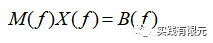

不同频率对于不同的系数矩阵、右端项，求解得到不同的数值解。因此，如果以频率作为未知数的角度来考虑，是否可以寻找一组频率点，这些频率点的计算结果可以通过类似插值的方式获得其他所有频率点的结果，而不再需要逐个求解每个有限元问题。

模式降阶的观点就是如此，找一组M个频率，称之为基向量频率，其他频率的结果都可以通过这组基向量频率的结果插值获得，因此就把原本N维度的解方程问题降低到M维度（假设原本有限元未知数维N）。

这种算法的思想是认为频率间的数值结果并不是完全独立，而是存在一定的关系，这关系就是存在一组基向量，通过对这组基向量的权重配比就可以获得所有频率段的信息。类似于三维坐标轴向量可以表示任意向量的原理一样。

**1.模式降阶实现原理**

以一维电场在电阻率介质中衰减的物理模型为例，其边值问题推导得到的有限元离散问题为：（具体有限元实现参考：[一维混合高阶有限元详细实现过程](http://mp.weixin.qq.com/s?__biz=MzkwNzUxOTM2NA==&amp;mid=2247483782&amp;idx=1&amp;sn=51f39dd80e76b688a32179284661d1c1&amp;chksm=c0d6b56df7a13c7bb6f4fad42dd7aed814ccb532057dff93ef767f70cee15712f304a85cd228&scene=21#wechat_redirect)）

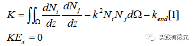

其最终的求解矩阵可以写成：

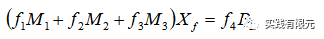

其中，M1，M2，M3，B1矩阵是与频率不相关的内容，f1，f2，f3则是对应矩阵上与频率相关的系数。通过对比不难发现，具体的系数矩阵与频率系数为：

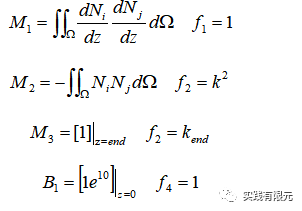

假设存在一组解x的基向量X(M,N)，其本身是满足有限元离散方程:

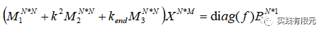

diag(f)是单元矩阵，在上述等式两端乘以基向量X的转置，并引入基向量的系数a(f)代替diag(f),得到：

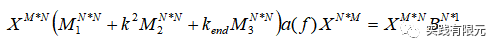

推导上述方程，从N\*N降阶到M\*M。

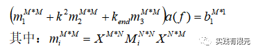

求解该方程，可以获得系数向量a,该向量则表示基向量X(M,N)的系数，对于任意频率fi,满足：

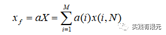

不难发现，如果待求频率为基向量频率，则系数向量a所对应基向量频率的数值为1，其他数值为0。其他非基向量频率则可以通过这组基向量X的不同的系数a占比，获取任意频率点的结果x，从而实现降阶算法。

**2.寻找合理的基函数方法**

从上述理论中不难发现，该方法的重点是找到一组合乎精度的基向量，这里提供一种二分法的方法，从最初频率段为基础，逐渐插值获得基向量，以达到试探频率的解满足已有基向量的降阶插值。

a.初始（当前）频率段的头尾两个频率作为基础，使用有限元求解两个频率的解作为基向量；

b.取头尾两个频率的中间频率，作为试探频率，并判断该频率使用已有基向量是否能插值获得满足收敛精度的结果。

c.如果b条件满足则认为找到一组满足该频率段所有频点的基向量；如果不满足，则计算试探频率的有限元解，并保存作为基向量，用试探频率分割当前频率段，得到范围更小的两个新频率段，重复a步骤，直到满足b步骤。

**3.测试案例**  

**a.以一维电场衰减为例，研究区域中电阻率如下分布，具体物理规律参考：**[**自适应有限元：几种常见的后验误差**](http://mp.weixin.qq.com/s?__biz=MzkwNzUxOTM2NA==&amp;mid=2247484119&amp;idx=1&amp;sn=23f18ffc9ffd003fdfeb62c7cb7ac94b&amp;chksm=c0d6b63cf7a13f2aad8632a6deb900ad9431c21e55ab046ddddd7a2a294ae2c9ad6401b850fb&token=675137261&lang=zh_CN&scene=21#wechat_redirect) **中的电阻率求解方法。**

该模型中间存在低阻区域：

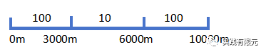

研究频率段为1e-2~1e2 Hz，以指数划分为100个频点；分别划分上述三个区域为100个网格，共计300个网格；计算每个频点在z=0处的视电阻率，因此100个频点每个对应一个视电阻率。

分别使用逐次求解每个频率和模式求解的方法求解上述相同的模型，得到的结果如下：

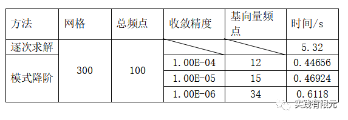        当取收敛误差为1e-4的计算结果对比如图所示：

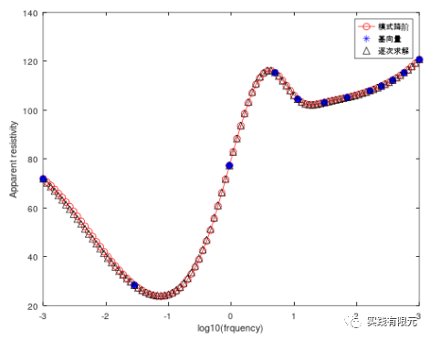

可见，模式降阶的结果在低频的基向量很少，而高频的基向量较多，结果与逐次求解对比也更加接近。展示收敛误差1e-6的结果，如下图：

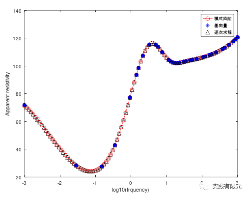

直观的可以发现，1e-4收敛误差中低频较为明显的精度不足得到了改善，高频的基向量更多了。这本身与高频在z=0处的电场变化剧烈相关。

根据物理规律，在频率高于10Hz的情况下，基本上不体现低阻区域的电阻率，因此高频部分的视电阻率结果应该是100欧姆才合理，但是图中的高频结果却在发散，这就是由于网格量不足的原因。

因此，对于该模型，同样100个频率，将每个区域分割成300份网格，总计900个网格，得到的结果如下：

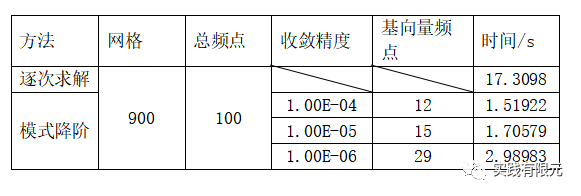

展示误差精度为1e-5的计算对比结果：

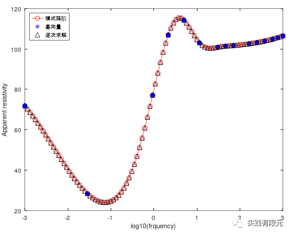

可以发现相比于网格量300，900网格在高频的结果更加的收敛在100欧姆米，但是如果仅使用逐次计算，则需要划分17秒时间，模式降阶则仅需要2秒不到。计算效率得到了大大的改善。

**b.以一维电场衰减为例，研究区域中电阻率如下分布，中间区域存在高阻：**

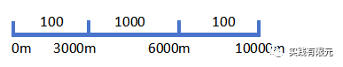

研究频率段为1e-2~50 Hz，以指数划分为100个频点；网格划分上述三个区域分别划分为100个网格，共计300个网格；计算每个频点在z=0出的视电阻率，因此100个频点对应100个视电阻率。

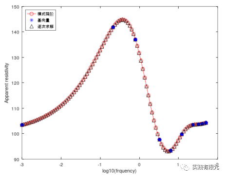

结果显示，仅使用了10个基向量就获得了求解结果。时间在0.423s。而逐次计算要5.318s。

模式降阶的快速扫频方式优势在于如果需要进一步计算该模型1000个频点的结果，也仅需要10个基向量，耗时0.5秒不到，而逐次计算则需要接近一分钟，这个效率改善就非常的明显了，如下图1000个频点的模式降阶计算结果，虽然时间很少，但是精度依旧和逐次求解一致。

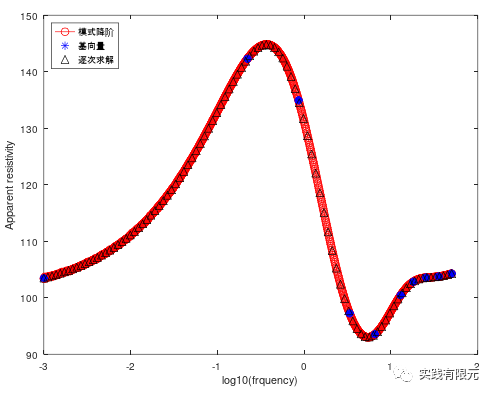

**4.总结**

a.对于求解大量频率的频率域问题，模式降阶的方法能够从算法上有效的提高计算效率；

b.模式降阶的方法仅是提高计算效率，对于本身数值精度没有改善，精度最高与逐次求解的精度一致；  

c.模式求解的关键在于找到一组基向量解，通过求解降阶方程获得基向量解的系数，进而可以获得所有频率的数值结果；