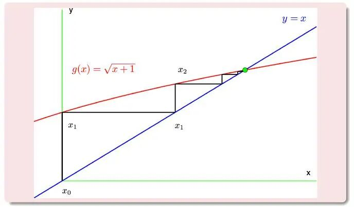
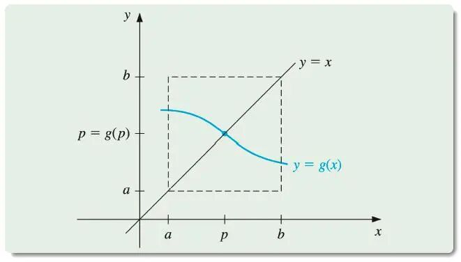
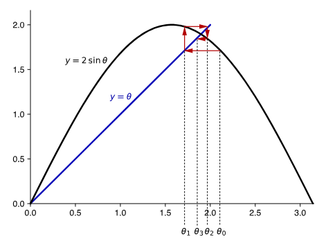
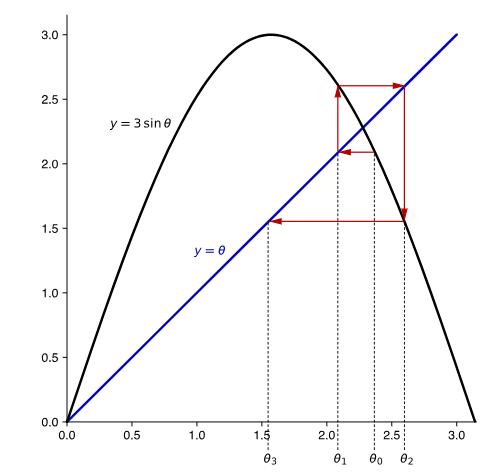

# 求解之道：不动点迭代法深入解析

> 原文地址: [https://mp.weixin.qq.com/s/QF9oFILUGQtE4YjlvPuEKA](https://mp.weixin.qq.com/s/QF9oFILUGQtE4YjlvPuEKA)

在数学和计算机科学的交汇处，数值分析是一门重要的学科，它致力于开发并应用算法来解决连续数学的问题。不动点迭代法是数值分析中的一种强大工具，广泛应用于求解非线性方程、优化问题以及动态系统的稳定性分析等领域。本文将深入探讨不动点迭代法的基本概念、理论基础、实现方法及其应用，旨在为读者提供一个全面而深入的理解。

## 不动点的概念

在开始讨论不动点迭代之前，我们首先需要理解什么是不动点。对于给定的一个函数，如果存在一个值  使得 ，那么这个值  就被称作该函数的一个**不动点**。换句话说，当我们将  作为输入传递给函数  时，得到的输出仍然是  本身，即这个点保持“静止”或“不变”。

不动点不仅是一个数学上的抽象概念，而且在现实世界中也有着丰富的应用场景。例如，在经济学中，市场均衡价格可以被看作是供给函数与需求函数交点处的不动点；而在物理学里，某些物理系统的稳定状态也可以通过寻找其动力学方程的不动点来确定。

## 从零点到不动点

当我们面对一个形式为  的一般零点问题时，可以通过转换成对应的不动点问题来进行求解。具体来说，就是构造一个新的函数 ，使得原方程  能够表示为  的形式。这样的转化并非唯一，不同的  选择可能会导致不同性质的不动点迭代过程。

举个例子，考虑方程

这个求零点问题实际上可以转化为不动点问题：

或者也可以这样转化：

这两种表达方式虽然都对应同一个原始方程，但它们在不动点迭代中的行为却可能截然不同。因此，在实际操作中，我们需要仔细挑选适合的  形式，以确保迭代过程的有效性和收敛性。

## 不动点的存在性和唯一性

了解了如何将零点问题转化为不动点问题之后，接下来我们要关注的是，这些不动点是否存在以及是否唯一。这涉及到以下两个关键定理。

-   **不动点的存在性定理**
    

> 如果函数  在其定义域  内连续，并且对于所有 ，有 ，那么  在区间  内至少存在一个不动点。

这个定理是很好理解的：

想象一个坐标系上的方形区域。画一条从区域的最左侧延续到最右侧的连续曲线，这条曲线必然会与方形区域的对角线接触。

  

-   **不动点的唯一性定理**
    

> 假设在区间  上， 的导数  存在，并且对于所有 ，存在常数  满足 。在这种情况下， 内的不动点是唯一的。

这个定理比上一个稍微难理解一些：

同样在一个坐标系上的方形区域，画一条从区域的最左侧延续到最右侧的连续曲线。如果不想让这条曲线多次与对角线接触，那么曲线就不能过于“陡峭”。如果衡量曲线“陡峭”程度的导数的绝对值，永远比对角线的斜率  小，那么这条曲线和对角线的交点也是唯一的。

这两个定理为我们提供了判断不动点存在的充分条件以及保证不动点唯一性的必要条件。值得注意的是，后者实际上还隐含了一个关于收敛速度的信息——即当导数绝对值严格小于 1 时，不动点迭代将会快速地趋向于那个唯一的不动点。

## 不动点迭代的过程

有了前面的理论准备，我们现在可以正式介绍不动点迭代的具体步骤。

基本思想非常直观：

> 选择一个初始猜测值 ，然后根据规则  反复计算新的近似值，直到相邻两次的结果足够接近为止（通常使用某种预设的小阈值  作为终止标准）。

理论上讲，只要选择了恰当的  并且初始值合适，那么这个序列  最终会收敛到真正的不动点。

用一张图帮助理解一下整个迭代过程：

然而，实际情况往往比理想情况复杂得多。一方面，不同的  可能导致完全不同的收敛特性；另一方面，即使在同一  下，初始值的选择也极大地影响着迭代路径和效率。此外，还有可能存在不收敛的情形，例如下面这张图的示例。这就要求我们在设计算法时必须考虑到这些问题，并采取相应的措施加以防范。

## 不动点迭代的收敛性分析

为了更好地理解和预测不动点迭代的行为，我们还需要研究其收敛性质。这里的关键在于考察函数  的导数。根据不动点定理，如果在整个区间  内，，那么无论从哪个起点出发，迭代序列都将单调地趋近于唯一的不动点。不仅如此，还可以给出误差估计公式，用于量化每次迭代后距离真实解的差距。

具体而言，设  为所求不动点，则对于任意 ，都有

这一结果表明，随着迭代次数  的增加，误差呈指数衰减趋势，从而确保了算法的高效性。当然，这里假定了 ，即导数的绝对值始终不超过 1。如果违反了这个前提条件，那么收敛性就不能得到保证，甚至可能出现发散的情况。

## 实例演示

为了更直观地展示不动点迭代的实际效果，让我们来看一个小例子。假设我们要编程求解方程

的根，初始点选为 。为此，我们尝试了以下三种不同的不动点迭代策略：

### **Fortran 实现**

利用 Fortran 语言，我们可以高效地实现该问题的数值解法。具体参见以下的代码和注释：

`module func_mod   abstract interface       function def_func(x) result(res)         real, intent(in) :: x         real :: res       end function def_func   end interface   contains   subroutine fixedpoint(g, p0, tol, p, n)       implicit none       procedure(def_func) :: g       real, intent(in) :: p0, tol       real, intent(out) :: p       integer, intent(out) :: n       real :: temp          p = p0       n = 1       do while (.true.)         temp = g(p)         if (abs(temp - p) < tol) exit         p = temp         n = n + 1       end do   end subroutine fixedpoint   end module func_mod         program fixed_point_iteration   use func_mod   implicit none   real :: p0, p, tol   integer :: n      ! 初始化p0和tol   p0 = 1.0! 初始猜测值   tol = 1.0E-6! 容差      call fixedpoint(g0, p0, tol, p, n)   print *, 'case 1: c = 1.0'   print *, 'The iteration number:', n   print *, 'The fixed point     :', p          call fixedpoint(g1, p0, tol, p, n)   print *, 'case 2: c = 0.5'   print *, 'The iteration number:', n   print *, 'The fixed point     :', p      call fixedpoint(g2, p0, tol, p, n)   print *, 'case 3: c = 0.6'   print *, 'The iteration number:', n   print *, 'The fixed point     :', p        contains   ! 示例函数g(x)，用户可以根据需要修改此函数   function g0(x) result(res)       real, intent(in) :: x       real :: res       res = cos(x) ! 对应 c = 1   end function g0   function g1(x) result(res)       real, intent(in) :: x       real :: res       res = x - 0.5*(x-cos(x)) ! 对应 c = 0.5   end function g1   function g2(x) result(res)       real, intent(in) :: x       real :: res       res = x - 0.6*(x-cos(x)) ! 对应 c = 0.6   end function g2     end program fixed_point_iteration   `

编译并运行，得到

 `case 1: c = 1.0    The iteration number:          35    The fixed point     :  0.739085555        case 2: c = 0.5    The iteration number:           8    The fixed point     :  0.739085674        case 3: c = 0.6    The iteration number:           4    The fixed point     :  0.739085078`

通过编程模拟上述过程，我们可以观察到不同参数  对收敛速度的影响。显然，适当调整系数  可以显著改善迭代性能，加快达到目标精度的速度。这也提醒我们在实际应用中应当灵活运用各种技巧，以期获得最佳的结果。

## 小结

综上所述，不动点迭代法作为一种经典而又实用的数值分析技术，在解决各类非线性问题方面展现了强大的能力。通过对不动点概念的理解、相关定理的学习以及实际案例的研究，相信读者已经对其有了较为全面的认识。未来，随着计算机技术的发展和新算法的涌现，相信不动点迭代法将继续在更多领域展现出无限潜力。

  

往期推荐

[

Fortran中的函数与_回调_：概念与实践

](http://mp.weixin.qq.com/s?__biz=Mzk0MzI0NDU2NQ==&mid=2247486687&idx=1&sn=955c0d001654df70c2c51baf61ee0132&chksm=c33798a5f44011b3b53bd795ca0273bde36c042e447ef00558a42d3e13749a762101fdb813f7&scene=21#wechat_redirect)

[

数值计算中的_误差_及减小_误差_的原则

](http://mp.weixin.qq.com/s?__biz=Mzk0MzI0NDU2NQ==&mid=2247488424&idx=1&sn=b6654a3d4f75bb83a0c3abba0661079f&chksm=c33787d2f4400ec47a76f6bda3d5feb1a3d72cc34d6369b47354132b641207db0dc3f74f0f73&scene=21#wechat_redirect)

[

_数学_也有_实验_？

](http://mp.weixin.qq.com/s?__biz=Mzk0MzI0NDU2NQ==&mid=2247487965&idx=2&sn=1e42d20f9ef327c187b78ba4d854be20&chksm=c33785a7f4400cb1e51e6c4551660aaafd3f6634c96cc2886e0eb30cd1bcab872062ea47ccfa&scene=21#wechat_redirect)

  

## 推荐阅读

  

  

‍

  

  

  

**给我一组控制方程，还你一套专业软件。**我们长期从事多场耦合有限元算法和软件的研发工作，掌握全流程的 CAE 软件开发技能。如果您需要相关的技术服务，非常欢迎私信交流和扫码咨询。

**喜欢****作者******，请点********赞********和在看********

****